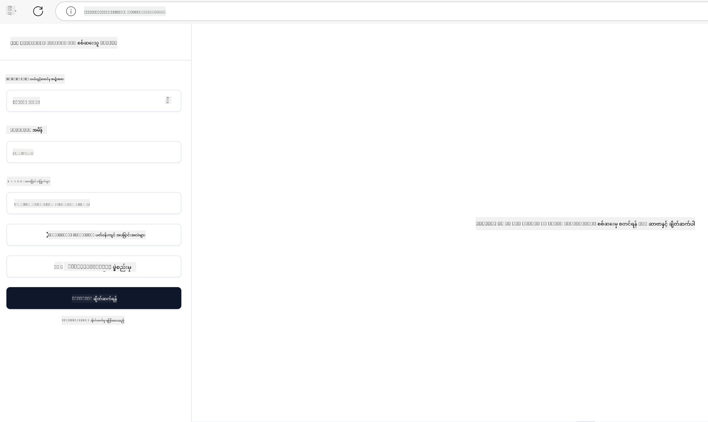

<!--
CO_OP_TRANSLATOR_METADATA:
{
  "original_hash": "d88dbf928fa0f159b82312e9a6757ba0",
  "translation_date": "2025-06-18T09:40:20+00:00",
  "source_file": "04-PracticalImplementation/README.md",
  "language_code": "my"
}
-->
# လက်တွေ့အသုံးပြုမှု

လက်တွေ့အသုံးပြုမှုမှာ Model Context Protocol (MCP) ၏အင်အားကို မျက်မှောက်ခံစားနိုင်တဲ့ နေရာဖြစ်ပါတယ်။ MCP ၏ သီအိုရီနဲ့ ဖွဲ့စည်းပုံကို နားလည်တာ အရေးကြီးပေမယ့်၊ တကယ်တော့ ဒီအယူအဆတွေကို အသုံးပြုပြီး လက်တွေ့ပြဿနာတွေကို ဖြေရှင်းနိုင်တဲ့ ဖြေရှင်းချက်တွေကို တည်ဆောက်၊ စမ်းသပ်၊ ဖြန့်ချိတဲ့အခါမှာ တန်ဖိုးမှန်ကန်မှုတွေ ထွက်ပေါ်လာပါတယ်။ ဒီအခန်းက MCP အခြေခံထားတဲ့ အက်ပလီကေးရှင်းတွေကို တည်ဆောက်ရာမှာ သဘောတရားနဲ့ လက်တွေ့ဖွံ့ဖြိုးမှုကြားက ချန်လှပ်ကို ချိတ်ဆက်ပေးပြီး လမ်းညွှန်ပေးမှာ ဖြစ်ပါတယ်။

သင်ဟာ တိုင်းတာမှုအတုများ ဖန်တီးခြင်း၊ AI ကို စီးပွားရေးလုပ်ငန်းစဉ်များထဲသို့ ပေါင်းစပ်ခြင်း၊ ဒေတာဆက်သွယ်မှု အတွက် စိတ်ကြိုက်ကိရိယာများ တည်ဆောက်ခြင်း စသဖြင့် မည်သည့်လုပ်ငန်းကို ပြုလုပ်နေရင်မဆို MCP သည် လွယ်ကူပြောင်းလဲနိုင်သော အခြေခံအဆောက်အအုံကို ပေးစွမ်းပါတယ်။ ၎င်း၏ ဘာသာစကားမရွေး ဒီဇိုင်းနဲ့ လူကြိုက်များသော programming ဘာသာစကားများအတွက် တရားဝင် SDK များကြောင့် မည်သူမဆို လွယ်ကူစွာ အသုံးပြုနိုင်ပါသည်။ ဒီ SDK များကို အသုံးပြုခြင်းဖြင့် သင်ဟာ မျိုးစုံသော ပလက်ဖောင်းများနဲ့ ပတ်ဝန်းကျင်များပေါ်မှာ မျက်နှာချင်းဆိုင် စမ်းသပ်၊ ပြန်လည်ပြင်ဆင်၊ တိုးချဲ့နိုင်ပါသည်။

နောက်ပိုင်းအပိုင်းများတွင် C#, Java, TypeScript, JavaScript, Python တို့တွင် MCP ကို ဘယ်လို အကောင်အထည်ဖော်ရမည်၊ MCP ဆာဗာများကို ဘယ်လို debug နှင့် စမ်းသပ်ရမည်၊ API များကို စီမံခန့်ခွဲခြင်း၊ Azure ကို အသုံးပြုပြီး ဖြန့်ချိခြင်း စသည့် လက်တွေ့ ဥပမာများ၊ ကိုးကားကုဒ်များ၊ ဖြန့်ချိမှုနည်းလမ်းများကို တွေ့ရှိနိုင်ပါမည်။ ဒီလက်တွေ့အရင်းအမြစ်များက သင်၏ သင်ယူမှုကို မြန်ဆန်စေပြီး MCP အက်ပလီကေးရှင်းများကို ခိုင်မာပြီး ထုတ်လုပ်နိုင်အောင် တည်ဆောက်နိုင်ရန် ကူညီပေးမှာ ဖြစ်ပါတယ်။

## အနှစ်ချုပ်

ဒီသင်ခန်းစာမှာ MCP ကို မျိုးစုံသော programming ဘာသာစကားများတွင် လက်တွေ့အသုံးပြုရာ အချက်အလက်များကို ဦးတည်ဖော်ပြထားပါတယ်။ C#, Java, TypeScript, JavaScript, Python တို့တွင် MCP SDK များကို ဘယ်လို အသုံးပြုရမည်၊ MCP ဆာဗာများကို ဘယ်လို debug နဲ့ စမ်းသပ်ရမည်၊ ပြန်လည်အသုံးပြုနိုင်သော resource များ၊ prompt များနှင့် tool များကို ဘယ်လို ဖန်တီးရမည် စသည်တို့ကို ရှင်းလင်းဖော်ပြပါမည်။

## သင်ယူရမည့် ရည်မှန်းချက်များ

ဒီသင်ခန်းစာအပြီးမှာ သင်မှာ အောက်ပါအရာများကို လုပ်ဆောင်နိုင်ပါလိမ့်မယ်-
- မျိုးစုံသော programming ဘာသာစကားများတွင် တရားဝင် SDK များ အသုံးပြုပြီး MCP ဖြေရှင်းချက်များကို အကောင်အထည်ဖော်နိုင်ခြင်း
- MCP ဆာဗာများကို စနစ်တကျ debug နှင့် စမ်းသပ်နိုင်ခြင်း
- ဆာဗာအင်္ဂါရပ်များ (Resources, Prompts, Tools) ဖန်တီးပြီး အသုံးပြုနိုင်ခြင်း
- အဆင့်မြင့်တာဝန်များအတွက် ထိရောက်သော MCP လုပ်ငန်းစဉ်များကို ဒီဇိုင်းဆွဲနိုင်ခြင်း
- စွမ်းဆောင်ရည်နှင့် ယုံကြည်စိတ်ချရမှုအတွက် MCP အကောင်အထည်ဖော်မှုများကို အကောင်းဆုံး ပြုလုပ်နိုင်ခြင်း

## တရားဝင် SDK အရင်းအမြစ်များ

Model Context Protocol သည် မျိုးစုံသော ဘာသာစကားများအတွက် တရားဝင် SDK များကို ပံ့ပိုးပေးသည်-

- [C# SDK](https://github.com/modelcontextprotocol/csharp-sdk)
- [Java SDK](https://github.com/modelcontextprotocol/java-sdk)
- [TypeScript SDK](https://github.com/modelcontextprotocol/typescript-sdk)
- [Python SDK](https://github.com/modelcontextprotocol/python-sdk)
- [Kotlin SDK](https://github.com/modelcontextprotocol/kotlin-sdk)

## MCP SDK များနှင့် လုပ်ဆောင်ခြင်း

ဒီအပိုင်းမှာ MCP ကို မျိုးစုံသော programming ဘာသာစကားများတွင် အကောင်အထည်ဖော်ခြင်းအတွက် လက်တွေ့ ဥပမာများ ပေးထားပါတယ်။ `samples` ဖိုလ်ဒါအတွင်း ဘာသာစကားအလိုက် စီစဉ်ထားသော ကိုးကားကုဒ်များကို တွေ့ရှိနိုင်ပါသည်။

### ရနိုင်သော ဥပမာများ

ဒီ repository တွင် အောက်ပါ ဘာသာစကားများအတွက် [နမူနာ အကောင်အထည်ဖော်မှုများ](../../../04-PracticalImplementation/samples) ပါဝင်သည်-

- [C#](./samples/csharp/README.md)
- [Java](./samples/java/containerapp/README.md)
- [TypeScript](./samples/typescript/README.md)
- [JavaScript](./samples/javascript/README.md)
- [Python](./samples/python/README.md)

အဆိုပါ နမူနာတိုင်းသည် MCP ၏ အဓိက အယူအဆများနှင့် အကောင်အထည်ဖော်မှု နမူနာပုံစံများကို မိမိဘာသာစကားနှင့် ပတ်ဝန်းကျင်အတွက် ဖော်ပြထားပါသည်။

## အခြေခံ ဆာဗာ အင်္ဂါရပ်များ

MCP ဆာဗာများသည် အောက်ပါ အင်္ဂါရပ်များကို မည်သည့်ပေါင်းစပ်မှုဖြင့်မဆို အကောင်အထည်ဖော်နိုင်ပါသည်-

### Resources  
Resources သည် အသုံးပြုသူ သို့မဟုတ် AI မော်ဒယ်အတွက် အကြောင်းအရာနှင့် ဒေတာများ ပံ့ပိုးပေးသည်-  
- စာရွက်စာတမ်း သိမ်းဆည်းရာနေရာများ  
- အသိပညာ အခြေခံများ  
- ဖွဲ့စည်းထားသော ဒေတာအရင်းအမြစ်များ  
- ဖိုင်စနစ်များ  

### Prompts  
Prompts သည် အသုံးပြုသူများအတွက် ပုံစံပြုထားသော စကားပြောစာများနှင့် လုပ်ငန်းစဉ်များဖြစ်သည်-  
- ကြိုတင်သတ်မှတ်ထားသော စကားပြောပုံစံများ  
- လမ်းညွှန်ချက်များပါဝင်သော ဆက်ဆံရေးပုံစံများ  
- အထူးပြု စကားပြောဖွဲ့စည်းမှုများ  

### Tools  
Tools သည် AI မော်ဒယ်မှ အလုပ်လုပ်ဆောင်နိုင်သော လုပ်ဆောင်ချက်များဖြစ်သည်-  
- ဒေတာကို ပြုပြင်ထိန်းသိမ်းရန် ကိရိယာများ  
- ပြင်ပ API များနှင့် ပေါင်းစပ်ခြင်း  
- တွက်ချက်မှုစွမ်းရည်များ  
- ရှာဖွေရေး လုပ်ဆောင်ချက်များ  

## နမူနာ အကောင်အထည်ဖော်မှုများ: C#

တရားဝင် C# SDK repository တွင် MCP ၏ မတူညီသော အစိတ်အပိုင်းများကို ဖော်ပြထားသော နမူနာ အကောင်အထည်ဖော်မှုများ ပါဝင်သည်-

- **အခြေခံ MCP Client**: MCP client တစ်ခု ဖန်တီးပြီး tool များကို ခေါ်ယူနည်း ရိုးရှင်းသော ဥပမာ  
- **အခြေခံ MCP Server**: အခြေခံ tool မှတ်ပုံတင်မှုနှင့် အနည်းဆုံး server အကောင်အထည်ဖော်မှု  
- **တိုးတက်ပြီး MCP Server**: tool မှတ်ပုံတင်ခြင်း၊ အတည်ပြုခြင်း၊ error ကိုင်တွယ်ခြင်း ပါဝင်သော အပြည့်အစုံ server  
- **ASP.NET ပေါင်းစပ်မှု**: ASP.NET Core နှင့် ပေါင်းစပ်သုံးစွဲနည်း ဥပမာများ  
- **Tool အကောင်အထည်ဖော်မှု ပုံစံများ**: ကိရိယာများကို မတူညီသော ရိုးရှင်းမှ အဆင့်မြင့် အဆင့်အတန်းများဖြင့် အကောင်အထည်ဖော်နည်းပုံစံများ  

MCP C# SDK သည် preview အဆင့်တွင်ရှိပြီး API များမှာ အပြောင်းအလဲရှိနိုင်ပါသည်။ SDK တိုးတက်လာသည်နှင့်အမျှ ဒီဘလော့ဂ်ကို ဆက်လက် အပ်ဒိတ်လုပ်သွားမည် ဖြစ်ပါသည်။

### အဓိက အင်္ဂါရပ်များ  
- [C# MCP Nuget ModelContextProtocol](https://www.nuget.org/packages/ModelContextProtocol)  
- သင်၏ [ပထမဆုံး MCP Server တည်ဆောက်ခြင်း](https://devblogs.microsoft.com/dotnet/build-a-model-context-protocol-mcp-server-in-csharp/)  

C# အပြည့်အစုံအကောင်အထည်ဖော်မှုများအတွက် [တရားဝင် C# SDK နမူနာ repository](https://github.com/modelcontextprotocol/csharp-sdk) ကို လည်ပတ်ကြည့်ရှုနိုင်ပါသည်။

## နမူနာ အကောင်အထည်ဖော်မှု: Java Implementation

Java SDK သည် စီးပွားရေးအဆင့်မြင့် လုပ်ဆောင်ချက်များပါဝင်သော MCP အကောင်အထည်ဖော်မှု ရွေးချယ်မှုများကို ပံ့ပိုးပေးပါသည်။

### အဓိက အင်္ဂါရပ်များ  
- Spring Framework ပေါင်းစပ်မှု  
- အတင်းအကျပ်အမျိုးအစားလုံခြုံမှု  
- Reactive programming ပံ့ပိုးမှု  
- အပြည့်အစုံ error ကိုင်တွယ်မှု  

Java အကောင်အထည်ဖော်မှု နမူနာအပြည့်အစုံအတွက် samples ဖိုလ်ဒါရှိ [MCPSample.java](../../../04-PracticalImplementation/samples/java/MCPSample.java) ကို ကြည့်ရှုနိုင်ပါသည်။

## နမူနာ အကောင်အထည်ဖော်မှု: JavaScript Implementation

JavaScript SDK သည် MCP အကောင်အထည်ဖော်မှုအတွက် အလွယ်တကူနှင့် ပြောင်းလွယ်ပြင်လွယ်နည်းလမ်းကို ပေးစွမ်းပါသည်။

### အဓိက အင်္ဂါရပ်များ  
- Node.js နှင့် browser ပံ့ပိုးမှု  
- Promise အခြေခံ API  
- Express နှင့် အခြား framework များနှင့် လွယ်ကူစွာ ပေါင်းစပ်နိုင်မှု  
- Streaming အတွက် WebSocket ပံ့ပိုးမှု  

JavaScript အကောင်အထည်ဖော်မှု နမူနာအပြည့်အစုံအတွက် samples ဖိုလ်ဒါရှိ [mcp_sample.js](../../../04-PracticalImplementation/samples/javascript/mcp_sample.js) ကို ကြည့်ရှုနိုင်ပါသည်။

## နမူနာ အကောင်အထည်ဖော်မှု: Python Implementation

Python SDK သည် MCP အကောင်အထည်ဖော်မှုအတွက် Python ရဲ့ သဘာဝကို ကိုက်ညီသော နည်းလမ်းနှင့် ML framework များနှင့် ပေါင်းစပ်မှုများကို ထောက်ပံ့ပေးပါသည်။

### အဓိက အင်္ဂါရပ်များ  
- asyncio ဖြင့် async/await ပံ့ပိုးမှု  
- Flask နှင့် FastAPI ပေါင်းစပ်မှု  
- ရိုးရှင်းသော tool မှတ်ပုံတင်မှု  
- လူကြိုက်များသော ML စာကြည့်တိုက်များနှင့် သဘာဝ ပေါင်းစပ်မှု  

Python အကောင်အထည်ဖော်မှု နမူနာအပြည့်အစုံအတွက် samples ဖိုလ်ဒါရှိ [mcp_sample.py](../../../04-PracticalImplementation/samples/python/mcp_sample.py) ကို ကြည့်ရှုနိုင်ပါသည်။

## API စီမံခန့်ခွဲမှု

Azure API Management သည် MCP ဆာဗာများကို ဘယ်လိုလုံခြုံစွာ စီမံနိုင်မလဲဆိုတာအတွက် အကောင်းဆုံး ဖြေရှင်းချက်တစ်ခု ဖြစ်သည်။ အဓိကအတွေးမှာ MCP ဆာဗာရှေ့မှာ Azure API Management instance တစ်ခု ထားပြီး အောက်ပါ လုပ်ဆောင်ချက်များကို စီမံခန့်ခွဲပေးခြင်းဖြစ်သည်-

- rate limiting  
- token management  
- monitoring  
- load balancing  
- security  

### Azure နမူနာ

ဒီမှာ Azure နမူနာတစ်ခု ရှိပြီး MCP Server တည်ဆောက်ပြီး Azure API Management ဖြင့် လုံခြုံစေသည်။ (https://github.com/Azure-Samples/remote-mcp-apim-functions-python)

အောက်ပါ ပုံတွင် authorization လုပ်ငန်းစဉ်ကို ကြည့်ရှုနိုင်ပါသည်-


ဤပုံတွင် ဖြစ်ပေါ်နေသော အချက်များမှာ-

- Microsoft Entra ကို အသုံးပြု၍ Authentication/Authorization ဖြစ်ပေါ်သည်။  
- Azure API Management သည် gateway အဖြစ် လုပ်ဆောင်ပြီး နည်းဗျူဟာများဖြင့် လမ်းညွှန်မှုနှင့် traffic စီမံခန့်ခွဲမှု ပြုလုပ်သည်။  
- Azure Monitor သည် အားလုံးသော request များကို မှတ်တမ်းတင်ကာ နောက်ထပ် စိစစ်မှုများအတွက် သိမ်းဆည်းထားသည်။  

#### Authorization လုပ်ငန်းစဉ်

Authorization လုပ်ငန်းစဉ်ကို ပိုမိုအသေးစိတ် ကြည့်ရှုကြပါစို့-


#### MCP authorization specification

[MCP Authorization specification](https://modelcontextprotocol.io/specification/2025-03-26/basic/authorization#2-10-third-party-authorization-flow) အကြောင်း ပိုမိုသိရှိနိုင်ပါသည်။

## Remote MCP Server ကို Azure ပေါ်သို့ ဖြန့်ချိခြင်း

အောက်ပါ နမူနာကို ဖြန့်ချိနိုင်မလား ကြည့်ကြပါစို့-

1. Repository ကို clone လုပ်ပါ

    ```bash
    git clone https://github.com/Azure-Samples/remote-mcp-apim-functions-python.git
    cd remote-mcp-apim-functions-python
    ```

2. `Microsoft.App` provider ကို မှတ်ပုံတင်ပါ  
   `` resource provider.
    * If you are using Azure CLI, run `az provider register --namespace Microsoft.App --wait`.
    * If you are using Azure PowerShell, run `Register-AzResourceProvider -ProviderNamespace Microsoft.App`. Then run `(Get-AzResourceProvider -ProviderNamespace Microsoft.App).RegistrationState`  
   အချိန်အနည်းငယ် ကြာသင့်သည်။ မှတ်ပုံတင်ခြင်း ပြီးဆုံးမှုကို စစ်ဆေးပါ။

3. API Management service, function app (code ပါဝင်သည်) နှင့် Azure ရှိ အခြားလိုအပ်သော resource များအား provision ပြုလုပ်ရန် [azd](https://aka.ms/azd) command ကို run ပါ

    ```shell
    azd up
    ```

    ဒီ command က Azure ပေါ်မှာ cloud resource အားလုံးကို ဖြန့်ချိပါလိမ့်မယ်။

### MCP Inspector ဖြင့် သင်၏ ဆာဗာကို စမ်းသပ်ခြင်း

1. **အသစ်သော terminal window** တစ်ခုတွင် MCP Inspector ကို install လုပ်ပြီး run ပါ

    ```shell
    npx @modelcontextprotocol/inspector
    ```

    အောက်ပါ အင်တာဖေ့စ်ကဲ့သို့ မြင်ရပါမည်-

    

2. MCP Inspector web app ကို URL မှ CTRL နှိပ်ပြီး ဖွင့်ပါ (ဥပမာ http://127.0.0.1:6274/#resources)  
3. transport type ကို `SSE`
1. Set the URL to your running API Management SSE endpoint displayed after `azd up` သို့ ပြောင်းပြီး **Connect** ကို နှိပ်ပါ

    ```shell
    https://<apim-servicename-from-azd-output>.azure-api.net/mcp/sse
    ```

5. **List Tools** ကို နှိပ်ပါ။ tool တစ်ခုကို ရွေးပြီး **Run Tool** ကို နှိပ်ပါ။

အဆင့်အားလုံး အောင်မြင်ပါက MCP ဆာဗာနှင့် ချိတ်ဆက်ပြီး tool ကို ခေါ်ယူနိုင်ပါပြီ။

## Azure အတွက် MCP ဆာဗာများ

[Remote-mcp-functions](https://github.com/Azure-Samples/remote-mcp-functions-dotnet) သည် Azure Functions ဖြင့် Python, C# .NET သို့မဟုတ် Node/TypeScript ကို

**ချက်ချင်းအသိပေးချက်**  
ဤစာတမ်းကို AI ဘာသာပြန်ဝန်ဆောင်မှု [Co-op Translator](https://github.com/Azure/co-op-translator) ကို အသုံးပြု၍ ဘာသာပြန်ထားပါသည်။ ကျွန်ုပ်တို့သည် တိကျမှန်ကန်မှုအတွက် ကြိုးစားနေသော်လည်း၊ အလိုအလျောက်ဘာသာပြန်မှုများတွင် အမှားများ သို့မဟုတ် မှားယွင်းမှုများ ပါဝင်နိုင်ကြောင်း သတိပြုပါရန် အရေးကြီးပါသည်။ မူရင်းစာတမ်းကို မူရင်းဘာသာဖြင့်သာ အတည်ပြုရမည့် အရင်းအမြစ်အဖြစ် သတ်မှတ်စဉ်းစားသင့်ပါသည်။ အရေးကြီးသော သတင်းအချက်အလက်များအတွက် ကျွမ်းကျင်သော လူသားဘာသာပြန်ကို အသုံးပြုရန် အကြံပြုပါသည်။ ဤဘာသာပြန်မှုကို အသုံးပြုခြင်းကြောင့် ဖြစ်ပေါ်လာနိုင်သည့် နားလည်မှုမှားယွင်းမှုများအတွက် ကျွန်ုပ်တို့သည် တာဝန်မယူပါ။