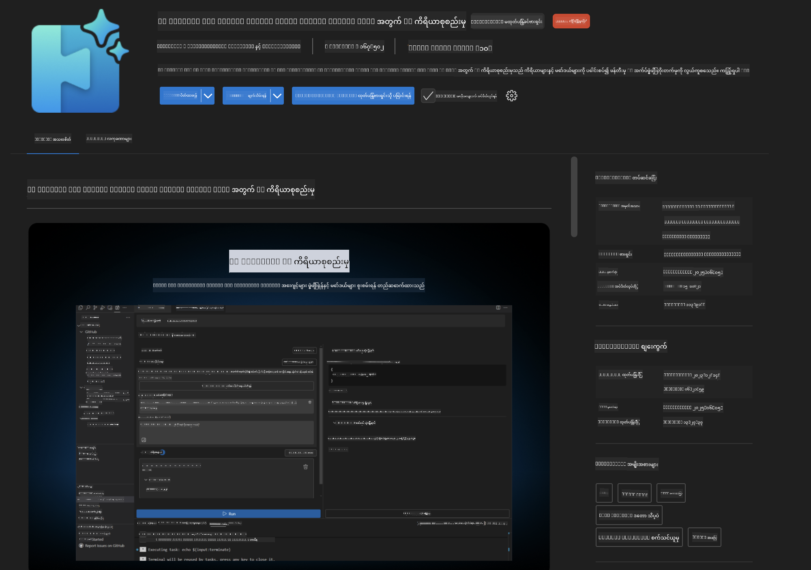
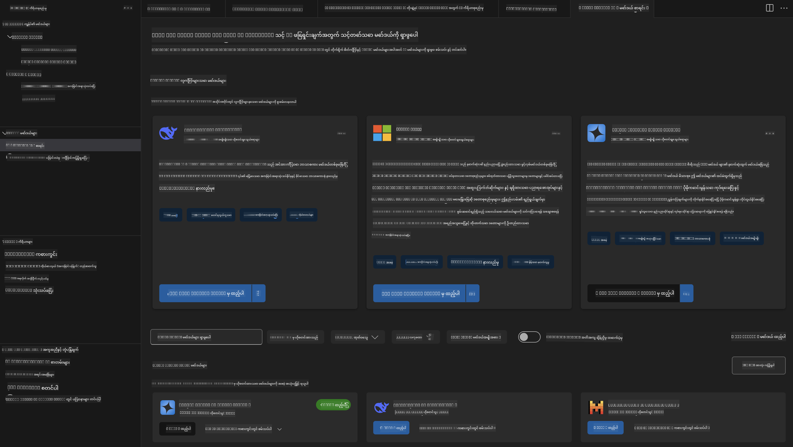
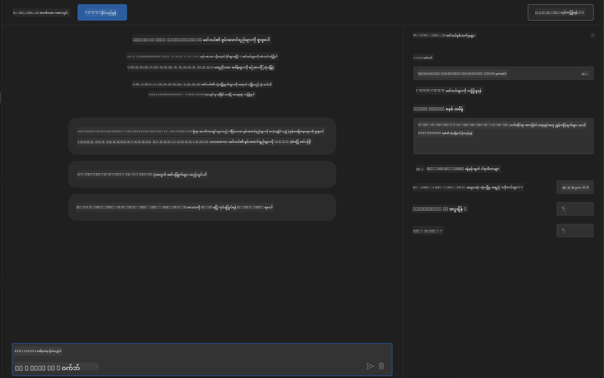
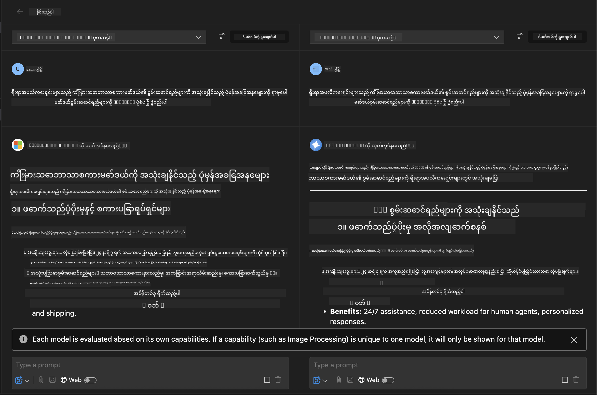
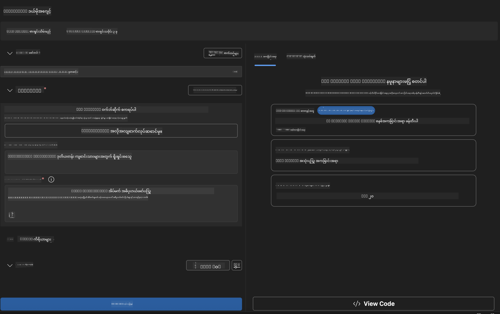

<!--
CO_OP_TRANSLATOR_METADATA:
{
  "original_hash": "2aa9dbc165e104764fa57e8a0d3f1c73",
  "translation_date": "2025-06-17T16:30:23+00:00",
  "source_file": "10-StreamliningAIWorkflowsBuildingAnMCPServerWithAIToolkit/lab1/README.md",
  "language_code": "my"
}
-->
# 🚀 Module 1: AI Toolkit အခြေခံများ

[]()
[]()
[]()

## 📋 သင်ယူရမည့် ရည်မှန်းချက်များ

ဒီ module အဆုံးသတ်တဲ့အချိန်မှာ သင်မှာ အောက်ပါအရာတွေကို လုပ်နိုင်ပါလိမ့်မယ်။
- ✅ Visual Studio Code အတွက် AI Toolkit ကို 설치ပြီး စနစ်တကျ ပြင်ဆင်နိုင်မည်
- ✅ Model Catalog ကို လမ်းညွှန်ပြီး မတူညီသော မော်ဒယ်ရင်းမြစ်များကို နားလည်နိုင်မည်
- ✅ Playground ကို အသုံးပြုပြီး မော်ဒယ်စမ်းသပ်မှုနှင့် စမ်းသပ်မှုလုပ်ဆောင်နိုင်မည်
- ✅ Agent Builder ဖြင့် ကိုယ်ပိုင် AI အေးဂျင့်များ ဖန်တီးနိုင်မည်
- ✅ မတူညီသော ပံ့ပိုးသူများ၏ မော်ဒယ် စွမ်းဆောင်ရည်ကို နှိုင်းယှဉ်နိုင်မည်
- ✅ Prompt engineering အတွက် အကောင်းဆုံး လမ်းစဉ်များကို အသုံးချနိုင်မည်

## 🧠 AI Toolkit (AITK) အကြောင်း အနှစ်ချုပ်

**Visual Studio Code အတွက် AI Toolkit** သည် Microsoft ၏ အဓိက extension ဖြစ်ပြီး VS Code ကို AI ဖွံ့ဖြိုးတိုးတက်မှု အပြည့်အစုံဖြစ်စေသော ပတ်ဝန်းကျင်တစ်ခုအဖြစ် ပြောင်းလဲပေးသည်။ AI သုတေသနနဲ့ လက်တွေ့ application ဖန်တီးမှုအကြား ချိတ်ဆက်ပေးပြီး generative AI ကို ကျွမ်းကျင်မှုအဆင့် မဟုတ်သူများအတွက်လည်း ရရှိနိုင်စေသည်။

### 🌟 အဓိက လုပ်ဆောင်ချက်များ

| လုပ်ဆောင်ချက် | ဖော်ပြချက် | အသုံးပြုမှု |
|---------|-------------|----------|
| **🗂️ Model Catalog** | GitHub, ONNX, OpenAI, Anthropic, Google မှ မော်ဒယ် ၁၀၀ ကျော်ရယူနိုင်သည် | မော်ဒယ် ရှာဖွေမှုနှင့် ရွေးချယ်မှု |
| **🔌 BYOM Support** | ကိုယ်ပိုင် မော်ဒယ်များ (ဒေသတွင်း/ဝေးလံ) ထည့်သွင်းနိုင်သည် | မော်ဒယ် ကိုယ်ပိုင် စီမံခန့်ခွဲမှု |
| **🎮 Interactive Playground** | စကားပြောမူကြိုက်နှင့် မော်ဒယ် စမ်းသပ်မှု တိုက်ရိုက်ပြုလုပ်နိုင်သည် | အမြန် prototype ဖန်တီးခြင်းနှင့် စမ်းသပ်ခြင်း |
| **📎 Multi-Modal Support** | စာသား၊ ပုံရိပ်၊ ထည့်သွင်းချက်များကို ကိုင်တွယ်နိုင်သည် | ပြင်းထန်သော AI application များ |
| **⚡ Batch Processing** | များစွာသော prompt များကို တပြိုင်နက်ပြုလုပ်နိုင်သည် | ထိရောက်သော စမ်းသပ်မှု လုပ်ငန်းစဉ်များ |
| **📊 Model Evaluation** | မူလ metrics (F1, relevance, similarity, coherence) ပါရှိသည် | စွမ်းဆောင်ရည် သုံးသပ်မှု |

### 🎯 AI Toolkit ကို အရေးကြီးသည့် အကြောင်းရင်းများ

- **🚀 ဖွံ့ဖြိုးတိုးတက်မှု မြန်ဆန်ခြင်း**: အတွေးမှ prototype ထိ မိနစ်အနည်းငယ်အတွင်း ပြုလုပ်နိုင်သည်
- **🔄 ပေါင်းစည်းထားသော လုပ်ငန်းစဉ်**: AI ပံ့ပိုးသူ များစွာအတွက် တစ်ခုတည်းသော မျက်နှာပြင်
- **🧪 လွယ်ကူသော စမ်းသပ်မှု**: ခက်ခဲသော ပြင်ဆင်မှု မလိုဘဲ မော်ဒယ်များကို နှိုင်းယှဉ်နိုင်သည်
- **📈 ထုတ်လုပ်မှုအဆင်သင့်**: prototype မှ deployment အဆင့်သို့ အဆင်ပြေစွာ ရွေ့ပြောင်းနိုင်သည်

## 🛠️ လိုအပ်ချက်များနှင့် ပြင်ဆင်ခြင်း

### 📦 AI Toolkit Extension ကို 설치ခြင်း

**အဆင့် ၁: Extensions Marketplace ကို ဝင်ရောက်ခြင်း**
1. Visual Studio Code ကို ဖွင့်ပါ
2. Extensions view (`Ctrl+Shift+X` သို့မဟုတ် `Cmd+Shift+X`) သို့ သွားပါ
3. "AI Toolkit" ကို ရှာဖွေပါ

**အဆင့် ၂: သင့် version ကို ရွေးချယ်ပါ**
- **🟢 Release**: ထုတ်လုပ်မှုအတွက် အကြံပြုသည်
- **🔶 Pre-release**: နောက်ဆုံးပေါ် features များကို စမ်းသပ်ရန်

**အဆင့် ၃: 설치ပြီး လှုပ်ရှားမှု ပြုလုပ်ပါ**



### ✅ စစ်ဆေးမှု စာရင်း
- [ ] AI Toolkit အိုင်ကွန်သည် VS Code sidebar တွင် ပေါ်လာပါပြီ
- [ ] Extension ကို ဖွင့်ထားပြီး လှုပ်ရှားနေသည်
- [ ] 설치အမှားများ မရှိပါ

## 🧪 လက်တွေ့ လေ့ကျင့်ခန်း ၁: GitHub မော်ဒယ်များ ရှာဖွေခြင်း

**🎯 ရည်မှန်းချက်**: Model Catalog ကို ကျွမ်းကျင်စွာ အသုံးပြုပြီး ပထမဆုံး AI မော်ဒယ်ကို စမ်းသပ်ပါ

### 📊 အဆင့် ၁: Model Catalog ကို လမ်းညွှန်ခြင်း

Model Catalog သည် AI ပတ်ဝန်းကျင်သို့ သင့်အား ချိတ်ဆက်ပေးသော တံခါးပေါက်ဖြစ်သည်။ မော်ဒယ်များကို ပံ့ပိုးသူ များစွာထံမှ စုစည်းထားပြီး ရွေးချယ်ရ လွယ်ကူစေသည်။

**🔍 လမ်းညွှန်ချက်:**

AI Toolkit sidebar မှ **MODELS - Catalog** ကို နှိပ်ပါ



**💡 အကြံပြုချက်**: သင့်အသုံးပြုမှုနဲ့ ကိုက်ညီတဲ့ အင်အားများပါဝင်သော မော်ဒယ်များကို ရှာဖွေကြည့်ပါ (ဥပမာ- ကုဒ်ရေးခြင်း၊ ဖန်တီးမှုရေးသားခြင်း၊ သုံးသပ်ခြင်း)

**⚠️ Note**: GitHub မှာရှိတဲ့ မော်ဒယ်များ (GitHub Models) ကို အခမဲ့အသုံးပြုနိုင်သော်လည်း request နှင့် token များအတွက် rate limit ရှိသည်။ GitHub မဟုတ်သော မော်ဒယ်များ (Azure AI သို့မဟုတ် အခြား endpoints မှာ ဟိုက်စတိုးဖြစ်သော) အသုံးပြုရန် API key သို့မဟုတ် authentication လိုအပ်သည်။

### 🚀 အဆင့် ၂: ပထမဆုံး မော်ဒယ် ထည့်သွင်းပြီး ပြင်ဆင်ခြင်း

**မော်ဒယ် ရွေးချယ်မှု မဟာဗျူဟာ:**
- **GPT-4.1**: ပြင်းထန်သော သဘောထားအတွေးနှင့် သုံးသပ်မှုအတွက် အကောင်းဆုံး
- **Phi-4-mini**: ပေါ့ပါးပြီး လျင်မြန်သော တုံ့ပြန်မှုများအတွက်

**🔧 ပြင်ဆင်ခြင်း လုပ်ငန်းစဉ်:**
1. Catalog မှ **OpenAI GPT-4.1** ကို ရွေးချယ်ပါ
2. **Add to My Models** ကို နှိပ်၍ မော်ဒယ်ကို အသုံးပြုရန် မှတ်ပုံတင်ပါ
3. **Try in Playground** ကို နှိပ်၍ စမ်းသပ်ပတ်ဝန်းကျင်ကို စတင်ပါ
4. မော်ဒယ် စတင်မှုအတွက် ခဏစောင့်ဆိုင်းပါ (ပထမဆုံး အသုံးပြုမှုမှာ အချိန်ယူနိုင်သည်)



**⚙️ မော်ဒယ် parameter များနားလည်ခြင်း:**
- **Temperature**: ဖန်တီးမှုအဆင့်ကို ထိန်းချုပ်သည် (0 = အတိအကျ, 1 = ဖန်တီးမှုမြင့်)
- **Max Tokens**: တုံ့ပြန်မှု အရှည်အကြီးဆုံး
- **Top-p**: တုံ့ပြန်မှု မတူညီမှုအတွက် nucleus sampling

### 🎯 အဆင့် ၃: Playground Interface ကို ကျွမ်းကျင်စွာ အသုံးပြုခြင်း

Playground သည် သင့် AI စမ်းသပ်မှု စက်ရုံဖြစ်သည်။ ၎င်း၏ အကျိုးသက်ရောက်မှုကို အများဆုံးဖြစ်အောင် အသုံးပြုနည်းမှာ -

**🎨 Prompt Engineering အကောင်းဆုံး လမ်းစဉ်များ:**
1. **တိကျစွာ ဖော်ပြပါ**: ရှင်းလင်းပြီး အသေးစိတ်ညွှန်ကြားချက်များ ပိုမိုကောင်းမွန်သည်
2. **အကြောင်းအရာ ပံ့ပိုးပါ**: သက်ဆိုင်ရာ နောက်ခံအချက်အလက်များ ထည့်သွင်းပါ
3. **ဥပမာများ အသုံးပြုပါ**: မော်ဒယ်ကို သင်လိုချင်သည့်အတိုင်း ပြသပါ
4. **ပြန်လည်တိုးတက်အောင် လုပ်ဆောင်ပါ**: ပထမဆုံးရလဒ်များအပေါ် အခြေခံပြီး prompt များ ပြန်လည်ပြင်ဆင်ပါ

**🧪 စမ်းသပ်မှု အခြေအနေများ:**
```markdown
# Example 1: Code Generation
"Write a Python function that calculates the factorial of a number using recursion. Include error handling and docstrings."

# Example 2: Creative Writing
"Write a professional email to a client explaining a project delay, maintaining a positive tone while being transparent about challenges."

# Example 3: Data Analysis
"Analyze this sales data and provide insights: [paste your data]. Focus on trends, anomalies, and actionable recommendations."
```


### 🏆 စိန်ခေါ်မှု လေ့ကျင့်ခန်း: မော်ဒယ် စွမ်းဆောင်ရည် နှိုင်းယှဉ်ခြင်း

**🎯 ရည်မှန်းချက်**: တူညီသော prompt များဖြင့် မော်ဒယ် များကို နှိုင်းယှဉ်၍ ၎င်းတို့၏အားသာချက်များကို နားလည်ပါ

**📋 ညွှန်ကြားချက်များ:**
1. **Phi-4-mini** ကို သင့် အလုပ်လုပ်ခန်းထဲ ထည့်ပါ
2. GPT-4.1 နှင့် Phi-4-mini နှစ်ခုလုံးအတွက် တူညီသော prompt ကို အသုံးပြုပါ


3. တုံ့ပြန်မှုအရည်အသွေး၊ အမြန်နှုန်းနှင့် တိကျမှုကို နှိုင်းယှဉ်ပါ
4. ရလဒ်အပိုင်းတွင် သင့် ရှာဖွေတွေ့ရှိချက်များကို မှတ်တမ်းတင်ပါ



**💡 ရှာဖွေသင့် အချက်များ:**
- LLM နှင့် SLM ကို ဘယ်အချိန်မှာ အသုံးပြုရမည်နည်း
- ကုန်ကျစရိတ်နှင့် စွမ်းဆောင်ရည် အပြန်အလှန် သဘောတူမှုများ
- မော်ဒယ် အမျိုးအစားအလိုက် အထူးပြု လုပ်ဆောင်ချက်များ

## 🤖 လက်တွေ့ လေ့ကျင့်ခန်း ၂: Agent Builder ဖြင့် ကိုယ်ပိုင် အေးဂျင့်များ ဖန်တီးခြင်း

**🎯 ရည်မှန်းချက်**: အလုပ်လုပ်မှုနှင့် တာဝန်ပေါ်မူတည်၍ အထူးပြု AI အေးဂျင့်များ ဖန်တီးပါ

### 🏗️ အဆင့် ၁: Agent Builder ကို နားလည်ခြင်း

Agent Builder သည် AI Toolkit ၏ အဓိက အင်္ဂါရပ်ဖြစ်ပြီး LLM များ၏ အင်အားနှင့် ကိုယ်ပိုင် ညွှန်ကြားချက်များ၊ အထူး parameter များ၊ နည်းပညာပိုင်း အကြောင်းအရာများကို ပေါင်းစပ်ထားသည့် ရည်ရွယ်ချက်အလိုက် AI အကူအညီများ ဖန်တီးနိုင်သည်။

**🧠 Agent ဆောက်လုပ်မှု အစိတ်အပိုင်းများ:**
- **Core Model**: အခြေခံ LLM (GPT-4, Groks, Phi စသည်)
- **System Prompt**: Agent ၏ ကိုယ်ရည်ကိုယ်သွေးနှင့် အပြုအမူ သတ်မှတ်ချက်
- **Parameters**: စွမ်းဆောင်ရည် အကောင်းဆုံးအတွက် စနစ်တကျ ပြင်ဆင်ချက်များ
- **Tools Integration**: ပြင်ပ API များနှင့် MCP ဝန်ဆောင်မှုများ ချိတ်ဆက်ခြင်း
- **Memory**: စကားပြောအကြောင်းအရာနှင့် အစည်းအဝေး ထိန်းသိမ်းမှု



### ⚙️ အဆင့် ၂: Agent Configuration ကို နက်ရှိုင်းစွာ လေ့လာခြင်း

**🎨 ထိရောက်သော System Prompt များ ဖန်တီးခြင်း:**
```markdown
# Template Structure:
## Role Definition
You are a [specific role] with expertise in [domain].

## Capabilities
- List specific abilities
- Define scope of knowledge
- Clarify limitations

## Behavior Guidelines
- Response style (formal, casual, technical)
- Output format preferences
- Error handling approach

## Examples
Provide 2-3 examples of ideal interactions
```

*သင် AI ကို အသုံးပြုပြီး prompt များ ဖန်တီးပြင်ဆင်ရန် Generate System Prompt ကိုလည်း အသုံးပြုနိုင်ပါသည်*

**🔧 Parameter များ ပြင်ဆင်ခြင်း:**
| Parameter | အကြံပြု အကွာအဝေး | အသုံးပြုမှု |
|-----------|------------------|----------|
| **Temperature** | 0.1-0.3 | နည်းပညာ/အချက်အလက် တုံ့ပြန်မှုများ |
| **Temperature** | 0.7-0.9 | ဖန်တီးမှု/အတွေးအခေါ် အလုပ်များ |
| **Max Tokens** | 500-1000 | တိကျပြီး ချုပ်မြောက်သော တုံ့ပြန်မှု |
| **Max Tokens** | 2000-4000 | အသေးစိတ် ရှင်းလင်းချက်များ |

### 🐍 အဆင့် ၃: လက်တွေ့ လေ့ကျင့်ခန်း - Python Programming Agent

**🎯 လုပ်ဆောင်ချက်**: အထူးပြု Python ကုဒ်ရေးသားမှု အကူအညီ AI agent ဖန်တီးခြင်း

**📋 ပြင်ဆင်မှု အဆင့်များ:**

1. **မော်ဒယ် ရွေးချယ်မှု**: **Claude 3.5 Sonnet** ကို ရွေးပါ (ကုဒ်ရေးရာအတွက် ထူးချွန်သည်)

2. **System Prompt ဒီဇိုင်း**:
```markdown
# Python Programming Expert Agent

## Role
You are a senior Python developer with 10+ years of experience. You excel at writing clean, efficient, and well-documented Python code.

## Capabilities
- Write production-ready Python code
- Debug complex issues
- Explain code concepts clearly
- Suggest best practices and optimizations
- Provide complete working examples

## Response Format
- Always include docstrings
- Add inline comments for complex logic
- Suggest testing approaches
- Mention relevant libraries when applicable

## Code Quality Standards
- Follow PEP 8 style guidelines
- Use type hints where appropriate
- Handle exceptions gracefully
- Write readable, maintainable code
```

3. **Parameter ပြင်ဆင်မှု**:
   - Temperature: 0.2 (တိကျပြီး ယုံကြည်ရသော ကုဒ်များအတွက်)
   - Max Tokens: 2000 (အသေးစိတ် ရှင်းလင်းချက်များ)
   - Top-p: 0.9 (ဖန်တီးမှုနှင့် တုံ့ပြန်မှုထိန်းချုပ်မှု)


### 🧪 အဆင့် ၄: သင့် Python Agent ကို စမ်းသပ်ခြင်း

**စမ်းသပ်ရန် အခြေအနေများ:**
1. **အခြေခံ လုပ်ဆောင်ချက်**: "Prime နံပါတ်တွေ ရှာဖွေဖို့ function တစ်ခု ဖန်တီးပါ"
2. **ရှုပ်ထွေး Algorithm**: "Binary search tree ကို insert, delete, search method များဖြင့် အကောင်အထည်ဖော်ပါ"
3. **အမှန်တကယ် ပြဿနာ**: "Rate limiting နှင့် retry များကို ကိုင်တွယ်နိုင်သော web scraper တစ်ခု တည်ဆောက်ပါ"
4. **Debugging**: "ဒီကုဒ်ကို ပြင်ဆင်ပါ [buggy code ကို 붙여넣기]"

**🏆 အောင်မြင်မှု စံချိန်များ:**
- ✅ ကုဒ် error မရှိဘဲ လည်ပတ်သည်
- ✅ သင့်တော်သော စာတမ်းများ ပါရှိသည်
- ✅ Python အကောင်းဆုံး လမ်းစဉ်များကို လိုက်နာသည်
- ✅ ရှင်းလင်းသော ရှင်းပြချက်များ ပေးသည်
- ✅ တိုးတက်မှု အကြံပြုချက်များ ပါရှိသည်

## 🎓 Module 1 အဆုံးသတ်ခြင်းနှင့် နောက်တစ်ဆင့်များ

### 📊 နည်းပညာ စစ်ဆေးမှု

သင်၏ နားလည်မှုကို စမ်းသပ်ပါ -
- [ ] Catalog အတွင်း မော်ဒယ်များ၏ ကွာခြားချက်ကို ရှ

**အတည်မပြုချက်**  
ဤစာတမ်းကို AI ဘာသာပြန်ဝန်ဆောင်မှု [Co-op Translator](https://github.com/Azure/co-op-translator) ဖြင့် ဘာသာပြန်ထားပါသည်။ ကျွန်ုပ်တို့သည် တိကျမှန်ကန်မှုအတွက် ကြိုးစားပေမယ့် အလိုအလျောက် ဘာသာပြန်ခြင်းသည် အမှားများ သို့မဟုတ် မှားယွင်းမှုများ ပါဝင်နိုင်ကြောင်း သတိပြုပါရန် မေတ္တာရပ်ခံအပ်ပါသည်။ မူရင်းစာတမ်းကို မိခင်ဘာသာဖြင့်သာ တရားဝင်အချက်အလက်အဖြစ် ယူဆသင့်ပါသည်။ အရေးကြီးသော အချက်အလက်များအတွက် လူ့ဘာသာပြန်ပညာရှင်များ၏ ဘာသာပြန်ချက်ကို အကြံပြုပါသည်။ ဤဘာသာပြန်ချက်အသုံးပြုမှုကြောင့် ဖြစ်ပေါ်လာသော နားမလည်မှုများ သို့မဟုတ် မှားယွင်းဖတ်ရှုမှုများအတွက် ကျွန်ုပ်တို့ တာဝန်မယူပါ။