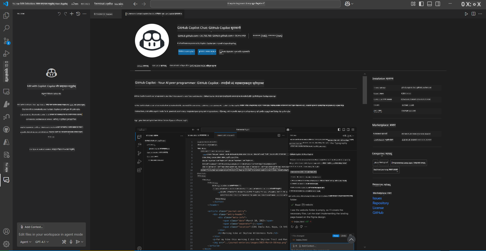
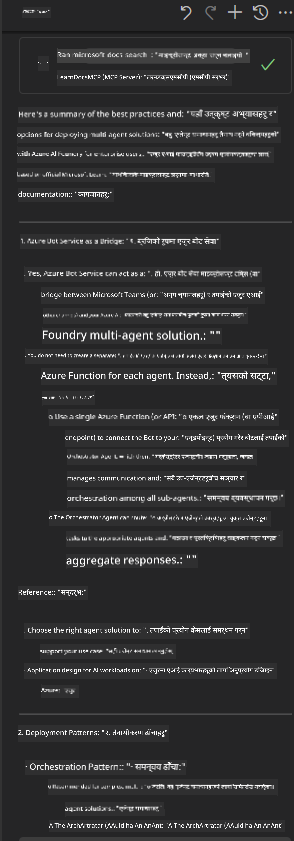

<!--
CO_OP_TRANSLATOR_METADATA:
{
  "original_hash": "db532b1ec386c9ce38c791653dc3c881",
  "translation_date": "2025-06-21T14:37:55+00:00",
  "source_file": "09-CaseStudy/docs-mcp/solution/scenario3/README.md",
  "language_code": "ne"
}
-->
# Scenario 3: VS Code मा MCP सर्भरसहित इन-एडिटर डक्स

## अवलोकन

यस परिदृश्यमा, तपाईंले Microsoft Learn Docs सिधै आफ्नो Visual Studio Code वातावरणमा ल्याउन MCP सर्भर कसरी प्रयोग गर्ने सिक्नुहुनेछ। बारम्बार ब्राउजर ट्याब परिवर्तन गरेर डकुमेन्टेसन खोज्ने सट्टा, तपाईंले आफ्नो एडिटरभित्रै आधिकारिक डक्स पहुँच, खोज, र सन्दर्भ गर्न सक्नुहुन्छ। यसले तपाईंको कार्यप्रवाहलाई सरल बनाउँछ, ध्यान केन्द्रित राख्छ, र GitHub Copilot जस्ता उपकरणहरूसँग सहज एकीकरण सक्षम बनाउँछ।

- VS Code भित्रै डक्स खोज्नुहोस् र पढ्नुहोस्, कोडिङ वातावरण छोड्नु नपर्ने।
- README वा कोर्स फाइलहरूमा सिधै डकुमेन्टेसन सन्दर्भ र लिंकहरू थप्नुहोस्।
- GitHub Copilot र MCP सँगै प्रयोग गरी सहज, AI-समर्थित डकुमेन्टेसन कार्यप्रवाह बनाउनुहोस्।

## सिकाइका उद्देश्यहरू

यस अध्यायको अन्त्यसम्म, तपाईंले VS Code भित्र MCP सर्भर सेटअप र प्रयोग गरेर आफ्नो डकुमेन्टेसन र विकास कार्यप्रवाह कसरी सुधार गर्ने बुझ्नुहुनेछ। तपाईं सक्षम हुनुहुनेछ:

- डकुमेन्टेसन खोजका लागि MCP सर्भर प्रयोग गर्न आफ्नो कार्यक्षेत्र कन्फिगर गर्न।
- VS Code भित्रैबाट डकुमेन्टेसन खोज्न र सम्मिलित गर्न।
- GitHub Copilot र MCP को शक्तिलाई संयोजन गरी बढी उत्पादक, AI-सहयोगी कार्यप्रवाह बनाउन।

यी सीपहरूले तपाईंलाई ध्यान केन्द्रित राख्न, डकुमेन्टेसनको गुणस्तर सुधार गर्न, र विकासकर्ता वा प्राविधिक लेखकको रूपमा उत्पादनशीलता बढाउन मद्दत गर्नेछन्।

## समाधान

इन-एडिटर डकुमेन्टेसन पहुँच प्राप्त गर्न, तपाईंले MCP सर्भरलाई VS Code र GitHub Copilot सँग एकीकृत गर्ने चरणहरू पालना गर्नुहुनेछ। यो समाधान कोर्स लेखक, डकुमेन्टेसन लेखक, र विकासकर्ताहरूका लागि उपयुक्त छ जसले एडिटरमा ध्यान राख्दै डक्स र Copilot सँग काम गर्न चाहन्छन्।

- कोर्स वा प्रोजेक्ट डकुमेन्टेसन लेख्दा README मा छिटो सन्दर्भ लिंक थप्नुहोस्।
- Copilot लाई कोड बनाउन प्रयोग गर्नुहोस् र MCP बाट तुरुन्तै सान्दर्भिक डक्स खोज्नुहोस् र उद्धृत गर्नुहोस्।
- एडिटरमा ध्यान केन्द्रित राख्नुहोस् र उत्पादकत्व बढाउनुहोस्।

### चरण-द्वारा-चरण मार्गदर्शन

सुरु गर्न, यी चरणहरू पालना गर्नुहोस्। प्रत्येक चरणका लागि, तपाईंले प्रक्रिया दृश्यात्मक रूपमा देखाउन assets फोल्डरबाट स्क्रिनसट थप्न सक्नुहुन्छ।

1. **MCP कन्फिगरेसन थप्नुहोस्:**
   आफ्नो प्रोजेक्ट रुटमा `.vscode/mcp.json` फाइल बनाउनुहोस् र निम्न कन्फिगरेसन थप्नुहोस्:
   ```json
   {
     "servers": {
       "LearnDocsMCP": {
         "url": "https://learn.microsoft.com/api/mcp"
       }
     }
   }
   ```
   यस कन्फिगरेसनले VS Code लाई [`Microsoft Learn Docs MCP server`](https://github.com/MicrosoftDocs/mcp) सँग कसरी जडान गर्ने भन्ने बताउँछ।
   
   
    
2. **GitHub Copilot Chat प्यानल खोल्नुहोस्:**
   यदि तपाईंले GitHub Copilot एक्सटेन्सन पहिले नै इन्स्टल गर्नुभएको छैन भने, VS Code को Extensions दृश्यमा गई इन्स्टल गर्नुहोस्। तपाईं यसलाई सिधै [Visual Studio Code Marketplace](https://marketplace.visualstudio.com/items?itemName=GitHub.copilot-chat) बाट डाउनलोड गर्न सक्नुहुन्छ। त्यसपछि Copilot Chat प्यानल साइडबारबाट खोल्नुहोस्।

   

3. **एजेन्ट मोड सक्षम गर्नुहोस् र उपकरणहरू जाँच गर्नुहोस्:**
   Copilot Chat प्यानलमा एजेन्ट मोड सक्षम गर्नुहोस्।

   

   एजेन्ट मोड सक्षम गरेपछि, MCP सर्भर उपलब्ध उपकरणहरू मध्ये एक हो कि होइन जाँच गर्नुहोस्। यसले Copilot एजेन्टलाई सान्दर्भिक जानकारी ल्याउन डकुमेन्टेसन सर्भर पहुँच गर्न सक्षम बनाउँछ।
   
   
4. **नयाँ च्याट सुरु गर्नुहोस् र एजेन्टलाई सोध्नुहोस्:**
   Copilot Chat प्यानलमा नयाँ च्याट खोल्नुहोस्। अब तपाईं आफ्नो डकुमेन्टेसन सम्बन्धी प्रश्नहरू एजेन्टलाई सोध्न सक्नुहुन्छ। एजेन्टले MCP सर्भर प्रयोग गरी सम्बन्धित Microsoft Learn डकुमेन्टेसन सिधै तपाईंको एडिटरमा ल्याउनेछ।

   - *"म विषय X को लागि ८ हप्ते अध्ययन योजना बनाउन खोज्दैछु। प्रत्येक हप्ताका लागि म के सामग्री लिनु पर्छ भनेर सुझाव दिनुहोस्।"*

   

5. **प्रत्यक्ष प्रश्न:**

   > Azure AI Foundry Discord को [#get-help](https://discord.gg/D6cRhjHWSC) सेक्सनबाट प्रत्यक्ष प्रश्न लिऔं ([मूल सन्देश हेर्नुहोस्](https://discord.com/channels/1113626258182504448/1385498306720829572)):
   
   *"म Azure AI Foundry मा विकास गरिएका AI एजेन्टहरूसँग बहु-एजेन्ट समाधान कसरी तैनाथ गर्ने भनेर जवाफ खोज्दैछु। Copilot Studio च्यानलहरू जस्तो सिधा तैनाथ गर्ने विधि छैन जस्तो देखिन्छ। त्यसैले, एंटरप्राइज प्रयोगकर्ताहरूले अन्तरक्रिया गर्न र काम सम्पन्न गर्नका लागि यो तैनाथीकरणका विभिन्न तरिका के-के हुन्?
धेरै लेख/ब्लगहरूमा भनिएको छ कि Azure Bot सेवा प्रयोग गरेर यो काम गर्न सकिन्छ जसले MS Teams र Azure AI Foundry एजेन्टहरूबीच पुलको काम गर्छ, के Azure function मार्फत Orchestrator Agent सँग जडान गर्ने Azure Bot सेटअप गरे यो काम गर्नेछ वा मलाई बहु-एजेन्ट समाधानका प्रत्येक AI एजेन्टको लागि Azure function सिर्जना गर्नुपर्छ ताकि Bot framework मा orchestration गर्न सकियोस्? अन्य सुझावहरू स्वागतयोग्य छन्।"*

   

   एजेन्टले सम्बन्धित डकुमेन्टेसन लिंकहरू र सारांशहरू प्रदान गर्नेछ, जुन तपाईंले markdown फाइलहरूमा सिधै सम्मिलित गर्न वा कोडमा सन्दर्भको रूपमा प्रयोग गर्न सक्नुहुन्छ।
   
### नमुना प्रश्नहरू

यहाँ केही उदाहरण प्रश्नहरू छन् जुन तपाईंले प्रयास गर्न सक्नुहुन्छ। यी प्रश्नहरूले MCP सर्भर र Copilot कसरी मिलेर तत्काल, सन्दर्भ-सचेत डकुमेन्टेसन र सन्दर्भहरू प्रदान गर्छन् भन्ने देखाउनेछन्, र तपाईंलाई VS Code छोड्न आवश्यक पर्दैन:

- "Azure Functions triggers कसरी प्रयोग गर्ने देखाउनुहोस्।"
- "Azure Key Vault को आधिकारिक डकुमेन्टेसनको लिंक सम्मिलित गर्नुहोस्।"
- "Azure स्रोतहरू सुरक्षित गर्ने उत्तम अभ्यासहरू के-के हुन्?"
- "Azure AI सेवाहरूको लागि छिटो सुरु गाइड फेला पार्नुहोस्।"

यी प्रश्नहरूले MCP सर्भर र Copilot कसरी मिलेर तत्काल, सन्दर्भ-सचेत डकुमेन्टेसन र सन्दर्भहरू प्रदान गर्छन् भन्ने देखाउनेछन्, र तपाईंलाई VS Code छोड्न आवश्यक पर्दैन।

---

**अस्वीकरण**:  
यो कागजात [Co-op Translator](https://github.com/Azure/co-op-translator) नामक एआई अनुवाद सेवा प्रयोग गरी अनुवाद गरिएको हो। हामी शुद्धताका लागि प्रयासरत छौं, तर कृपया ध्यान दिनुहोस् कि स्वचालित अनुवादमा त्रुटि वा अशुद्धता हुनसक्छ। मूल कागजात यसको मूल भाषामा आधिकारिक स्रोत मानिनु पर्छ। महत्वपूर्ण जानकारीका लागि व्यावसायिक मानवीय अनुवाद सिफारिस गरिन्छ। यस अनुवादको प्रयोगबाट उत्पन्न हुने कुनै पनि गलतफहमी वा गलत व्याख्याका लागि हामी जिम्मेवार छैनौं।