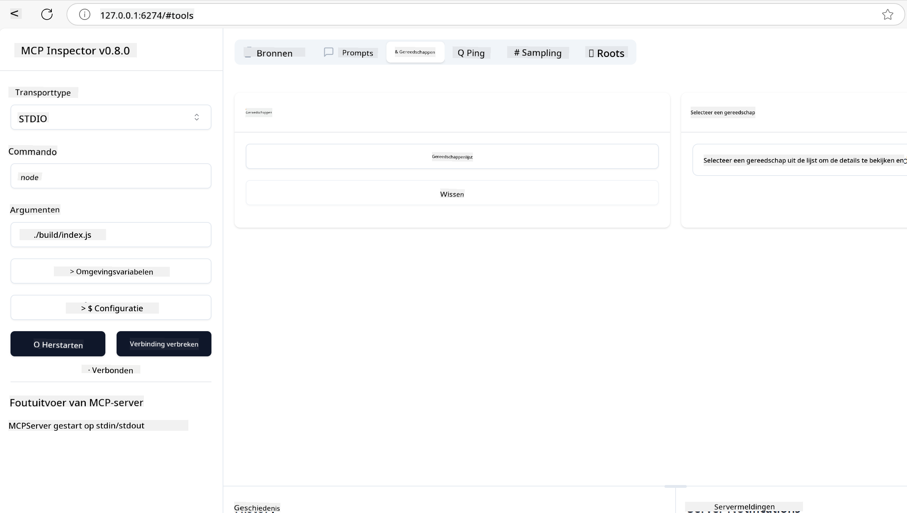

<!--
CO_OP_TRANSLATOR_METADATA:
{
  "original_hash": "315ecce765d22639b60dbc41344c8533",
  "translation_date": "2025-07-13T17:35:40+00:00",
  "source_file": "03-GettingStarted/01-first-server/README.md",
  "language_code": "nl"
}
-->
### -2- Maak een project aan

Nu je de SDK hebt geïnstalleerd, gaan we een project aanmaken:

### -3- Maak projectbestanden aan

### -4- Schrijf de servercode

### -5- Een tool en een resource toevoegen

Voeg een tool en een resource toe door de volgende code toe te voegen:

### -6- Volledige code

Laten we de laatste code toevoegen die nodig is om de server te kunnen starten:

### -7- Test de server

Start de server met het volgende commando:

### -8- Gebruik de inspector

De inspector is een geweldig hulpmiddel dat je server kan opstarten en waarmee je kunt interactieren om te testen of alles werkt. Laten we hem starten:
> [!NOTE]
> het kan er anders uitzien in het veld "command" omdat dit de opdracht bevat om een server te starten met jouw specifieke runtime/
Je zou de volgende gebruikersinterface moeten zien:

1. Maak verbinding met de server door op de knop Connect te klikken  
   Zodra je verbonden bent met de server, zou je het volgende moeten zien:

   

1. Selecteer "Tools" en vervolgens "listTools", je zou "Add" moeten zien verschijnen. Selecteer "Add" en vul de parameterwaarden in.

   Je zou de volgende reactie moeten zien, dit is het resultaat van de "add" tool:

   

Gefeliciteerd, je hebt je eerste server gemaakt en uitgevoerd!

### Officiële SDK's

MCP biedt officiële SDK's voor meerdere talen:

- [C# SDK](https://github.com/modelcontextprotocol/csharp-sdk) - Onderhouden in samenwerking met Microsoft
- [Java SDK](https://github.com/modelcontextprotocol/java-sdk) - Onderhouden in samenwerking met Spring AI
- [TypeScript SDK](https://github.com/modelcontextprotocol/typescript-sdk) - De officiële TypeScript-implementatie
- [Python SDK](https://github.com/modelcontextprotocol/python-sdk) - De officiële Python-implementatie
- [Kotlin SDK](https://github.com/modelcontextprotocol/kotlin-sdk) - De officiële Kotlin-implementatie
- [Swift SDK](https://github.com/modelcontextprotocol/swift-sdk) - Onderhouden in samenwerking met Loopwork AI
- [Rust SDK](https://github.com/modelcontextprotocol/rust-sdk) - De officiële Rust-implementatie

## Belangrijkste punten

- Het opzetten van een MCP-ontwikkelomgeving is eenvoudig met taalspecifieke SDK's  
- Het bouwen van MCP-servers houdt in dat je tools maakt en registreert met duidelijke schema's  
- Testen en debuggen zijn essentieel voor betrouwbare MCP-implementaties

## Voorbeelden

- [Java Calculator](../samples/java/calculator/README.md)  
- [.Net Calculator](../../../../03-GettingStarted/samples/csharp)  
- [JavaScript Calculator](../samples/javascript/README.md)  
- [TypeScript Calculator](../samples/typescript/README.md)  
- [Python Calculator](../../../../03-GettingStarted/samples/python)

## Opdracht

Maak een eenvoudige MCP-server met een tool naar keuze:

1. Implementeer de tool in je favoriete taal (.NET, Java, Python of JavaScript).  
2. Definieer invoerparameters en retourwaarden.  
3. Voer de inspector-tool uit om te controleren of de server werkt zoals bedoeld.  
4. Test de implementatie met verschillende invoerwaarden.

## Oplossing

[Oplossing](./solution/README.md)

## Extra bronnen

- [Agents bouwen met Model Context Protocol op Azure](https://learn.microsoft.com/azure/developer/ai/intro-agents-mcp)  
- [Remote MCP met Azure Container Apps (Node.js/TypeScript/JavaScript)](https://learn.microsoft.com/samples/azure-samples/mcp-container-ts/mcp-container-ts/)  
- [.NET OpenAI MCP Agent](https://learn.microsoft.com/samples/azure-samples/openai-mcp-agent-dotnet/openai-mcp-agent-dotnet/)

## Wat nu?

Volgende: [Aan de slag met MCP Clients](../02-client/README.md)

**Disclaimer**:  
Dit document is vertaald met behulp van de AI-vertalingsdienst [Co-op Translator](https://github.com/Azure/co-op-translator). Hoewel we streven naar nauwkeurigheid, dient u er rekening mee te houden dat geautomatiseerde vertalingen fouten of onnauwkeurigheden kunnen bevatten. Het originele document in de oorspronkelijke taal moet als de gezaghebbende bron worden beschouwd. Voor cruciale informatie wordt professionele menselijke vertaling aanbevolen. Wij zijn niet aansprakelijk voor eventuele misverstanden of verkeerde interpretaties die voortvloeien uit het gebruik van deze vertaling.