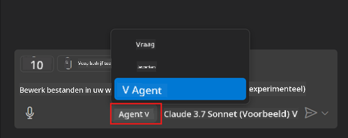

<!--
CO_OP_TRANSLATOR_METADATA:
{
  "original_hash": "8ea28e5e566edd5969337fd0b191ba3f",
  "translation_date": "2025-07-17T07:14:36+00:00",
  "source_file": "03-GettingStarted/04-vscode/README.md",
  "language_code": "nl"
}
-->
# Een server gebruiken vanuit GitHub Copilot Agent-modus

Visual Studio Code en GitHub Copilot kunnen fungeren als client en een MCP Server gebruiken. Je vraagt je misschien af waarom we dat zouden willen? Nou, dat betekent dat je alle functies van de MCP Server nu vanuit je IDE kunt gebruiken. Stel je bijvoorbeeld voor dat je de MCP-server van GitHub toevoegt, hiermee kun je GitHub bedienen via prompts in plaats van specifieke commando’s in de terminal te typen. Of stel je iets voor dat in het algemeen je ontwikkelervaring verbetert, allemaal bestuurd met natuurlijke taal. Nu zie je het voordeel toch?

## Overzicht

Deze les behandelt hoe je Visual Studio Code en de Agent-modus van GitHub Copilot gebruikt als client voor jouw MCP Server.

## Leerdoelen

Aan het einde van deze les kun je:

- Een MCP Server gebruiken via Visual Studio Code.
- Functionaliteiten zoals tools uitvoeren via GitHub Copilot.
- Visual Studio Code configureren om je MCP Server te vinden en beheren.

## Gebruik

Je kunt je MCP-server op twee manieren bedienen:

- Via de gebruikersinterface, je ziet later in dit hoofdstuk hoe dit werkt.
- Via de terminal, het is mogelijk om dingen te bedienen vanuit de terminal met de `code` executable:

  Om een MCP-server toe te voegen aan je gebruikersprofiel, gebruik je de --add-mcp commandoregeloptie en geef je de JSON-serverconfiguratie op in de vorm {\"name\":\"server-naam\",\"command\":...}.

  ```
  code --add-mcp "{\"name\":\"my-server\",\"command\": \"uvx\",\"args\": [\"mcp-server-fetch\"]}"
  ```

### Screenshots

  
  


Laten we in de volgende secties verder ingaan op het gebruik van de visuele interface.

## Aanpak

Dit is hoe we het op hoofdlijnen moeten aanpakken:

- Een bestand configureren om onze MCP Server te vinden.
- De server opstarten/verbinden zodat deze zijn mogelijkheden kan tonen.
- Deze mogelijkheden gebruiken via de GitHub Copilot Chat-interface.

Top, nu we de flow begrijpen, laten we een MCP Server proberen te gebruiken via Visual Studio Code met een oefening.

## Oefening: Een server gebruiken

In deze oefening configureren we Visual Studio Code zodat het jouw MCP-server kan vinden en gebruiken via de GitHub Copilot Chat-interface.

### -0- Voorbereiding, MCP Server discovery inschakelen

Je moet mogelijk het ontdekken van MCP Servers inschakelen.

1. Ga in Visual Studio Code naar `File -> Preferences -> Settings`.

1. Zoek op "MCP" en zet `chat.mcp.discovery.enabled` aan in het settings.json bestand.

### -1- Configuratiebestand aanmaken

Begin met het aanmaken van een configuratiebestand in de root van je project. Je hebt een bestand nodig genaamd MCP.json dat je plaatst in een map genaamd .vscode. Het zou er zo uit moeten zien:

```text
.vscode
|-- mcp.json
```

Vervolgens kijken we hoe je een server kunt toevoegen.

### -2- Een server configureren

Voeg de volgende inhoud toe aan *mcp.json*:

```json
{
    "inputs": [],
    "servers": {
       "hello-mcp": {
           "command": "node",
           "args": [
               "build/index.js"
           ]
       }
    }
}
```

Hierboven zie je een eenvoudig voorbeeld van het starten van een server geschreven in Node.js. Voor andere runtimes geef je het juiste commando op om de server te starten met `command` en `args`.

### -3- De server starten

Nu je een entry hebt toegevoegd, starten we de server:

1. Zoek je entry in *mcp.json* en zorg dat je het "play"-icoon ziet:

    

1. Klik op het "play"-icoon, je zou moeten zien dat het tools-icoon in GitHub Copilot Chat het aantal beschikbare tools verhoogt. Klik je op dat tools-icoon, dan zie je een lijst met geregistreerde tools. Je kunt elke tool aan- of uitvinken, afhankelijk van of je wilt dat GitHub Copilot deze als context gebruikt:

  

1. Om een tool uit te voeren, typ je een prompt waarvan je weet dat die overeenkomt met de beschrijving van een van je tools, bijvoorbeeld een prompt als "add 22 to 1":

  

  Je zou een antwoord moeten zien met 23.

## Opdracht

Probeer een server-entry toe te voegen aan je *mcp.json* bestand en zorg dat je de server kunt starten en stoppen. Zorg er ook voor dat je via de GitHub Copilot Chat-interface kunt communiceren met de tools op je server.

## Oplossing

[Oplossing](./solution/README.md)

## Belangrijkste punten

De belangrijkste punten uit dit hoofdstuk zijn:

- Visual Studio Code is een uitstekende client waarmee je meerdere MCP Servers en hun tools kunt gebruiken.
- De GitHub Copilot Chat-interface is hoe je met de servers communiceert.
- Je kunt de gebruiker om invoer vragen, zoals API-sleutels, die je kunt doorgeven aan de MCP Server bij het configureren van de server-entry in het *mcp.json* bestand.

## Voorbeelden

- [Java Calculator](../samples/java/calculator/README.md)  
- [.Net Calculator](../../../../03-GettingStarted/samples/csharp)  
- [JavaScript Calculator](../samples/javascript/README.md)  
- [TypeScript Calculator](../samples/typescript/README.md)  
- [Python Calculator](../../../../03-GettingStarted/samples/python)

## Extra bronnen

- [Visual Studio docs](https://code.visualstudio.com/docs/copilot/chat/mcp-servers)

## Wat volgt

- Volgende: [Een SSE Server maken](../05-sse-server/README.md)

**Disclaimer**:  
Dit document is vertaald met behulp van de AI-vertalingsdienst [Co-op Translator](https://github.com/Azure/co-op-translator). Hoewel we streven naar nauwkeurigheid, dient u er rekening mee te houden dat geautomatiseerde vertalingen fouten of onnauwkeurigheden kunnen bevatten. Het originele document in de oorspronkelijke taal moet als de gezaghebbende bron worden beschouwd. Voor cruciale informatie wordt professionele menselijke vertaling aanbevolen. Wij zijn niet aansprakelijk voor eventuele misverstanden of verkeerde interpretaties die voortvloeien uit het gebruik van deze vertaling.