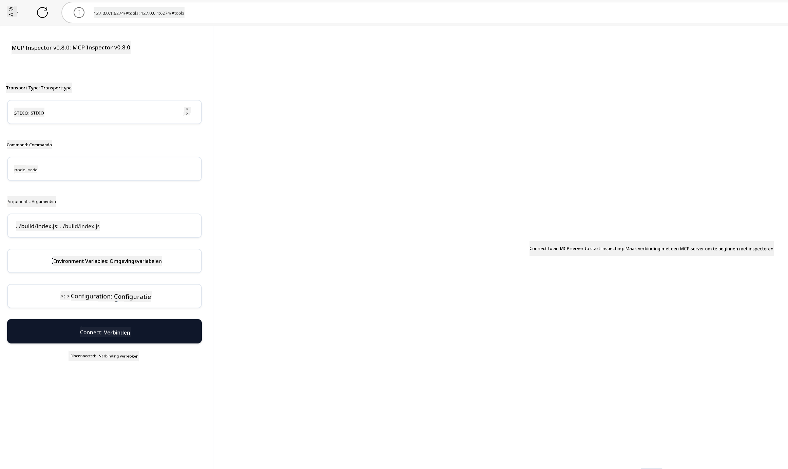

<!--
CO_OP_TRANSLATOR_METADATA:
{
  "original_hash": "e25bc265a51244a7a2d93b3761543a1f",
  "translation_date": "2025-06-13T02:09:52+00:00",
  "source_file": "03-GettingStarted/08-testing/README.md",
  "language_code": "nl"
}
-->
## Testen en Debuggen

Voordat je begint met het testen van je MCP-server, is het belangrijk om de beschikbare tools en beste praktijken voor debuggen te begrijpen. Effectief testen zorgt ervoor dat je server zich gedraagt zoals verwacht en helpt je snel problemen te identificeren en op te lossen. In de volgende sectie worden aanbevolen methoden beschreven om je MCP-implementatie te valideren.

## Overzicht

Deze les behandelt hoe je de juiste testmethode kiest en de meest effectieve testtool gebruikt.

## Leerdoelen

Aan het einde van deze les kun je:

- Verschillende testmethoden beschrijven.
- Verschillende tools gebruiken om je code effectief te testen.

## MCP-servers testen

MCP biedt tools om je te helpen je servers te testen en te debuggen:

- **MCP Inspector**: Een commandoregeltool die zowel als CLI-tool als visuele tool kan worden gebruikt.
- **Handmatig testen**: Je kunt een tool zoals curl gebruiken om webverzoeken uit te voeren, maar elke tool die HTTP ondersteunt werkt.
- **Unittesting**: Je kunt je favoriete testframework gebruiken om de functies van zowel server als client te testen.

### MCP Inspector gebruiken

We hebben het gebruik van deze tool in eerdere lessen beschreven, maar laten we het hier kort samenvatten. Het is een tool gebouwd in Node.js en je kunt het gebruiken door het `npx` uitvoerbare bestand aan te roepen, dat de tool tijdelijk downloadt en installeert en zichzelf opruimt zodra je verzoek is uitgevoerd.

De [MCP Inspector](https://github.com/modelcontextprotocol/inspector) helpt je om:

- **Servermogelijkheden ontdekken**: Detecteert automatisch beschikbare resources, tools en prompts.
- **Testen van tooluitvoering**: Probeer verschillende parameters en zie reacties in real-time.
- **Servermetadata bekijken**: Bekijk serverinformatie, schema's en configuraties.

Een typische uitvoering van de tool ziet er als volgt uit:

```bash
npx @modelcontextprotocol/inspector node build/index.js
```

Het bovenstaande commando start een MCP en de visuele interface en opent een lokale webinterface in je browser. Je ziet een dashboard met je geregistreerde MCP-servers, hun beschikbare tools, resources en prompts. De interface stelt je in staat om interactief tooluitvoering te testen, servermetadata te inspecteren en reacties in real-time te bekijken, wat het valideren en debuggen van je MCP-serverimplementaties eenvoudiger maakt.

Zo kan het eruitzien: 

Je kunt deze tool ook in CLI-modus draaien door de `--cli` optie toe te voegen. Hieronder een voorbeeld van het draaien van de tool in "CLI"-modus, waarbij alle tools op de server worden weergegeven:

```sh
npx @modelcontextprotocol/inspector --cli node build/index.js --method tools/list
```

### Handmatig testen

Naast het gebruik van de inspector tool om servermogelijkheden te testen, is een vergelijkbare aanpak om een client te gebruiken die HTTP ondersteunt, zoals curl.

Met curl kun je MCP-servers direct testen via HTTP-verzoeken:

```bash
# Example: Test server metadata
curl http://localhost:3000/v1/metadata

# Example: Execute a tool
curl -X POST http://localhost:3000/v1/tools/execute \
  -H "Content-Type: application/json" \
  -d '{"name": "calculator", "parameters": {"expression": "2+2"}}'
```

Zoals je ziet in het bovenstaande voorbeeld met curl, gebruik je een POST-verzoek om een tool aan te roepen met een payload die de naam van de tool en de parameters bevat. Gebruik de aanpak die het beste bij jou past. CLI-tools zijn over het algemeen sneller in gebruik en lenen zich goed voor scripting, wat handig kan zijn in een CI/CD-omgeving.

### Unittesting

Maak unittests voor je tools en resources om te garanderen dat ze werken zoals verwacht. Hier is een voorbeeld van testcode.

```python
import pytest

from mcp.server.fastmcp import FastMCP
from mcp.shared.memory import (
    create_connected_server_and_client_session as create_session,
)

# Mark the whole module for async tests
pytestmark = pytest.mark.anyio


async def test_list_tools_cursor_parameter():
    """Test that the cursor parameter is accepted for list_tools.

    Note: FastMCP doesn't currently implement pagination, so this test
    only verifies that the cursor parameter is accepted by the client.
    """

 server = FastMCP("test")

    # Create a couple of test tools
    @server.tool(name="test_tool_1")
    async def test_tool_1() -> str:
        """First test tool"""
        return "Result 1"

    @server.tool(name="test_tool_2")
    async def test_tool_2() -> str:
        """Second test tool"""
        return "Result 2"

    async with create_session(server._mcp_server) as client_session:
        # Test without cursor parameter (omitted)
        result1 = await client_session.list_tools()
        assert len(result1.tools) == 2

        # Test with cursor=None
        result2 = await client_session.list_tools(cursor=None)
        assert len(result2.tools) == 2

        # Test with cursor as string
        result3 = await client_session.list_tools(cursor="some_cursor_value")
        assert len(result3.tools) == 2

        # Test with empty string cursor
        result4 = await client_session.list_tools(cursor="")
        assert len(result4.tools) == 2
    
```

De bovenstaande code doet het volgende:

- Maakt gebruik van het pytest-framework waarmee je tests als functies kunt maken en assert-statements kunt gebruiken.
- Creëert een MCP Server met twee verschillende tools.
- Gebruikt de `assert`-statement om te controleren of bepaalde voorwaarden worden voldaan.

Bekijk het [volledige bestand hier](https://github.com/modelcontextprotocol/python-sdk/blob/main/tests/client/test_list_methods_cursor.py)

Met het bovenstaande bestand kun je je eigen server testen om te controleren of de mogelijkheden correct zijn aangemaakt.

Alle grote SDK's hebben vergelijkbare testsecties, dus je kunt dit aanpassen aan je gekozen runtime.

## Voorbeelden

- [Java Calculator](../samples/java/calculator/README.md)
- [.Net Calculator](../../../../03-GettingStarted/samples/csharp)
- [JavaScript Calculator](../samples/javascript/README.md)
- [TypeScript Calculator](../samples/typescript/README.md)
- [Python Calculator](../../../../03-GettingStarted/samples/python)

## Extra bronnen

- [Python SDK](https://github.com/modelcontextprotocol/python-sdk)

## Wat is de volgende stap

- Volgende: [Deployment](/03-GettingStarted/09-deployment/README.md)

**Disclaimer**:  
Dit document is vertaald met behulp van de AI-vertalingsdienst [Co-op Translator](https://github.com/Azure/co-op-translator). Hoewel we streven naar nauwkeurigheid, dient u er rekening mee te houden dat geautomatiseerde vertalingen fouten of onjuistheden kunnen bevatten. Het oorspronkelijke document in de oorspronkelijke taal moet als de gezaghebbende bron worden beschouwd. Voor cruciale informatie wordt professionele menselijke vertaling aanbevolen. Wij zijn niet aansprakelijk voor eventuele misverstanden of verkeerde interpretaties die voortvloeien uit het gebruik van deze vertaling.