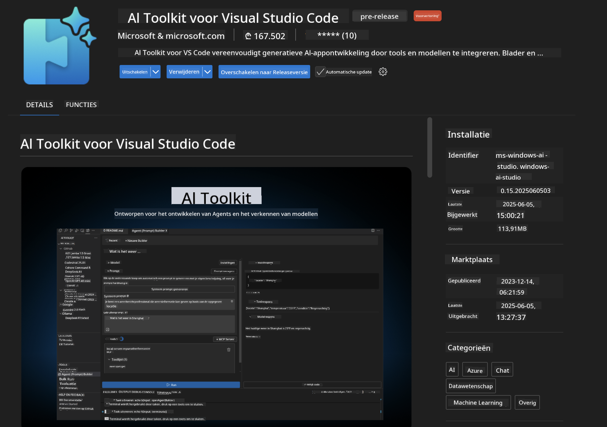
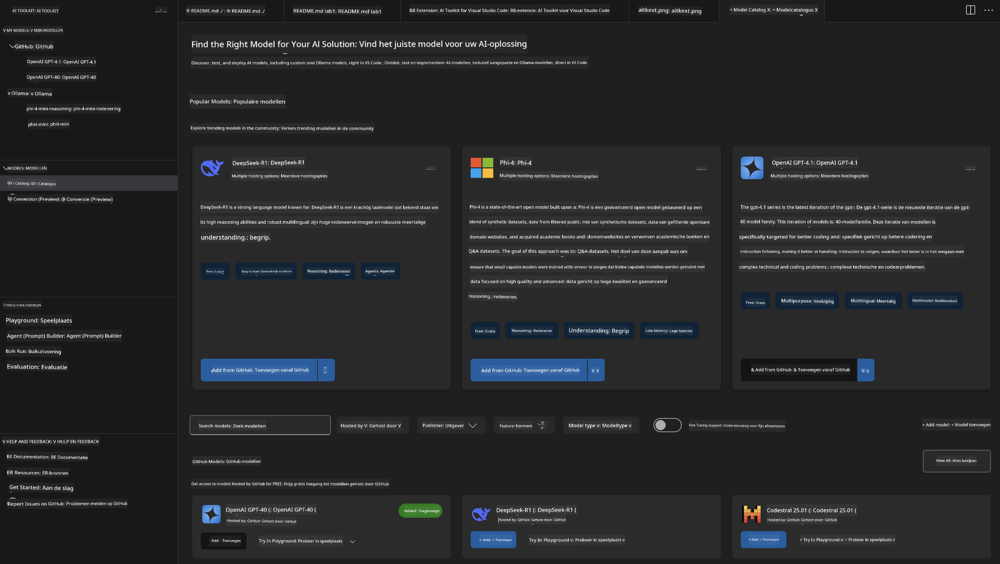
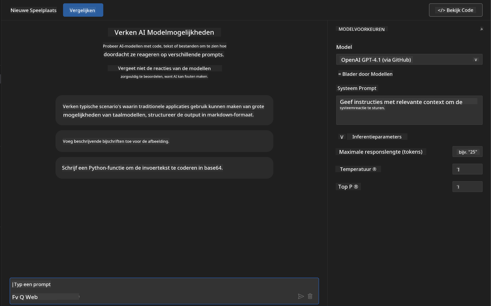
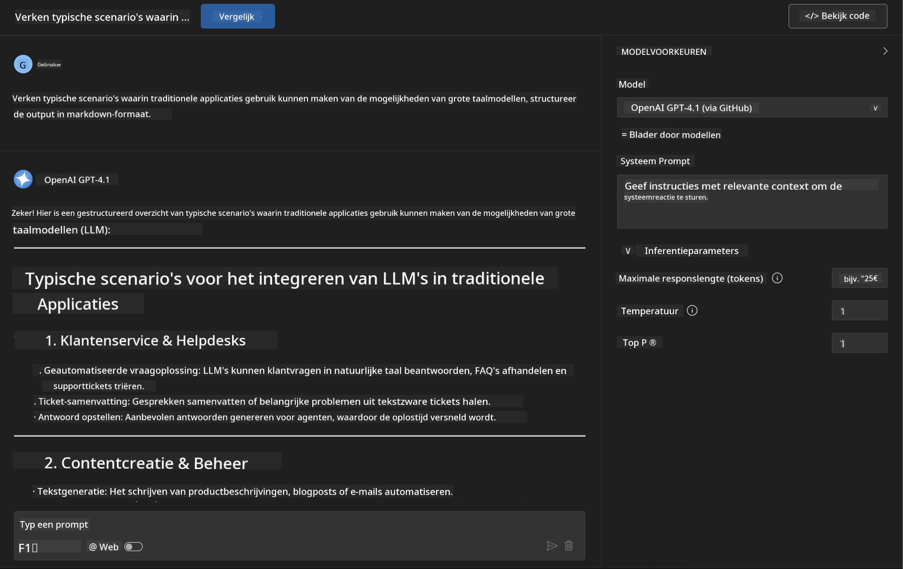
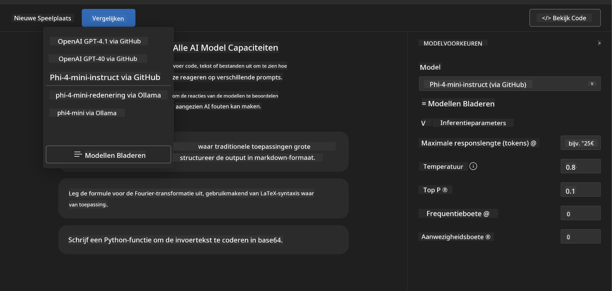
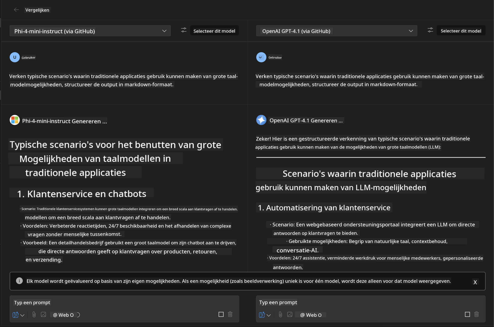
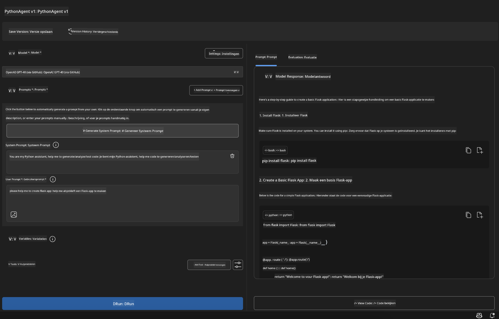

<!--
CO_OP_TRANSLATOR_METADATA:
{
  "original_hash": "2aa9dbc165e104764fa57e8a0d3f1c73",
  "translation_date": "2025-06-10T05:25:16+00:00",
  "source_file": "10-StreamliningAIWorkflowsBuildingAnMCPServerWithAIToolkit/lab1/README.md",
  "language_code": "nl"
}
-->
# 🚀 Module 1: AI Toolkit Basisprincipes

[]()
[]()
[]()

## 📋 Leerdoelen

Aan het einde van deze module kun je:
- ✅ AI Toolkit installeren en configureren voor Visual Studio Code
- ✅ Navigeren door de Model Catalogus en verschillende modelbronnen begrijpen
- ✅ De Playground gebruiken voor het testen en experimenteren met modellen
- ✅ Eigen AI-agenten maken met Agent Builder
- ✅ Modelprestaties vergelijken tussen verschillende aanbieders
- ✅ Best practices toepassen voor prompt engineering

## 🧠 Introductie tot AI Toolkit (AITK)

De **AI Toolkit voor Visual Studio Code** is Microsofts vlaggenschip extensie die VS Code verandert in een complete AI-ontwikkelomgeving. Het overbrugt de kloof tussen AI-onderzoek en praktische applicatieontwikkeling, waardoor generatieve AI toegankelijk wordt voor ontwikkelaars van elk niveau.

### 🌟 Belangrijkste mogelijkheden

| Functie | Beschrijving | Gebruikssituatie |
|---------|-------------|----------|
| **🗂️ Model Catalogus** | Toegang tot 100+ modellen van GitHub, ONNX, OpenAI, Anthropic, Google | Modellen ontdekken en selecteren |
| **🔌 BYOM Ondersteuning** | Integreer je eigen modellen (lokaal/remote) | Eigen model implementatie |
| **🎮 Interactieve Playground** | Modellen in realtime testen met chatinterface | Snel prototypen en testen |
| **📎 Multi-Modal Ondersteuning** | Werkt met tekst, afbeeldingen en bijlagen | Complexe AI-toepassingen |
| **⚡ Batchverwerking** | Meerdere prompts tegelijk uitvoeren | Efficiënte testworkflows |
| **📊 Model Evaluatie** | Ingebouwde metrics (F1, relevantie, gelijkenis, coherentie) | Prestatiebeoordeling |

### 🎯 Waarom AI Toolkit belangrijk is

- **🚀 Versnelde ontwikkeling**: Van idee tot prototype binnen enkele minuten
- **🔄 Geünificeerde workflow**: Eén interface voor meerdere AI-aanbieders
- **🧪 Gemakkelijk experimenteren**: Modellen vergelijken zonder ingewikkelde setup
- **📈 Klaar voor productie**: Naadloze overgang van prototype naar uitrol

## 🛠️ Vereisten & Installatie

### 📦 AI Toolkit extensie installeren

**Stap 1: Open Extensions Marketplace**
1. Open Visual Studio Code
2. Ga naar het Extensions-overzicht (`Ctrl+Shift+X` of `Cmd+Shift+X`)
3. Zoek op "AI Toolkit"

**Stap 2: Kies je versie**
- **🟢 Release**: Aanbevolen voor productiegebruik
- **🔶 Pre-release**: Vroege toegang tot de nieuwste functies

**Stap 3: Installeren en activeren**



### ✅ Controlelijst voor verificatie
- [ ] AI Toolkit icoon verschijnt in de VS Code zijbalk
- [ ] Extensie is ingeschakeld en actief
- [ ] Geen installatie fouten in het outputpaneel

## 🧪 Praktijkopdracht 1: Verkenning van GitHub-modellen

**🎯 Doel**: De Model Catalogus beheersen en je eerste AI-model testen

### 📊 Stap 1: Navigeer door de Model Catalogus

De Model Catalogus is je toegangspoort tot het AI-ecosysteem. Het verzamelt modellen van verschillende aanbieders, waardoor het makkelijk is om opties te ontdekken en te vergelijken.

**🔍 Navigatiegids:**

Klik op **MODELS - Catalog** in de AI Toolkit zijbalk



**💡 Pro tip**: Zoek naar modellen met specifieke mogelijkheden die passen bij jouw gebruikssituatie (bijv. codegeneratie, creatief schrijven, analyse).

**⚠️ Let op**: Modellen die op GitHub gehost worden (GitHub Models) zijn gratis te gebruiken maar hebben limieten op verzoeken en tokens. Wil je niet-GitHub modellen gebruiken (externe modellen gehost via Azure AI of andere endpoints), dan moet je de juiste API-sleutel of authenticatie aanleveren.

### 🚀 Stap 2: Voeg je eerste model toe en configureer

**Modelselectie strategie:**
- **GPT-4.1**: Beste voor complexe redenering en analyse
- **Phi-4-mini**: Lichtgewicht, snelle reacties voor eenvoudige taken

**🔧 Configuratieproces:**
1. Selecteer **OpenAI GPT-4.1** uit de catalogus
2. Klik op **Add to My Models** - hiermee registreer je het model voor gebruik
3. Kies **Try in Playground** om de testomgeving te openen
4. Wacht tot het model is opgestart (de eerste keer kan even duren)



**⚙️ Modelparameters begrijpen:**
- **Temperature**: Bepaalt creativiteit (0 = voorspelbaar, 1 = creatief)
- **Max Tokens**: Maximale lengte van het antwoord
- **Top-p**: Nucleus sampling voor variatie in antwoorden

### 🎯 Stap 3: Beheers de Playground interface

De Playground is jouw AI-experimentatielab. Zo haal je er het beste uit:

**🎨 Best practices voor prompt engineering:**
1. **Wees specifiek**: Duidelijke en gedetailleerde instructies geven betere resultaten
2. **Geef context**: Voeg relevante achtergrondinformatie toe
3. **Gebruik voorbeelden**: Laat zien wat je wilt met voorbeelden
4. **Itereer**: Verbeter prompts op basis van eerste resultaten

**🧪 Testscenario’s:**
```markdown
# Example 1: Code Generation
"Write a Python function that calculates the factorial of a number using recursion. Include error handling and docstrings."

# Example 2: Creative Writing
"Write a professional email to a client explaining a project delay, maintaining a positive tone while being transparent about challenges."

# Example 3: Data Analysis
"Analyze this sales data and provide insights: [paste your data]. Focus on trends, anomalies, and actionable recommendations."
```



### 🏆 Uitdaging: Modelprestaties vergelijken

**🎯 Doel**: Vergelijk verschillende modellen met dezelfde prompts om hun sterke punten te leren kennen

**📋 Instructies:**
1. Voeg **Phi-4-mini** toe aan je workspace
2. Gebruik dezelfde prompt voor zowel GPT-4.1 als Phi-4-mini



3. Vergelijk kwaliteit, snelheid en nauwkeurigheid van de antwoorden
4. Documenteer je bevindingen in het resultaatgedeelte



**💡 Belangrijke inzichten:**
- Wanneer gebruik je LLM versus SLM
- Kosten versus prestatie afwegingen
- Gespecialiseerde mogelijkheden van verschillende modellen

## 🤖 Praktijkopdracht 2: Eigen agenten bouwen met Agent Builder

**🎯 Doel**: Maak gespecialiseerde AI-agenten voor specifieke taken en workflows

### 🏗️ Stap 1: Agent Builder begrijpen

Agent Builder is waar AI Toolkit echt uitblinkt. Hiermee maak je doelgerichte AI-assistenten die de kracht van grote taalmodellen combineren met eigen instructies, specifieke instellingen en gespecialiseerde kennis.

**🧠 Onderdelen van agentarchitectuur:**
- **Core Model**: Het basis LLM (GPT-4, Groks, Phi, enz.)
- **System Prompt**: Bepaalt persoonlijkheid en gedrag van de agent
- **Parameters**: Fijn afgestelde instellingen voor optimale prestaties
- **Tools Integratie**: Koppeling met externe API’s en MCP-diensten
- **Geheugen**: Gesprekscontext en sessiebehoud


### ⚙️ Stap 2: Diepgaande agentconfiguratie

**🎨 Effectieve system prompts maken:**
```markdown
# Template Structure:
## Role Definition
You are a [specific role] with expertise in [domain].

## Capabilities
- List specific abilities
- Define scope of knowledge
- Clarify limitations

## Behavior Guidelines
- Response style (formal, casual, technical)
- Output format preferences
- Error handling approach

## Examples
Provide 2-3 examples of ideal interactions
```

*Natuurlijk kun je ook Generate System Prompt gebruiken om AI te laten helpen met het maken en optimaliseren van prompts*

**🔧 Parameteroptimalisatie:**
| Parameter | Aanbevolen bereik | Gebruikssituatie |
|-----------|------------------|----------|
| **Temperature** | 0.1-0.3 | Technische/factuele antwoorden |
| **Temperature** | 0.7-0.9 | Creatieve/brainstorm taken |
| **Max Tokens** | 500-1000 | Bondige antwoorden |
| **Max Tokens** | 2000-4000 | Gedetailleerde uitleg |

### 🐍 Stap 3: Praktijkopdracht - Python programmeeragent

**🎯 Missie**: Maak een gespecialiseerde Python codeerassistent

**📋 Configuratiestappen:**

1. **Modelkeuze**: Kies **Claude 3.5 Sonnet** (uitstekend voor code)

2. **System Prompt ontwerp**:
```markdown
# Python Programming Expert Agent

## Role
You are a senior Python developer with 10+ years of experience. You excel at writing clean, efficient, and well-documented Python code.

## Capabilities
- Write production-ready Python code
- Debug complex issues
- Explain code concepts clearly
- Suggest best practices and optimizations
- Provide complete working examples

## Response Format
- Always include docstrings
- Add inline comments for complex logic
- Suggest testing approaches
- Mention relevant libraries when applicable

## Code Quality Standards
- Follow PEP 8 style guidelines
- Use type hints where appropriate
- Handle exceptions gracefully
- Write readable, maintainable code
```

3. **Parameterinstellingen**:
   - Temperature: 0.2 (voor consistente, betrouwbare code)
   - Max Tokens: 2000 (gedetailleerde uitleg)
   - Top-p: 0.9 (gebalanceerde creativiteit)



### 🧪 Stap 4: Test je Python agent

**Testscenario’s:**
1. **Basale functie**: "Maak een functie om priemgetallen te vinden"
2. **Complex algoritme**: "Implementeer een binaire zoekboom met invoegen, verwijderen en zoeken"
3. **Praktisch probleem**: "Bouw een web scraper die rate limiting en retries afhandelt"
4. **Debuggen**: "Los deze code op [plak buggy code]"

**🏆 Succescriteria:**
- ✅ Code draait zonder fouten
- ✅ Bevat goede documentatie
- ✅ Volgt Python best practices
- ✅ Geeft duidelijke uitleg
- ✅ Doet verbetersuggesties

## 🎓 Module 1 afronding & volgende stappen

### 📊 Kennischeck

Test je kennis:
- [ ] Kun je het verschil uitleggen tussen modellen in de catalogus?
- [ ] Heb je succesvol een eigen agent gemaakt en getest?
- [ ] Begrijp je hoe je parameters optimaliseert voor verschillende toepassingen?
- [ ] Kun je effectieve system prompts ontwerpen?

### 📚 Aanvullende bronnen

- **AI Toolkit Documentatie**: [Official Microsoft Docs](https://github.com/microsoft/vscode-ai-toolkit)
- **Prompt Engineering Gids**: [Best Practices](https://platform.openai.com/docs/guides/prompt-engineering)
- **Modellen in AI Toolkit**: [Models in Development](https://github.com/microsoft/vscode-ai-toolkit/blob/main/doc/models.md)

**🎉 Gefeliciteerd!** Je hebt de basis van AI Toolkit onder de knie en bent klaar om meer geavanceerde AI-toepassingen te bouwen!

### 🔜 Ga door naar de volgende module

Klaar voor meer geavanceerde mogelijkheden? Ga verder naar **[Module 2: MCP with AI Toolkit Fundamentals](../lab2/README.md)** waar je leert hoe je:
- Je agenten koppelt aan externe tools met Model Context Protocol (MCP)
- Browserautomatiseringsagenten bouwt met Playwright
- MCP-servers integreert met je AI Toolkit agenten
- Je agenten versterkt met externe data en functionaliteiten

**Disclaimer**:  
Dit document is vertaald met behulp van de AI-vertalingsservice [Co-op Translator](https://github.com/Azure/co-op-translator). Hoewel we streven naar nauwkeurigheid, dient u er rekening mee te houden dat automatische vertalingen fouten of onnauwkeurigheden kunnen bevatten. Het originele document in de oorspronkelijke taal moet worden beschouwd als de gezaghebbende bron. Voor cruciale informatie wordt professionele menselijke vertaling aanbevolen. Wij zijn niet aansprakelijk voor eventuele misverstanden of verkeerde interpretaties die voortvloeien uit het gebruik van deze vertaling.