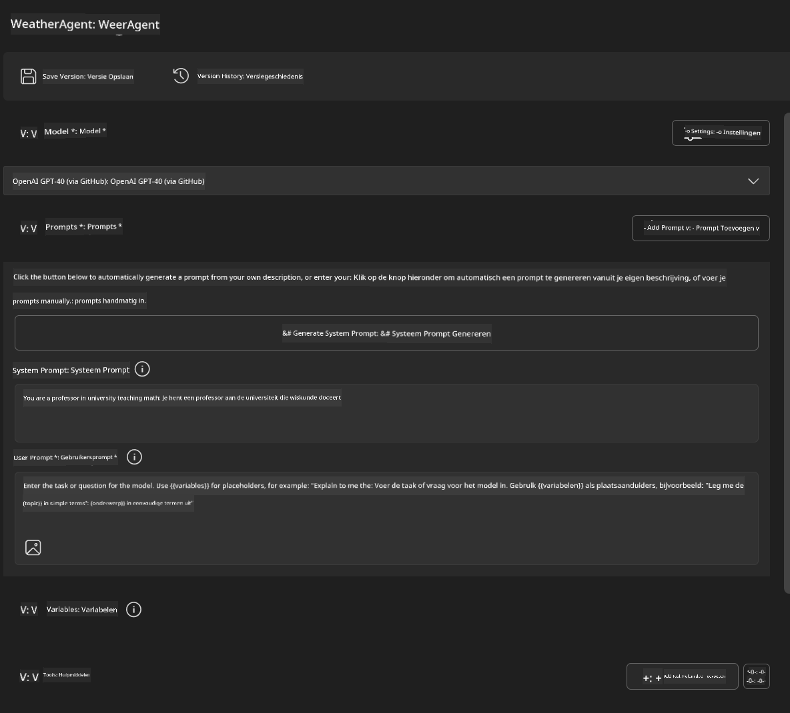
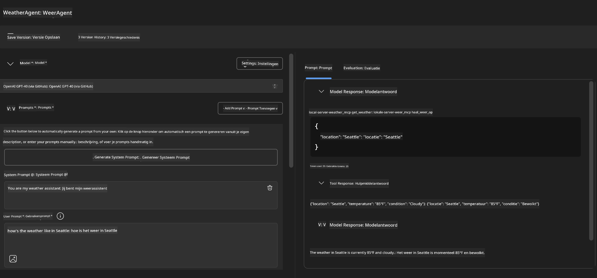
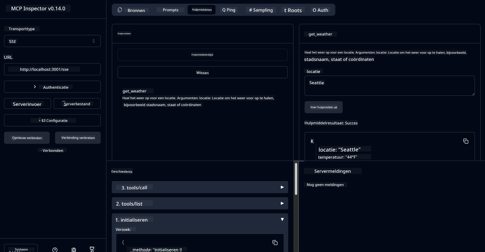

<!--
CO_OP_TRANSLATOR_METADATA:
{
  "original_hash": "dd8da3f75addcef453fe11f02a270217",
  "translation_date": "2025-06-10T06:14:19+00:00",
  "source_file": "10-StreamliningAIWorkflowsBuildingAnMCPServerWithAIToolkit/lab3/README.md",
  "language_code": "nl"
}
-->
# 🔧 Module 3: Geavanceerde MCP-ontwikkeling met AI Toolkit


## 🎯 Leerdoelen

Aan het einde van deze lab zul je in staat zijn om:

- ✅ Eigen MCP-servers te maken met behulp van de AI Toolkit
- ✅ De nieuwste MCP Python SDK (v1.9.3) te configureren en gebruiken
- ✅ De MCP Inspector in te stellen en te gebruiken voor debugging
- ✅ MCP-servers te debuggen in zowel Agent Builder als Inspector omgevingen
- ✅ Geavanceerde workflows voor MCP-serverontwikkeling te begrijpen

## 📋 Vereisten

- Lab 2 (MCP Fundamentals) voltooid
- VS Code met AI Toolkit extensie geïnstalleerd
- Python 3.10+ omgeving
- Node.js en npm voor de Inspector installatie

## 🏗️ Wat je gaat bouwen

In deze lab maak je een **Weather MCP Server** die laat zien:
- Implementatie van een custom MCP-server
- Integratie met AI Toolkit Agent Builder
- Professionele debugging workflows
- Gebruik van moderne MCP SDK patronen

---

## 🔧 Overzicht Kerncomponenten

### 🐍 MCP Python SDK  
De Model Context Protocol Python SDK vormt de basis voor het bouwen van custom MCP-servers. Je gebruikt versie 1.9.3 met verbeterde debugging mogelijkheden.

### 🔍 MCP Inspector  
Een krachtig debugging tool dat biedt:  
- Real-time server monitoring  
- Visualisatie van tool-uitvoering  
- Inspectie van netwerkverzoeken/-antwoorden  
- Interactieve testomgeving  

---

## 📖 Stapsgewijze Implementatie

### Stap 1: Maak een WeatherAgent in Agent Builder

1. **Start Agent Builder** in VS Code via de AI Toolkit extensie  
2. **Maak een nieuwe agent** met de volgende configuratie:  
   - Agent Naam: `WeatherAgent`



### Stap 2: Initialiseer MCP Server Project

1. **Ga naar Tools** → **Add Tool** in Agent Builder  
2. **Selecteer "MCP Server"** uit de beschikbare opties  
3. **Kies "Create A new MCP Server"**  
4. **Selecteer de `python-weather` template**  
5. **Geef je server een naam:** `weather_mcp`


### Stap 3: Open en Onderzoek het Project

1. **Open het gegenereerde project** in VS Code  
2. **Bekijk de projectstructuur:**  
   ```
   weather_mcp/
   ├── src/
   │   ├── __init__.py
   │   └── server.py
   ├── inspector/
   │   ├── package.json
   │   └── package-lock.json
   ├── .vscode/
   │   ├── launch.json
   │   └── tasks.json
   ├── pyproject.toml
   └── README.md
   ```

### Stap 4: Upgrade naar de nieuwste MCP SDK

> **🔍 Waarom upgraden?** We willen de nieuwste MCP SDK (v1.9.3) en Inspector service (0.14.0) gebruiken voor meer functies en betere debugging.

#### 4a. Update Python Dependencies

**Bewerk `pyproject.toml`:** update [./code/weather_mcp/pyproject.toml](../../../../10-StreamliningAIWorkflowsBuildingAnMCPServerWithAIToolkit/lab3/code/weather_mcp/pyproject.toml)


#### 4b. Update Inspector Configuration

**Edit `inspector/package.json`:** update [./code/weather_mcp/inspector/package.json](../../../../10-StreamliningAIWorkflowsBuildingAnMCPServerWithAIToolkit/lab3/code/weather_mcp/inspector/package.json)

#### 4c. Update Inspector Dependencies

**Edit `inspector/package-lock.json`:** update [./code/weather_mcp/inspector/package-lock.json](../../../../10-StreamliningAIWorkflowsBuildingAnMCPServerWithAIToolkit/lab3/code/weather_mcp/inspector/package-lock.json)

> **📝 Note:** This file contains extensive dependency definitions. Below is the essential structure - the full content ensures proper dependency resolution.


> **⚡ Full Package Lock:** The complete package-lock.json contains ~3000 lines of dependency definitions. The above shows the key structure - use the provided file for complete dependency resolution.

### Step 5: Configure VS Code Debugging

*Note: Please copy the file in the specified path to replace the corresponding local file*

#### 5a. Update Launch Configuration

**Edit `.vscode/launch.json`:**

```json
{
  "version": "0.2.0",
  "configurations": [
    {
      "name": "Attach to Local MCP",
      "type": "debugpy",
      "request": "attach",
      "connect": {
        "host": "localhost",
        "port": 5678
      },
      "presentation": {
        "hidden": true
      },
      "internalConsoleOptions": "neverOpen",
      "postDebugTask": "Terminate All Tasks"
    },
    {
      "name": "Launch Inspector (Edge)",
      "type": "msedge",
      "request": "launch",
      "url": "http://localhost:6274?timeout=60000&serverUrl=http://localhost:3001/sse#tools",
      "cascadeTerminateToConfigurations": [
        "Attach to Local MCP"
      ],
      "presentation": {
        "hidden": true
      },
      "internalConsoleOptions": "neverOpen"
    },
    {
      "name": "Launch Inspector (Chrome)",
      "type": "chrome",
      "request": "launch",
      "url": "http://localhost:6274?timeout=60000&serverUrl=http://localhost:3001/sse#tools",
      "cascadeTerminateToConfigurations": [
        "Attach to Local MCP"
      ],
      "presentation": {
        "hidden": true
      },
      "internalConsoleOptions": "neverOpen"
    }
  ],
  "compounds": [
    {
      "name": "Debug in Agent Builder",
      "configurations": [
        "Attach to Local MCP"
      ],
      "preLaunchTask": "Open Agent Builder",
    },
    {
      "name": "Debug in Inspector (Edge)",
      "configurations": [
        "Launch Inspector (Edge)",
        "Attach to Local MCP"
      ],
      "preLaunchTask": "Start MCP Inspector",
      "stopAll": true
    },
    {
      "name": "Debug in Inspector (Chrome)",
      "configurations": [
        "Launch Inspector (Chrome)",
        "Attach to Local MCP"
      ],
      "preLaunchTask": "Start MCP Inspector",
      "stopAll": true
    }
  ]
}
```

**Bewerk `.vscode/tasks.json`:**

```
{
  "version": "2.0.0",
  "tasks": [
    {
      "label": "Start MCP Server",
      "type": "shell",
      "command": "python -m debugpy --listen 127.0.0.1:5678 src/__init__.py sse",
      "isBackground": true,
      "options": {
        "cwd": "${workspaceFolder}",
        "env": {
          "PORT": "3001"
        }
      },
      "problemMatcher": {
        "pattern": [
          {
            "regexp": "^.*$",
            "file": 0,
            "location": 1,
            "message": 2
          }
        ],
        "background": {
          "activeOnStart": true,
          "beginsPattern": ".*",
          "endsPattern": "Application startup complete|running"
        }
      }
    },
    {
      "label": "Start MCP Inspector",
      "type": "shell",
      "command": "npm run dev:inspector",
      "isBackground": true,
      "options": {
        "cwd": "${workspaceFolder}/inspector",
        "env": {
          "CLIENT_PORT": "6274",
          "SERVER_PORT": "6277",
        }
      },
      "problemMatcher": {
        "pattern": [
          {
            "regexp": "^.*$",
            "file": 0,
            "location": 1,
            "message": 2
          }
        ],
        "background": {
          "activeOnStart": true,
          "beginsPattern": "Starting MCP inspector",
          "endsPattern": "Proxy server listening on port"
        }
      },
      "dependsOn": [
        "Start MCP Server"
      ]
    },
    {
      "label": "Open Agent Builder",
      "type": "shell",
      "command": "echo ${input:openAgentBuilder}",
      "presentation": {
        "reveal": "never"
      },
      "dependsOn": [
        "Start MCP Server"
      ],
    },
    {
      "label": "Terminate All Tasks",
      "command": "echo ${input:terminate}",
      "type": "shell",
      "problemMatcher": []
    }
  ],
  "inputs": [
    {
      "id": "openAgentBuilder",
      "type": "command",
      "command": "ai-mlstudio.agentBuilder",
      "args": {
        "initialMCPs": [ "local-server-weather_mcp" ],
        "triggeredFrom": "vsc-tasks"
      }
    },
    {
      "id": "terminate",
      "type": "command",
      "command": "workbench.action.tasks.terminate",
      "args": "terminateAll"
    }
  ]
}
```

---

## 🚀 Je MCP Server draaien en testen

### Stap 6: Installeer dependencies

Nadat je de configuratie hebt aangepast, voer je de volgende commando’s uit:

**Installeer Python dependencies:**  
```bash
uv sync
```

**Installeer Inspector dependencies:**  
```bash
cd inspector
npm install
```

### Stap 7: Debug met Agent Builder

1. **Druk op F5** of gebruik de **"Debug in Agent Builder"** configuratie  
2. **Selecteer de samengestelde configuratie** in het debugpaneel  
3. **Wacht tot de server start** en Agent Builder opent  
4. **Test je Weather MCP server** met natuurlijke taalvragen

Voer een prompt in zoals deze

SYSTEM_PROMPT

```
You are my weather assistant
```

USER_PROMPT

```
How's the weather like in Seattle
```



### Stap 8: Debug met MCP Inspector

1. **Gebruik de "Debug in Inspector"** configuratie (Edge of Chrome)  
2. **Open de Inspector interface** via `http://localhost:6274`  
3. **Verken de interactieve testomgeving:**  
   - Bekijk beschikbare tools  
   - Test tool-uitvoering  
   - Monitor netwerkverzoeken  
   - Debug serverantwoorden



---

## 🎯 Belangrijkste Leerresultaten

Door deze lab te voltooien heb je:

- [x] **Een custom MCP-server gemaakt** met AI Toolkit templates  
- [x] **Geüpgraded naar de nieuwste MCP SDK** (v1.9.3) voor meer functionaliteit  
- [x] **Professionele debugging workflows geconfigureerd** voor zowel Agent Builder als Inspector  
- [x] **De MCP Inspector ingesteld** voor interactieve server tests  
- [x] **VS Code debugging configuraties onder de knie gekregen** voor MCP-ontwikkeling  

## 🔧 Geavanceerde functies die aan bod kwamen

| Functie                 | Beschrijving                      | Gebruikssituatie               |
|------------------------|---------------------------------|-------------------------------|
| **MCP Python SDK v1.9.3** | Laatste protocolimplementatie    | Moderne serverontwikkeling      |
| **MCP Inspector 0.14.0**  | Interactieve debuggingtool       | Real-time server testen         |
| **VS Code Debugging**     | Geïntegreerde ontwikkelomgeving  | Professionele debugging workflow |
| **Agent Builder Integratie** | Directe AI Toolkit koppeling     | End-to-end agent testing        |

## 📚 Extra bronnen

- [MCP Python SDK Documentatie](https://modelcontextprotocol.io/docs/sdk/python)  
- [AI Toolkit Extensie Gids](https://code.visualstudio.com/docs/ai/ai-toolkit)  
- [VS Code Debugging Documentatie](https://code.visualstudio.com/docs/editor/debugging)  
- [Model Context Protocol Specificatie](https://modelcontextprotocol.io/docs/concepts/architecture)

---

**🎉 Gefeliciteerd!** Je hebt Lab 3 succesvol afgerond en kunt nu custom MCP-servers maken, debuggen en uitrollen met professionele ontwikkelworkflows.

### 🔜 Ga door naar de volgende module

Klaar om je MCP-vaardigheden toe te passen in een praktische ontwikkelworkflow? Ga verder naar **[Module 4: Praktische MCP-ontwikkeling - Custom GitHub Clone Server](../lab4/README.md)** waar je:  
- Een productieklare MCP-server bouwt die GitHub repository acties automatiseert  
- Functionaliteit voor het klonen van GitHub repositories via MCP implementeert  
- Custom MCP-servers integreert met VS Code en GitHub Copilot Agent Mode  
- Custom MCP-servers test en uitrolt in productieomgevingen  
- Praktische workflowautomatisering voor ontwikkelaars leert

**Disclaimer**:  
Dit document is vertaald met behulp van de AI-vertalingsdienst [Co-op Translator](https://github.com/Azure/co-op-translator). Hoewel we streven naar nauwkeurigheid, dient u er rekening mee te houden dat automatische vertalingen fouten of onnauwkeurigheden kunnen bevatten. Het oorspronkelijke document in de oorspronkelijke taal moet worden beschouwd als de gezaghebbende bron. Voor cruciale informatie wordt professionele menselijke vertaling aanbevolen. Wij zijn niet aansprakelijk voor misverstanden of verkeerde interpretaties die voortvloeien uit het gebruik van deze vertaling.