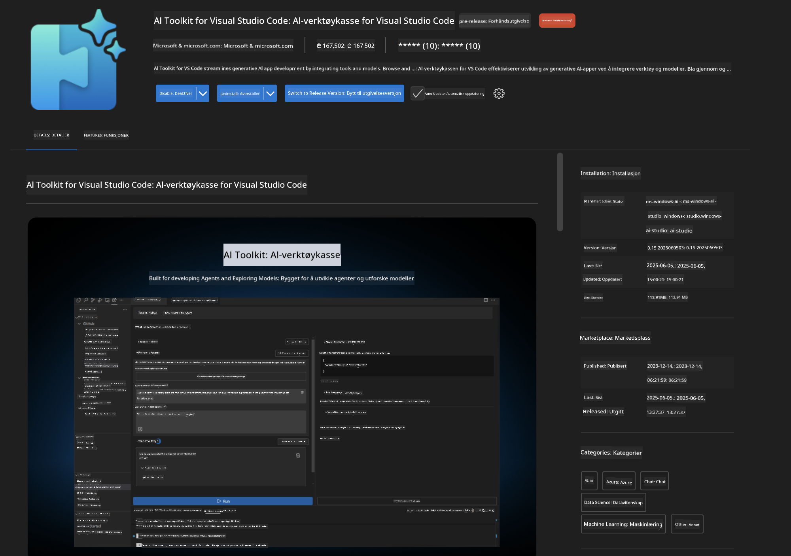
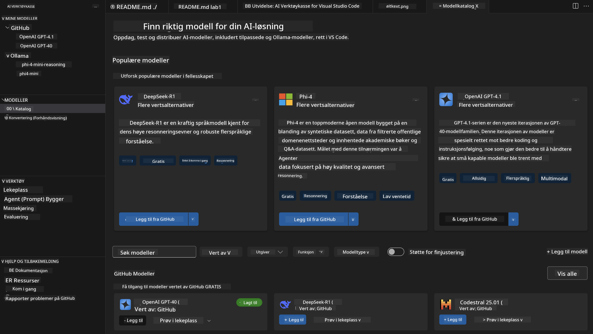
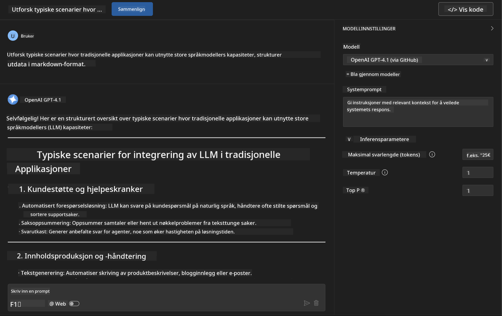
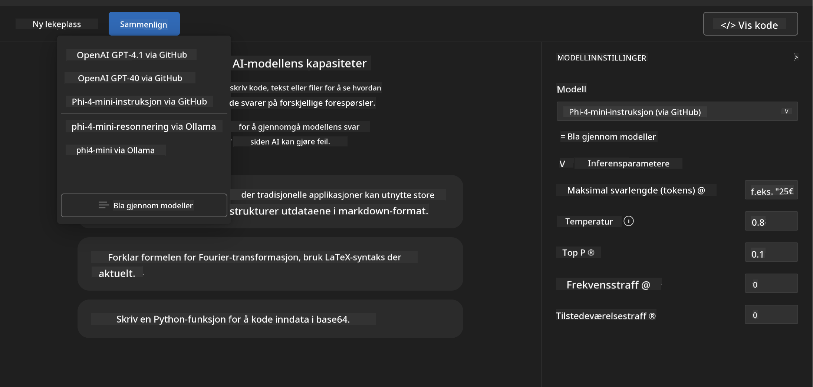
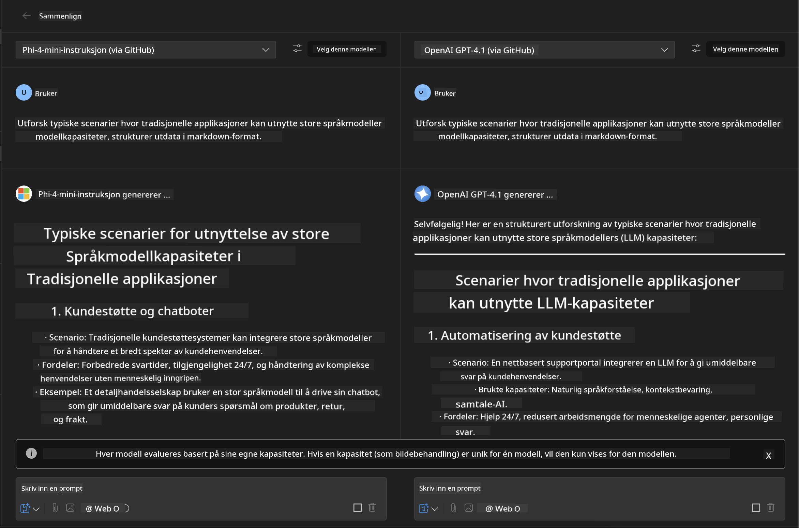
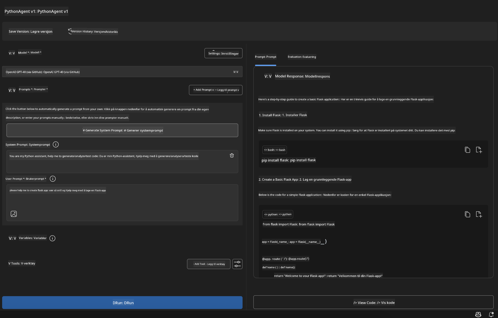

<!--
CO_OP_TRANSLATOR_METADATA:
{
  "original_hash": "2aa9dbc165e104764fa57e8a0d3f1c73",
  "translation_date": "2025-06-10T05:24:02+00:00",
  "source_file": "10-StreamliningAIWorkflowsBuildingAnMCPServerWithAIToolkit/lab1/README.md",
  "language_code": "no"
}
-->
# 🚀 Modul 1: Grunnleggende om AI Toolkit

[]()
[]()
[]()

## 📋 Læringsmål

Når du er ferdig med dette modulen, vil du kunne:
- ✅ Installere og konfigurere AI Toolkit for Visual Studio Code
- ✅ Navigere i Model Catalog og forstå ulike modellkilder
- ✅ Bruke Playground for modelltesting og eksperimentering
- ✅ Lage tilpassede AI-agenter med Agent Builder
- ✅ Sammenligne modellprestasjon på tvers av leverandører
- ✅ Anvende beste praksis for prompt engineering

## 🧠 Introduksjon til AI Toolkit (AITK)

**AI Toolkit for Visual Studio Code** er Microsofts flaggskiputvidelse som gjør VS Code om til et komplett utviklingsmiljø for AI. Den bygger bro mellom AI-forskning og praktisk applikasjonsutvikling, og gjør generativ AI tilgjengelig for utviklere på alle ferdighetsnivåer.

### 🌟 Nøkkelfunksjoner

| Funksjon | Beskrivelse | Bruksområde |
|---------|-------------|-------------|
| **🗂️ Model Catalog** | Tilgang til 100+ modeller fra GitHub, ONNX, OpenAI, Anthropic, Google | Modelloppdagelse og valg |
| **🔌 BYOM Support** | Integrer dine egne modeller (lokale/fjern) | Egne modellimplementasjoner |
| **🎮 Interaktiv Playground** | Sanntidstesting av modeller med chattegrensesnitt | Rask prototyping og testing |
| **📎 Multimodal støtte** | Håndter tekst, bilder og vedlegg | Komplekse AI-applikasjoner |
| **⚡ Batchbehandling** | Kjør flere prompts samtidig | Effektive testarbeidsflyter |
| **📊 Modellvurdering** | Innebygde måleparametere (F1, relevans, likhet, sammenheng) | Vurdering av ytelse |

### 🎯 Hvorfor AI Toolkit er viktig

- **🚀 Raskere utvikling**: Fra idé til prototype på minutter
- **🔄 Enhetlig arbeidsflyt**: Én plattform for flere AI-leverandører
- **🧪 Enkel eksperimentering**: Sammenlign modeller uten komplisert oppsett
- **📈 Klar for produksjon**: Sømløs overgang fra prototype til utrulling

## 🛠️ Forutsetninger og oppsett

### 📦 Installer AI Toolkit-utvidelsen

**Steg 1: Åpne Extensions Marketplace**
1. Start Visual Studio Code
2. Gå til Extensions-visningen (`Ctrl+Shift+X` eller `Cmd+Shift+X`)
3. Søk etter "AI Toolkit"

**Steg 2: Velg versjon**
- **🟢 Release**: Anbefalt for produksjonsbruk
- **🔶 Pre-release**: Tidlig tilgang til nye funksjoner

**Steg 3: Installer og aktiver**



### ✅ Sjekkliste for verifisering
- [ ] AI Toolkit-ikon vises i VS Code-sidepanelet
- [ ] Utvidelsen er aktivert og i bruk
- [ ] Ingen installasjonsfeil i output-panelet

## 🧪 Praktisk øvelse 1: Utforsk GitHub-modeller

**🎯 Mål**: Bli kjent med Model Catalog og test din første AI-modell

### 📊 Steg 1: Naviger i Model Catalog

Model Catalog er inngangsporten til AI-økosystemet. Den samler modeller fra flere leverandører, slik at du enkelt kan oppdage og sammenligne alternativer.

**🔍 Navigasjonsguide:**

Klikk på **MODELS - Catalog** i AI Toolkit-sidepanelet



**💡 Tips**: Se etter modeller med spesifikke egenskaper som passer ditt brukstilfelle (f.eks. kodegenerering, kreativ skriving, analyse).

**⚠️ Merk**: Modeller hostet på GitHub (GitHub Models) er gratis å bruke, men har begrensninger på antall forespørsler og tokens. For å få tilgang til modeller utenfor GitHub (dvs. eksterne modeller via Azure AI eller andre endepunkter), må du legge inn riktig API-nøkkel eller autentisering.

### 🚀 Steg 2: Legg til og konfigurer din første modell

**Strategi for modellvalg:**
- **GPT-4.1**: Best for komplekse resonnementer og analyser
- **Phi-4-mini**: Lettvektsmodell, raske svar for enkle oppgaver

**🔧 Konfigurasjonsprosess:**
1. Velg **OpenAI GPT-4.1** fra katalogen
2. Klikk **Add to My Models** – dette registrerer modellen for bruk
3. Velg **Try in Playground** for å åpne testmiljøet
4. Vent på at modellen starter opp (første gang kan ta litt tid)


**⚙️ Forstå modellparametere:**
- **Temperature**: Styrer kreativitet (0 = deterministisk, 1 = kreativ)
- **Max Tokens**: Maksimal lengde på svar
- **Top-p**: Nucleus sampling for variasjon i svar

### 🎯 Steg 3: Mestre Playground-grensesnittet

Playground er ditt laboratorium for AI-eksperimenter. Slik får du mest ut av det:

**🎨 Beste praksis for prompt engineering:**
1. **Vær spesifikk**: Klare og detaljerte instruksjoner gir bedre resultater
2. **Gi kontekst**: Inkluder relevant bakgrunnsinformasjon
3. **Bruk eksempler**: Vis modellen hva du ønsker med eksempler
4. **Iterer**: Forbedre promptene basert på tidlige svar

**🧪 Testscenarier:**
```markdown
# Example 1: Code Generation
"Write a Python function that calculates the factorial of a number using recursion. Include error handling and docstrings."

# Example 2: Creative Writing
"Write a professional email to a client explaining a project delay, maintaining a positive tone while being transparent about challenges."

# Example 3: Data Analysis
"Analyze this sales data and provide insights: [paste your data]. Focus on trends, anomalies, and actionable recommendations."
```



### 🏆 Utfordringsøvelse: Sammenligning av modellprestasjon

**🎯 Mål**: Sammenligne ulike modeller med identiske prompts for å forstå styrkene deres

**📋 Instruksjoner:**
1. Legg til **Phi-4-mini** i arbeidsområdet ditt
2. Bruk samme prompt for både GPT-4.1 og Phi-4-mini



3. Sammenlign svarenes kvalitet, hastighet og nøyaktighet
4. Dokumenter funnene dine i resultatsseksjonen



**💡 Viktige innsikter å oppdage:**
- Når man bør bruke LLM vs SLM
- Kostnad vs ytelse
- Spesialiserte egenskaper ved ulike modeller

## 🤖 Praktisk øvelse 2: Bygg tilpassede agenter med Agent Builder

**🎯 Mål**: Lag spesialiserte AI-agenter tilpasset spesifikke oppgaver og arbeidsflyter

### 🏗️ Steg 1: Forstå Agent Builder

Agent Builder er der AI Toolkit virkelig skinner. Her kan du lage målrettede AI-assistenter som kombinerer kraften til store språkmodeller med egne instruksjoner, spesifikke parametere og spesialisert kunnskap.

**🧠 Komponenter i agentarkitekturen:**
- **Kjernemodell**: Grunnleggende LLM (GPT-4, Groks, Phi osv.)
- **Systemprompt**: Definerer agentens personlighet og oppførsel
- **Parametere**: Finjusterte innstillinger for optimal ytelse
- **Verktøyintegrasjon**: Koble til eksterne API-er og MCP-tjenester
- **Minne**: Samtalekontekst og sesjonspersistens


### ⚙️ Steg 2: Dypdykk i agentkonfigurasjon

**🎨 Lage effektive systemprompter:**
```markdown
# Template Structure:
## Role Definition
You are a [specific role] with expertise in [domain].

## Capabilities
- List specific abilities
- Define scope of knowledge
- Clarify limitations

## Behavior Guidelines
- Response style (formal, casual, technical)
- Output format preferences
- Error handling approach

## Examples
Provide 2-3 examples of ideal interactions
```

*Selvfølgelig kan du også bruke Generate System Prompt for å la AI hjelpe deg med å lage og optimalisere prompter*

**🔧 Parameteroptimalisering:**
| Parameter | Anbefalt område | Bruksområde |
|-----------|-----------------|-------------|
| **Temperature** | 0.1-0.3 | Tekniske/faktabaserte svar |
| **Temperature** | 0.7-0.9 | Kreative/idémyldringsoppgaver |
| **Max Tokens** | 500-1000 | Konsise svar |
| **Max Tokens** | 2000-4000 | Detaljerte forklaringer |

### 🐍 Steg 3: Praktisk øvelse – Python-programmeringsagent

**🎯 Oppdrag**: Lag en spesialisert assistent for Python-koding

**📋 Konfigurasjonstrinn:**

1. **Modellvalg**: Velg **Claude 3.5 Sonnet** (utmerket for kode)

2. **Systemprompt-design**:
```markdown
# Python Programming Expert Agent

## Role
You are a senior Python developer with 10+ years of experience. You excel at writing clean, efficient, and well-documented Python code.

## Capabilities
- Write production-ready Python code
- Debug complex issues
- Explain code concepts clearly
- Suggest best practices and optimizations
- Provide complete working examples

## Response Format
- Always include docstrings
- Add inline comments for complex logic
- Suggest testing approaches
- Mention relevant libraries when applicable

## Code Quality Standards
- Follow PEP 8 style guidelines
- Use type hints where appropriate
- Handle exceptions gracefully
- Write readable, maintainable code
```

3. **Parameterkonfigurasjon**:
   - Temperature: 0.2 (for konsistent og pålitelig kode)
   - Max Tokens: 2000 (detaljerte forklaringer)
   - Top-p: 0.9 (balansert kreativitet)



### 🧪 Steg 4: Test din Python-agent

**Testscenarier:**
1. **Grunnleggende funksjon**: "Lag en funksjon som finner primtall"
2. **Kompleks algoritme**: "Implementer et binært søketre med innsetting, sletting og søk"
3. **Virkelighetsproblem**: "Lag en webskraper som håndterer rate limiting og retry"
4. **Feilsøking**: "Fiks denne koden [lim inn buggy kode]"

**🏆 Suksesskriterier:**
- ✅ Koden kjører uten feil
- ✅ Inneholder god dokumentasjon
- ✅ Følger beste praksis for Python
- ✅ Gir klare forklaringer
- ✅ Foreslår forbedringer

## 🎓 Modul 1 Oppsummering og veien videre

### 📊 Kunnskapstest

Test hva du har lært:
- [ ] Kan du forklare forskjellen mellom modellene i katalogen?
- [ ] Har du laget og testet en tilpasset agent?
- [ ] Forstår du hvordan du optimaliserer parametere for ulike bruksområder?
- [ ] Kan du lage effektive systemprompter?

### 📚 Ekstra ressurser

- **AI Toolkit Dokumentasjon**: [Official Microsoft Docs](https://github.com/microsoft/vscode-ai-toolkit)
- **Guide til prompt engineering**: [Best Practices](https://platform.openai.com/docs/guides/prompt-engineering)
- **Modeller i AI Toolkit**: [Models in Develpment](https://github.com/microsoft/vscode-ai-toolkit/blob/main/doc/models.md)

**🎉 Gratulerer!** Du har mestret det grunnleggende i AI Toolkit og er klar for å bygge mer avanserte AI-applikasjoner!

### 🔜 Fortsett til neste modul

Klar for mer avanserte funksjoner? Fortsett til **[Modul 2: MCP med AI Toolkit Fundamentals](../lab2/README.md)** hvor du lærer å:
- Koble agentene dine til eksterne verktøy med Model Context Protocol (MCP)
- Bygge nettleserautomatiseringsagenter med Playwright
- Integrere MCP-servere med AI Toolkit-agentene dine
- Gi agentene dine ekstra kraft med ekstern data og funksjonalitet

**Ansvarsfraskrivelse**:  
Dette dokumentet er oversatt ved hjelp av AI-oversettelsestjenesten [Co-op Translator](https://github.com/Azure/co-op-translator). Selv om vi streber etter nøyaktighet, vennligst vær oppmerksom på at automatiske oversettelser kan inneholde feil eller unøyaktigheter. Det originale dokumentet på det opprinnelige språket bør betraktes som den autoritative kilden. For kritisk informasjon anbefales profesjonell menneskelig oversettelse. Vi er ikke ansvarlige for misforståelser eller feiltolkninger som oppstår fra bruk av denne oversettelsen.