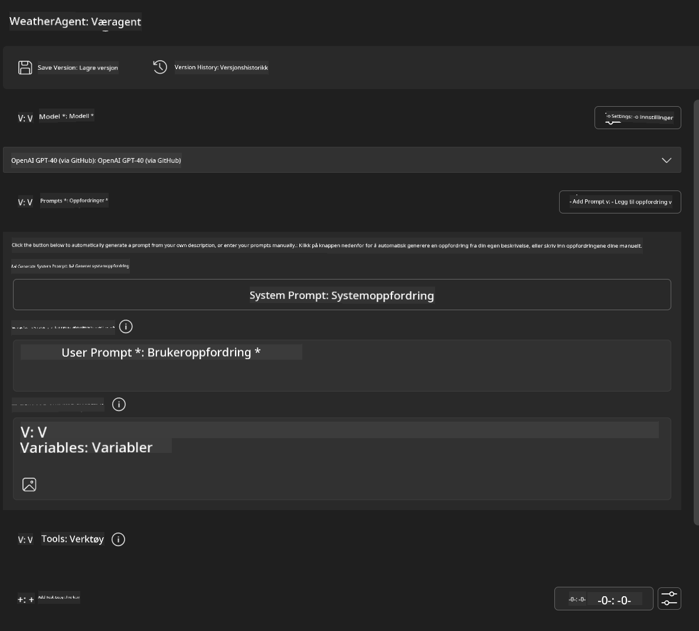
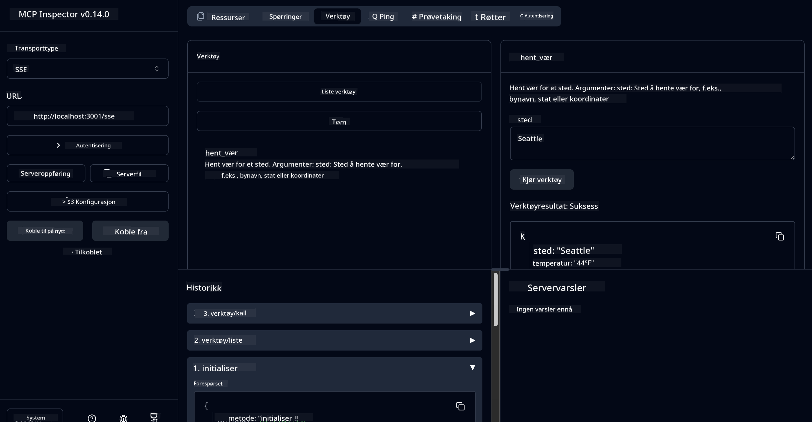

<!--
CO_OP_TRANSLATOR_METADATA:
{
  "original_hash": "dd8da3f75addcef453fe11f02a270217",
  "translation_date": "2025-06-10T06:13:25+00:00",
  "source_file": "10-StreamliningAIWorkflowsBuildingAnMCPServerWithAIToolkit/lab3/README.md",
  "language_code": "no"
}
-->
# 🔧 Modul 3: Avansert MCP-utvikling med AI Toolkit


## 🎯 Læringsmål

Når du er ferdig med denne laben, vil du kunne:

- ✅ Lage tilpassede MCP-servere med AI Toolkit
- ✅ Konfigurere og bruke den nyeste MCP Python SDK (v1.9.3)
- ✅ Sette opp og bruke MCP Inspector for feilsøking
- ✅ Feilsøke MCP-servere i både Agent Builder og Inspector
- ✅ Forstå avanserte arbeidsflyter for MCP-serverutvikling

## 📋 Forutsetninger

- Fullført Lab 2 (MCP Grunnleggende)
- VS Code med AI Toolkit-utvidelsen installert
- Python 3.10+ miljø
- Node.js og npm for Inspector-oppsett

## 🏗️ Det du skal bygge

I denne laben lager du en **Weather MCP Server** som viser:

- Tilpasset MCP-serverimplementasjon
- Integrasjon med AI Toolkit Agent Builder
- Profesjonelle feilsøkingsarbeidsflyter
- Moderne MCP SDK-bruksmønstre

---

## 🔧 Oversikt over kjernekomponenter

### 🐍 MCP Python SDK  
Model Context Protocol Python SDK er grunnlaget for å bygge tilpassede MCP-servere. Du vil bruke versjon 1.9.3 med forbedrede feilsøkingsmuligheter.

### 🔍 MCP Inspector  
Et kraftig feilsøkingsverktøy som tilbyr:  
- Sanntidsovervåkning av server  
- Visualisering av verktøykjøring  
- Nettverksforespørsler/-svar inspeksjon  
- Interaktiv testmiljø

---

## 📖 Steg-for-steg implementering

### Steg 1: Lag en WeatherAgent i Agent Builder

1. **Start Agent Builder** i VS Code via AI Toolkit-utvidelsen  
2. **Opprett en ny agent** med følgende konfigurasjon:  
   - Agentnavn: `WeatherAgent`



### Steg 2: Initialiser MCP Server-prosjekt

1. **Gå til Tools** → **Add Tool** i Agent Builder  
2. **Velg "MCP Server"** fra tilgjengelige alternativer  
3. **Velg "Create A new MCP Server"**  
4. **Velg `python-weather` malen**  
5. **Gi serveren et navn:** `weather_mcp`


### Steg 3: Åpne og gå gjennom prosjektet

1. **Åpne det genererte prosjektet** i VS Code  
2. **Se over prosjektstrukturen:**  
   ```
   weather_mcp/
   ├── src/
   │   ├── __init__.py
   │   └── server.py
   ├── inspector/
   │   ├── package.json
   │   └── package-lock.json
   ├── .vscode/
   │   ├── launch.json
   │   └── tasks.json
   ├── pyproject.toml
   └── README.md
   ```

### Steg 4: Oppgrader til nyeste MCP SDK

> **🔍 Hvorfor oppgradere?** Vi ønsker å bruke nyeste MCP SDK (v1.9.3) og Inspector-tjenesten (0.14.0) for flere funksjoner og bedre feilsøking.

#### 4a. Oppdater Python-avhengigheter

**Rediger `pyproject.toml`:** update [./code/weather_mcp/pyproject.toml](../../../../10-StreamliningAIWorkflowsBuildingAnMCPServerWithAIToolkit/lab3/code/weather_mcp/pyproject.toml)


#### 4b. Update Inspector Configuration

**Edit `inspector/package.json`:** update [./code/weather_mcp/inspector/package.json](../../../../10-StreamliningAIWorkflowsBuildingAnMCPServerWithAIToolkit/lab3/code/weather_mcp/inspector/package.json)

#### 4c. Update Inspector Dependencies

**Edit `inspector/package-lock.json`:** update [./code/weather_mcp/inspector/package-lock.json](../../../../10-StreamliningAIWorkflowsBuildingAnMCPServerWithAIToolkit/lab3/code/weather_mcp/inspector/package-lock.json)

> **📝 Note:** This file contains extensive dependency definitions. Below is the essential structure - the full content ensures proper dependency resolution.


> **⚡ Full Package Lock:** The complete package-lock.json contains ~3000 lines of dependency definitions. The above shows the key structure - use the provided file for complete dependency resolution.

### Step 5: Configure VS Code Debugging

*Note: Please copy the file in the specified path to replace the corresponding local file*

#### 5a. Update Launch Configuration

**Edit `.vscode/launch.json`:**

```json
{
  "version": "0.2.0",
  "configurations": [
    {
      "name": "Attach to Local MCP",
      "type": "debugpy",
      "request": "attach",
      "connect": {
        "host": "localhost",
        "port": 5678
      },
      "presentation": {
        "hidden": true
      },
      "internalConsoleOptions": "neverOpen",
      "postDebugTask": "Terminate All Tasks"
    },
    {
      "name": "Launch Inspector (Edge)",
      "type": "msedge",
      "request": "launch",
      "url": "http://localhost:6274?timeout=60000&serverUrl=http://localhost:3001/sse#tools",
      "cascadeTerminateToConfigurations": [
        "Attach to Local MCP"
      ],
      "presentation": {
        "hidden": true
      },
      "internalConsoleOptions": "neverOpen"
    },
    {
      "name": "Launch Inspector (Chrome)",
      "type": "chrome",
      "request": "launch",
      "url": "http://localhost:6274?timeout=60000&serverUrl=http://localhost:3001/sse#tools",
      "cascadeTerminateToConfigurations": [
        "Attach to Local MCP"
      ],
      "presentation": {
        "hidden": true
      },
      "internalConsoleOptions": "neverOpen"
    }
  ],
  "compounds": [
    {
      "name": "Debug in Agent Builder",
      "configurations": [
        "Attach to Local MCP"
      ],
      "preLaunchTask": "Open Agent Builder",
    },
    {
      "name": "Debug in Inspector (Edge)",
      "configurations": [
        "Launch Inspector (Edge)",
        "Attach to Local MCP"
      ],
      "preLaunchTask": "Start MCP Inspector",
      "stopAll": true
    },
    {
      "name": "Debug in Inspector (Chrome)",
      "configurations": [
        "Launch Inspector (Chrome)",
        "Attach to Local MCP"
      ],
      "preLaunchTask": "Start MCP Inspector",
      "stopAll": true
    }
  ]
}
```

**Rediger `.vscode/tasks.json`:**

```
{
  "version": "2.0.0",
  "tasks": [
    {
      "label": "Start MCP Server",
      "type": "shell",
      "command": "python -m debugpy --listen 127.0.0.1:5678 src/__init__.py sse",
      "isBackground": true,
      "options": {
        "cwd": "${workspaceFolder}",
        "env": {
          "PORT": "3001"
        }
      },
      "problemMatcher": {
        "pattern": [
          {
            "regexp": "^.*$",
            "file": 0,
            "location": 1,
            "message": 2
          }
        ],
        "background": {
          "activeOnStart": true,
          "beginsPattern": ".*",
          "endsPattern": "Application startup complete|running"
        }
      }
    },
    {
      "label": "Start MCP Inspector",
      "type": "shell",
      "command": "npm run dev:inspector",
      "isBackground": true,
      "options": {
        "cwd": "${workspaceFolder}/inspector",
        "env": {
          "CLIENT_PORT": "6274",
          "SERVER_PORT": "6277",
        }
      },
      "problemMatcher": {
        "pattern": [
          {
            "regexp": "^.*$",
            "file": 0,
            "location": 1,
            "message": 2
          }
        ],
        "background": {
          "activeOnStart": true,
          "beginsPattern": "Starting MCP inspector",
          "endsPattern": "Proxy server listening on port"
        }
      },
      "dependsOn": [
        "Start MCP Server"
      ]
    },
    {
      "label": "Open Agent Builder",
      "type": "shell",
      "command": "echo ${input:openAgentBuilder}",
      "presentation": {
        "reveal": "never"
      },
      "dependsOn": [
        "Start MCP Server"
      ],
    },
    {
      "label": "Terminate All Tasks",
      "command": "echo ${input:terminate}",
      "type": "shell",
      "problemMatcher": []
    }
  ],
  "inputs": [
    {
      "id": "openAgentBuilder",
      "type": "command",
      "command": "ai-mlstudio.agentBuilder",
      "args": {
        "initialMCPs": [ "local-server-weather_mcp" ],
        "triggeredFrom": "vsc-tasks"
      }
    },
    {
      "id": "terminate",
      "type": "command",
      "command": "workbench.action.tasks.terminate",
      "args": "terminateAll"
    }
  ]
}
```

---

## 🚀 Kjøre og teste MCP-serveren din

### Steg 6: Installer avhengigheter

Etter å ha gjort konfigurasjonsendringene, kjør følgende kommandoer:

**Installer Python-avhengigheter:**  
```bash
uv sync
```

**Installer Inspector-avhengigheter:**  
```bash
cd inspector
npm install
```

### Steg 7: Feilsøk med Agent Builder

1. **Trykk F5** eller bruk konfigurasjonen **"Debug in Agent Builder"**  
2. **Velg sammensatt konfigurasjon** fra feilsøkingspanelet  
3. **Vent på at serveren starter** og Agent Builder åpnes  
4. **Test din weather MCP-server** med naturlige språkspørsmål

Skriv inn prompt som dette

SYSTEM_PROMPT

```
You are my weather assistant
```

USER_PROMPT

```
How's the weather like in Seattle
```


### Steg 8: Feilsøk med MCP Inspector

1. **Bruk konfigurasjonen "Debug in Inspector"** (Edge eller Chrome)  
2. **Åpne Inspector-grensesnittet** på `http://localhost:6274`  
3. **Utforsk det interaktive testmiljøet:**  
   - Se tilgjengelige verktøy  
   - Test kjøring av verktøy  
   - Overvåk nettverksforespørsler  
   - Feilsøk serversvar



---

## 🎯 Viktige læringsresultater

Ved å fullføre denne laben har du:

- [x] **Laget en tilpasset MCP-server** med AI Toolkit-maler  
- [x] **Oppgradert til nyeste MCP SDK** (v1.9.3) for forbedret funksjonalitet  
- [x] **Konfigurert profesjonelle feilsøkingsarbeidsflyter** for både Agent Builder og Inspector  
- [x] **Satt opp MCP Inspector** for interaktiv servertesting  
- [x] **Behersket VS Code feilsøkingskonfigurasjoner** for MCP-utvikling

## 🔧 Avanserte funksjoner utforsket

| Funksjon | Beskrivelse | Bruksområde |
|---------|-------------|-------------|
| **MCP Python SDK v1.9.3** | Nyeste protokollimplementasjon | Moderne serverutvikling |
| **MCP Inspector 0.14.0** | Interaktivt feilsøkingsverktøy | Sanntidstesting av server |
| **VS Code Debugging** | Integrert utviklingsmiljø | Profesjonell feilsøkingsflyt |
| **Agent Builder Integrasjon** | Direkte AI Toolkit-tilkobling | Helhetlig agenttesting |

## 📚 Ekstra ressurser

- [MCP Python SDK Dokumentasjon](https://modelcontextprotocol.io/docs/sdk/python)  
- [AI Toolkit Utvidelsesguide](https://code.visualstudio.com/docs/ai/ai-toolkit)  
- [VS Code Feilsøkingsdokumentasjon](https://code.visualstudio.com/docs/editor/debugging)  
- [Model Context Protocol Spesifikasjon](https://modelcontextprotocol.io/docs/concepts/architecture)

---

**🎉 Gratulerer!** Du har nå fullført Lab 3 og kan lage, feilsøke og distribuere tilpassede MCP-servere med profesjonelle utviklingsarbeidsflyter.

### 🔜 Fortsett til neste modul

Klar til å bruke MCP-ferdighetene dine i en reell utviklingsarbeidsflyt? Fortsett til **[Modul 4: Praktisk MCP-utvikling - Tilpasset GitHub-klone-server](../lab4/README.md)** hvor du vil:

- Bygge en produksjonsklar MCP-server som automatiserer GitHub-repositorieoperasjoner  
- Implementere GitHub-repositorie-kloning via MCP  
- Integrere tilpassede MCP-servere med VS Code og GitHub Copilot Agent Mode  
- Teste og distribuere tilpassede MCP-servere i produksjonsmiljøer  
- Lære praktisk arbeidsflytautomatisering for utviklere

**Ansvarsfraskrivelse**:  
Dette dokumentet er oversatt ved hjelp av AI-oversettelsestjenesten [Co-op Translator](https://github.com/Azure/co-op-translator). Selv om vi streber etter nøyaktighet, vennligst vær oppmerksom på at automatiske oversettelser kan inneholde feil eller unøyaktigheter. Det originale dokumentet på dets opprinnelige språk skal betraktes som den autoritative kilden. For kritisk informasjon anbefales profesjonell menneskelig oversettelse. Vi er ikke ansvarlige for eventuelle misforståelser eller feiltolkninger som oppstår ved bruk av denne oversettelsen.