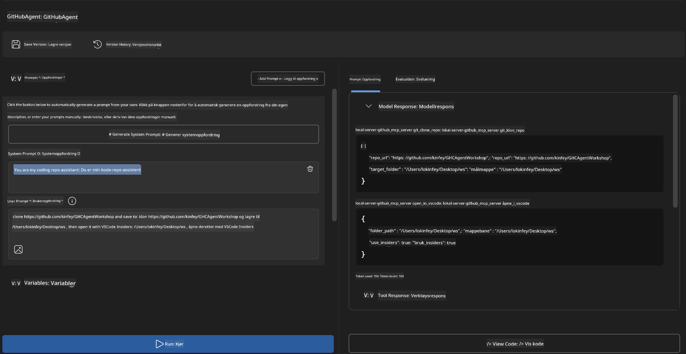
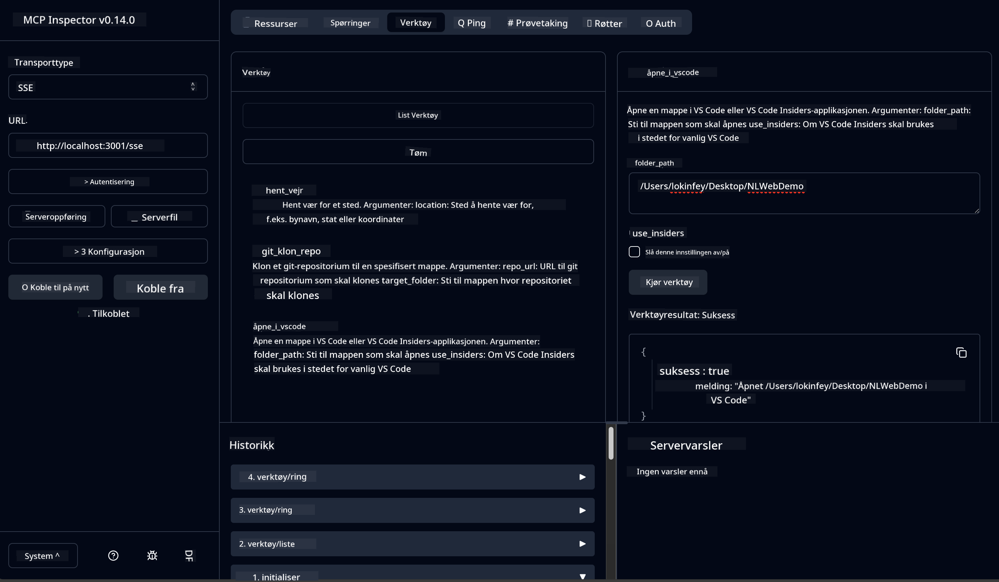

<!--
CO_OP_TRANSLATOR_METADATA:
{
  "original_hash": "f83bc722dc758efffd68667d6a1db470",
  "translation_date": "2025-06-10T06:51:41+00:00",
  "source_file": "10-StreamliningAIWorkflowsBuildingAnMCPServerWithAIToolkit/lab4/README.md",
  "language_code": "no"
}
-->
# 🐙 Modul 4: Praktisk MCP-utvikling - Egen GitHub-klone-server


> **⚡ Rask start:** Bygg en produksjonsklar MCP-server som automatiserer kloning av GitHub-repositorier og integrasjon med VS Code på bare 30 minutter!

## 🎯 Læringsmål

Når du er ferdig med denne labben, vil du kunne:

- ✅ Lage en egen MCP-server for virkelige utviklingsarbeidsflyter  
- ✅ Implementere kloning av GitHub-repositorier via MCP  
- ✅ Integrere egne MCP-servere med VS Code og Agent Builder  
- ✅ Bruke GitHub Copilot Agent Mode med egne MCP-verktøy  
- ✅ Teste og distribuere egne MCP-servere i produksjonsmiljøer  

## 📋 Forutsetninger

- Fullført Lab 1-3 (MCP-grunnleggende og avansert utvikling)  
- GitHub Copilot-abonnement ([gratis registrering tilgjengelig](https://github.com/github-copilot/signup))  
- VS Code med AI Toolkit og GitHub Copilot-utvidelser  
- Git CLI installert og konfigurert  

## 🏗️ Prosjektoversikt

### **Utviklingsutfordring fra virkeligheten**  
Som utviklere bruker vi ofte GitHub for å klone repositorier og åpne dem i VS Code eller VS Code Insiders. Denne manuelle prosessen innebærer:  
1. Åpne terminal/kommandoprompt  
2. Navigere til ønsket mappe  
3. Kjøre `git clone`-kommandoen  
4. Åpne VS Code i den klonede mappen  

**Vår MCP-løsning forenkler dette til én smart kommando!**

### **Hva du skal bygge**  
En **GitHub Clone MCP Server** (`git_mcp_server`) som tilbyr:

| Funksjon | Beskrivelse | Fordel |
|---------|-------------|---------|
| 🔄 **Smart repositorie-kloning** | Klon GitHub-repoer med validering | Automatisk feilsjekk |
| 📁 **Intelligent mappehåndtering** | Sjekk og opprett mapper trygt | Forhindrer overskriving |
| 🚀 **Plattformuavhengig VS Code-integrasjon** | Åpne prosjekter i VS Code/Insiders | Sømløs arbeidsflytovergang |
| 🛡️ **Robust feilhåndtering** | Håndter nettverk, tillatelser og sti-problemer | Klar for produksjon |

---

## 📖 Steg-for-steg implementering

### Steg 1: Lag GitHub-agent i Agent Builder

1. **Start Agent Builder** via AI Toolkit-utvidelsen  
2. **Opprett en ny agent** med følgende konfigurasjon:  
   ```
   Agent Name: GitHubAgent
   ```

3. **Initialiser egen MCP-server:**  
   - Gå til **Tools** → **Add Tool** → **MCP Server**  
   - Velg **"Create A new MCP Server"**  
   - Velg **Python-mal** for maksimal fleksibilitet  
   - **Servernavn:** `git_mcp_server`  

### Steg 2: Konfigurer GitHub Copilot Agent Mode

1. **Åpne GitHub Copilot** i VS Code (Ctrl/Cmd + Shift + P → "GitHub Copilot: Open")  
2. **Velg Agent-modell** i Copilot-grensesnittet  
3. **Velg Claude 3.7-modellen** for bedre resonnering  
4. **Aktiver MCP-integrasjon** for verktøystilgang  

> **💡 Tips:** Claude 3.7 gir bedre forståelse av utviklingsarbeidsflyter og mønstre for feilhåndtering.

### Steg 3: Implementer kjernen i MCP-serveren

**Bruk denne detaljerte prompten med GitHub Copilot Agent Mode:**  

```
Create two MCP tools with the following comprehensive requirements:

🔧 TOOL A: clone_repository
Requirements:
- Clone any GitHub repository to a specified local folder
- Return the absolute path of the successfully cloned project
- Implement comprehensive validation:
  ✓ Check if target directory already exists (return error if exists)
  ✓ Validate GitHub URL format (https://github.com/user/repo)
  ✓ Verify git command availability (prompt installation if missing)
  ✓ Handle network connectivity issues
  ✓ Provide clear error messages for all failure scenarios

🚀 TOOL B: open_in_vscode
Requirements:
- Open specified folder in VS Code or VS Code Insiders
- Cross-platform compatibility (Windows/Linux/macOS)
- Use direct application launch (not terminal commands)
- Auto-detect available VS Code installations
- Handle cases where VS Code is not installed
- Provide user-friendly error messages

Additional Requirements:
- Follow MCP 1.9.3 best practices
- Include proper type hints and documentation
- Implement logging for debugging purposes
- Add input validation for all parameters
- Include comprehensive error handling
```

### Steg 4: Test MCP-serveren din

#### 4a. Test i Agent Builder

1. **Start debug-konfigurasjonen** for Agent Builder  
2. **Konfigurer agenten din med denne systemprompten:**  

```
SYSTEM_PROMPT:
You are my intelligent coding repository assistant. You help developers efficiently clone GitHub repositories and set up their development environment. Always provide clear feedback about operations and handle errors gracefully.
```

3. **Test med realistiske bruker-scenarier:**  

```
USER_PROMPT EXAMPLES:

Scenario : Basic Clone and Open
"Clone {Your GitHub Repo link such as https://github.com/kinfey/GHCAgentWorkshop
 } and save to {The global path you specify}, then open it with VS Code Insiders"
```



**Forventede resultater:**  
- ✅ Vellykket kloning med sti-bekreftelse  
- ✅ Automatisk oppstart av VS Code  
- ✅ Tydelige feilmeldinger ved ugyldige scenarier  
- ✅ Korrekt håndtering av spesialtilfeller  

#### 4b. Test i MCP Inspector



---

**🎉 Gratulerer!** Du har nå laget en praktisk, produksjonsklar MCP-server som løser ekte utfordringer i utviklingsarbeidsflyter. Din egen GitHub-klone-server viser hvor kraftig MCP er for å automatisere og forbedre utviklerproduktiviteten.

### 🏆 Oppnåelser:  
- ✅ **MCP-utvikler** - Laget egen MCP-server  
- ✅ **Automatiseringsmester** - Forenklet utviklingsprosesser  
- ✅ **Integrasjonsekspert** - Knyttet sammen flere utviklingsverktøy  
- ✅ **Klar for produksjon** - Bygget løsninger som kan distribueres  

---

## 🎓 Fullført workshop: Din reise med Model Context Protocol

**Kjære workshop-deltaker,**

Gratulerer med å ha fullført alle fire modulene i Model Context Protocol-workshopen! Du har gått fra å forstå grunnleggende AI Toolkit-konsepter til å bygge produksjonsklare MCP-servere som løser virkelige utviklingsutfordringer.

### 🚀 Oppsummering av læringsreisen:

**[Modul 1](../lab1/README.md)**: Du startet med å utforske AI Toolkit, modelltesting og å lage din første AI-agent.

**[Modul 2](../lab2/README.md)**: Du lærte MCP-arkitektur, integrerte Playwright MCP, og bygde din første nettleserautomatiseringsagent.

**[Modul 3](../lab3/README.md)**: Du avanserte til egen MCP-serverutvikling med Weather MCP-serveren og mestret feilsøkingsverktøy.

**[Modul 4](../lab4/README.md)**: Nå har du brukt alt til å lage et praktisk verktøy for automatisering av GitHub-repositorie-arbeidsflyt.

### 🌟 Det du har mestret:

- ✅ **AI Toolkit-økosystemet**: Modeller, agenter og integrasjonsmønstre  
- ✅ **MCP-arkitektur**: Klient-server-design, transportprotokoller og sikkerhet  
- ✅ **Utviklerverktøy**: Fra Playground til Inspector og produksjonsdistribusjon  
- ✅ **Egenutvikling**: Bygge, teste og distribuere egne MCP-servere  
- ✅ **Praktiske anvendelser**: Løse virkelige arbeidsflytutfordringer med AI  

### 🔮 Dine neste steg:

1. **Bygg din egen MCP-server**: Bruk ferdighetene til å automatisere dine egne arbeidsflyter  
2. **Bli med i MCP-fellesskapet**: Del dine prosjekter og lær av andre  
3. **Utforsk avansert integrasjon**: Koble MCP-servere til bedriftsløsninger  
4. **Bidra til open source**: Hjelp til med å forbedre MCP-verktøy og dokumentasjon  

Husk at denne workshopen bare er starten. Model Context Protocol-økosystemet utvikler seg raskt, og du er nå klar til å være i front på AI-drevne utviklingsverktøy.

**Takk for din deltakelse og læringsvilje!**

Vi håper denne workshopen har gitt deg ideer som vil forandre hvordan du bygger og bruker AI-verktøy i utviklingsreisen din.

**Lykke til med koding!**

---

**Ansvarsfraskrivelse**:  
Dette dokumentet er oversatt ved hjelp av AI-oversettelsestjenesten [Co-op Translator](https://github.com/Azure/co-op-translator). Selv om vi streber etter nøyaktighet, vennligst vær oppmerksom på at automatiserte oversettelser kan inneholde feil eller unøyaktigheter. Det opprinnelige dokumentet på dets opprinnelige språk bør betraktes som den autoritative kilden. For kritisk informasjon anbefales profesjonell menneskelig oversettelse. Vi er ikke ansvarlige for eventuelle misforståelser eller feiltolkninger som oppstår ved bruk av denne oversettelsen.