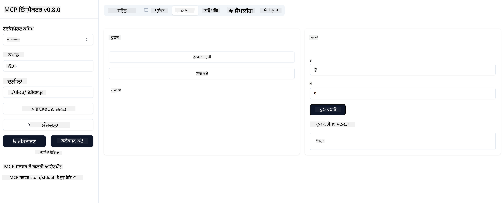

<!--
CO_OP_TRANSLATOR_METADATA:
{
  "original_hash": "d730cbe43a8efc148677fdbc849a7d5e",
  "translation_date": "2025-06-02T16:58:46+00:00",
  "source_file": "03-GettingStarted/01-first-server/README.md",
  "language_code": "pa"
}
-->
### -2- ਪ੍ਰੋਜੈਕਟ ਬਣਾਓ

ਹੁਣ ਜਦੋਂ ਤੁਹਾਡੇ ਕੋਲ SDK ਇੰਸਟਾਲ ਹੋ ਚੁੱਕਾ ਹੈ, ਆਓ ਅਗਲੇ ਕਦਮ ਵਜੋਂ ਇੱਕ ਪ੍ਰੋਜੈਕਟ ਬਣਾਈਏ: 

### -3- ਪ੍ਰੋਜੈਕਟ ਫਾਈਲਾਂ ਬਣਾਓ

### -4- ਸਰਵਰ ਕੋਡ ਬਣਾਓ

### -5- ਇੱਕ ਟੂਲ ਅਤੇ ਇੱਕ ਸਰੋਤ ਜੋੜੋ

ਹੇਠਾਂ ਦਿੱਤਾ ਕੋਡ ਜੋੜ ਕੇ ਇੱਕ ਟੂਲ ਅਤੇ ਇੱਕ ਸਰੋਤ ਸ਼ਾਮਲ ਕਰੋ: 

### -6- ਆਖਰੀ ਕੋਡ

ਆਓ ਆਖਰੀ ਕੋਡ ਜੋੜੀਏ ਤਾਂ ਜੋ ਸਰਵਰ ਸ਼ੁਰੂ ਹੋ ਸਕੇ: 

### -7- ਸਰਵਰ ਦੀ ਜਾਂਚ ਕਰੋ

ਹੇਠਾਂ ਦਿੱਤੇ ਕਮਾਂਡ ਨਾਲ ਸਰਵਰ ਸ਼ੁਰੂ ਕਰੋ: 

### -8- ਇੰਸਪੈਕਟਰ ਦੀ ਵਰਤੋਂ ਕਰੋ

ਇੰਸਪੈਕਟਰ ਇੱਕ ਵਧੀਆ ਟੂਲ ਹੈ ਜੋ ਤੁਹਾਡੇ ਸਰਵਰ ਨੂੰ ਚਾਲੂ ਕਰਦਾ ਹੈ ਅਤੇ ਤੁਹਾਨੂੰ ਇਸ ਨਾਲ ਇੰਟਰੈਕਟ ਕਰਨ ਦਿੰਦਾ ਹੈ ਤਾਂ ਜੋ ਤੁਸੀਂ ਟੈਸਟ ਕਰ ਸਕੋ ਕਿ ਇਹ ਠੀਕ ਕੰਮ ਕਰ ਰਿਹਾ ਹੈ। ਆਓ ਇਸਨੂੰ ਚਾਲੂ ਕਰੀਏ:

> [!NOTE]
> ਇਹ "command" ਫੀਲਡ ਵਿੱਚ ਵੱਖਰਾ ਦਿਸ ਸਕਦਾ ਹੈ ਕਿਉਂਕਿ ਇਹ ਤੁਹਾਡੇ ਖਾਸ ਰਨਟਾਈਮ ਲਈ ਸਰਵਰ ਚਲਾਉਣ ਦੀ ਕਮਾਂਡ ਸ਼ਾਮਲ ਕਰਦਾ ਹੈ

ਤੁਹਾਨੂੰ ਹੇਠਾਂ ਦਿੱਤੀ ਵਰਤੋਂਕਾਰ ਇੰਟਰਫੇਸ ਦਿਖਾਈ ਦੇਵੇਗੀ:

1. Connect ਬਟਨ ਨੂੰ ਚੁਣ ਕੇ ਸਰਵਰ ਨਾਲ ਜੁੜੋ  
  ਜਦੋਂ ਤੁਸੀਂ ਸਰਵਰ ਨਾਲ ਜੁੜ ਜਾਵੋਗੇ, ਤਾਂ ਤੁਹਾਨੂੰ ਹੇਠਾਂ ਦਿੱਤਾ ਦ੍ਰਿਸ਼ ਦਿਖਾਈ ਦੇਵੇਗਾ:

  

1. "Tools" ਅਤੇ "listTools" ਚੁਣੋ, ਤੁਹਾਨੂੰ "Add" ਦਿਖਾਈ ਦੇਵੇਗਾ, "Add" ਨੂੰ ਚੁਣੋ ਅਤੇ ਪੈਰਾਮੀਟਰ ਮੁੱਲ ਭਰੋ।

  ਤੁਹਾਨੂੰ ਹੇਠਾਂ ਦਿੱਤਾ ਜਵਾਬ ਮਿਲੇਗਾ, ਜਿਸਦਾ ਮਤਲਬ ਹੈ ਕਿ "add" ਟੂਲ ਤੋਂ ਨਤੀਜਾ:

  

ਮੁਬਾਰਕਾਂ, ਤੁਸੀਂ ਆਪਣਾ ਪਹਿਲਾ ਸਰਵਰ ਬਣਾਇਆ ਅਤੇ ਚਲਾਇਆ ਹੈ!

### ਅਧਿਕਾਰਕ SDKs

MCP ਕਈ ਭਾਸ਼ਾਵਾਂ ਲਈ ਅਧਿਕਾਰਕ SDKs ਪ੍ਰਦਾਨ ਕਰਦਾ ਹੈ:  
- [C# SDK](https://github.com/modelcontextprotocol/csharp-sdk) - Microsoft ਨਾਲ ਸਹਿਯੋਗ ਵਿੱਚ ਰੱਖਿਆ ਗਿਆ  
- [Java SDK](https://github.com/modelcontextprotocol/java-sdk) - Spring AI ਨਾਲ ਸਹਿਯੋਗ ਵਿੱਚ ਰੱਖਿਆ ਗਿਆ  
- [TypeScript SDK](https://github.com/modelcontextprotocol/typescript-sdk) - ਅਧਿਕਾਰਕ TypeScript ਇੰਪਲੀਮੈਂਟੇਸ਼ਨ  
- [Python SDK](https://github.com/modelcontextprotocol/python-sdk) - ਅਧਿਕਾਰਕ Python ਇੰਪਲੀਮੈਂਟੇਸ਼ਨ  
- [Kotlin SDK](https://github.com/modelcontextprotocol/kotlin-sdk) - ਅਧਿਕਾਰਕ Kotlin ਇੰਪਲੀਮੈਂਟੇਸ਼ਨ  
- [Swift SDK](https://github.com/modelcontextprotocol/swift-sdk) - Loopwork AI ਨਾਲ ਸਹਿਯੋਗ ਵਿੱਚ ਰੱਖਿਆ ਗਿਆ  
- [Rust SDK](https://github.com/modelcontextprotocol/rust-sdk) - ਅਧਿਕਾਰਕ Rust ਇੰਪਲੀਮੈਂਟੇਸ਼ਨ  

## ਮੁੱਖ ਗੱਲਾਂ

- MCP ਵਿਕਾਸ ਵਾਤਾਵਰਣ ਸੈੱਟਅਪ ਭਾਸ਼ਾ-ਖਾਸ SDKs ਨਾਲ ਸੌਖਾ ਹੈ  
- MCP ਸਰਵਰ ਬਣਾਉਣਾ ਸਾਫ਼-ਸੁਥਰੇ ਸਕੀਮਾਂ ਨਾਲ ਟੂਲ ਬਣਾਉਣ ਅਤੇ ਰਜਿਸਟਰ ਕਰਨ ਵਿੱਚ ਸ਼ਾਮਲ ਹੈ  
- ਟੈਸਟਿੰਗ ਅਤੇ ਡੀਬੱਗਿੰਗ ਭਰੋਸੇਯੋਗ MCP ਇੰਪਲੀਮੈਂਟੇਸ਼ਨਾਂ ਲਈ ਜ਼ਰੂਰੀ ਹਨ  

## ਨਮੂਨੇ

- [Java Calculator](../samples/java/calculator/README.md)  
- [.Net Calculator](../../../../03-GettingStarted/samples/csharp)  
- [JavaScript Calculator](../samples/javascript/README.md)  
- [TypeScript Calculator](../samples/typescript/README.md)  
- [Python Calculator](../../../../03-GettingStarted/samples/python)  

## ਅਸਾਈਨਮੈਂਟ

ਆਪਣੀ ਪਸੰਦ ਦਾ ਟੂਲ ਲੈ ਕੇ ਇੱਕ ਸਧਾਰਣ MCP ਸਰਵਰ ਬਣਾਓ:  
1. ਆਪਣੇ ਮਨਪਸੰਦ ਭਾਸ਼ਾ (.NET, Java, Python, ਜਾਂ JavaScript) ਵਿੱਚ ਟੂਲ ਲਾਗੂ ਕਰੋ।  
2. ਇਨਪੁੱਟ ਪੈਰਾਮੀਟਰ ਅਤੇ ਵਾਪਸੀ ਮੁੱਲ ਪਰਿਭਾਸ਼ਿਤ ਕਰੋ।  
3. ਸਰਵਰ ਦੇ ਸਹੀ ਕੰਮ ਕਰਨ ਦੀ ਜਾਂਚ ਲਈ ਇੰਸਪੈਕਟਰ ਟੂਲ ਚਲਾਓ।  
4. ਵੱਖ-ਵੱਖ ਇਨਪੁੱਟ ਨਾਲ ਇੰਪਲੀਮੈਂਟੇਸ਼ਨ ਦੀ ਟੈਸਟਿੰਗ ਕਰੋ।  

## ਹੱਲ

[Solution](./solution/README.md)

## ਵਾਧੂ ਸਰੋਤ

- [MCP GitHub Repository](https://github.com/microsoft/mcp-for-beginners)

## ਅਗਲਾ ਕਦਮ

ਅਗਲਾ: [Getting Started with MCP Clients](/03-GettingStarted/02-client/README.md)

**ਅਸਵੀਕਾਰੋਪਣ**:  
ਇਹ ਦਸਤਾਵੇਜ਼ AI ਅਨੁਵਾਦ ਸੇਵਾ [Co-op Translator](https://github.com/Azure/co-op-translator) ਦੀ ਵਰਤੋਂ ਕਰਕੇ ਅਨੁਵਾਦ ਕੀਤਾ ਗਿਆ ਹੈ। ਜਦੋਂ ਕਿ ਅਸੀਂ ਸਹੀਤਾ ਲਈ ਕੋਸ਼ਿਸ਼ ਕਰਦੇ ਹਾਂ, ਕਿਰਪਾ ਕਰਕੇ ਧਿਆਨ ਵਿੱਚ ਰੱਖੋ ਕਿ ਸਵੈਚਾਲਿਤ ਅਨੁਵਾਦਾਂ ਵਿੱਚ ਗਲਤੀਆਂ ਜਾਂ ਅਸਮਰਥਤਾਵਾਂ ਹੋ ਸਕਦੀਆਂ ਹਨ। ਮੂਲ ਦਸਤਾਵੇਜ਼ ਆਪਣੀ ਮੂਲ ਭਾਸ਼ਾ ਵਿੱਚ ਅਧਿਕਾਰਤ ਸਰੋਤ ਮੰਨਿਆ ਜਾਣਾ ਚਾਹੀਦਾ ਹੈ। ਜਰੂਰੀ ਜਾਣਕਾਰੀ ਲਈ, ਪੇਸ਼ੇਵਰ ਮਨੁੱਖੀ ਅਨੁਵਾਦ ਦੀ ਸਿਫਾਰਿਸ਼ ਕੀਤੀ ਜਾਂਦੀ ਹੈ। ਅਸੀਂ ਇਸ ਅਨੁਵਾਦ ਦੀ ਵਰਤੋਂ ਤੋਂ ਉਤਪੰਨ ਹੋਣ ਵਾਲੀਆਂ ਕਿਸੇ ਵੀ ਗਲਤਫਹਿਮੀਆਂ ਜਾਂ ਗਲਤ ਵਿਆਖਿਆਵਾਂ ਲਈ ਜ਼ਿੰਮੇਵਾਰ ਨਹੀਂ ਹਾਂ।