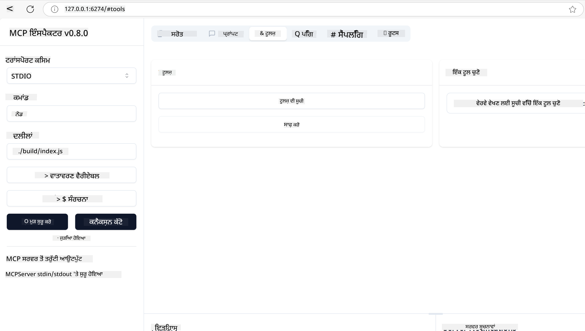

<!--
CO_OP_TRANSLATOR_METADATA:
{
  "original_hash": "bf05718d019040cf0c7d4ccc6d6a1a88",
  "translation_date": "2025-06-13T05:57:35+00:00",
  "source_file": "03-GettingStarted/01-first-server/README.md",
  "language_code": "pa"
}
-->
### -2- ਪ੍ਰੋਜੈਕਟ ਬਣਾਓ

ਹੁਣ ਜਦੋਂ ਤੁਹਾਡੇ ਕੋਲ SDK ਇੰਸਟਾਲ ਹੈ, ਆਓ ਅਗਲਾ ਕਦਮ ਹੈ ਪ੍ਰੋਜੈਕਟ ਬਣਾਉਣਾ:

### -3- ਪ੍ਰੋਜੈਕਟ ਫਾਈਲਾਂ ਬਣਾਓ

### -4- ਸਰਵਰ ਕੋਡ ਬਣਾਓ

### -5- ਇੱਕ ਟੂਲ ਅਤੇ ਇੱਕ ਰਿਸੋਰਸ ਸ਼ਾਮਿਲ ਕਰੋ

ਹੇਠਾਂ ਦਿੱਤਾ ਕੋਡ ਸ਼ਾਮਿਲ ਕਰਕੇ ਇੱਕ ਟੂਲ ਅਤੇ ਇੱਕ ਰਿਸੋਰਸ ਜੋੜੋ:

### -6 ਅੰਤਿਮ ਕੋਡ

ਆਓ ਆਖਰੀ ਕੋਡ ਸ਼ਾਮਿਲ ਕਰੀਏ ਤਾਂ ਜੋ ਸਰਵਰ ਸ਼ੁਰੂ ਹੋ ਸਕੇ:

### -7- ਸਰਵਰ ਟੈਸਟ ਕਰੋ

ਸਰਵਰ ਨੂੰ ਹੇਠਾਂ ਦਿੱਤੇ ਕਮਾਂਡ ਨਾਲ ਸ਼ੁਰੂ ਕਰੋ:

### -8- ਇੰਸਪੈਕਟਰ ਦੀ ਵਰਤੋਂ ਕਰੋ

ਇੰਸਪੈਕਟਰ ਇੱਕ ਵਧੀਆ ਟੂਲ ਹੈ ਜੋ ਤੁਹਾਡੇ ਸਰਵਰ ਨੂੰ ਚਾਲੂ ਕਰਦਾ ਹੈ ਅਤੇ ਤੁਹਾਨੂੰ ਇਸ ਨਾਲ ਇੰਟਰੈਕਟ ਕਰਨ ਦਿੰਦਾ ਹੈ ਤਾਂ ਜੋ ਤੁਸੀਂ ਇਹ ਟੈਸਟ ਕਰ ਸਕੋ ਕਿ ਇਹ ਕੰਮ ਕਰ ਰਿਹਾ ਹੈ। ਆਓ ਇਸਨੂੰ ਚਾਲੂ ਕਰੀਏ:

> [!NOTE]
> ਇਹ "command" ਖੇਤਰ ਵਿੱਚ ਵੱਖਰਾ ਲੱਗ ਸਕਦਾ ਹੈ ਕਿਉਂਕਿ ਇਸ ਵਿੱਚ ਤੁਹਾਡੇ ਖਾਸ ਰਨਟਾਈਮ ਨਾਲ ਸਰਵਰ ਚਲਾਉਣ ਲਈ ਕਮਾਂਡ ਹੁੰਦੀ ਹੈ।

ਤੁਹਾਨੂੰ ਹੇਠਾਂ ਦਿੱਤੀ ਯੂਜ਼ਰ ਇੰਟਰਫੇਸ ਵੇਖਣ ਨੂੰ ਮਿਲੇਗੀ:

1. ਕਨੈਕਟ ਬਟਨ ਚੁਣ ਕੇ ਸਰਵਰ ਨਾਲ ਜੁੜੋ  
   ਜਦੋਂ ਤੁਸੀਂ ਸਰਵਰ ਨਾਲ ਜੁੜ ਜਾਵੋਗੇ, ਤੁਹਾਨੂੰ ਹੁਣ ਹੇਠਾਂ ਦਿੱਤਾ ਦ੍ਰਿਸ਼ ਮਿਲੇਗਾ:

   

2. "Tools" ਅਤੇ "listTools" ਚੁਣੋ, ਤੁਹਾਨੂੰ "Add" ਦਿਖਾਈ ਦੇਵੇਗਾ, "Add" ਚੁਣੋ ਅਤੇ ਪੈਰਾਮੀਟਰ ਮੁੱਲ ਭਰੋ।

   ਤੁਹਾਨੂੰ ਹੇਠਾਂ ਦਿੱਤੀ ਜਵਾਬ ਮਿਲੇਗੀ, ਜਿਵੇਂ ਕਿ "add" ਟੂਲ ਤੋਂ ਨਤੀਜਾ:

   

ਮੁਬਾਰਕਾਂ, ਤੁਸੀਂ ਆਪਣਾ ਪਹਿਲਾ ਸਰਵਰ ਬਣਾਇਆ ਅਤੇ ਚਲਾਇਆ ਹੈ!

### ਅਧਿਕਾਰਿਕ SDKs

MCP ਕਈ ਭਾਸ਼ਾਵਾਂ ਲਈ ਅਧਿਕਾਰਿਕ SDKs ਪ੍ਰਦਾਨ ਕਰਦਾ ਹੈ:  
- [C# SDK](https://github.com/modelcontextprotocol/csharp-sdk) - ਮਾਇਕ੍ਰੋਸਾਫਟ ਨਾਲ ਸਹਿਯੋਗ ਵਿੱਚ ਸੰਭਾਲਿਆ ਗਿਆ  
- [Java SDK](https://github.com/modelcontextprotocol/java-sdk) - Spring AI ਨਾਲ ਸਹਿਯੋਗ ਵਿੱਚ ਸੰਭਾਲਿਆ ਗਿਆ  
- [TypeScript SDK](https://github.com/modelcontextprotocol/typescript-sdk) - ਅਧਿਕਾਰਿਕ TypeScript ਇੰਪਲੀਮੈਂਟੇਸ਼ਨ  
- [Python SDK](https://github.com/modelcontextprotocol/python-sdk) - ਅਧਿਕਾਰਿਕ Python ਇੰਪਲੀਮੈਂਟੇਸ਼ਨ  
- [Kotlin SDK](https://github.com/modelcontextprotocol/kotlin-sdk) - ਅਧਿਕਾਰਿਕ Kotlin ਇੰਪਲੀਮੈਂਟੇਸ਼ਨ  
- [Swift SDK](https://github.com/modelcontextprotocol/swift-sdk) - Loopwork AI ਨਾਲ ਸਹਿਯੋਗ ਵਿੱਚ ਸੰਭਾਲਿਆ ਗਿਆ  
- [Rust SDK](https://github.com/modelcontextprotocol/rust-sdk) - ਅਧਿਕਾਰਿਕ Rust ਇੰਪਲੀਮੈਂਟੇਸ਼ਨ

## ਮੁੱਖ ਬਿੰਦੂ

- MCP ਵਿਕਾਸ ਵਾਤਾਵਰਣ ਸੈਟਅੱਪ ਕਰਨਾ ਭਾਸ਼ਾ-ਵਿਸ਼ੇਸ਼ SDKs ਨਾਲ ਸੌਖਾ ਹੈ  
- MCP ਸਰਵਰ ਬਣਾਉਣਾ ਸਾਫ਼-ਸੁਥਰੇ ਸਕੀਮਾਂ ਨਾਲ ਟੂਲ ਬਣਾਉਣ ਅਤੇ ਰਜਿਸਟਰ ਕਰਨ ਦਾ ਕੰਮ ਹੈ  
- ਟੈਸਟਿੰਗ ਅਤੇ ਡੀਬੱਗਿੰਗ MCP ਇੰਪਲੀਮੈਂਟੇਸ਼ਨਾਂ ਲਈ ਜ਼ਰੂਰੀ ਹਨ

## ਨਮੂਨੇ

- [Java Calculator](../samples/java/calculator/README.md)  
- [.Net Calculator](../../../../03-GettingStarted/samples/csharp)  
- [JavaScript Calculator](../samples/javascript/README.md)  
- [TypeScript Calculator](../samples/typescript/README.md)  
- [Python Calculator](../../../../03-GettingStarted/samples/python)

## ਅਸਾਈਨਮੈਂਟ

ਆਪਣੀ ਪਸੰਦ ਦਾ ਇੱਕ ਸਧਾਰਣ MCP ਸਰਵਰ ਬਣਾਓ:  
1. ਆਪਣੇ ਮਨਪਸੰਦ ਭਾਸ਼ਾ (.NET, Java, Python, ਜਾਂ JavaScript) ਵਿੱਚ ਟੂਲ ਨੂੰ ਇੰਪਲੀਮੈਂਟ ਕਰੋ।  
2. ਇਨਪੁੱਟ ਪੈਰਾਮੀਟਰ ਅਤੇ ਰਿਟਰਨ ਵੈਲਿਊਜ਼ ਪਰਿਭਾਸ਼ਿਤ ਕਰੋ।  
3. ਸਰਵਰ ਦੇ ਕੰਮ ਕਰਨ ਦੀ ਪੁਸ਼ਟੀ ਲਈ ਇੰਸਪੈਕਟਰ ਟੂਲ ਚਲਾਓ।  
4. ਵੱਖ-ਵੱਖ ਇਨਪੁੱਟ ਨਾਲ ਇੰਪਲੀਮੈਂਟੇਸ਼ਨ ਨੂੰ ਟੈਸਟ ਕਰੋ।

## ਹੱਲ

[Solution](./solution/README.md)

## ਵਾਧੂ ਸਰੋਤ

- [Azure 'ਤੇ Model Context Protocol ਦੀ ਵਰਤੋਂ ਕਰਕੇ ਏਜੰਟ ਬਣਾਓ](https://learn.microsoft.com/azure/developer/ai/intro-agents-mcp)  
- [Azure Container Apps ਨਾਲ Remote MCP (Node.js/TypeScript/JavaScript)](https://learn.microsoft.com/samples/azure-samples/mcp-container-ts/mcp-container-ts/)  
- [.NET OpenAI MCP Agent](https://learn.microsoft.com/samples/azure-samples/openai-mcp-agent-dotnet/openai-mcp-agent-dotnet/)

## ਅਗਲਾ ਕਦਮ

ਅਗਲਾ: [Getting Started with MCP Clients](/03-GettingStarted/02-client/README.md)

**ਅਸਵੀਕਾਰੋक्ति**:  
ਇਹ ਦਸਤਾਵੇਜ਼ AI ਅਨੁਵਾਦ ਸੇਵਾ [Co-op Translator](https://github.com/Azure/co-op-translator) ਦੀ ਵਰਤੋਂ ਕਰਕੇ ਅਨੁਵਾਦ ਕੀਤਾ ਗਿਆ ਹੈ। ਜਦੋਂ ਕਿ ਅਸੀਂ ਸਹੀਤਾ ਲਈ ਕੋਸ਼ਿਸ਼ ਕਰਦੇ ਹਾਂ, ਕਿਰਪਾ ਕਰਕੇ ਧਿਆਨ ਵਿੱਚ ਰੱਖੋ ਕਿ ਸਵੈਚਾਲਿਤ ਅਨੁਵਾਦਾਂ ਵਿੱਚ ਗਲਤੀਆਂ ਜਾਂ ਅਸਮਰਥਤਾਵਾਂ ਹੋ ਸਕਦੀਆਂ ਹਨ। ਮੂਲ ਦਸਤਾਵੇਜ਼ ਆਪਣੀ ਮੂਲ ਭਾਸ਼ਾ ਵਿੱਚ ਪ੍ਰਮਾਣਿਕ ਸਰੋਤ ਮੰਨਿਆ ਜਾਣਾ ਚਾਹੀਦਾ ਹੈ। ਮਹੱਤਵਪੂਰਨ ਜਾਣਕਾਰੀ ਲਈ, ਪੇਸ਼ੇਵਰ ਮਨੁੱਖੀ ਅਨੁਵਾਦ ਦੀ ਸਿਫਾਰਸ਼ ਕੀਤੀ ਜਾਂਦੀ ਹੈ। ਅਸੀਂ ਇਸ ਅਨੁਵਾਦ ਦੇ ਉਪਯੋਗ ਤੋਂ ਉਪਜਣ ਵਾਲੀਆਂ ਕਿਸੇ ਵੀ ਗਲਤਫਹਿਮੀਆਂ ਜਾਂ ਗਲਤ ਵਿਆਖਿਆਵਾਂ ਲਈ ਜ਼ਿੰਮੇਵਾਰ ਨਹੀਂ ਹਾਂ।