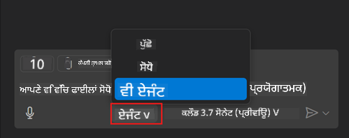
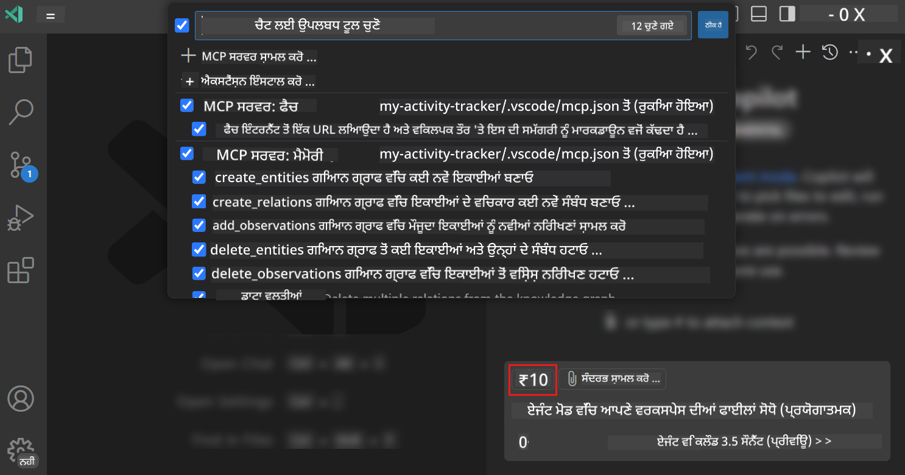

<!--
CO_OP_TRANSLATOR_METADATA:
{
  "original_hash": "8ea28e5e566edd5969337fd0b191ba3f",
  "translation_date": "2025-07-17T00:56:54+00:00",
  "source_file": "03-GettingStarted/04-vscode/README.md",
  "language_code": "pa"
}
-->
# GitHub Copilot Agent ਮੋਡ ਤੋਂ ਸਰਵਰ ਦੀ ਵਰਤੋਂ ਕਰਨਾ

Visual Studio Code ਅਤੇ GitHub Copilot ਇੱਕ ਕਲਾਇੰਟ ਵਜੋਂ ਕੰਮ ਕਰ ਸਕਦੇ ਹਨ ਅਤੇ MCP ਸਰਵਰ ਨੂੰ ਵਰਤ ਸਕਦੇ ਹਨ। ਤੁਸੀਂ ਪੁੱਛ ਸਕਦੇ ਹੋ ਕਿ ਅਸੀਂ ਇਹ ਕਿਉਂ ਕਰਨਾ ਚਾਹੁੰਦੇ ਹਾਂ? ਇਸਦਾ ਮਤਲਬ ਹੈ ਕਿ MCP ਸਰਵਰ ਦੀਆਂ ਜੋ ਵੀ ਖੂਬੀਆਂ ਹਨ, ਉਹ ਹੁਣ ਤੁਹਾਡੇ IDE ਦੇ ਅੰਦਰੋਂ ਵਰਤੀ ਜਾ ਸਕਦੀਆਂ ਹਨ। ਉਦਾਹਰਨ ਵਜੋਂ ਸੋਚੋ ਕਿ ਤੁਸੀਂ GitHub ਦਾ MCP ਸਰਵਰ ਜੋੜਦੇ ਹੋ, ਇਸ ਨਾਲ ਤੁਸੀਂ ਟਰਮੀਨਲ ਵਿੱਚ ਖਾਸ ਕਮਾਂਡਾਂ ਟਾਈਪ ਕਰਨ ਦੀ ਬਜਾਏ ਪ੍ਰਾਂਪਟਾਂ ਰਾਹੀਂ GitHub ਨੂੰ ਕੰਟਰੋਲ ਕਰ ਸਕੋਗੇ। ਜਾਂ ਕੁਝ ਵੀ ਜੋ ਤੁਹਾਡੇ ਡਿਵੈਲਪਰ ਅਨੁਭਵ ਨੂੰ ਸੁਧਾਰ ਸਕਦਾ ਹੈ, ਉਹ ਸਾਰਾ ਕੁਦਰਤੀ ਭਾਸ਼ਾ ਰਾਹੀਂ ਕੰਟਰੋਲ ਕੀਤਾ ਜਾ ਸਕਦਾ ਹੈ। ਹੁਣ ਤੁਸੀਂ ਜਿੱਤ ਦੇਖ ਰਹੇ ਹੋ, ਸਹੀ?

## ਝਲਕ

ਇਸ ਪਾਠ ਵਿੱਚ ਦੱਸਿਆ ਗਿਆ ਹੈ ਕਿ ਕਿਵੇਂ Visual Studio Code ਅਤੇ GitHub Copilot ਦੇ Agent ਮੋਡ ਨੂੰ MCP ਸਰਵਰ ਲਈ ਕਲਾਇੰਟ ਵਜੋਂ ਵਰਤਣਾ ਹੈ।

## ਸਿੱਖਣ ਦੇ ਲਕੜੇ

ਇਸ ਪਾਠ ਦੇ ਅੰਤ ਤੱਕ, ਤੁਸੀਂ ਸਮਰੱਥ ਹੋਵੋਗੇ:

- Visual Studio Code ਰਾਹੀਂ MCP ਸਰਵਰ ਦੀ ਵਰਤੋਂ ਕਰਨਾ।
- GitHub Copilot ਰਾਹੀਂ ਟੂਲ ਵਰਗੀਆਂ ਸਮਰੱਥਾਵਾਂ ਚਲਾਉਣਾ।
- Visual Studio Code ਨੂੰ ਆਪਣੇ MCP ਸਰਵਰ ਨੂੰ ਲੱਭਣ ਅਤੇ ਪ੍ਰਬੰਧਿਤ ਕਰਨ ਲਈ ਸੰਰਚਿਤ ਕਰਨਾ।

## ਵਰਤੋਂ

ਤੁਸੀਂ ਆਪਣੇ MCP ਸਰਵਰ ਨੂੰ ਦੋ ਤਰੀਕਿਆਂ ਨਾਲ ਕੰਟਰੋਲ ਕਰ ਸਕਦੇ ਹੋ:

- ਯੂਜ਼ਰ ਇੰਟਰਫੇਸ, ਜਿਸਦਾ ਤਰੀਕਾ ਤੁਸੀਂ ਇਸ ਅਧਿਆਇ ਵਿੱਚ ਬਾਅਦ ਵਿੱਚ ਵੇਖੋਗੇ।
- ਟਰਮੀਨਲ, ਟਰਮੀਨਲ ਤੋਂ `code` ਐਗਜ਼ਿਕਿਊਟੇਬਲ ਦੀ ਵਰਤੋਂ ਕਰਕੇ ਚੀਜ਼ਾਂ ਕੰਟਰੋਲ ਕਰਨਾ ਸੰਭਵ ਹੈ:

  ਆਪਣੇ ਯੂਜ਼ਰ ਪ੍ਰੋਫਾਈਲ ਵਿੱਚ MCP ਸਰਵਰ ਜੋੜਨ ਲਈ, --add-mcp ਕਮਾਂਡ ਲਾਈਨ ਵਿਕਲਪ ਦੀ ਵਰਤੋਂ ਕਰੋ, ਅਤੇ JSON ਸਰਵਰ ਸੰਰਚਨਾ ਇਸ ਰੂਪ ਵਿੱਚ ਦਿਓ {\"name\":\"server-name\",\"command\":...}।

  ```
  code --add-mcp "{\"name\":\"my-server\",\"command\": \"uvx\",\"args\": [\"mcp-server-fetch\"]}"
  ```

### ਸਕ੍ਰੀਨਸ਼ਾਟ

  
  


ਅਗਲੇ ਹਿੱਸਿਆਂ ਵਿੱਚ ਅਸੀਂ ਵਿਜ਼ੂਅਲ ਇੰਟਰਫੇਸ ਦੀ ਵਰਤੋਂ ਬਾਰੇ ਹੋਰ ਗੱਲ ਕਰਾਂਗੇ।

## ਤਰੀਕਾ

ਇਸ ਨੂੰ ਉੱਚ ਸਤਰ 'ਤੇ ਇਸ ਤਰ੍ਹਾਂ ਕਰਨਾ ਹੈ:

- ਇੱਕ ਫਾਈਲ ਸੰਰਚਿਤ ਕਰੋ ਜੋ ਸਾਡੇ MCP ਸਰਵਰ ਨੂੰ ਲੱਭੇ।
- ਉਸ ਸਰਵਰ ਨੂੰ ਸ਼ੁਰੂ ਕਰੋ ਜਾਂ ਕਨੈਕਟ ਕਰੋ ਤਾਂ ਜੋ ਉਹ ਆਪਣੀਆਂ ਸਮਰੱਥਾਵਾਂ ਦੀ ਸੂਚੀ ਦਿਖਾ ਸਕੇ।
- GitHub Copilot Chat ਇੰਟਰਫੇਸ ਰਾਹੀਂ ਉਹ ਸਮਰੱਥਾਵਾਂ ਵਰਤੋ।

ਵਧੀਆ, ਹੁਣ ਜਦੋਂ ਅਸੀਂ ਪ੍ਰਕਿਰਿਆ ਸਮਝ ਗਏ ਹਾਂ, ਆਓ ਇੱਕ ਅਭਿਆਸ ਰਾਹੀਂ Visual Studio Code ਤੋਂ MCP ਸਰਵਰ ਦੀ ਵਰਤੋਂ ਕਰੀਏ।

## ਅਭਿਆਸ: ਸਰਵਰ ਦੀ ਵਰਤੋਂ ਕਰਨਾ

ਇਸ ਅਭਿਆਸ ਵਿੱਚ, ਅਸੀਂ Visual Studio Code ਨੂੰ ਸੰਰਚਿਤ ਕਰਾਂਗੇ ਤਾਂ ਜੋ ਉਹ ਤੁਹਾਡੇ MCP ਸਰਵਰ ਨੂੰ ਲੱਭ ਸਕੇ ਅਤੇ GitHub Copilot Chat ਇੰਟਰਫੇਸ ਤੋਂ ਵਰਤਿਆ ਜਾ ਸਕੇ।

### -0- ਪਹਿਲਾ ਕਦਮ, MCP ਸਰਵਰ ਖੋਜ ਨੂੰ ਯੋਗ ਕਰੋ

ਤੁਹਾਨੂੰ MCP ਸਰਵਰਾਂ ਦੀ ਖੋਜ ਯੋਗ ਕਰਨ ਦੀ ਲੋੜ ਹੋ ਸਕਦੀ ਹੈ।

1. Visual Studio Code ਵਿੱਚ `File -> Preferences -> Settings` 'ਤੇ ਜਾਓ।

1. "MCP" ਖੋਜੋ ਅਤੇ settings.json ਫਾਈਲ ਵਿੱਚ `chat.mcp.discovery.enabled` ਨੂੰ ਯੋਗ ਕਰੋ।

### -1- ਸੰਰਚਨਾ ਫਾਈਲ ਬਣਾਓ

ਆਪਣੇ ਪ੍ਰੋਜੈਕਟ ਰੂਟ ਵਿੱਚ ਇੱਕ ਸੰਰਚਨਾ ਫਾਈਲ ਬਣਾਉ, ਜਿਸਦਾ ਨਾਮ MCP.json ਹੋਵੇ ਅਤੇ ਇਸਨੂੰ .vscode ਫੋਲਡਰ ਵਿੱਚ ਰੱਖੋ। ਇਹ ਇਸ ਤਰ੍ਹਾਂ ਹੋਣਾ ਚਾਹੀਦਾ ਹੈ:

```text
.vscode
|-- mcp.json
```

ਹੁਣ ਦੇਖੀਏ ਕਿ ਸਰਵਰ ਐਂਟਰੀ ਕਿਵੇਂ ਜੋੜੀ ਜਾ ਸਕਦੀ ਹੈ।

### -2- ਸਰਵਰ ਸੰਰਚਿਤ ਕਰੋ

*ਮcp.json* ਵਿੱਚ ਹੇਠਾਂ ਦਿੱਤਾ ਸਮੱਗਰੀ ਸ਼ਾਮਲ ਕਰੋ:

```json
{
    "inputs": [],
    "servers": {
       "hello-mcp": {
           "command": "node",
           "args": [
               "build/index.js"
           ]
       }
    }
}
```

ਉਪਰ ਦਿੱਤਾ ਸਧਾਰਣ ਉਦਾਹਰਨ ਹੈ ਕਿ Node.js ਵਿੱਚ ਲਿਖਿਆ ਸਰਵਰ ਕਿਵੇਂ ਸ਼ੁਰੂ ਕਰਨਾ ਹੈ, ਹੋਰ ਰਨਟਾਈਮ ਲਈ `command` ਅਤੇ `args` ਦੀ ਵਰਤੋਂ ਕਰਕੇ ਸਰਵਰ ਸ਼ੁਰੂ ਕਰਨ ਲਈ ਸਹੀ ਕਮਾਂਡ ਦਿਓ।

### -3- ਸਰਵਰ ਸ਼ੁਰੂ ਕਰੋ

ਹੁਣ ਜਦੋਂ ਤੁਸੀਂ ਐਂਟਰੀ ਜੋੜ ਦਿੱਤੀ ਹੈ, ਆਓ ਸਰਵਰ ਸ਼ੁਰੂ ਕਰੀਏ:

1. *mcp.json* ਵਿੱਚ ਆਪਣੀ ਐਂਟਰੀ ਲੱਭੋ ਅਤੇ "play" ਆਈਕਨ ਨੂੰ ਯਕੀਨੀ ਬਣਾਓ:

    

1. "play" ਆਈਕਨ 'ਤੇ ਕਲਿੱਕ ਕਰੋ, ਤੁਸੀਂ GitHub Copilot Chat ਵਿੱਚ ਟੂਲ ਆਈਕਨ ਦੇ ਨਾਲ ਉਪਲਬਧ ਟੂਲਾਂ ਦੀ ਗਿਣਤੀ ਵਧਦੀ ਦੇਖੋਗੇ। ਜੇ ਤੁਸੀਂ ਉਸ ਟੂਲ ਆਈਕਨ 'ਤੇ ਕਲਿੱਕ ਕਰੋਗੇ, ਤਾਂ ਤੁਹਾਨੂੰ ਦਰਜ ਟੂਲਾਂ ਦੀ ਸੂਚੀ ਮਿਲੇਗੀ। ਤੁਸੀਂ ਹਰ ਟੂਲ ਨੂੰ ਚੈੱਕ ਜਾਂ ਅਨਚੈੱਕ ਕਰ ਸਕਦੇ ਹੋ ਕਿ GitHub Copilot ਉਹਨਾਂ ਨੂੰ ਸੰਦਰਭ ਵਜੋਂ ਵਰਤੇ:

  

1. ਕਿਸੇ ਟੂਲ ਨੂੰ ਚਲਾਉਣ ਲਈ, ਇੱਕ ਪ੍ਰਾਂਪਟ ਟਾਈਪ ਕਰੋ ਜੋ ਤੁਹਾਡੇ ਟੂਲਾਂ ਵਿੱਚੋਂ ਕਿਸੇ ਇੱਕ ਦੇ ਵਰਣਨ ਨਾਲ ਮੇਲ ਖਾਂਦਾ ਹੋਵੇ, ਉਦਾਹਰਨ ਵਜੋਂ "add 22 to 1":

  

  ਤੁਹਾਨੂੰ 23 ਦਾ ਜਵਾਬ ਮਿਲਣਾ ਚਾਹੀਦਾ ਹੈ।

## ਅਸਾਈਨਮੈਂਟ

ਆਪਣੇ *mcp.json* ਫਾਈਲ ਵਿੱਚ ਇੱਕ ਸਰਵਰ ਐਂਟਰੀ ਜੋੜਨ ਦੀ ਕੋਸ਼ਿਸ਼ ਕਰੋ ਅਤੇ ਯਕੀਨੀ ਬਣਾਓ ਕਿ ਤੁਸੀਂ ਸਰਵਰ ਨੂੰ ਸ਼ੁਰੂ ਅਤੇ ਰੋਕ ਸਕਦੇ ਹੋ। ਇਹ ਵੀ ਯਕੀਨੀ ਬਣਾਓ ਕਿ ਤੁਸੀਂ GitHub Copilot Chat ਇੰਟਰਫੇਸ ਰਾਹੀਂ ਆਪਣੇ ਸਰਵਰ ਦੇ ਟੂਲਾਂ ਨਾਲ ਸੰਚਾਰ ਕਰ ਸਕਦੇ ਹੋ।

## ਹੱਲ

[Solution](./solution/README.md)

## ਮੁੱਖ ਗੱਲਾਂ

ਇਸ ਅਧਿਆਇ ਤੋਂ ਮੁੱਖ ਸਿੱਖਣ ਵਾਲੀਆਂ ਗੱਲਾਂ ਹਨ:

- Visual Studio Code ਇੱਕ ਸ਼ਾਨਦਾਰ ਕਲਾਇੰਟ ਹੈ ਜੋ ਤੁਹਾਨੂੰ ਕਈ MCP ਸਰਵਰਾਂ ਅਤੇ ਉਹਨਾਂ ਦੇ ਟੂਲਾਂ ਦੀ ਵਰਤੋਂ ਕਰਨ ਦਿੰਦਾ ਹੈ।
- GitHub Copilot Chat ਇੰਟਰਫੇਸ ਉਹ ਢੰਗ ਹੈ ਜਿਸ ਨਾਲ ਤੁਸੀਂ ਸਰਵਰਾਂ ਨਾਲ ਗੱਲਬਾਤ ਕਰਦੇ ਹੋ।
- ਤੁਸੀਂ ਵਰਤੋਂਕਾਰ ਤੋਂ ਇਨਪੁਟ ਜਿਵੇਂ API ਕੁੰਜੀਆਂ ਮੰਗ ਸਕਦੇ ਹੋ ਜੋ MCP ਸਰਵਰ ਨੂੰ *mcp.json* ਫਾਈਲ ਵਿੱਚ ਸਰਵਰ ਐਂਟਰੀ ਸੰਰਚਿਤ ਕਰਦੇ ਸਮੇਂ ਦਿੱਤੀਆਂ ਜਾ ਸਕਦੀਆਂ ਹਨ।

## ਨਮੂਨੇ

- [Java Calculator](../samples/java/calculator/README.md)
- [.Net Calculator](../../../../03-GettingStarted/samples/csharp)
- [JavaScript Calculator](../samples/javascript/README.md)
- [TypeScript Calculator](../../../../03-GettingStarted/samples/typescript)
- [Python Calculator](../../../../03-GettingStarted/samples/python)

## ਵਾਧੂ ਸਰੋਤ

- [Visual Studio docs](https://code.visualstudio.com/docs/copilot/chat/mcp-servers)

## ਅਗਲਾ ਕੀ ਹੈ

- ਅਗਲਾ: [SSE ਸਰਵਰ ਬਣਾਉਣਾ](../05-sse-server/README.md)

**ਅਸਵੀਕਾਰੋਪਣ**:  
ਇਹ ਦਸਤਾਵੇਜ਼ AI ਅਨੁਵਾਦ ਸੇਵਾ [Co-op Translator](https://github.com/Azure/co-op-translator) ਦੀ ਵਰਤੋਂ ਕਰਕੇ ਅਨੁਵਾਦਿਤ ਕੀਤਾ ਗਿਆ ਹੈ। ਜਦੋਂ ਕਿ ਅਸੀਂ ਸਹੀਤਾ ਲਈ ਕੋਸ਼ਿਸ਼ ਕਰਦੇ ਹਾਂ, ਕਿਰਪਾ ਕਰਕੇ ਧਿਆਨ ਰੱਖੋ ਕਿ ਸਵੈਚਾਲਿਤ ਅਨੁਵਾਦਾਂ ਵਿੱਚ ਗਲਤੀਆਂ ਜਾਂ ਅਸਮਰਥਤਾਵਾਂ ਹੋ ਸਕਦੀਆਂ ਹਨ। ਮੂਲ ਦਸਤਾਵੇਜ਼ ਆਪਣੀ ਮੂਲ ਭਾਸ਼ਾ ਵਿੱਚ ਪ੍ਰਮਾਣਿਕ ਸਰੋਤ ਮੰਨਿਆ ਜਾਣਾ ਚਾਹੀਦਾ ਹੈ। ਮਹੱਤਵਪੂਰਨ ਜਾਣਕਾਰੀ ਲਈ, ਪੇਸ਼ੇਵਰ ਮਨੁੱਖੀ ਅਨੁਵਾਦ ਦੀ ਸਿਫਾਰਸ਼ ਕੀਤੀ ਜਾਂਦੀ ਹੈ। ਇਸ ਅਨੁਵਾਦ ਦੀ ਵਰਤੋਂ ਤੋਂ ਉਤਪੰਨ ਕਿਸੇ ਵੀ ਗਲਤਫਹਮੀ ਜਾਂ ਗਲਤ ਵਿਆਖਿਆ ਲਈ ਅਸੀਂ ਜ਼ਿੰਮੇਵਾਰ ਨਹੀਂ ਹਾਂ।