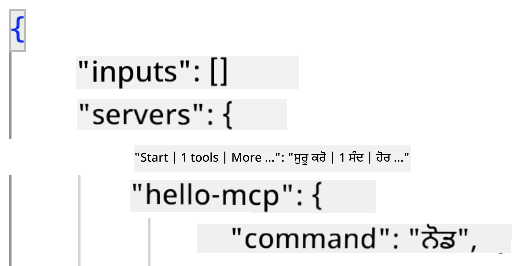

<!--
CO_OP_TRANSLATOR_METADATA:
{
  "original_hash": "54e9ffc5dba01afcb8880a9949fd1881",
  "translation_date": "2025-07-04T16:50:20+00:00",
  "source_file": "03-GettingStarted/04-vscode/README.md",
  "language_code": "pa"
}
-->
ਆਓ ਅਗਲੇ ਭਾਗਾਂ ਵਿੱਚ ਵਿਜ਼ੂਅਲ ਇੰਟਰਫੇਸ ਦੀ ਵਰਤੋਂ ਬਾਰੇ ਹੋਰ ਗੱਲ ਕਰੀਏ।

## ਤਰੀਕਾ

ਇਸ ਨੂੰ ਉੱਚ ਸਤਰ 'ਤੇ ਇਸ ਤਰ੍ਹਾਂ ਅਪਣਾਉਣਾ ਹੈ:

- ਇੱਕ ਫਾਈਲ ਕਨਫਿਗਰ ਕਰੋ ਜੋ ਸਾਡੇ MCP ਸਰਵਰ ਨੂੰ ਲੱਭ ਸਕੇ।
- ਉਸ ਸਰਵਰ ਨੂੰ ਸ਼ੁਰੂ ਕਰੋ ਜਾਂ ਕਨੈਕਟ ਕਰੋ ਤਾਂ ਜੋ ਉਹ ਆਪਣੀਆਂ ਸਮਰੱਥਾਵਾਂ ਦੀ ਸੂਚੀ ਦਿਖਾ ਸਕੇ।
- GitHub Copilot Chat ਇੰਟਰਫੇਸ ਰਾਹੀਂ ਉਹ ਸਮਰੱਥਾਵਾਂ ਵਰਤੋ।

ਵਧੀਆ, ਹੁਣ ਜਦੋਂ ਅਸੀਂ ਪ੍ਰਕਿਰਿਆ ਨੂੰ ਸਮਝ ਗਏ ਹਾਂ, ਆਓ ਇੱਕ ਅਭਿਆਸ ਰਾਹੀਂ Visual Studio Code ਵਿੱਚ MCP ਸਰਵਰ ਦੀ ਵਰਤੋਂ ਕਰੀਏ।

## ਅਭਿਆਸ: ਸਰਵਰ ਦੀ ਵਰਤੋਂ

ਇਸ ਅਭਿਆਸ ਵਿੱਚ, ਅਸੀਂ Visual Studio Code ਨੂੰ ਕਨਫਿਗਰ ਕਰਾਂਗੇ ਤਾਂ ਜੋ ਇਹ ਤੁਹਾਡੇ MCP ਸਰਵਰ ਨੂੰ ਲੱਭ ਸਕੇ ਅਤੇ GitHub Copilot Chat ਇੰਟਰਫੇਸ ਤੋਂ ਵਰਤਿਆ ਜਾ ਸਕੇ।

### -0- ਪਹਿਲਾ ਕਦਮ, MCP ਸਰਵਰ ਖੋਜ ਨੂੰ ਯੋਗ ਕਰੋ

ਤੁਹਾਨੂੰ MCP ਸਰਵਰਾਂ ਦੀ ਖੋਜ ਯੋਗ ਕਰਨ ਦੀ ਲੋੜ ਹੋ ਸਕਦੀ ਹੈ।

1. Visual Studio Code ਵਿੱਚ `File -> Preferences -> Settings` 'ਤੇ ਜਾਓ।

2. "MCP" ਖੋਜੋ ਅਤੇ settings.json ਫਾਈਲ ਵਿੱਚ `chat.mcp.discovery.enabled` ਨੂੰ ਯੋਗ ਕਰੋ।

### -1- ਕਨਫਿਗ ਫਾਈਲ ਬਣਾਓ

ਆਪਣੇ ਪ੍ਰੋਜੈਕਟ ਰੂਟ ਵਿੱਚ ਇੱਕ ਕਨਫਿਗ ਫਾਈਲ ਬਣਾਓ, ਜਿਸਦਾ ਨਾਮ MCP.json ਹੋਵੇ ਅਤੇ ਇਸਨੂੰ .vscode ਫੋਲਡਰ ਵਿੱਚ ਰੱਖੋ। ਇਹ ਇਸ ਤਰ੍ਹਾਂ ਹੋਣਾ ਚਾਹੀਦਾ ਹੈ:

```text
.vscode
|-- mcp.json
```

ਹੁਣ ਦੇਖੀਏ ਕਿ ਸਰਵਰ ਐਂਟਰੀ ਕਿਵੇਂ ਜੋੜੀ ਜਾ ਸਕਦੀ ਹੈ।

### -2- ਸਰਵਰ ਕਨਫਿਗਰ ਕਰੋ

*mcp.json* ਵਿੱਚ ਹੇਠਾਂ ਦਿੱਤਾ ਸਮੱਗਰੀ ਸ਼ਾਮਲ ਕਰੋ:

```json
{
    "inputs": [],
    "servers": {
       "hello-mcp": {
           "command": "node",
           "args": [
               "build/index.js"
           ]
       }
    }
}
```

ਉਪਰ ਦਿੱਤਾ ਸਧਾਰਣ ਉਦਾਹਰਨ Node.js ਵਿੱਚ ਲਿਖੇ ਸਰਵਰ ਨੂੰ ਸ਼ੁਰੂ ਕਰਨ ਲਈ ਹੈ, ਹੋਰ ਰਨਟਾਈਮ ਲਈ `command` ਅਤੇ `args` ਦੀ ਵਰਤੋਂ ਕਰਕੇ ਸਰਵਰ ਸ਼ੁਰੂ ਕਰਨ ਦਾ ਸਹੀ ਕਮਾਂਡ ਦੱਸੋ।

### -3- ਸਰਵਰ ਸ਼ੁਰੂ ਕਰੋ

ਹੁਣ ਜਦੋਂ ਤੁਸੀਂ ਐਂਟਰੀ ਜੋੜ ਦਿੱਤੀ ਹੈ, ਆਓ ਸਰਵਰ ਸ਼ੁਰੂ ਕਰੀਏ:

1. *mcp.json* ਵਿੱਚ ਆਪਣੀ ਐਂਟਰੀ ਲੱਭੋ ਅਤੇ "play" ਆਈਕਨ ਨੂੰ ਲੱਭੋ:

    

2. "play" ਆਈਕਨ 'ਤੇ ਕਲਿੱਕ ਕਰੋ, ਤੁਸੀਂ GitHub Copilot Chat ਵਿੱਚ ਟੂਲ ਆਈਕਨ ਦੇ ਨਾਲ ਉਪਲਬਧ ਟੂਲਾਂ ਦੀ ਗਿਣਤੀ ਵਧਦੀ ਦੇਖੋਗੇ। ਜੇ ਤੁਸੀਂ ਉਸ ਟੂਲ ਆਈਕਨ 'ਤੇ ਕਲਿੱਕ ਕਰੋਗੇ, ਤਾਂ ਤੁਹਾਨੂੰ ਦਰਜ ਟੂਲਾਂ ਦੀ ਸੂਚੀ ਮਿਲੇਗੀ। ਤੁਸੀਂ ਹਰ ਟੂਲ ਨੂੰ ਚੈੱਕ ਜਾਂ ਅਨਚੈੱਕ ਕਰ ਸਕਦੇ ਹੋ ਕਿ ਤੁਸੀਂ GitHub Copilot ਨੂੰ ਉਹਨਾਂ ਨੂੰ ਸੰਦਰਭ ਵਜੋਂ ਵਰਤਣਾ ਚਾਹੁੰਦੇ ਹੋ ਜਾਂ ਨਹੀਂ:

  

3. ਕਿਸੇ ਟੂਲ ਨੂੰ ਚਲਾਉਣ ਲਈ, ਇੱਕ ਪ੍ਰਾਂਪਟ ਟਾਈਪ ਕਰੋ ਜੋ ਤੁਹਾਨੂੰ ਪਤਾ ਹੈ ਕਿ ਤੁਹਾਡੇ ਕਿਸੇ ਟੂਲ ਦੇ ਵਰਣਨ ਨਾਲ ਮੇਲ ਖਾਂਦਾ ਹੈ, ਉਦਾਹਰਨ ਵਜੋਂ "add 22 to 1":

  

  ਤੁਹਾਨੂੰ 23 ਦਾ ਜਵਾਬ ਮਿਲਣਾ ਚਾਹੀਦਾ ਹੈ।

## ਅਸਾਈਨਮੈਂਟ

ਆਪਣੇ *mcp.json* ਫਾਈਲ ਵਿੱਚ ਇੱਕ ਸਰਵਰ ਐਂਟਰੀ ਜੋੜਨ ਦੀ ਕੋਸ਼ਿਸ਼ ਕਰੋ ਅਤੇ ਯਕੀਨੀ ਬਣਾਓ ਕਿ ਤੁਸੀਂ ਸਰਵਰ ਨੂੰ ਸ਼ੁਰੂ ਅਤੇ ਰੋਕ ਸਕਦੇ ਹੋ। ਇਹ ਵੀ ਯਕੀਨੀ ਬਣਾਓ ਕਿ ਤੁਸੀਂ GitHub Copilot Chat ਇੰਟਰਫੇਸ ਰਾਹੀਂ ਆਪਣੇ ਸਰਵਰ ਦੇ ਟੂਲਾਂ ਨਾਲ ਸੰਚਾਰ ਕਰ ਸਕਦੇ ਹੋ।

## ਹੱਲ

[Solution](./solution/README.md)

## ਮੁੱਖ ਗੱਲਾਂ

ਇਸ ਅਧਿਆਇ ਤੋਂ ਮੁੱਖ ਸਿੱਖਣ ਵਾਲੀਆਂ ਗੱਲਾਂ ਇਹ ਹਨ:

- Visual Studio Code ਇੱਕ ਸ਼ਾਨਦਾਰ ਕਲਾਇੰਟ ਹੈ ਜੋ ਤੁਹਾਨੂੰ ਕਈ MCP ਸਰਵਰਾਂ ਅਤੇ ਉਹਨਾਂ ਦੇ ਟੂਲਾਂ ਦੀ ਵਰਤੋਂ ਕਰਨ ਦਿੰਦਾ ਹੈ।
- GitHub Copilot Chat ਇੰਟਰਫੇਸ ਉਹ ਢੰਗ ਹੈ ਜਿਸ ਨਾਲ ਤੁਸੀਂ ਸਰਵਰਾਂ ਨਾਲ ਗੱਲਬਾਤ ਕਰਦੇ ਹੋ।
- ਤੁਸੀਂ ਉਪਭੋਗਤਾ ਤੋਂ ਐਪੀ ਆਈ ਕੁੰਜੀਆਂ ਵਰਗੇ ਇਨਪੁੱਟ ਲਈ ਪ੍ਰਾਂਪਟ ਕਰ ਸਕਦੇ ਹੋ ਜੋ *mcp.json* ਫਾਈਲ ਵਿੱਚ ਸਰਵਰ ਐਂਟਰੀ ਕਨਫਿਗਰ ਕਰਦੇ ਸਮੇਂ MCP ਸਰਵਰ ਨੂੰ ਦਿੱਤੇ ਜਾ ਸਕਦੇ ਹਨ।

## ਨਮੂਨੇ

- [Java ਕੈਲਕੁਲੇਟਰ](../samples/java/calculator/README.md)
- [.Net ਕੈਲਕੁਲੇਟਰ](../../../../03-GettingStarted/samples/csharp)
- [JavaScript ਕੈਲਕੁਲੇਟਰ](../samples/javascript/README.md)
- [TypeScript ਕੈਲਕੁਲੇਟਰ](../samples/typescript/README.md)
- [Python ਕੈਲਕੁਲੇਟਰ](../../../../03-GettingStarted/samples/python)

## ਵਾਧੂ ਸਰੋਤ

- [Visual Studio ਦਸਤਾਵੇਜ਼](https://code.visualstudio.com/docs/copilot/chat/mcp-servers)

## ਅਗਲਾ ਕੀ ਹੈ

- ਅਗਲਾ: [SSE ਸਰਵਰ ਬਣਾਉਣਾ](../05-sse-server/README.md)

**ਅਸਵੀਕਾਰੋਪਣ**:  
ਇਹ ਦਸਤਾਵੇਜ਼ AI ਅਨੁਵਾਦ ਸੇਵਾ [Co-op Translator](https://github.com/Azure/co-op-translator) ਦੀ ਵਰਤੋਂ ਕਰਕੇ ਅਨੁਵਾਦਿਤ ਕੀਤਾ ਗਿਆ ਹੈ। ਜਦੋਂ ਕਿ ਅਸੀਂ ਸਹੀਅਤ ਲਈ ਕੋਸ਼ਿਸ਼ ਕਰਦੇ ਹਾਂ, ਕਿਰਪਾ ਕਰਕੇ ਧਿਆਨ ਰੱਖੋ ਕਿ ਸਵੈਚਾਲਿਤ ਅਨੁਵਾਦਾਂ ਵਿੱਚ ਗਲਤੀਆਂ ਜਾਂ ਅਸਮਰਥਤਾਵਾਂ ਹੋ ਸਕਦੀਆਂ ਹਨ। ਮੂਲ ਦਸਤਾਵੇਜ਼ ਆਪਣੀ ਮੂਲ ਭਾਸ਼ਾ ਵਿੱਚ ਪ੍ਰਮਾਣਿਕ ਸਰੋਤ ਮੰਨਿਆ ਜਾਣਾ ਚਾਹੀਦਾ ਹੈ। ਮਹੱਤਵਪੂਰਨ ਜਾਣਕਾਰੀ ਲਈ, ਪੇਸ਼ੇਵਰ ਮਨੁੱਖੀ ਅਨੁਵਾਦ ਦੀ ਸਿਫਾਰਸ਼ ਕੀਤੀ ਜਾਂਦੀ ਹੈ। ਅਸੀਂ ਇਸ ਅਨੁਵਾਦ ਦੀ ਵਰਤੋਂ ਤੋਂ ਉਤਪੰਨ ਕਿਸੇ ਵੀ ਗਲਤਫਹਿਮੀ ਜਾਂ ਗਲਤ ਵਿਆਖਿਆ ਲਈ ਜ਼ਿੰਮੇਵਾਰ ਨਹੀਂ ਹਾਂ।