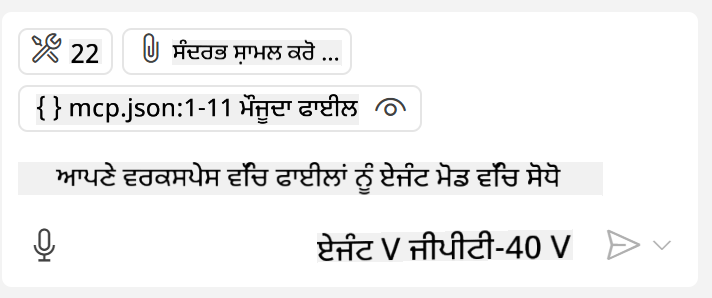

<!--
CO_OP_TRANSLATOR_METADATA:
{
  "original_hash": "0eb9557780cd0a2551cdb8a16c886b51",
  "translation_date": "2025-06-17T15:37:47+00:00",
  "source_file": "03-GettingStarted/04-vscode/README.md",
  "language_code": "pa"
}
-->
ਆਓ ਅਗਲੇ ਭਾਗਾਂ ਵਿੱਚ ਵਿਜ਼ੂਅਲ ਇੰਟਰਫੇਸ ਦੇ ਇਸਤੇਮਾਲ ਬਾਰੇ ਹੋਰ ਗੱਲ ਕਰੀਏ।

## ਦ੍ਰਿਸ਼ਟੀਕੋਣ

ਇਸ ਨੂੰ ਉੱਚ ਸਤਰ 'ਤੇ ਇਸ ਤਰ੍ਹਾਂ ਅਪ੍ਰੋਚ ਕਰਨਾ ਚਾਹੀਦਾ ਹੈ:

- ਇੱਕ ਫਾਈਲ ਕਨਫਿਗਰ ਕਰੋ ਤਾਂ ਜੋ ਸਾਡਾ MCP ਸਰਵਰ ਲੱਭ ਸਕੇ।
- ਉਸ ਸਰਵਰ ਨੂੰ ਸ਼ੁਰੂ ਕਰੋ/ਜੁੜੋ ਤਾਂ ਜੋ ਇਹ ਆਪਣੀਆਂ ਸਮਰੱਥਾਵਾਂ ਦਿਖਾ ਸਕੇ।
- ਗਿਟਹੱਬ ਕੋਪਾਇਲਟ ਚੈਟ ਇੰਟਰਫੇਸ ਰਾਹੀਂ ਉਹ ਸਮਰੱਥਾਵਾਂ ਵਰਤੋਂ।

ਵਧੀਆ, ਹੁਣ ਜਦੋਂ ਅਸੀਂ ਪ੍ਰਕਿਰਿਆ ਨੂੰ ਸਮਝ ਗਏ ਹਾਂ, ਆਓ ਇੱਕ ਅਭਿਆਸ ਰਾਹੀਂ Visual Studio Code ਵਿੱਚ MCP ਸਰਵਰ ਦੀ ਵਰਤੋਂ ਕਰੀਏ।

## ਅਭਿਆਸ: ਇੱਕ ਸਰਵਰ ਦੀ ਵਰਤੋਂ ਕਰਨਾ

ਇਸ ਅਭਿਆਸ ਵਿੱਚ, ਅਸੀਂ Visual Studio Code ਨੂੰ ਤੁਹਾਡੇ MCP ਸਰਵਰ ਨੂੰ ਲੱਭਣ ਲਈ ਕਨਫਿਗਰ ਕਰਾਂਗੇ ਤਾਂ ਜੋ ਇਹ ਗਿਟਹੱਬ ਕੋਪਾਇਲਟ ਚੈਟ ਇੰਟਰਫੇਸ ਤੋਂ ਵਰਤਿਆ ਜਾ ਸਕੇ।

### -0- ਪਹਿਲਾ ਕਦਮ, MCP ਸਰਵਰ ਖੋਜ ਸਹਾਇਤਾ ਚਾਲੂ ਕਰੋ

ਤੁਹਾਨੂੰ MCP ਸਰਵਰਾਂ ਦੀ ਖੋਜ ਨੂੰ ਚਾਲੂ ਕਰਨ ਦੀ ਲੋੜ ਹੋ ਸਕਦੀ ਹੈ।

1. `File -> Preferences -> Settings` ਤੇ ਜਾਓ ਅਤੇ settings.json ਫਾਈਲ ਵਿੱਚ ` in Visual Studio Code.

1. Search for "MCP" and enable `chat.mcp.discovery.enabled ਨੂੰ ਐਨੇਬਲ ਕਰੋ।

### -1- ਕਨਫਿਗ ਫਾਈਲ ਬਣਾਓ

ਆਪਣੇ ਪ੍ਰੋਜੈਕਟ ਦੀ ਰੂਟ ਵਿੱਚ ਇੱਕ ਕਨਫਿਗ ਫਾਈਲ ਬਣਾਓ, ਜਿਸਦਾ ਨਾਮ MCP.json ਹੋਵੇ ਅਤੇ ਇਹ .vscode ਫੋਲਡਰ ਵਿੱਚ ਰੱਖੋ। ਇਹ ਇਸ ਤਰ੍ਹਾਂ ਹੋਣਾ ਚਾਹੀਦਾ ਹੈ:

```text
.vscode
|-- mcp.json
```

ਹੁਣ, ਆਓ ਵੇਖੀਏ ਕਿ ਕਿਵੇਂ ਸਰਵਰ ਦਾ ਐਂਟਰੀ ਜੋੜੀਏ।

### -2- ਸਰਵਰ ਕਨਫਿਗਰ ਕਰੋ

*ਮcp.json* ਵਿੱਚ ਹੇਠਾਂ ਦਿੱਤਾ ਸਮੱਗਰੀ ਜੋੜੋ:

```json
{
    "inputs": [],
    "servers": {
       "hello-mcp": {
           "command": "node",
           "args": [
               "build/index.js"
           ]
       }
    }
}
```

ਉਪਰ ਦਿੱਤਾ ਇੱਕ ਸਧਾਰਣ ਉਦਾਹਰਣ ਹੈ ਕਿ Node.js ਵਿੱਚ ਲਿਖਿਆ ਸਰਵਰ ਕਿਵੇਂ ਸ਼ੁਰੂ ਕੀਤਾ ਜਾ ਸਕਦਾ ਹੈ, ਹੋਰ ਰਨਟਾਈਮ ਲਈ `command` and `args` ਦੀ ਵਰਤੋਂ ਕਰਕੇ ਸਰਵਰ ਸ਼ੁਰੂ ਕਰਨ ਲਈ ਸਹੀ ਕਮਾਂਡ ਦਿਓ।

### -3- ਸਰਵਰ ਸ਼ੁਰੂ ਕਰੋ

ਹੁਣ ਜਦੋਂ ਤੁਸੀਂ ਐਂਟਰੀ ਜੋੜ ਲਈ ਹੈ, ਆਓ ਸਰਵਰ ਸ਼ੁਰੂ ਕਰੀਏ:

1. *mcp.json* ਵਿੱਚ ਆਪਣੀ ਐਂਟਰੀ ਲੱਭੋ ਅਤੇ ਯਕੀਨੀ ਬਣਾਓ ਕਿ ਤੁਹਾਨੂੰ "play" ਆਈਕਨ ਮਿਲਦਾ ਹੈ:

    

1. "play" ਆਈਕਨ 'ਤੇ ਕਲਿੱਕ ਕਰੋ, ਤੁਹਾਨੂੰ ਗਿਟਹੱਬ ਕੋਪਾਇਲਟ ਚੈਟ ਵਿੱਚ ਟੂਲ ਆਈਕਨ 'ਤੇ ਉਪਲਬਧ ਟੂਲਾਂ ਦੀ ਗਿਣਤੀ ਵਧਦੀ ਹੋਈ ਦੇਖਣ ਨੂੰ ਮਿਲੇਗੀ। ਜੇ ਤੁਸੀਂ ਉਸ ਟੂਲ ਆਈਕਨ 'ਤੇ ਕਲਿੱਕ ਕਰੋਗੇ, ਤਾਂ ਤੁਹਾਨੂੰ ਦਰਜ ਟੂਲਾਂ ਦੀ ਸੂਚੀ ਮਿਲੇਗੀ। ਤੁਸੀਂ ਹਰ ਟੂਲ ਨੂੰ ਚੈੱਕ ਜਾਂ ਅਨਚੈੱਕ ਕਰ ਸਕਦੇ ਹੋ ਕਿ ਤੁਸੀਂ ਚਾਹੁੰਦੇ ਹੋ ਕਿ ਗਿਟਹੱਬ ਕੋਪਾਇਲਟ ਉਹਨਾਂ ਨੂੰ ਸੰਦਰਭ ਵਜੋਂ ਵਰਤੇ:

  

1. ਕਿਸੇ ਟੂਲ ਨੂੰ ਚਲਾਉਣ ਲਈ, ਇੱਕ ਪ੍ਰਾਂਪਟ ਟਾਈਪ ਕਰੋ ਜੋ ਤੁਹਾਨੂੰ ਪਤਾ ਹੈ ਕਿ ਤੁਹਾਡੇ ਟੂਲਾਂ ਵਿੱਚੋਂ ਕਿਸੇ ਦੇ ਵੇਰਵੇ ਨਾਲ ਮੇਲ ਖਾਂਦਾ ਹੈ, ਉਦਾਹਰਨ ਲਈ "add 22 to 1" ਵਰਗਾ ਪ੍ਰਾਂਪਟ:

  

  ਤੁਹਾਨੂੰ 23 ਦਾ ਜਵਾਬ ਮਿਲਣਾ ਚਾਹੀਦਾ ਹੈ।

## ਅਸਾਈਨਮੈਂਟ

ਆਪਣੇ *mcp.json* ਫਾਈਲ ਵਿੱਚ ਇੱਕ ਸਰਵਰ ਐਂਟਰੀ ਜੋੜਨ ਦੀ ਕੋਸ਼ਿਸ਼ ਕਰੋ ਅਤੇ ਯਕੀਨੀ ਬਣਾਓ ਕਿ ਤੁਸੀਂ ਸਰਵਰ ਨੂੰ ਸ਼ੁਰੂ ਅਤੇ ਰੋਕ ਸਕਦੇ ਹੋ। ਇਹ ਵੀ ਯਕੀਨੀ ਬਣਾਓ ਕਿ ਤੁਸੀਂ ਗਿਟਹੱਬ ਕੋਪਾਇਲਟ ਚੈਟ ਇੰਟਰਫੇਸ ਰਾਹੀਂ ਆਪਣੇ ਸਰਵਰ ਦੇ ਟੂਲਾਂ ਨਾਲ ਸੰਚਾਰ ਕਰ ਸਕਦੇ ਹੋ।

## ਹੱਲ

[ਹੱਲ](./solution/README.md)

## ਮੁੱਖ ਬਿੰਦੂ

ਇਸ ਅਧਿਆਇ ਤੋਂ ਮੁੱਖ ਸਿੱਖਿਆਵਾਂ ਹਨ:

- Visual Studio Code ਇੱਕ ਸ਼ਾਨਦਾਰ ਕਲਾਇੰਟ ਹੈ ਜੋ ਤੁਹਾਨੂੰ ਕਈ MCP ਸਰਵਰਾਂ ਅਤੇ ਉਹਨਾਂ ਦੇ ਟੂਲਾਂ ਦੀ ਵਰਤੋਂ ਕਰਨ ਦਿੰਦਾ ਹੈ।
- ਗਿਟਹੱਬ ਕੋਪਾਇਲਟ ਚੈਟ ਇੰਟਰਫੇਸ ਉਹ ਢੰਗ ਹੈ ਜਿਸ ਨਾਲ ਤੁਸੀਂ ਸਰਵਰਾਂ ਨਾਲ ਗੱਲਬਾਤ ਕਰਦੇ ਹੋ।
- ਤੁਸੀਂ ਉਪਭੋਗਤਾ ਤੋਂ ਇਨਪੁੱਟ ਲਈ ਪ੍ਰਾਂਪਟ ਕਰ ਸਕਦੇ ਹੋ ਜਿਵੇਂ ਕਿ API ਕੁੰਜੀਆਂ, ਜੋ *mcp.json* ਫਾਈਲ ਵਿੱਚ ਸਰਵਰ ਐਂਟਰੀ ਕਨਫਿਗਰ ਕਰਦਿਆਂ MCP ਸਰਵਰ ਨੂੰ ਦਿੱਤੀਆਂ ਜਾ ਸਕਦੀਆਂ ਹਨ।

## ਨਮੂਨੇ

- [ਜਾਵਾ ਕੈਲਕੁਲੇਟਰ](../samples/java/calculator/README.md)
- [.Net ਕੈਲਕੁਲੇਟਰ](../../../../03-GettingStarted/samples/csharp)
- [ਜਾਵਾਸਕ੍ਰਿਪਟ ਕੈਲਕੁਲੇਟਰ](../samples/javascript/README.md)
- [ਟਾਈਪਸਕ੍ਰਿਪਟ ਕੈਲਕੁਲੇਟਰ](../samples/typescript/README.md)
- [ਪਾਇਥਨ ਕੈਲਕੁਲੇਟਰ](../../../../03-GettingStarted/samples/python)

## ਵਾਧੂ ਸਰੋਤ

- [Visual Studio ਡੌਕਸ](https://code.visualstudio.com/docs/copilot/chat/mcp-servers)

## ਅਗਲਾ ਕੀ ਹੈ

- ਅਗਲਾ: [SSE ਸਰਵਰ ਬਣਾਉਣਾ](/03-GettingStarted/05-sse-server/README.md)

**ਡਿਸਕਲੇਮਰ**:  
ਇਹ ਦਸਤਾਵੇਜ਼ AI ਅਨੁਵਾਦ ਸੇਵਾ [Co-op Translator](https://github.com/Azure/co-op-translator) ਦੀ ਵਰਤੋਂ ਕਰਕੇ ਅਨੁਵਾਦਿਤ ਕੀਤਾ ਗਿਆ ਹੈ। ਜਦੋਂ ਕਿ ਅਸੀਂ ਸਹੀਤਾ ਲਈ ਕੋਸ਼ਿਸ਼ ਕਰਦੇ ਹਾਂ, ਕਿਰਪਾ ਕਰਕੇ ਧਿਆਨ ਰੱਖੋ ਕਿ ਆਟੋਮੈਟਿਕ ਅਨੁਵਾਦਾਂ ਵਿੱਚ ਗਲਤੀਆਂ ਜਾਂ ਅਸਹੀਤਾਵਾਂ ਹੋ ਸਕਦੀਆਂ ਹਨ। ਮੂਲ ਦਸਤਾਵੇਜ਼ ਆਪਣੀ ਮੂਲ ਭਾਸ਼ਾ ਵਿੱਚ ਪ੍ਰਮਾਣਿਕ ਸਰੋਤ ਮੰਨਿਆ ਜਾਣਾ ਚਾਹੀਦਾ ਹੈ। ਮਹੱਤਵਪੂਰਨ ਜਾਣਕਾਰੀ ਲਈ, ਪੇਸ਼ੇਵਰ ਮਨੁੱਖੀ ਅਨੁਵਾਦ ਦੀ ਸਿਫਾਰਿਸ਼ ਕੀਤੀ ਜਾਂਦੀ ਹੈ। ਅਸੀਂ ਇਸ ਅਨੁਵਾਦ ਦੀ ਵਰਤੋਂ ਨਾਲ ਹੋਣ ਵਾਲੀਆਂ ਕਿਸੇ ਵੀ ਗਲਤਫਹਿਮੀਆਂ ਜਾਂ ਗਲਤ ਵਿਆਖਿਆਵਾਂ ਲਈ ਜ਼ਿੰਮੇਵਾਰ ਨਹੀਂ ਹਾਂ।