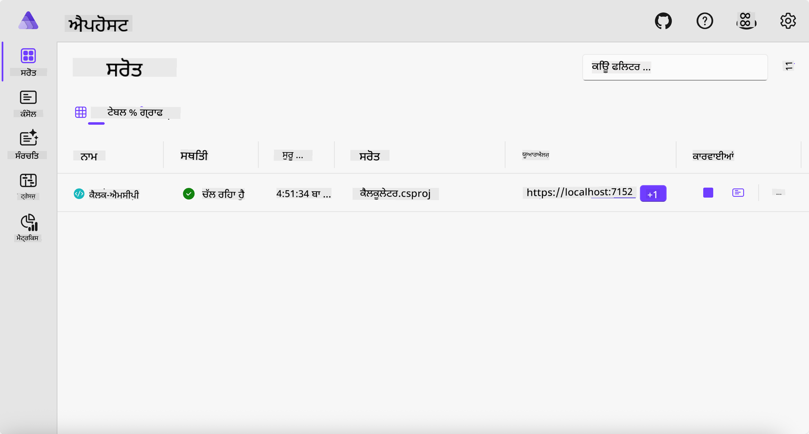
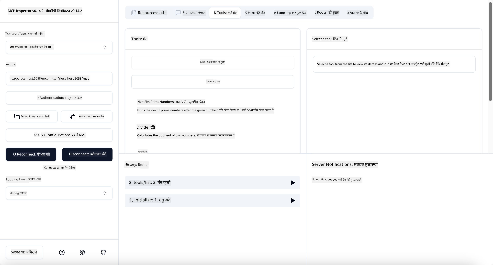

<!--
CO_OP_TRANSLATOR_METADATA:
{
  "original_hash": "0bc7bd48f55f1565f1d95ccb2c16f728",
  "translation_date": "2025-06-18T07:49:03+00:00",
  "source_file": "04-PracticalImplementation/samples/csharp/README.md",
  "language_code": "pa"
}
-->
# Sample

ਪਿਛਲਾ ਉਦਾਹਰਨ ਦਿਖਾਉਂਦਾ ਹੈ ਕਿ ਕਿਸ ਤਰ੍ਹਾਂ ਇੱਕ ਸਥਾਨਕ .NET ਪ੍ਰੋਜੈਕਟ ਨੂੰ `stdio` ਕਿਸਮ ਨਾਲ ਵਰਤਣਾ ਹੈ। ਅਤੇ ਕਿਵੇਂ ਸਰਵਰ ਨੂੰ ਇੱਕ ਕੰਟੇਨਰ ਵਿੱਚ ਸਥਾਨਕ ਤੌਰ 'ਤੇ ਚਲਾਇਆ ਜਾ ਸਕਦਾ ਹੈ। ਇਹ ਕਈ ਹਾਲਾਤਾਂ ਵਿੱਚ ਇੱਕ ਚੰਗਾ ਹੱਲ ਹੈ। ਪਰ, ਸਰਵਰ ਨੂੰ ਦੂਰੀ ਤੋਂ ਚਲਾਉਣਾ ਵੀ ਲਾਭਦਾਇਕ ਹੋ ਸਕਦਾ ਹੈ, ਜਿਵੇਂ ਕਿ ਕਲਾਉਡ ਵਾਤਾਵਰਣ ਵਿੱਚ। ਇਹੋ ਜਗ੍ਹਾ ਤੇ `http` ਕਿਸਮ ਆਉਂਦੀ ਹੈ।

`04-PracticalImplementation` ਫੋਲਡਰ ਵਿੱਚ ਹੱਲ ਨੂੰ ਦੇਖਦੇ ਹੋਏ, ਇਹ ਪਹਿਲਾਂ ਵਾਲੇ ਨਾਲੋਂ ਕਾਫੀ ਜ਼ਿਆਦਾ ਜਟਿਲ ਲੱਗ ਸਕਦਾ ਹੈ। ਪਰ ਅਸਲ ਵਿੱਚ, ਇਹ ਐਸਾ ਨਹੀਂ ਹੈ। ਜੇ ਤੁਸੀਂ ਪ੍ਰੋਜੈਕਟ `src/Calculator` ਨੂੰ ਧਿਆਨ ਨਾਲ ਵੇਖੋ, ਤਾਂ ਤੁਹਾਨੂੰ ਪਤਾ ਲੱਗੇਗਾ ਕਿ ਇਹ ਜ਼ਿਆਦਾਤਰ ਪਹਿਲਾਂ ਵਾਲੇ ਕੋਡ ਵਰਗਾ ਹੀ ਹੈ। ਸਿਰਫ ਫਰਕ ਇਹ ਹੈ ਕਿ ਅਸੀਂ HTTP ਬੇਨਤੀਆਂ ਨੂੰ ਸੰਭਾਲਣ ਲਈ ਇੱਕ ਵੱਖਰਾ ਲਾਇਬ੍ਰੇਰੀ `ModelContextProtocol.AspNetCore` ਵਰਤ ਰਹੇ ਹਾਂ। ਅਤੇ ਅਸੀਂ `IsPrime` ਮੈਥਡ ਨੂੰ ਪ੍ਰਾਈਵੇਟ ਬਣਾਉਂਦੇ ਹਾਂ, ਸਿਰਫ ਇਹ ਦਿਖਾਉਣ ਲਈ ਕਿ ਤੁਸੀਂ ਆਪਣੇ ਕੋਡ ਵਿੱਚ ਪ੍ਰਾਈਵੇਟ ਮੈਥਡ ਵੀ ਰੱਖ ਸਕਦੇ ਹੋ। ਬਾਕੀ ਸਾਰਾ ਕੋਡ ਪਹਿਲਾਂ ਵਰਗਾ ਹੀ ਹੈ।

ਹੋਰ ਪ੍ਰੋਜੈਕਟ [.NET Aspire](https://learn.microsoft.com/dotnet/aspire/get-started/aspire-overview) ਤੋਂ ਹਨ। ਹੱਲ ਵਿੱਚ .NET Aspire ਹੋਣਾ ਡਿਵੈਲਪਰ ਦੇ ਤਜਰਬੇ ਨੂੰ ਵਿਕਾਸ ਅਤੇ ਟੈਸਟਿੰਗ ਦੌਰਾਨ ਸੁਧਾਰਦਾ ਹੈ ਅਤੇ ਨਿਰੀਖਣ ਯੋਗਤਾ ਵਿੱਚ ਮਦਦ ਕਰਦਾ ਹੈ। ਸਰਵਰ ਚਲਾਉਣ ਲਈ ਇਹ ਜ਼ਰੂਰੀ ਨਹੀਂ ਹੈ, ਪਰ ਇਹ ਤੁਹਾਡੇ ਹੱਲ ਵਿੱਚ ਸ਼ਾਮਲ ਹੋਣਾ ਚੰਗੀ ਪ੍ਰੈਕਟਿਸ ਹੈ।

## ਸਰਵਰ ਨੂੰ ਸਥਾਨਕ ਤੌਰ 'ਤੇ ਚਲਾਓ

1. VS Code (C# DevKit ਐਕਸਟੈਂਸ਼ਨ ਨਾਲ) ਤੋਂ, `04-PracticalImplementation/samples/csharp` ਡਾਇਰੈਕਟਰੀ ਵਿੱਚ ਜਾਓ।
1. ਸਰਵਰ ਚਲਾਉਣ ਲਈ ਹੇਠਾਂ ਦਿੱਤਾ ਕਮਾਂਡ ਚਲਾਓ:

   ```bash
    dotnet watch run --project ./src/AppHost
   ```

1. ਜਦੋਂ ਕੋਈ ਵੈੱਬ ਬ੍ਰਾਊਜ਼ਰ .NET Aspire ਡੈਸ਼ਬੋਰਡ ਖੋਲ੍ਹਦਾ ਹੈ, ਤਾਂ `http` URL ਨੂੰ ਨੋਟ ਕਰੋ। ਇਹ ਕੁਝ ਇਸ ਤਰ੍ਹਾਂ ਹੋਣਾ ਚਾਹੀਦਾ ਹੈ `http://localhost:5058/`।

   

## MCP ਇੰਸਪੈਕਟਰ ਨਾਲ Streamable HTTP ਦੀ ਟੈਸਟਿੰਗ ਕਰੋ

ਜੇ ਤੁਹਾਡੇ ਕੋਲ Node.js 22.7.5 ਜਾਂ ਇਸ ਤੋਂ ਉੱਚਾ ਵਰਜਨ ਹੈ, ਤਾਂ ਤੁਸੀਂ MCP ਇੰਸਪੈਕਟਰ ਦੀ ਵਰਤੋਂ ਕਰਕੇ ਆਪਣੇ ਸਰਵਰ ਦੀ ਟੈਸਟਿੰਗ ਕਰ ਸਕਦੇ ਹੋ।

ਸਰਵਰ ਚਲਾਓ ਅਤੇ ਟਰਮੀਨਲ ਵਿੱਚ ਹੇਠਾਂ ਦਿੱਤਾ ਕਮਾਂਡ ਚਲਾਓ:

```bash
npx @modelcontextprotocol/inspector http://localhost:5058
```



- `Streamable HTTP` as the Transport type.
- In the Url field, enter the URL of the server noted earlier, and append `/mcp` ਚੁਣੋ। ਇਹ `http` ਹੋਣਾ ਚਾਹੀਦਾ ਹੈ (ਨਾ ਕਿ `https`) something like `http://localhost:5058/mcp`.
- select the Connect button.

A nice thing about the Inspector is that it provide a nice visibility on what is happening.

- Try listing the available tools
- Try some of them, it should works just like before.

## Test MCP Server with GitHub Copilot Chat in VS Code

To use the Streamable HTTP transport with GitHub Copilot Chat, change the configuration of the `calc-mcp` ਸਰਵਰ ਜੋ ਪਹਿਲਾਂ ਬਣਾਇਆ ਗਿਆ ਸੀ, ਇਸ ਤਰ੍ਹਾਂ ਲੱਗਦਾ ਹੈ:

```jsonc
// .vscode/mcp.json
{
  "servers": {
    "calc-mcp": {
      "type": "http",
      "url": "http://localhost:5058/mcp"
    }
  }
}
```

ਕੁਝ ਟੈਸਟ ਕਰੋ:

- "6780 ਤੋਂ ਬਾਅਦ 3 ਪ੍ਰਾਈਮ ਨੰਬਰ" ਮੰਗੋ। ਦੇਖੋ ਕਿ Copilot ਨਵੇਂ ਟੂਲ `NextFivePrimeNumbers` ਦੀ ਵਰਤੋਂ ਕਰੇਗਾ ਅਤੇ ਸਿਰਫ ਪਹਿਲੇ 3 ਪ੍ਰਾਈਮ ਨੰਬਰ ਵਾਪਸ ਕਰੇਗਾ।
- "111 ਤੋਂ ਬਾਅਦ 7 ਪ੍ਰਾਈਮ ਨੰਬਰ" ਮੰਗੋ, ਦੇਖਣ ਲਈ ਕਿ ਕੀ ਹੁੰਦਾ ਹੈ।
- "ਜੌਨ ਕੋਲ 24 ਲਾਲੀ ਹਨ ਅਤੇ ਉਹ ਆਪਣੇ 3 ਬੱਚਿਆਂ ਵਿੱਚ ਸਾਰੀਆਂ ਵੰਡਣਾ ਚਾਹੁੰਦਾ ਹੈ। ਹਰ ਬੱਚੇ ਕੋਲ ਕਿੰਨੀਆਂ ਲਾਲੀਆਂ ਹਨ?" ਮੰਗੋ, ਦੇਖਣ ਲਈ ਕਿ ਕੀ ਹੁੰਦਾ ਹੈ।

## ਸਰਵਰ ਨੂੰ Azure 'ਤੇ ਡਿਪਲੌਇ ਕਰੋ

ਆਓ ਸਰਵਰ ਨੂੰ Azure 'ਤੇ ਡਿਪਲੌਇ ਕਰੀਏ ਤਾਂ ਜੋ ਹੋਰ ਲੋਕ ਇਸਦੀ ਵਰਤੋਂ ਕਰ ਸਕਣ।

ਟਰਮੀਨਲ ਤੋਂ, `04-PracticalImplementation/samples/csharp` ਫੋਲਡਰ ਵਿੱਚ ਜਾਓ ਅਤੇ ਹੇਠਾਂ ਦਿੱਤਾ ਕਮਾਂਡ ਚਲਾਓ:

```bash
azd up
```

ਜਦੋਂ ਡਿਪਲੌਇਮੈਂਟ ਮੁਕੰਮਲ ਹੋ ਜਾਏ, ਤਾਂ ਤੁਹਾਨੂੰ ਇਸ ਤਰ੍ਹਾਂ ਦਾ ਸੁਨੇਹਾ ਦੇਖਣਾ ਚਾਹੀਦਾ ਹੈ:


URL ਲਵੋ ਅਤੇ MCP ਇੰਸਪੈਕਟਰ ਅਤੇ GitHub Copilot Chat ਵਿੱਚ ਇਸਦੀ ਵਰਤੋਂ ਕਰੋ।

```jsonc
// .vscode/mcp.json
{
  "servers": {
    "calc-mcp": {
      "type": "http",
      "url": "https://calc-mcp.gentleriver-3977fbcf.australiaeast.azurecontainerapps.io/mcp"
    }
  }
}
```

## ਅਗਲਾ ਕੀ ਹੈ?

ਅਸੀਂ ਵੱਖ-ਵੱਖ ਟਰਾਂਸਪੋਰਟ ਕਿਸਮਾਂ ਅਤੇ ਟੈਸਟਿੰਗ ਟੂਲਜ਼ ਦੀ ਕੋਸ਼ਿਸ਼ ਕਰਦੇ ਹਾਂ। ਅਸੀਂ ਤੁਹਾਡੇ MCP ਸਰਵਰ ਨੂੰ Azure 'ਤੇ ਵੀ ਡਿਪਲੌਇ ਕਰਦੇ ਹਾਂ। ਪਰ ਜੇ ਸਾਡੇ ਸਰਵਰ ਨੂੰ ਪ੍ਰਾਈਵੇਟ ਸਰੋਤਾਂ ਤੱਕ ਪਹੁੰਚ ਦੀ ਲੋੜ ਹੋਵੇ ਤਾਂ? ਉਦਾਹਰਨ ਵਜੋਂ, ਡੇਟਾਬੇਸ ਜਾਂ ਪ੍ਰਾਈਵੇਟ API? ਅਗਲੇ ਅਧਿਆਇ ਵਿੱਚ, ਅਸੀਂ ਵੇਖਾਂਗੇ ਕਿ ਅਸੀਂ ਆਪਣੇ ਸਰਵਰ ਦੀ ਸੁਰੱਖਿਆ ਕਿਵੇਂ ਸੁਧਾਰ ਸਕਦੇ ਹਾਂ।

**ਅਸਵੀਕਾਰੋਪਣ**:  
ਇਹ ਦਸਤਾਵੇਜ਼ AI ਅਨੁਵਾਦ ਸੇਵਾ [Co-op Translator](https://github.com/Azure/co-op-translator) ਦੀ ਵਰਤੋਂ ਨਾਲ ਅਨੁਵਾਦਿਤ ਕੀਤਾ ਗਿਆ ਹੈ। ਜਦੋਂ ਕਿ ਅਸੀਂ ਸਹੀਅਤ ਲਈ ਕੋਸ਼ਿਸ਼ ਕਰਦੇ ਹਾਂ, ਕਿਰਪਾ ਕਰਕੇ ਧਿਆਨ ਰੱਖੋ ਕਿ ਸਵੈਚਾਲਿਤ ਅਨੁਵਾਦਾਂ ਵਿੱਚ ਗਲਤੀਆਂ ਜਾਂ ਅਸਥਿਰਤਾਵਾਂ ਹੋ ਸਕਦੀਆਂ ਹਨ। ਮੂਲ ਦਸਤਾਵੇਜ਼ ਆਪਣੀ ਮੂਲ ਭਾਸ਼ਾ ਵਿੱਚ ਪ੍ਰਮਾਣਿਕ ਸਰੋਤ ਮੰਨਿਆ ਜਾਣਾ ਚਾਹੀਦਾ ਹੈ। ਮਹੱਤਵਪੂਰਨ ਜਾਣਕਾਰੀ ਲਈ, ਪੇਸ਼ੇਵਰ ਮਨੁੱਖੀ ਅਨੁਵਾਦ ਦੀ ਸਿਫਾਰਸ਼ ਕੀਤੀ ਜਾਂਦੀ ਹੈ। ਅਸੀਂ ਇਸ ਅਨੁਵਾਦ ਦੀ ਵਰਤੋਂ ਕਰਕੇ ਪੈਦਾ ਹੋਣ ਵਾਲੀਆਂ ਕਿਸੇ ਵੀ ਗਲਤਫਹਿਮੀਆਂ ਜਾਂ ਗਲਤ ਵਿਆਖਿਆਵਾਂ ਲਈ ਜ਼ਿੰਮੇਵਾਰ ਨਹੀਂ ਹਾਂ।