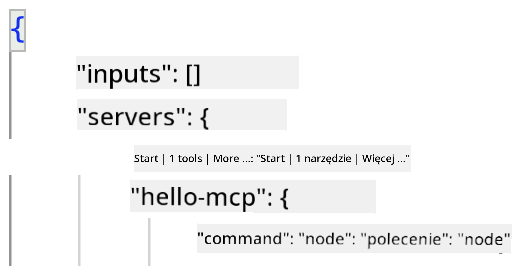

<!--
CO_OP_TRANSLATOR_METADATA:
{
  "original_hash": "8ea28e5e566edd5969337fd0b191ba3f",
  "translation_date": "2025-07-16T22:41:07+00:00",
  "source_file": "03-GettingStarted/04-vscode/README.md",
  "language_code": "pl"
}
-->
# Konsumowanie serwera w trybie GitHub Copilot Agent

Visual Studio Code i GitHub Copilot mogą działać jako klient i korzystać z MCP Server. Możesz się zastanawiać, po co miałoby to służyć? Otóż oznacza to, że wszystkie funkcje MCP Servera mogą być teraz używane bezpośrednio w Twoim IDE. Wyobraź sobie, że dodajesz na przykład MCP server GitHub — pozwoliłoby to na kontrolowanie GitHub za pomocą poleceń wpisywanych naturalnym językiem, zamiast ręcznego wpisywania konkretnych komend w terminalu. Albo wyobraź sobie cokolwiek, co mogłoby poprawić Twoje doświadczenie jako programisty, wszystko sterowane językiem naturalnym. Teraz zaczynasz widzieć korzyści, prawda?

## Przegląd

Ta lekcja pokazuje, jak używać Visual Studio Code i trybu Agent GitHub Copilot jako klienta dla Twojego MCP Servera.

## Cele nauki

Po ukończeniu tej lekcji będziesz potrafił:

- Korzystać z MCP Servera za pomocą Visual Studio Code.
- Uruchamiać funkcje, takie jak narzędzia, przez GitHub Copilot.
- Skonfigurować Visual Studio Code, aby odnajdywał i zarządzał Twoim MCP Serverem.

## Użytkowanie

Możesz kontrolować swój MCP Server na dwa sposoby:

- Interfejs użytkownika — zobaczysz, jak to zrobić w dalszej części tego rozdziału.
- Terminal — możliwe jest sterowanie serwerem z terminala za pomocą polecenia `code`:

  Aby dodać MCP Server do swojego profilu użytkownika, użyj opcji wiersza poleceń --add-mcp i podaj konfigurację serwera w formacie JSON w postaci {\"name\":\"server-name\",\"command\":...}.

  ```
  code --add-mcp "{\"name\":\"my-server\",\"command\": \"uvx\",\"args\": [\"mcp-server-fetch\"]}"
  ```

### Zrzuty ekranu

  
  


W kolejnych sekcjach omówimy dokładniej, jak korzystać z interfejsu wizualnego.

## Podejście

Oto jak powinniśmy podejść do tego na wysokim poziomie:

- Skonfigurować plik, który pozwoli odnaleźć nasz MCP Server.
- Uruchomić/połączyć się z serwerem, aby wyświetlić jego możliwości.
- Korzystać z tych możliwości przez interfejs GitHub Copilot Chat.

Świetnie, skoro znamy już ogólny przebieg, spróbujmy użyć MCP Servera w Visual Studio Code w praktycznym ćwiczeniu.

## Ćwiczenie: Konsumowanie serwera

W tym ćwiczeniu skonfigurujemy Visual Studio Code, aby odnajdywał Twój MCP Server i umożliwił korzystanie z niego przez interfejs GitHub Copilot Chat.

### -0- Krok wstępny, włącz wykrywanie MCP Serverów

Może być konieczne włączenie wykrywania MCP Serverów.

1. Przejdź do `File -> Preferences -> Settings` w Visual Studio Code.

1. Wyszukaj "MCP" i włącz `chat.mcp.discovery.enabled` w pliku settings.json.

### -1- Utwórz plik konfiguracyjny

Zacznij od utworzenia pliku konfiguracyjnego w katalogu głównym projektu. Potrzebujesz pliku o nazwie MCP.json, który umieścisz w folderze .vscode. Powinien wyglądać mniej więcej tak:

```text
.vscode
|-- mcp.json
```

Następnie zobaczmy, jak dodać wpis serwera.

### -2- Skonfiguruj serwer

Dodaj następującą zawartość do *mcp.json*:

```json
{
    "inputs": [],
    "servers": {
       "hello-mcp": {
           "command": "node",
           "args": [
               "build/index.js"
           ]
       }
    }
}
```

Powyżej znajduje się prosty przykład uruchomienia serwera napisanego w Node.js. Dla innych środowisk uruchomieniowych wskaż odpowiednią komendę do uruchomienia serwera, używając `command` i `args`.

### -3- Uruchom serwer

Teraz, gdy dodałeś wpis, uruchom serwer:

1. Znajdź swój wpis w *mcp.json* i upewnij się, że widzisz ikonę "play":

    

1. Kliknij ikonę "play", powinieneś zobaczyć, że ikona narzędzi w GitHub Copilot Chat zwiększy liczbę dostępnych narzędzi. Po kliknięciu tej ikony zobaczysz listę zarejestrowanych narzędzi. Możesz zaznaczać lub odznaczać każde narzędzie, w zależności od tego, czy chcesz, aby GitHub Copilot używał ich jako kontekstu:

  

1. Aby uruchomić narzędzie, wpisz polecenie, które pasuje do opisu jednego z Twoich narzędzi, na przykład: "add 22 to 1":

  

  Powinieneś zobaczyć odpowiedź z wynikiem 23.

## Zadanie

Spróbuj dodać wpis serwera do swojego pliku *mcp.json* i upewnij się, że możesz uruchamiać i zatrzymywać serwer. Sprawdź także, czy możesz komunikować się z narzędziami na serwerze przez interfejs GitHub Copilot Chat.

## Rozwiązanie

[Solution](./solution/README.md)

## Najważniejsze wnioski

Najważniejsze wnioski z tego rozdziału to:

- Visual Studio Code to świetny klient, który pozwala korzystać z wielu MCP Serverów i ich narzędzi.
- Interfejs GitHub Copilot Chat to sposób, w jaki komunikujesz się z serwerami.
- Możesz poprosić użytkownika o dane wejściowe, takie jak klucze API, które można przekazać do MCP Servera podczas konfigurowania wpisu serwera w pliku *mcp.json*.

## Przykłady

- [Java Calculator](../samples/java/calculator/README.md)
- [.Net Calculator](../../../../03-GettingStarted/samples/csharp)
- [JavaScript Calculator](../samples/javascript/README.md)
- [TypeScript Calculator](../samples/typescript/README.md)
- [Python Calculator](../../../../03-GettingStarted/samples/python)

## Dodatkowe zasoby

- [Visual Studio docs](https://code.visualstudio.com/docs/copilot/chat/mcp-servers)

## Co dalej

- Następny: [Tworzenie serwera SSE](../05-sse-server/README.md)

**Zastrzeżenie**:  
Niniejszy dokument został przetłumaczony za pomocą usługi tłumaczenia AI [Co-op Translator](https://github.com/Azure/co-op-translator). Mimo że dążymy do dokładności, prosimy mieć na uwadze, że automatyczne tłumaczenia mogą zawierać błędy lub nieścisłości. Oryginalny dokument w języku źródłowym powinien być uznawany za źródło autorytatywne. W przypadku informacji o kluczowym znaczeniu zalecane jest skorzystanie z profesjonalnego tłumaczenia wykonanego przez człowieka. Nie ponosimy odpowiedzialności za jakiekolwiek nieporozumienia lub błędne interpretacje wynikające z korzystania z tego tłumaczenia.