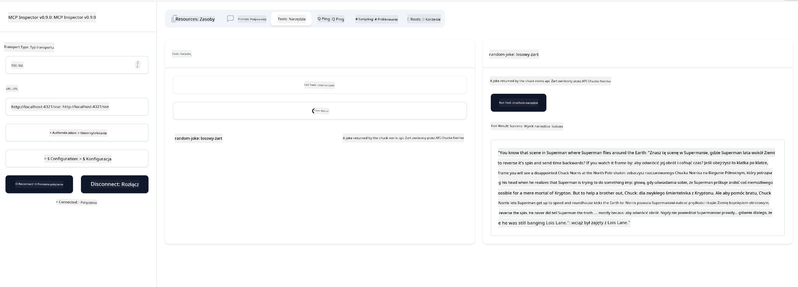

<!--
CO_OP_TRANSLATOR_METADATA:
{
  "original_hash": "0a8086dc4bf89448f83e7936db972c42",
  "translation_date": "2025-05-16T15:19:09+00:00",
  "source_file": "03-GettingStarted/05-sse-server/README.md",
  "language_code": "pl"
}
-->
Teraz, gdy wiemy już trochę więcej o SSE, zbudujmy serwer SSE.

## Ćwiczenie: Tworzenie serwera SSE

Aby stworzyć nasz serwer, musimy pamiętać o dwóch rzeczach:

- Musimy użyć serwera WWW, aby udostępnić endpointy do połączeń i wiadomości.
- Zbudować nasz serwer tak, jak zwykle, korzystając z narzędzi, zasobów i promptów, tak jak robiliśmy to przy stdio.

### -1- Utwórz instancję serwera

Do stworzenia serwera używamy tych samych typów co przy stdio. Jednak dla transportu musimy wybrać SSE.

---

Dodajmy teraz potrzebne trasy.

### -2- Dodaj trasy

Dodajmy trasy, które obsługują połączenia i przychodzące wiadomości:

---

Dodajmy teraz funkcje serwera.

### -3- Dodawanie funkcjonalności serwera

Teraz, gdy mamy już wszystko specyficzne dla SSE zdefiniowane, dodajmy funkcje serwera, takie jak narzędzia, promptsy i zasoby.

---

Twój pełny kod powinien wyglądać następująco:

---

Świetnie, mamy serwer korzystający z SSE, przetestujmy go teraz.

## Ćwiczenie: Debugowanie serwera SSE za pomocą Inspector

Inspector to świetne narzędzie, które poznaliśmy w poprzedniej lekcji [Tworzenie pierwszego serwera](/03-GettingStarted/01-first-server/README.md). Sprawdźmy, czy możemy go użyć także tutaj:

### -1- Uruchomienie Inspector

Aby uruchomić Inspector, najpierw musisz mieć działający serwer SSE, zróbmy to teraz:

1. Uruchom serwer

---

1. Uruchom Inspector

    > ![NOTE]
    > Uruchom to w osobnym oknie terminala niż serwer. Zwróć też uwagę, że musisz dostosować poniższe polecenie do adresu URL, pod którym działa Twój serwer.

    ```sh
    npx @modelcontextprotocol/inspector --cli http://localhost:8000/sse --method tools/list
    ```

    Uruchamianie Inspector wygląda tak samo we wszystkich środowiskach uruchomieniowych. Zauważ, że zamiast podawać ścieżkę do naszego serwera i komendę do jego uruchomienia, przekazujemy URL, pod którym działa serwer, oraz określamy trasę `/sse`.

### -2- Wypróbowanie narzędzia

Połącz się z serwerem, wybierając SSE z listy rozwijanej i wpisz adres URL, pod którym działa Twój serwer, np. http://localhost:4321/sse. Następnie kliknij przycisk "Connect". Jak wcześniej, wybierz listę narzędzi, wybierz narzędzie i podaj wartości wejściowe. Powinieneś zobaczyć wynik podobny do poniższego:



Świetnie, potrafisz korzystać z Inspector, zobaczmy teraz, jak pracować z Visual Studio Code.

## Zadanie

Spróbuj rozbudować swój serwer o dodatkowe funkcje. Zobacz [tę stronę](https://api.chucknorris.io/), aby na przykład dodać narzędzie wywołujące API, zdecyduj, jak ma wyglądać Twój serwer. Powodzenia :)

## Rozwiązanie

[Rozwiązanie](./solution/README.md) Oto możliwe rozwiązanie z działającym kodem.

## Kluczowe wnioski

Najważniejsze wnioski z tego rozdziału to:

- SSE to drugi obsługiwany typ transportu obok stdio.
- Aby wspierać SSE, musisz zarządzać przychodzącymi połączeniami i wiadomościami za pomocą frameworka webowego.
- Możesz korzystać zarówno z Inspector, jak i Visual Studio Code do obsługi serwera SSE, tak jak w przypadku serwerów stdio. Zauważ jednak, że różni się to nieco między stdio a SSE. W przypadku SSE musisz najpierw uruchomić serwer osobno, a potem uruchomić narzędzie Inspector. W przypadku Inspector musisz również podać URL.

## Przykłady

- [Java Calculator](../samples/java/calculator/README.md)
- [.Net Calculator](../../../../03-GettingStarted/samples/csharp)
- [JavaScript Calculator](../samples/javascript/README.md)
- [TypeScript Calculator](../samples/typescript/README.md)
- [Python Calculator](../../../../03-GettingStarted/samples/python)

## Dodatkowe zasoby

- [SSE](https://developer.mozilla.org/en-US/docs/Web/API/Server-sent_events)

## Co dalej

- Następny: [Pierwsze kroki z AI Toolkit dla VSCode](/03-GettingStarted/06-aitk/README.md)

**Zastrzeżenie**:  
Niniejszy dokument został przetłumaczony za pomocą automatycznej usługi tłumaczeniowej AI [Co-op Translator](https://github.com/Azure/co-op-translator). Mimo że dokładamy starań, aby tłumaczenie było jak najbardziej precyzyjne, prosimy pamiętać, że tłumaczenia automatyczne mogą zawierać błędy lub nieścisłości. Oryginalny dokument w języku źródłowym należy traktować jako źródło wiążące. W przypadku informacji o kluczowym znaczeniu zaleca się skorzystanie z profesjonalnego tłumaczenia wykonanego przez człowieka. Nie ponosimy odpowiedzialności za jakiekolwiek nieporozumienia lub błędne interpretacje wynikające z korzystania z tego tłumaczenia.