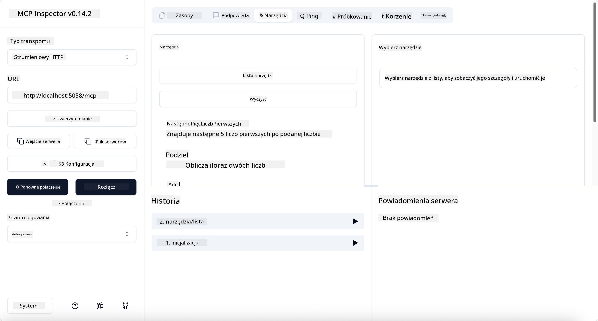

<!--
CO_OP_TRANSLATOR_METADATA:
{
  "original_hash": "0bc7bd48f55f1565f1d95ccb2c16f728",
  "translation_date": "2025-06-18T07:49:50+00:00",
  "source_file": "04-PracticalImplementation/samples/csharp/README.md",
  "language_code": "pl"
}
-->
# Przykład

Poprzedni przykład pokazuje, jak używać lokalnego projektu .NET z typem `stdio`. I jak uruchomić serwer lokalnie w kontenerze. To dobre rozwiązanie w wielu sytuacjach. Jednak czasem przydatne jest, aby serwer działał zdalnie, na przykład w środowisku chmurowym. Tutaj z pomocą przychodzi typ `http`.

Patrząc na rozwiązanie w folderze `04-PracticalImplementation`, może się wydawać znacznie bardziej skomplikowane niż poprzednie. Ale w rzeczywistości tak nie jest. Jeśli przyjrzeć się uważnie projektowi `src/Calculator`, zobaczymy, że to w dużej mierze ten sam kod co wcześniej. Jedyną różnicą jest to, że używamy innej biblioteki `ModelContextProtocol.AspNetCore` do obsługi żądań HTTP. Dodatkowo zmieniamy metodę `IsPrime` na prywatną, aby pokazać, że w kodzie można mieć metody prywatne. Reszta kodu pozostaje bez zmian.

Pozostałe projekty pochodzą z [.NET Aspire](https://learn.microsoft.com/dotnet/aspire/get-started/aspire-overview). Obecność .NET Aspire w rozwiązaniu poprawia komfort pracy dewelopera podczas tworzenia i testowania oraz wspiera obserwowalność. Nie jest to wymagane do uruchomienia serwera, ale warto mieć to w swoim projekcie.

## Uruchom serwer lokalnie

1. W VS Code (z rozszerzeniem C# DevKit) przejdź do katalogu `04-PracticalImplementation/samples/csharp`.
1. Wykonaj następujące polecenie, aby uruchomić serwer:

   ```bash
    dotnet watch run --project ./src/AppHost
   ```

1. Gdy przeglądarka internetowa otworzy pulpit .NET Aspire, zwróć uwagę na adres URL `http`. Powinien wyglądać mniej więcej tak: `http://localhost:5058/`.

   

## Testuj Streamable HTTP za pomocą MCP Inspector

Jeśli masz Node.js w wersji 22.7.5 lub nowszej, możesz użyć MCP Inspector do testowania swojego serwera.

Uruchom serwer i wpisz w terminalu następujące polecenie:

```bash
npx @modelcontextprotocol/inspector http://localhost:5058
```



- Wybierz `Streamable HTTP` as the Transport type.
- In the Url field, enter the URL of the server noted earlier, and append `/mcp`. Powinno to być `http` (nie `https`) something like `http://localhost:5058/mcp`.
- select the Connect button.

A nice thing about the Inspector is that it provide a nice visibility on what is happening.

- Try listing the available tools
- Try some of them, it should works just like before.

## Test MCP Server with GitHub Copilot Chat in VS Code

To use the Streamable HTTP transport with GitHub Copilot Chat, change the configuration of the `calc-mcp`), serwer utworzony wcześniej, aby wyglądał tak:

```jsonc
// .vscode/mcp.json
{
  "servers": {
    "calc-mcp": {
      "type": "http",
      "url": "http://localhost:5058/mcp"
    }
  }
}
```

Przeprowadź kilka testów:

- Poproś o "3 liczby pierwsze po 6780". Zwróć uwagę, że Copilot użyje nowych narzędzi `NextFivePrimeNumbers` i zwróci tylko pierwsze 3 liczby pierwsze.
- Poproś o "7 liczb pierwszych po 111", aby zobaczyć, co się stanie.
- Zapytaj: "John ma 24 lizaki i chce rozdać je wszystkim swoim 3 dzieciom. Ile lizaków dostanie każde dziecko?", aby zobaczyć, co się stanie.

## Wdróż serwer do Azure

Wdróżmy serwer do Azure, aby mogło z niego korzystać więcej osób.

W terminalu przejdź do folderu `04-PracticalImplementation/samples/csharp` i wykonaj następujące polecenie:

```bash
azd up
```

Po zakończeniu wdrożenia powinieneś zobaczyć komunikat podobny do tego:


Skopiuj adres URL i użyj go w MCP Inspector oraz w GitHub Copilot Chat.

```jsonc
// .vscode/mcp.json
{
  "servers": {
    "calc-mcp": {
      "type": "http",
      "url": "https://calc-mcp.gentleriver-3977fbcf.australiaeast.azurecontainerapps.io/mcp"
    }
  }
}
```

## Co dalej?

Wypróbujemy różne typy transportu i narzędzia do testowania. Wdrożymy też Twój serwer MCP do Azure. A co jeśli nasz serwer będzie potrzebował dostępu do zasobów prywatnych? Na przykład bazy danych lub prywatnego API? W kolejnym rozdziale zobaczymy, jak możemy poprawić bezpieczeństwo naszego serwera.

**Zastrzeżenie**:  
Niniejszy dokument został przetłumaczony za pomocą automatycznej usługi tłumaczeniowej AI [Co-op Translator](https://github.com/Azure/co-op-translator). Chociaż dokładamy starań, aby tłumaczenie było jak najbardziej precyzyjne, prosimy mieć na uwadze, że tłumaczenia automatyczne mogą zawierać błędy lub nieścisłości. Oryginalny dokument w języku źródłowym powinien być uznawany za autorytatywne źródło. W przypadku informacji krytycznych zalecane jest skorzystanie z profesjonalnego tłumaczenia wykonanego przez człowieka. Nie ponosimy odpowiedzialności za jakiekolwiek nieporozumienia lub błędne interpretacje wynikające z korzystania z tego tłumaczenia.