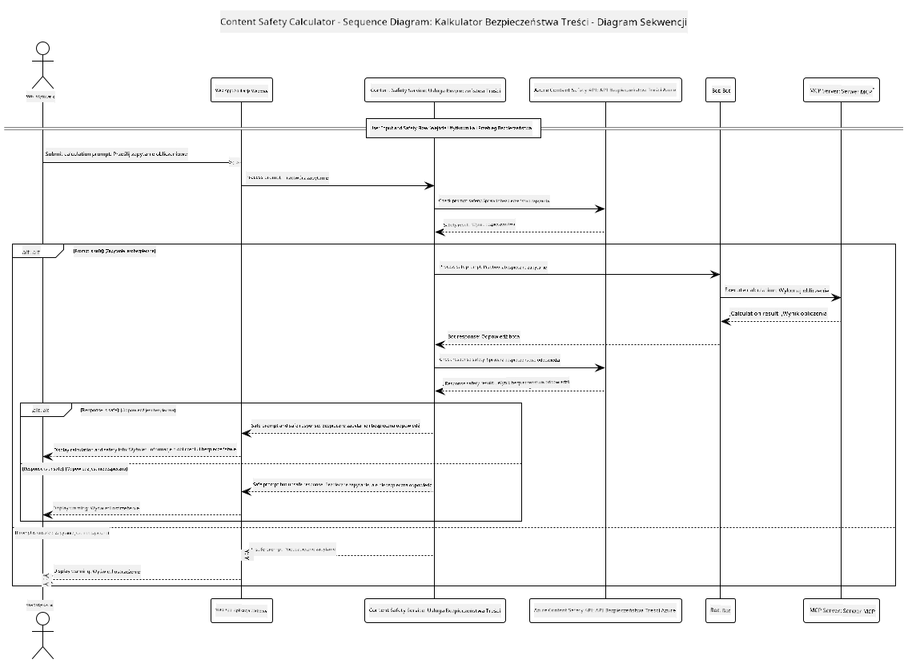

<!--
CO_OP_TRANSLATOR_METADATA:
{
  "original_hash": "e5ea5e7582f70008ea9bec3b3820f20a",
  "translation_date": "2025-05-16T15:39:15+00:00",
  "source_file": "04-PracticalImplementation/samples/java/containerapp/README.md",
  "language_code": "pl"
}
-->
## Architektura Systemu

Ten projekt demonstruje aplikację webową, która wykorzystuje sprawdzanie bezpieczeństwa treści przed przekazaniem zapytań użytkownika do usługi kalkulatora za pomocą Model Context Protocol (MCP).



### Jak to działa

1. **Wprowadzenie danych przez użytkownika**: użytkownik wpisuje zapytanie do obliczeń w interfejsie webowym  
2. **Filtrowanie bezpieczeństwa treści (wejście)**: zapytanie jest analizowane przez Azure Content Safety API  
3. **Decyzja bezpieczeństwa (wejście)**:  
   - Jeśli treść jest bezpieczna (poziom zagrożenia < 2 we wszystkich kategoriach), jest przekazywana do kalkulatora  
   - Jeśli treść jest oznaczona jako potencjalnie szkodliwa, proces zostaje przerwany i zwracane jest ostrzeżenie  
4. **Integracja z kalkulatorem**: bezpieczna treść jest przetwarzana przez LangChain4j, który komunikuje się z serwerem kalkulatora MCP  
5. **Filtrowanie bezpieczeństwa treści (wyjście)**: odpowiedź bota jest analizowana przez Azure Content Safety API  
6. **Decyzja bezpieczeństwa (wyjście)**:  
   - Jeśli odpowiedź bota jest bezpieczna, jest wyświetlana użytkownikowi  
   - Jeśli odpowiedź bota jest oznaczona jako potencjalnie szkodliwa, zostaje zastąpiona ostrzeżeniem  
7. **Odpowiedź**: wyniki (jeśli bezpieczne) są wyświetlane użytkownikowi wraz z obydwoma analizami bezpieczeństwa

## Korzystanie z Model Context Protocol (MCP) z usługami kalkulatora

Projekt pokazuje, jak używać Model Context Protocol (MCP) do wywoływania usług kalkulatora MCP z LangChain4j. Implementacja korzysta z lokalnego serwera MCP działającego na porcie 8080, który udostępnia operacje kalkulatora.

### Konfiguracja usługi Azure Content Safety

Przed użyciem funkcji bezpieczeństwa treści, należy utworzyć zasób usługi Azure Content Safety:

1. Zaloguj się do [Azure Portal](https://portal.azure.com)  
2. Kliknij „Create a resource” i wyszukaj „Content Safety”  
3. Wybierz „Content Safety” i kliknij „Create”  
4. Wprowadź unikalną nazwę zasobu  
5. Wybierz subskrypcję oraz grupę zasobów (lub utwórz nową)  
6. Wybierz obsługiwany region (sprawdź [dostępność regionów](https://azure.microsoft.com/en-us/global-infrastructure/services/?products=cognitive-services))  
7. Wybierz odpowiedni plan cenowy  
8. Kliknij „Create”, aby wdrożyć zasób  
9. Po zakończeniu wdrożenia kliknij „Go to resource”  
10. W lewym panelu, w sekcji „Resource Management”, wybierz „Keys and Endpoint”  
11. Skopiuj dowolny z kluczy oraz adres endpoint do dalszego wykorzystania

### Konfiguracja zmiennych środowiskowych

Ustaw zmienną środowiskową `GITHUB_TOKEN` do uwierzytelniania modeli GitHub:  
```sh
export GITHUB_TOKEN=<your_github_token>
```

Dla funkcji bezpieczeństwa treści ustaw:  
```sh
export CONTENT_SAFETY_ENDPOINT=<your_content_safety_endpoint>
export CONTENT_SAFETY_KEY=<your_content_safety_key>
```

Te zmienne środowiskowe są wykorzystywane przez aplikację do uwierzytelniania się w usłudze Azure Content Safety. Jeśli nie zostaną ustawione, aplikacja użyje wartości zastępczych do celów demonstracyjnych, jednak funkcje bezpieczeństwa treści nie będą działać prawidłowo.

### Uruchamianie serwera kalkulatora MCP

Przed uruchomieniem klienta należy wystartować serwer kalkulatora MCP w trybie SSE na localhost:8080.

## Opis projektu

Projekt demonstruje integrację Model Context Protocol (MCP) z LangChain4j do wywoływania usług kalkulatora. Kluczowe cechy to:

- Wykorzystanie MCP do połączenia z usługą kalkulatora dla podstawowych operacji matematycznych  
- Dwuwarstwowe sprawdzanie bezpieczeństwa treści zarówno zapytań użytkownika, jak i odpowiedzi bota  
- Integracja z modelem gpt-4.1-nano z GitHub przez LangChain4j  
- Użycie Server-Sent Events (SSE) jako transportu MCP

## Integracja bezpieczeństwa treści

Projekt zawiera kompleksowe funkcje bezpieczeństwa treści, aby zapewnić, że zarówno dane wejściowe użytkownika, jak i odpowiedzi systemu są wolne od szkodliwych treści:

1. **Filtrowanie wejściowe**: wszystkie zapytania użytkownika są analizowane pod kątem kategorii szkodliwych treści, takich jak mowa nienawiści, przemoc, samookaleczenia czy treści seksualne, zanim zostaną przetworzone.

2. **Filtrowanie wyjściowe**: nawet przy użyciu potencjalnie nieocenzurowanych modeli, system sprawdza wszystkie generowane odpowiedzi przez te same filtry bezpieczeństwa treści przed wyświetleniem ich użytkownikowi.

To dwuwarstwowe podejście gwarantuje, że system pozostaje bezpieczny niezależnie od wykorzystywanego modelu AI, chroniąc użytkowników przed szkodliwymi danymi wejściowymi oraz potencjalnie problematycznymi odpowiedziami generowanymi przez AI.

## Klient Webowy

Aplikacja zawiera przyjazny dla użytkownika interfejs webowy, który pozwala na interakcję z systemem Content Safety Calculator:

### Funkcje interfejsu webowego

- Prosty, intuicyjny formularz do wpisywania zapytań obliczeniowych  
- Dwuwarstwowa walidacja bezpieczeństwa treści (wejście i wyjście)  
- Informacje zwrotne w czasie rzeczywistym o bezpieczeństwie zapytania i odpowiedzi  
- Kolorowe wskaźniki bezpieczeństwa dla łatwej interpretacji  
- Czysty, responsywny design działający na różnych urządzeniach  
- Przykładowe bezpieczne zapytania pomagające użytkownikom

### Korzystanie z klienta webowego

1. Uruchom aplikację:  
   ```sh
   mvn spring-boot:run
   ```

2. Otwórz przeglądarkę i przejdź do `http://localhost:8087`

3. Wpisz zapytanie do obliczeń w udostępnionym polu tekstowym (np. „Oblicz sumę 24.5 i 17.3”)

4. Kliknij „Submit”, aby przetworzyć zapytanie

5. Zobacz wyniki, które będą zawierać:  
   - Analizę bezpieczeństwa treści Twojego zapytania  
   - Obliczony wynik (jeśli zapytanie było bezpieczne)  
   - Analizę bezpieczeństwa treści odpowiedzi bota  
   - Ewentualne ostrzeżenia, jeśli któreś z wejścia lub wyjścia zostało oznaczone

Klient webowy automatycznie obsługuje oba procesy weryfikacji bezpieczeństwa treści, zapewniając, że wszystkie interakcje są bezpieczne i odpowiednie, niezależnie od używanego modelu AI.

**Zastrzeżenie**:  
Niniejszy dokument został przetłumaczony za pomocą usługi tłumaczeń AI [Co-op Translator](https://github.com/Azure/co-op-translator). Mimo że dążymy do jak największej dokładności, prosimy mieć na uwadze, że automatyczne tłumaczenia mogą zawierać błędy lub niedokładności. Oryginalny dokument w języku źródłowym powinien być traktowany jako źródło wiarygodne. W przypadku informacji o kluczowym znaczeniu zaleca się skorzystanie z profesjonalnego tłumaczenia wykonanego przez człowieka. Nie ponosimy odpowiedzialności za jakiekolwiek nieporozumienia lub błędne interpretacje wynikające z korzystania z tego tłumaczenia.