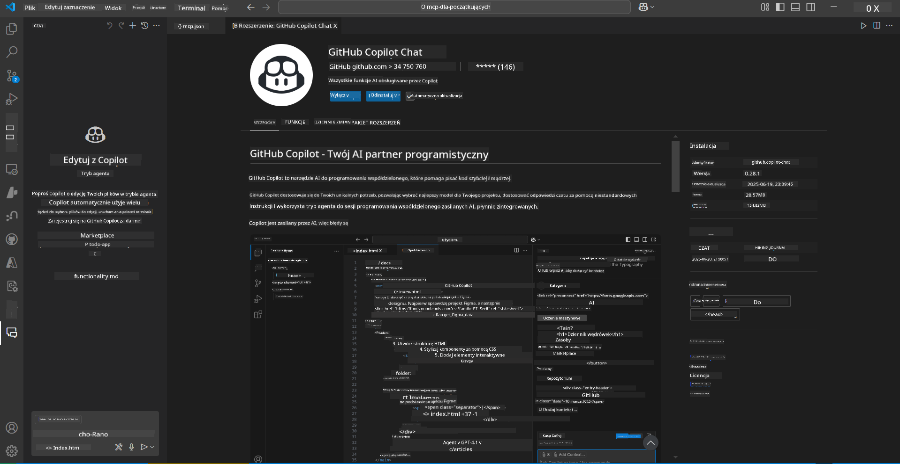
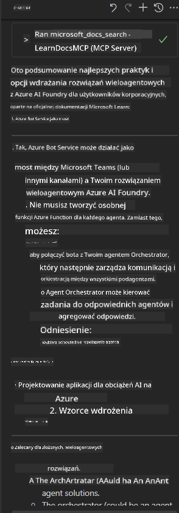

<!--
CO_OP_TRANSLATOR_METADATA:
{
  "original_hash": "db532b1ec386c9ce38c791653dc3c881",
  "translation_date": "2025-06-21T14:39:18+00:00",
  "source_file": "09-CaseStudy/docs-mcp/solution/scenario3/README.md",
  "language_code": "pl"
}
-->
# Scenariusz 3: Dokumentacja w edytorze z serwerem MCP w VS Code

## Przegląd

W tym scenariuszu nauczysz się, jak wprowadzić Microsoft Learn Docs bezpośrednio do środowiska Visual Studio Code za pomocą serwera MCP. Zamiast ciągłego przełączania się między kartami przeglądarki, aby szukać dokumentacji, możesz uzyskać dostęp, przeszukiwać i odwoływać się do oficjalnych materiałów bezpośrednio w edytorze. Takie podejście usprawnia Twój workflow, pozwala zachować koncentrację i umożliwia płynną integrację z narzędziami takimi jak GitHub Copilot.

- Przeszukuj i czytaj dokumentację w VS Code bez wychodzenia z środowiska kodowania.
- Odwołuj się do dokumentacji i wstawiaj linki bezpośrednio do README lub plików kursu.
- Korzystaj jednocześnie z GitHub Copilot i MCP, aby mieć spójny, wspierany AI workflow dokumentacyjny.

## Cele nauki

Na koniec tego rozdziału będziesz wiedział, jak skonfigurować i używać serwera MCP w VS Code, aby usprawnić swój workflow dokumentacyjny i programistyczny. Będziesz potrafił:

- Skonfigurować swoje środowisko pracy do korzystania z serwera MCP w celu wyszukiwania dokumentacji.
- Przeszukiwać i wstawiać dokumentację bezpośrednio z poziomu VS Code.
- Łączyć moc GitHub Copilot i MCP, by pracować efektywniej z wsparciem AI.

Te umiejętności pomogą Ci zachować koncentrację, poprawić jakość dokumentacji i zwiększyć produktywność jako programista lub autor techniczny.

## Rozwiązanie

Aby uzyskać dostęp do dokumentacji w edytorze, wykonasz serię kroków integrujących serwer MCP z VS Code i GitHub Copilot. To rozwiązanie jest idealne dla autorów kursów, pisarzy dokumentacji i programistów, którzy chcą skupić się na pracy w edytorze, korzystając jednocześnie z dokumentów i Copilota.

- Szybko dodawaj linki referencyjne do README podczas pisania kursu lub dokumentacji projektu.
- Używaj Copilota do generowania kodu, a MCP do natychmiastowego wyszukiwania i cytowania odpowiednich materiałów.
- Zachowaj koncentrację w edytorze i zwiększ swoją wydajność.

### Przewodnik krok po kroku

Aby zacząć, wykonaj poniższe kroki. Do każdego kroku możesz dodać zrzut ekranu z folderu assets, aby wizualnie zobrazować proces.

1. **Dodaj konfigurację MCP:**  
   W katalogu głównym projektu utwórz plik `.vscode/mcp.json` i dodaj następującą konfigurację:  
   ```json
   {
     "servers": {
       "LearnDocsMCP": {
         "url": "https://learn.microsoft.com/api/mcp"
       }
     }
   }
   ```  
   Ta konfiguracja informuje VS Code, jak połączyć się z [`Microsoft Learn Docs MCP server`](https://github.com/MicrosoftDocs/mcp).
   
   
    
2. **Otwórz panel GitHub Copilot Chat:**  
   Jeśli nie masz jeszcze zainstalowanego rozszerzenia GitHub Copilot, przejdź do widoku Extensions w VS Code i zainstaluj je. Możesz pobrać je bezpośrednio z [Visual Studio Code Marketplace](https://marketplace.visualstudio.com/items?itemName=GitHub.copilot-chat). Następnie otwórz panel Copilot Chat z paska bocznego.

   

3. **Włącz tryb agenta i zweryfikuj narzędzia:**  
   W panelu Copilot Chat włącz tryb agenta.

   

   Po włączeniu trybu agenta upewnij się, że serwer MCP jest widoczny na liście dostępnych narzędzi. Zapewnia to, że agent Copilot może uzyskać dostęp do serwera dokumentacji i pobierać odpowiednie informacje.
   
   
4. **Rozpocznij nową rozmowę i zadaj pytanie agentowi:**  
   Otwórz nową rozmowę w panelu Copilot Chat. Teraz możesz zadawać agentowi pytania dotyczące dokumentacji. Agent użyje serwera MCP, aby pobrać i wyświetlić odpowiednie materiały Microsoft Learn bezpośrednio w edytorze.

   - *„Próbuję napisać plan nauki dla tematu X. Będę się go uczyć przez 8 tygodni, na każdy tydzień zaproponuj mi treści, które powinienem przerobić.”*

   

5. **Zapytanie na żywo:**

   > Weźmy przykład zapytania z sekcji [#get-help](https://discord.gg/D6cRhjHWSC) na Discordzie Azure AI Foundry ([zobacz oryginalną wiadomość](https://discord.com/channels/1113626258182504448/1385498306720829572)):
   
   *„Szukam odpowiedzi na temat wdrożenia rozwiązania multi-agentowego z agentami AI rozwijanymi na Azure AI Foundry. Widzę, że nie ma bezpośredniej metody wdrożenia, takiej jak kanały Copilot Studio. Jakie są różne sposoby wdrożenia tego rozwiązania, aby użytkownicy korporacyjni mogli współpracować i wykonać zadanie?  
Jest wiele artykułów/blogów, które mówią, że można użyć Azure Bot service jako pomostu między MS Teams a agentami Azure AI Foundry. Czy to zadziała, jeśli skonfiguruję Azure bota łączącego się z Orchestrator Agent na Azure AI Foundry za pomocą Azure function do orkiestracji, czy też muszę stworzyć Azure function dla każdego agenta AI w ramach rozwiązania multi-agentowego, aby orkiestracja odbywała się na poziomie Bot framework? Każda inna sugestia jest mile widziana.”*

   

   Agent odpowie z odpowiednimi linkami do dokumentacji i podsumowaniami, które możesz wstawić bezpośrednio do swoich plików markdown lub wykorzystać jako odniesienia w kodzie.
   
### Przykładowe zapytania

Oto kilka przykładowych zapytań, które możesz wypróbować. Pokażą one, jak serwer MCP i Copilot mogą współpracować, aby zapewnić natychmiastową, kontekstową dokumentację i odniesienia bez wychodzenia z VS Code:

- „Pokaż mi, jak używać wyzwalaczy Azure Functions.”
- „Wstaw link do oficjalnej dokumentacji Azure Key Vault.”
- „Jakie są najlepsze praktyki zabezpieczania zasobów Azure?”
- „Znajdź szybki start dla usług Azure AI.”

Te zapytania pokażą, jak MCP i Copilot współpracują, aby dostarczyć natychmiastową, kontekstową dokumentację i odniesienia bez opuszczania VS Code.

---

**Zastrzeżenie**:  
Niniejszy dokument został przetłumaczony przy użyciu usługi tłumaczenia AI [Co-op Translator](https://github.com/Azure/co-op-translator). Mimo że dążymy do dokładności, prosimy mieć na uwadze, że automatyczne tłumaczenia mogą zawierać błędy lub niedokładności. Oryginalny dokument w jego języku źródłowym powinien być uznawany za autorytatywne źródło. W przypadku informacji krytycznych zaleca się skorzystanie z profesjonalnego tłumaczenia wykonanego przez człowieka. Nie ponosimy odpowiedzialności za jakiekolwiek nieporozumienia lub błędne interpretacje wynikające z korzystania z tego tłumaczenia.