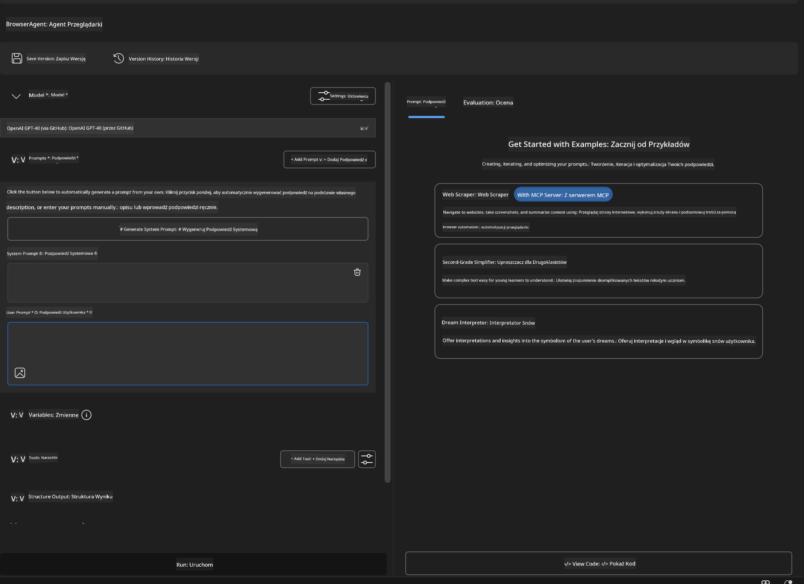
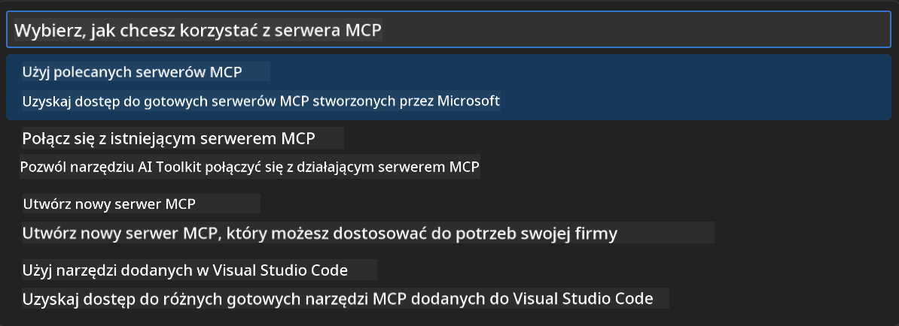
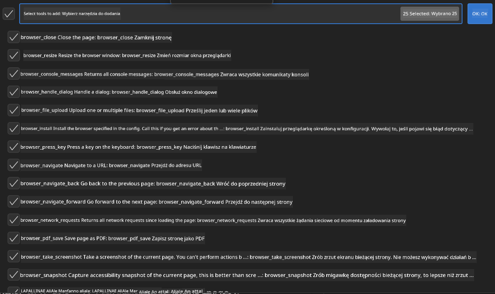
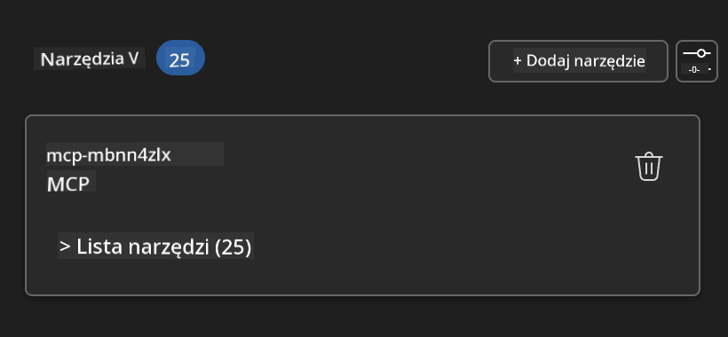
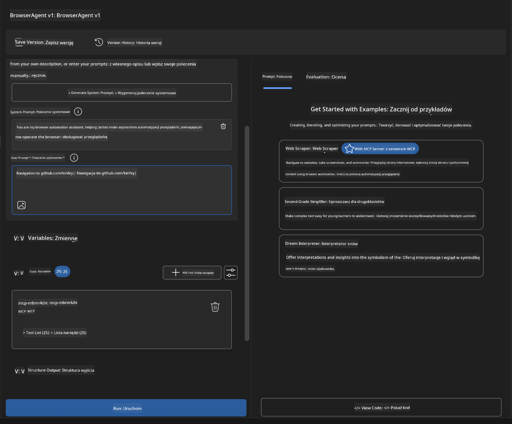
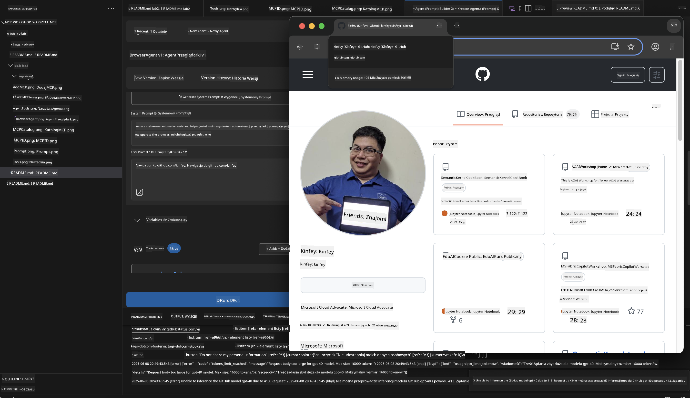
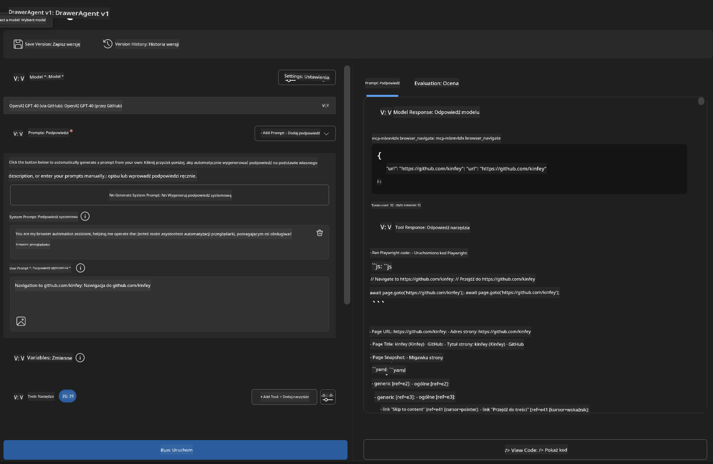
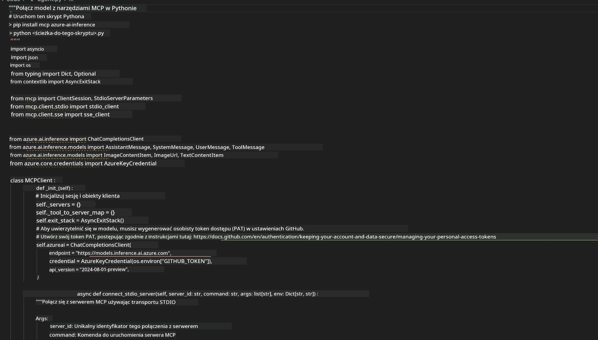

<!--
CO_OP_TRANSLATOR_METADATA:
{
  "original_hash": "a22b7dd11cd7690f99f9195877cafdc3",
  "translation_date": "2025-06-10T05:47:10+00:00",
  "source_file": "10-StreamliningAIWorkflowsBuildingAnMCPServerWithAIToolkit/lab2/README.md",
  "language_code": "pl"
}
-->
# 🌐 Moduł 2: Podstawy MCP z AI Toolkit

[]()
[]()
[]()

## 📋 Cele nauki

Po ukończeniu tego modułu będziesz potrafił:
- ✅ Zrozumieć architekturę i korzyści Model Context Protocol (MCP)
- ✅ Poznać ekosystem serwerów MCP Microsoftu
- ✅ Zintegrować serwery MCP z AI Toolkit Agent Builder
- ✅ Zbudować funkcjonalnego agenta do automatyzacji przeglądarki korzystając z Playwright MCP
- ✅ Skonfigurować i przetestować narzędzia MCP w swoich agentach
- ✅ Eksportować i wdrażać agentów opartych na MCP do użytku produkcyjnego

## 🎯 Kontynuacja po Module 1

W Module 1 opanowaliśmy podstawy AI Toolkit i stworzyliśmy naszego pierwszego agenta w Pythonie. Teraz **wzmocnimy** Twoich agentów, łącząc ich z zewnętrznymi narzędziami i usługami za pomocą rewolucyjnego **Model Context Protocol (MCP)**.

Pomyśl o tym jak o przejściu z prostego kalkulatora do pełnoprawnego komputera – Twoi agenci AI zyskają możliwość:
- 🌐 Przeglądania i interakcji ze stronami internetowymi
- 📁 Dostępu i manipulacji plikami
- 🔧 Integracji z systemami korporacyjnymi
- 📊 Przetwarzania danych w czasie rzeczywistym z API

## 🧠 Co to jest Model Context Protocol (MCP)?

### 🔍 Czym jest MCP?

Model Context Protocol (MCP) to **„USB-C dla aplikacji AI”** – rewolucyjny, otwarty standard łączący duże modele językowe (LLM) z zewnętrznymi narzędziami, źródłami danych i usługami. Tak jak USB-C wyeliminowało chaos z kablami, oferując jeden uniwersalny port, tak MCP upraszcza integrację AI dzięki jednolitemu protokołowi.

### 🎯 Problem, który rozwiązuje MCP

**Przed MCP:**
- 🔧 Indywidualne integracje dla każdego narzędzia
- 🔄 Uzależnienie od dostawców i rozwiązań własnościowych
- 🔒 Luki w bezpieczeństwie wynikające z ad-hoc połączeń
- ⏱️ Miesiące pracy nad podstawowymi integracjami

**Z MCP:**
- ⚡ Integracja narzędzi typu plug-and-play
- 🔄 Architektura niezależna od dostawcy
- 🛡️ Wbudowane najlepsze praktyki bezpieczeństwa
- 🚀 Minuty na dodanie nowych funkcji

### 🏗️ Architektura MCP – szczegóły

MCP opiera się na **architekturze klient-serwer**, tworząc bezpieczny i skalowalny ekosystem:

```mermaid
graph TB
    A[AI Application/Agent] --> B[MCP Client]
    B --> C[MCP Server 1: Files]
    B --> D[MCP Server 2: Web APIs]
    B --> E[MCP Server 3: Database]
    B --> F[MCP Server N: Custom Tools]
    
    C --> G[Local File System]
    D --> H[External APIs]
    E --> I[Database Systems]
    F --> J[Enterprise Systems]
```

**🔧 Kluczowe komponenty:**

| Komponent | Rola | Przykłady |
|-----------|------|-----------|
| **MCP Hosts** | Aplikacje korzystające z usług MCP | Claude Desktop, VS Code, AI Toolkit |
| **MCP Clients** | Obsługa protokołu (1:1 z serwerami) | Wbudowane w aplikacje hosta |
| **MCP Servers** | Udostępniają funkcje przez standardowy protokół | Playwright, Files, Azure, GitHub |
| **Warstwa transportowa** | Metody komunikacji | stdio, HTTP, WebSockets |

## 🏢 Ekosystem serwerów MCP Microsoftu

Microsoft przewodzi ekosystemowi MCP, oferując kompleksowy zestaw serwerów klasy enterprise, które odpowiadają na realne potrzeby biznesowe.

### 🌟 Najważniejsze serwery MCP Microsoftu

#### 1. ☁️ Azure MCP Server  
**🔗 Repozytorium**: [azure/azure-mcp](https://github.com/azure/azure-mcp)  
**🎯 Cel**: Kompleksowe zarządzanie zasobami Azure z integracją AI

**✨ Kluczowe funkcje:**
- Deklaratywne zarządzanie infrastrukturą
- Monitorowanie zasobów w czasie rzeczywistym
- Rekomendacje optymalizacji kosztów
- Sprawdzanie zgodności z politykami bezpieczeństwa

**🚀 Przykłady zastosowań:**
- Infrastructure-as-Code z pomocą AI
- Automatyczne skalowanie zasobów
- Optymalizacja kosztów chmury
- Automatyzacja procesów DevOps

#### 2. 📊 Microsoft Dataverse MCP  
**📚 Dokumentacja**: [Microsoft Dataverse Integration](https://go.microsoft.com/fwlink/?linkid=2320176)  
**🎯 Cel**: Interfejs w naturalnym języku do danych biznesowych

**✨ Kluczowe funkcje:**
- Zapytania do bazy danych w języku naturalnym
- Rozumienie kontekstu biznesowego
- Własne szablony promptów
- Zarządzanie danymi korporacyjnymi

**🚀 Przykłady zastosowań:**
- Raportowanie BI
- Analiza danych klientów
- Wgląd w pipeline sprzedaży
- Zapytania dotyczące zgodności

#### 3. 🌐 Playwright MCP Server  
**🔗 Repozytorium**: [microsoft/playwright-mcp](https://github.com/microsoft/playwright-mcp)  
**🎯 Cel**: Automatyzacja przeglądarki i interakcje webowe

**✨ Kluczowe funkcje:**
- Automatyzacja wieloprzeglądarkowa (Chrome, Firefox, Safari)
- Inteligentne wykrywanie elementów
- Generowanie zrzutów ekranu i PDF
- Monitorowanie ruchu sieciowego

**🚀 Przykłady zastosowań:**
- Automatyczne testowanie
- Web scraping i ekstrakcja danych
- Monitorowanie UI/UX
- Automatyzacja analizy konkurencji

#### 4. 📁 Files MCP Server  
**🔗 Repozytorium**: [microsoft/files-mcp-server](https://github.com/microsoft/files-mcp-server)  
**🎯 Cel**: Inteligentne operacje na systemie plików

**✨ Kluczowe funkcje:**
- Deklaratywne zarządzanie plikami
- Synchronizacja zawartości
- Integracja z kontrolą wersji
- Ekstrakcja metadanych

**🚀 Przykłady zastosowań:**
- Zarządzanie dokumentacją
- Organizacja repozytoriów kodu
- Workflow publikacji treści
- Obsługa plików w pipeline danych

#### 5. 📝 MarkItDown MCP Server  
**🔗 Repozytorium**: [microsoft/markitdown](https://github.com/microsoft/markitdown)  
**🎯 Cel**: Zaawansowane przetwarzanie i manipulacja Markdown

**✨ Kluczowe funkcje:**
- Zaawansowane parsowanie Markdown
- Konwersja formatów (MD ↔ HTML ↔ PDF)
- Analiza struktury treści
- Przetwarzanie szablonów

**🚀 Przykłady zastosowań:**
- Workflow dokumentacji technicznej
- Systemy zarządzania treścią
- Generowanie raportów
- Automatyzacja baz wiedzy

#### 6. 📈 Clarity MCP Server  
**📦 Pakiet**: [@microsoft/clarity-mcp-server](https://www.npmjs.com/package/@microsoft/clarity-mcp-server)  
**🎯 Cel**: Analiza webowa i zachowania użytkowników

**✨ Kluczowe funkcje:**
- Analiza map cieplnych
- Nagrywanie sesji użytkowników
- Metryki wydajności
- Analiza lejkowa konwersji

**🚀 Przykłady zastosowań:**
- Optymalizacja stron www
- Badania UX
- Analiza testów A/B
- Dashboardy BI

### 🌍 Ekosystem społeczności

Poza serwerami Microsoftu, ekosystem MCP obejmuje:
- **🐙 GitHub MCP**: Zarządzanie repozytoriami i analiza kodu
- **🗄️ MCP dla baz danych**: Integracje z PostgreSQL, MySQL, MongoDB
- **☁️ MCP dostawców chmury**: Narzędzia AWS, GCP, Digital Ocean
- **📧 MCP komunikacji**: Integracje Slack, Teams, Email

## 🛠️ Laboratorium: Budowa agenta automatyzacji przeglądarki

**🎯 Cel projektu**: Stwórz inteligentnego agenta do automatyzacji przeglądarki korzystającego z Playwright MCP, który będzie nawigował po stronach, wyciągał informacje i wykonywał złożone interakcje webowe.

### 🚀 Faza 1: Przygotowanie podstaw agenta

#### Krok 1: Inicjalizacja agenta
1. **Otwórz AI Toolkit Agent Builder**  
2. **Utwórz nowego agenta** z następującą konfiguracją:  
   - **Nazwa**: `BrowserAgent`
   - **Model**: Choose GPT-4o 




### 🔧 Phase 2: MCP Integration Workflow

#### Step 3: Add MCP Server Integration
1. **Navigate to Tools Section** in Agent Builder
2. **Click "Add Tool"** to open the integration menu
3. **Select "MCP Server"** from available options


**🔍 Understanding Tool Types:**
- **Built-in Tools**: Pre-configured AI Toolkit functions
- **MCP Servers**: External service integrations
- **Custom APIs**: Your own service endpoints
- **Function Calling**: Direct model function access

#### Step 4: MCP Server Selection
1. **Choose "MCP Server"** option to proceed


2. **Browse MCP Catalog** to explore available integrations



### 🎮 Phase 3: Playwright MCP Configuration

#### Step 5: Select and Configure Playwright
1. **Click "Use Featured MCP Servers"** to access Microsoft's verified servers
2. **Select "Playwright"** from the featured list
3. **Accept Default MCP ID** or customize for your environment


#### Step 6: Enable Playwright Capabilities
**🔑 Critical Step**: Select **ALL** available Playwright methods for maximum functionality



**🛠️ Essential Playwright Tools:**
- **Navigation**: `goto`, `goBack`, `goForward`, `reload`
- **Interaction**: `click`, `fill`, `press`, `hover`, `drag`
- **Extraction**: `textContent`, `innerHTML`, `getAttribute`
- **Validation**: `isVisible`, `isEnabled`, `waitForSelector`
- **Capture**: `screenshot`, `pdf`, `video`
- **Network**: `setExtraHTTPHeaders`, `route`, `waitForResponse`

#### Krok 7: Weryfikacja poprawności integracji  
**✅ Wskaźniki sukcesu:**  
- Wszystkie narzędzia widoczne w interfejsie Agent Buildera  
- Brak komunikatów o błędach w panelu integracji  
- Status serwera Playwright pokazuje „Connected”



**🔧 Rozwiązywanie typowych problemów:**  
- **Nieudane połączenie**: Sprawdź połączenie internetowe i ustawienia zapory  
- **Brak narzędzi**: Upewnij się, że wszystkie funkcjonalności zostały wybrane podczas konfiguracji  
- **Błędy uprawnień**: Zweryfikuj, czy VS Code ma odpowiednie uprawnienia systemowe

### 🎯 Faza 4: Zaawansowane projektowanie promptów

#### Krok 8: Tworzenie inteligentnych promptów systemowych  
Stwórz zaawansowane prompty wykorzystujące pełne możliwości Playwright:

```markdown
# Web Automation Expert System Prompt

## Core Identity
You are an advanced web automation specialist with deep expertise in browser automation, web scraping, and user experience analysis. You have access to Playwright tools for comprehensive browser control.

## Capabilities & Approach
### Navigation Strategy
- Always start with screenshots to understand page layout
- Use semantic selectors (text content, labels) when possible
- Implement wait strategies for dynamic content
- Handle single-page applications (SPAs) effectively

### Error Handling
- Retry failed operations with exponential backoff
- Provide clear error descriptions and solutions
- Suggest alternative approaches when primary methods fail
- Always capture diagnostic screenshots on errors

### Data Extraction
- Extract structured data in JSON format when possible
- Provide confidence scores for extracted information
- Validate data completeness and accuracy
- Handle pagination and infinite scroll scenarios

### Reporting
- Include step-by-step execution logs
- Provide before/after screenshots for verification
- Suggest optimizations and alternative approaches
- Document any limitations or edge cases encountered

## Ethical Guidelines
- Respect robots.txt and rate limiting
- Avoid overloading target servers
- Only extract publicly available information
- Follow website terms of service
```

#### Krok 9: Tworzenie dynamicznych promptów użytkownika  
Zaprojektuj prompty pokazujące różne funkcje:

**🌐 Przykład analizy stron internetowych:**  
```markdown
Navigate to github.com/kinfey and provide a comprehensive analysis including:
1. Repository structure and organization
2. Recent activity and contribution patterns  
3. Documentation quality assessment
4. Technology stack identification
5. Community engagement metrics
6. Notable projects and their purposes

Include screenshots at key steps and provide actionable insights.
```



### 🚀 Faza 5: Uruchomienie i testowanie

#### Krok 10: Uruchom pierwszą automatyzację  
1. **Kliknij „Run”**, aby rozpocząć sekwencję automatyzacji  
2. **Monitoruj wykonanie w czasie rzeczywistym**:  
   - Przeglądarka Chrome uruchamia się automatycznie  
   - Agent nawiguję do docelowej strony  
   - Zrzuty ekranu dokumentują każdy ważny krok  
   - Wyniki analizy pojawiają się na bieżąco



#### Krok 11: Analiza wyników i wniosków  
Przejrzyj szczegółowe wyniki w interfejsie Agent Buildera:



### 🌟 Faza 6: Zaawansowane funkcje i wdrożenie

#### Krok 12: Eksport i wdrożenie produkcyjne  
Agent Builder oferuje różne opcje wdrożenia:



## 🎓 Podsumowanie Modułu 2 i kolejne kroki

### 🏆 Osiągnięcie: Mistrz Integracji MCP

**✅ Opanowane umiejętności:**  
- [ ] Zrozumienie architektury i korzyści MCP  
- [ ] Poruszanie się po ekosystemie serwerów MCP Microsoftu  
- [ ] Integracja Playwright MCP z AI Toolkit  
- [ ] Budowa zaawansowanych agentów automatyzacji przeglądarki  
- [ ] Zaawansowane projektowanie promptów do automatyzacji webowej

### 📚 Dodatkowe materiały

- **🔗 Specyfikacja MCP**: [Oficjalna dokumentacja protokołu](https://modelcontextprotocol.io/)  
- **🛠️ Playwright API**: [Pełna referencja metod](https://playwright.dev/docs/api/class-playwright)  
- **🏢 Serwery MCP Microsoftu**: [Przewodnik integracji enterprise](https://github.com/microsoft/mcp-servers)  
- **🌍 Przykłady społeczności**: [Galeria serwerów MCP](https://github.com/modelcontextprotocol/servers)

**🎉 Gratulacje!** Opanowałeś integrację MCP i możesz teraz tworzyć produkcyjne agentów AI z wykorzystaniem zewnętrznych narzędzi!

### 🔜 Przejdź do kolejnego modułu

Chcesz podnieść swoje umiejętności MCP na wyższy poziom? Przejdź do **[Modułu 3: Zaawansowany rozwój MCP z AI Toolkit](../lab3/README.md)**, gdzie nauczysz się:  
- Tworzyć własne niestandardowe serwery MCP  
- Konfigurować i korzystać z najnowszego MCP Python SDK  
- Ustawiać MCP Inspector do debugowania  
- Opanować zaawansowane workflow rozwoju serwerów MCP  
- Budować własny Weather MCP Server od podstaw

**Zastrzeżenie**:  
Niniejszy dokument został przetłumaczony przy użyciu automatycznej usługi tłumaczeniowej AI [Co-op Translator](https://github.com/Azure/co-op-translator). Mimo że dokładamy starań, aby tłumaczenie było jak najbardziej precyzyjne, prosimy pamiętać, że automatyczne tłumaczenia mogą zawierać błędy lub nieścisłości. Oryginalny dokument w języku źródłowym powinien być uznawany za źródło autorytatywne. W przypadku informacji o krytycznym znaczeniu zaleca się skorzystanie z profesjonalnego tłumaczenia wykonanego przez człowieka. Nie ponosimy odpowiedzialności za jakiekolwiek nieporozumienia lub błędne interpretacje wynikające z użycia tego tłumaczenia.