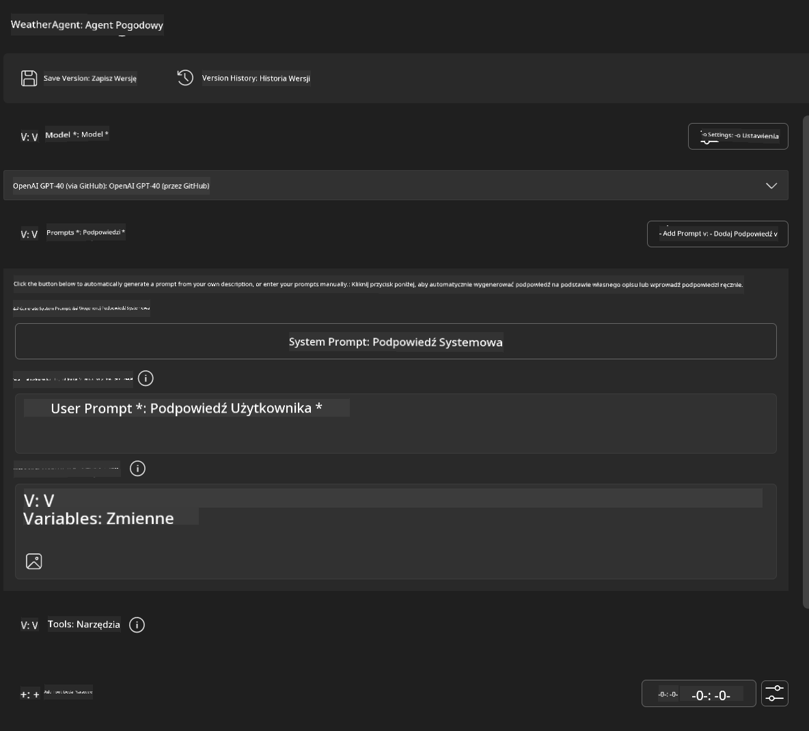
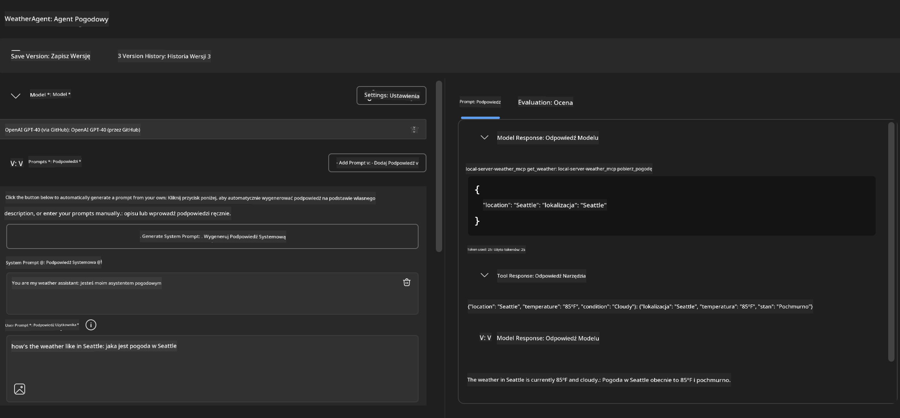
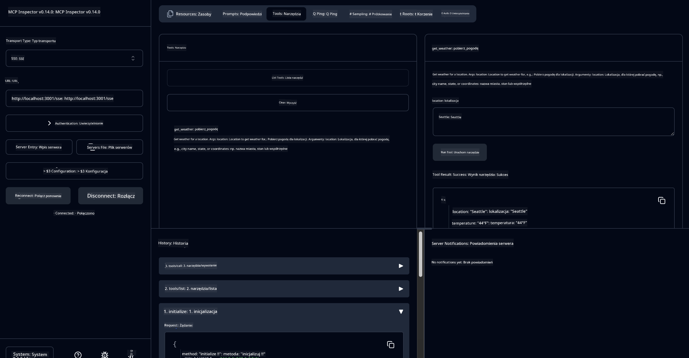

<!--
CO_OP_TRANSLATOR_METADATA:
{
  "original_hash": "dd8da3f75addcef453fe11f02a270217",
  "translation_date": "2025-06-10T06:10:27+00:00",
  "source_file": "10-StreamliningAIWorkflowsBuildingAnMCPServerWithAIToolkit/lab3/README.md",
  "language_code": "pl"
}
-->
# 🔧 Moduł 3: Zaawansowany rozwój MCP z AI Toolkit


## 🎯 Cele nauki

Pod koniec tego laboratorium będziesz potrafił:

- ✅ Tworzyć własne serwery MCP z wykorzystaniem AI Toolkit
- ✅ Konfigurować i używać najnowszego MCP Python SDK (v1.9.3)
- ✅ Uruchamiać i wykorzystywać MCP Inspector do debugowania
- ✅ Debugować serwery MCP zarówno w Agent Builder, jak i w Inspector
- ✅ Zrozumieć zaawansowane procesy tworzenia serwerów MCP

## 📋 Wymagania wstępne

- Ukończenie Laboratorium 2 (Podstawy MCP)
- VS Code z zainstalowanym rozszerzeniem AI Toolkit
- Środowisko Python 3.10+
- Node.js i npm do konfiguracji Inspector

## 🏗️ Co zbudujesz

W tym laboratorium stworzysz **Weather MCP Server**, który pokaże:
- Własną implementację serwera MCP
- Integrację z AI Toolkit Agent Builder
- Profesjonalne procesy debugowania
- Nowoczesne wzorce użycia MCP SDK

---

## 🔧 Przegląd kluczowych komponentów

### 🐍 MCP Python SDK
Pythonowe SDK Model Context Protocol stanowi fundament do tworzenia własnych serwerów MCP. Będziesz korzystać z wersji 1.9.3 z rozszerzonymi możliwościami debugowania.

### 🔍 MCP Inspector
Potężne narzędzie do debugowania, które oferuje:
- Monitorowanie serwera w czasie rzeczywistym
- Wizualizację wykonania narzędzi
- Inspekcję zapytań i odpowiedzi sieciowych
- Interaktywne środowisko testowe

---

## 📖 Implementacja krok po kroku

### Krok 1: Utwórz WeatherAgent w Agent Builder

1. **Uruchom Agent Builder** w VS Code przez rozszerzenie AI Toolkit
2. **Stwórz nowego agenta** z następującą konfiguracją:
   - Nazwa agenta: `WeatherAgent`



### Krok 2: Zainicjuj projekt serwera MCP

1. **Przejdź do Tools** → **Add Tool** w Agent Builder
2. **Wybierz "MCP Server"** z dostępnych opcji
3. **Wybierz "Create A new MCP Server"**
4. **Wybierz szablon `python-weather`**
5. **Nadaj nazwę swojemu serwerowi:** `weather_mcp`


### Krok 3: Otwórz i przeanalizuj projekt

1. **Otwórz wygenerowany projekt** w VS Code
2. **Przejrzyj strukturę projektu:**
   ```
   weather_mcp/
   ├── src/
   │   ├── __init__.py
   │   └── server.py
   ├── inspector/
   │   ├── package.json
   │   └── package-lock.json
   ├── .vscode/
   │   ├── launch.json
   │   └── tasks.json
   ├── pyproject.toml
   └── README.md
   ```

### Krok 4: Zaktualizuj MCP SDK do najnowszej wersji

> **🔍 Dlaczego aktualizacja?** Chcemy korzystać z najnowszego MCP SDK (v1.9.3) oraz usługi Inspector (0.14.0) dla lepszych funkcji i możliwości debugowania.

#### 4a. Aktualizacja zależności Pythona

**Edytuj `pyproject.toml`:** update [./code/weather_mcp/pyproject.toml](../../../../10-StreamliningAIWorkflowsBuildingAnMCPServerWithAIToolkit/lab3/code/weather_mcp/pyproject.toml)


#### 4b. Update Inspector Configuration

**Edit `inspector/package.json`:** update [./code/weather_mcp/inspector/package.json](../../../../10-StreamliningAIWorkflowsBuildingAnMCPServerWithAIToolkit/lab3/code/weather_mcp/inspector/package.json)

#### 4c. Update Inspector Dependencies

**Edit `inspector/package-lock.json`:** update [./code/weather_mcp/inspector/package-lock.json](../../../../10-StreamliningAIWorkflowsBuildingAnMCPServerWithAIToolkit/lab3/code/weather_mcp/inspector/package-lock.json)

> **📝 Note:** This file contains extensive dependency definitions. Below is the essential structure - the full content ensures proper dependency resolution.


> **⚡ Full Package Lock:** The complete package-lock.json contains ~3000 lines of dependency definitions. The above shows the key structure - use the provided file for complete dependency resolution.

### Step 5: Configure VS Code Debugging

*Note: Please copy the file in the specified path to replace the corresponding local file*

#### 5a. Update Launch Configuration

**Edit `.vscode/launch.json`:**

```json
{
  "version": "0.2.0",
  "configurations": [
    {
      "name": "Attach to Local MCP",
      "type": "debugpy",
      "request": "attach",
      "connect": {
        "host": "localhost",
        "port": 5678
      },
      "presentation": {
        "hidden": true
      },
      "internalConsoleOptions": "neverOpen",
      "postDebugTask": "Terminate All Tasks"
    },
    {
      "name": "Launch Inspector (Edge)",
      "type": "msedge",
      "request": "launch",
      "url": "http://localhost:6274?timeout=60000&serverUrl=http://localhost:3001/sse#tools",
      "cascadeTerminateToConfigurations": [
        "Attach to Local MCP"
      ],
      "presentation": {
        "hidden": true
      },
      "internalConsoleOptions": "neverOpen"
    },
    {
      "name": "Launch Inspector (Chrome)",
      "type": "chrome",
      "request": "launch",
      "url": "http://localhost:6274?timeout=60000&serverUrl=http://localhost:3001/sse#tools",
      "cascadeTerminateToConfigurations": [
        "Attach to Local MCP"
      ],
      "presentation": {
        "hidden": true
      },
      "internalConsoleOptions": "neverOpen"
    }
  ],
  "compounds": [
    {
      "name": "Debug in Agent Builder",
      "configurations": [
        "Attach to Local MCP"
      ],
      "preLaunchTask": "Open Agent Builder",
    },
    {
      "name": "Debug in Inspector (Edge)",
      "configurations": [
        "Launch Inspector (Edge)",
        "Attach to Local MCP"
      ],
      "preLaunchTask": "Start MCP Inspector",
      "stopAll": true
    },
    {
      "name": "Debug in Inspector (Chrome)",
      "configurations": [
        "Launch Inspector (Chrome)",
        "Attach to Local MCP"
      ],
      "preLaunchTask": "Start MCP Inspector",
      "stopAll": true
    }
  ]
}
```

**Edytuj `.vscode/tasks.json`:**

```
{
  "version": "2.0.0",
  "tasks": [
    {
      "label": "Start MCP Server",
      "type": "shell",
      "command": "python -m debugpy --listen 127.0.0.1:5678 src/__init__.py sse",
      "isBackground": true,
      "options": {
        "cwd": "${workspaceFolder}",
        "env": {
          "PORT": "3001"
        }
      },
      "problemMatcher": {
        "pattern": [
          {
            "regexp": "^.*$",
            "file": 0,
            "location": 1,
            "message": 2
          }
        ],
        "background": {
          "activeOnStart": true,
          "beginsPattern": ".*",
          "endsPattern": "Application startup complete|running"
        }
      }
    },
    {
      "label": "Start MCP Inspector",
      "type": "shell",
      "command": "npm run dev:inspector",
      "isBackground": true,
      "options": {
        "cwd": "${workspaceFolder}/inspector",
        "env": {
          "CLIENT_PORT": "6274",
          "SERVER_PORT": "6277",
        }
      },
      "problemMatcher": {
        "pattern": [
          {
            "regexp": "^.*$",
            "file": 0,
            "location": 1,
            "message": 2
          }
        ],
        "background": {
          "activeOnStart": true,
          "beginsPattern": "Starting MCP inspector",
          "endsPattern": "Proxy server listening on port"
        }
      },
      "dependsOn": [
        "Start MCP Server"
      ]
    },
    {
      "label": "Open Agent Builder",
      "type": "shell",
      "command": "echo ${input:openAgentBuilder}",
      "presentation": {
        "reveal": "never"
      },
      "dependsOn": [
        "Start MCP Server"
      ],
    },
    {
      "label": "Terminate All Tasks",
      "command": "echo ${input:terminate}",
      "type": "shell",
      "problemMatcher": []
    }
  ],
  "inputs": [
    {
      "id": "openAgentBuilder",
      "type": "command",
      "command": "ai-mlstudio.agentBuilder",
      "args": {
        "initialMCPs": [ "local-server-weather_mcp" ],
        "triggeredFrom": "vsc-tasks"
      }
    },
    {
      "id": "terminate",
      "type": "command",
      "command": "workbench.action.tasks.terminate",
      "args": "terminateAll"
    }
  ]
}
```

---

## 🚀 Uruchamianie i testowanie serwera MCP

### Krok 6: Instalacja zależności

Po dokonaniu zmian konfiguracyjnych uruchom następujące polecenia:

**Instalacja zależności Pythona:**
```bash
uv sync
```

**Instalacja zależności Inspector:**
```bash
cd inspector
npm install
```

### Krok 7: Debugowanie w Agent Builder

1. **Naciśnij F5** lub wybierz konfigurację **"Debug in Agent Builder"**
2. **Wybierz konfigurację compound** w panelu debugowania
3. **Poczekaj na uruchomienie serwera** i otwarcie Agent Builder
4. **Testuj swój serwer weather MCP** za pomocą zapytań w naturalnym języku

Wprowadź zapytanie takie jak poniżej

SYSTEM_PROMPT

```
You are my weather assistant
```

USER_PROMPT

```
How's the weather like in Seattle
```



### Krok 8: Debugowanie w MCP Inspector

1. **Użyj konfiguracji "Debug in Inspector"** (Edge lub Chrome)
2. **Otwórz interfejs Inspector** pod adresem `http://localhost:6274`
3. **Poznaj interaktywne środowisko testowe:**
   - Przeglądaj dostępne narzędzia
   - Testuj wykonanie narzędzi
   - Monitoruj zapytania sieciowe
   - Debuguj odpowiedzi serwera



---

## 🎯 Kluczowe efekty nauki

Ukończenie tego laboratorium pozwoliło Ci:

- [x] **Stworzyć własny serwer MCP** korzystając z szablonów AI Toolkit
- [x] **Zaktualizować MCP SDK do najnowszej wersji** (v1.9.3) dla lepszej funkcjonalności
- [x] **Skonfigurować profesjonalne procesy debugowania** zarówno w Agent Builder, jak i Inspector
- [x] **Uruchomić MCP Inspector** do interaktywnych testów serwera
- [x] **Opanować konfiguracje debugowania w VS Code** dla rozwoju MCP

## 🔧 Zaawansowane funkcje omówione

| Funkcja | Opis | Przykład zastosowania |
|---------|-------|----------------------|
| **MCP Python SDK v1.9.3** | Najnowsza implementacja protokołu | Nowoczesny rozwój serwera |
| **MCP Inspector 0.14.0** | Interaktywne narzędzie do debugowania | Testowanie serwera w czasie rzeczywistym |
| **Debugowanie w VS Code** | Zintegrowane środowisko programistyczne | Profesjonalny workflow debugowania |
| **Integracja z Agent Builder** | Bezpośrednie połączenie z AI Toolkit | Kompleksowe testowanie agenta |

## 📚 Dodatkowe materiały

- [MCP Python SDK Documentation](https://modelcontextprotocol.io/docs/sdk/python)
- [AI Toolkit Extension Guide](https://code.visualstudio.com/docs/ai/ai-toolkit)
- [VS Code Debugging Documentation](https://code.visualstudio.com/docs/editor/debugging)
- [Model Context Protocol Specification](https://modelcontextprotocol.io/docs/concepts/architecture)

---

**🎉 Gratulacje!** Ukończyłeś Laboratorium 3 i teraz potrafisz tworzyć, debugować oraz wdrażać własne serwery MCP korzystając z profesjonalnych procesów rozwojowych.

### 🔜 Przejdź do następnego modułu

Gotowy, by wykorzystać swoje umiejętności MCP w praktycznym workflow? Kontynuuj do **[Modułu 4: Praktyczny rozwój MCP - własny serwer klonujący GitHub](../lab4/README.md)**, gdzie:
- Zbudujesz produkcyjny serwer MCP automatyzujący operacje na repozytoriach GitHub
- Wdrożysz funkcję klonowania repozytoriów GitHub przez MCP
- Zintegrujesz własne serwery MCP z VS Code i trybem GitHub Copilot Agent
- Przetestujesz i wdrożysz serwery MCP w środowisku produkcyjnym
- Nauczysz się praktycznej automatyzacji procesów dla programistów

**Zastrzeżenie**:  
Niniejszy dokument został przetłumaczony za pomocą usługi tłumaczenia AI [Co-op Translator](https://github.com/Azure/co-op-translator). Mimo że dążymy do dokładności, prosimy pamiętać, że automatyczne tłumaczenia mogą zawierać błędy lub niedokładności. Oryginalny dokument w języku źródłowym należy traktować jako autorytatywne źródło. W przypadku informacji krytycznych zaleca się skorzystanie z profesjonalnego tłumaczenia wykonanego przez człowieka. Nie ponosimy odpowiedzialności za jakiekolwiek nieporozumienia lub błędne interpretacje wynikające z korzystania z tego tłumaczenia.