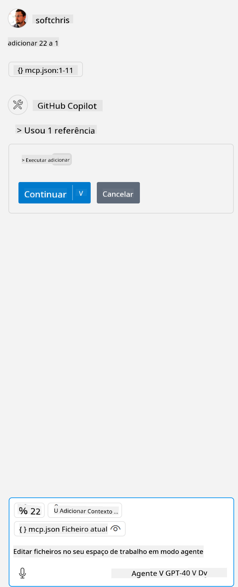

<!--
CO_OP_TRANSLATOR_METADATA:
{
  "original_hash": "0eb9557780cd0a2551cdb8a16c886b51",
  "translation_date": "2025-06-17T15:39:32+00:00",
  "source_file": "03-GettingStarted/04-vscode/README.md",
  "language_code": "pt"
}
-->
Vamos falar mais sobre como usar a interface visual nas próximas secções.

## Abordagem

Aqui está como devemos abordar isto a alto nível:

- Configurar um ficheiro para localizar o nosso MCP Server.
- Iniciar/Conectar ao servidor para que este liste as suas capacidades.
- Usar essas capacidades através da interface do GitHub Copilot Chat.

Ótimo, agora que entendemos o fluxo, vamos tentar usar um MCP Server através do Visual Studio Code num exercício.

## Exercício: Consumir um servidor

Neste exercício, vamos configurar o Visual Studio Code para encontrar o seu MCP server de modo a que possa ser usado na interface do GitHub Copilot Chat.

### -0- Passo prévio, ativar a descoberta de MCP Server

Pode ser necessário ativar a descoberta de MCP Servers.

1. Vá a `File -> Preferences -> Settings` in Visual Studio Code.

1. Search for "MCP" and enable `chat.mcp.discovery.enabled` no ficheiro settings.json.

### -1- Criar ficheiro de configuração

Comece por criar um ficheiro de configuração na raiz do seu projeto, precisará de um ficheiro chamado MCP.json colocado numa pasta chamada .vscode. Deve ficar assim:

```text
.vscode
|-- mcp.json
```

De seguida, vamos ver como adicionar uma entrada de servidor.

### -2- Configurar um servidor

Adicione o seguinte conteúdo ao *mcp.json*:

```json
{
    "inputs": [],
    "servers": {
       "hello-mcp": {
           "command": "node",
           "args": [
               "build/index.js"
           ]
       }
    }
}
```

Aqui está um exemplo simples de como iniciar um servidor escrito em Node.js, para outras plataformas indique o comando correto para iniciar o servidor usando `command` and `args`.

### -3- Iniciar o servidor

Agora que adicionou uma entrada, vamos iniciar o servidor:

1. Localize a sua entrada em *mcp.json* e certifique-se que encontra o ícone "play":

    

1. Clique no ícone "play", deverá ver o ícone de ferramentas no GitHub Copilot Chat aumentar o número de ferramentas disponíveis. Se clicar nesse ícone, verá uma lista das ferramentas registadas. Pode assinalar ou desassinalar cada ferramenta conforme desejar que o GitHub Copilot as use como contexto:

  

1. Para executar uma ferramenta, escreva um prompt que saiba que corresponde à descrição de uma das suas ferramentas, por exemplo um prompt como "add 22 to 1":

  

  Deve ver uma resposta indicando 23.

## Tarefa

Tente adicionar uma entrada de servidor ao seu ficheiro *mcp.json* e certifique-se que consegue iniciar/parar o servidor. Garanta também que consegue comunicar com as ferramentas no seu servidor via interface do GitHub Copilot Chat.

## Solução

[Solução](./solution/README.md)

## Pontos-Chave

Os principais pontos deste capítulo são:

- O Visual Studio Code é um excelente cliente que permite consumir vários MCP Servers e as suas ferramentas.
- A interface do GitHub Copilot Chat é como interage com os servidores.
- Pode solicitar ao utilizador inputs como chaves API que podem ser passadas ao MCP Server ao configurar a entrada do servidor no ficheiro *mcp.json*.

## Exemplos

- [Calculadora Java](../samples/java/calculator/README.md)
- [Calculadora .Net](../../../../03-GettingStarted/samples/csharp)
- [Calculadora JavaScript](../samples/javascript/README.md)
- [Calculadora TypeScript](../samples/typescript/README.md)
- [Calculadora Python](../../../../03-GettingStarted/samples/python)

## Recursos Adicionais

- [Documentação Visual Studio](https://code.visualstudio.com/docs/copilot/chat/mcp-servers)

## O que vem a seguir

- Seguinte: [Criar um Servidor SSE](/03-GettingStarted/05-sse-server/README.md)

**Aviso Legal**:  
Este documento foi traduzido utilizando o serviço de tradução automática [Co-op Translator](https://github.com/Azure/co-op-translator). Embora nos esforcemos pela precisão, por favor tenha em conta que traduções automáticas podem conter erros ou imprecisões. O documento original na sua língua nativa deve ser considerado a fonte oficial. Para informações críticas, recomenda-se a tradução profissional humana. Não nos responsabilizamos por quaisquer mal-entendidos ou interpretações incorretas decorrentes da utilização desta tradução.