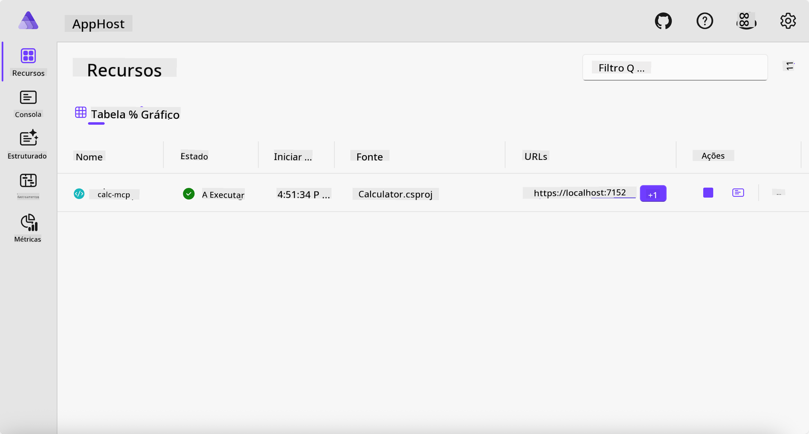

<!--
CO_OP_TRANSLATOR_METADATA:
{
  "original_hash": "0bc7bd48f55f1565f1d95ccb2c16f728",
  "translation_date": "2025-06-18T07:49:19+00:00",
  "source_file": "04-PracticalImplementation/samples/csharp/README.md",
  "language_code": "pt"
}
-->
# Exemplo

O exemplo anterior mostra como usar um projeto local .NET com o tipo `stdio`. E como executar o servidor localmente num contentor. Esta é uma boa solução em muitas situações. No entanto, pode ser útil ter o servidor a correr remotamente, como num ambiente de cloud. É aqui que entra o tipo `http`.

Ao olhar para a solução na pasta `04-PracticalImplementation`, pode parecer muito mais complexa do que a anterior. Mas, na realidade, não é. Se olhar de perto para o projeto `src/Calculator`, verá que é, na sua maioria, o mesmo código do exemplo anterior. A única diferença é que estamos a usar uma biblioteca diferente `ModelContextProtocol.AspNetCore` para tratar os pedidos HTTP. E alterámos o método `IsPrime` para torná-lo privado, só para mostrar que pode ter métodos privados no seu código. O resto do código é igual ao anterior.

Os outros projetos são do [.NET Aspire](https://learn.microsoft.com/dotnet/aspire/get-started/aspire-overview). Ter o .NET Aspire na solução melhora a experiência do programador durante o desenvolvimento e testes e ajuda na observabilidade. Não é obrigatório para correr o servidor, mas é uma boa prática tê-lo na sua solução.

## Iniciar o servidor localmente

1. No VS Code (com a extensão C# DevKit), navegue até à diretoria `04-PracticalImplementation/samples/csharp`.
1. Execute o seguinte comando para iniciar o servidor:

   ```bash
    dotnet watch run --project ./src/AppHost
   ```

1. Quando um navegador abrir o dashboard do .NET Aspire, repare na URL `http`. Deve ser algo como `http://localhost:5058/`.

   

## Testar Streamable HTTP com o MCP Inspector

Se tiver o Node.js 22.7.5 ou superior, pode usar o MCP Inspector para testar o seu servidor.

Inicie o servidor e execute o seguinte comando num terminal:

```bash
npx @modelcontextprotocol/inspector http://localhost:5058
```


- Selecione o `Streamable HTTP` as the Transport type.
- In the Url field, enter the URL of the server noted earlier, and append `/mcp`. Deve ser `http` (não `https`) something like `http://localhost:5058/mcp`.
- select the Connect button.

A nice thing about the Inspector is that it provide a nice visibility on what is happening.

- Try listing the available tools
- Try some of them, it should works just like before.

## Test MCP Server with GitHub Copilot Chat in VS Code

To use the Streamable HTTP transport with GitHub Copilot Chat, change the configuration of the `calc-mcp`) servidor criado anteriormente para ficar assim:

```jsonc
// .vscode/mcp.json
{
  "servers": {
    "calc-mcp": {
      "type": "http",
      "url": "http://localhost:5058/mcp"
    }
  }
}
```

Faça alguns testes:

- Peça "3 números primos depois de 6780". Repare como o Copilot vai usar as novas ferramentas `NextFivePrimeNumbers` e só devolve os primeiros 3 números primos.
- Peça "7 números primos depois de 111", para ver o que acontece.
- Peça "O John tem 24 rebuçados e quer distribuí-los pelos seus 3 filhos. Quantos rebuçados tem cada filho?", para ver o que acontece.

## Fazer deploy do servidor para o Azure

Vamos fazer o deploy do servidor para o Azure para que mais pessoas possam usá-lo.

Numa linha de comandos, navegue até à pasta `04-PracticalImplementation/samples/csharp` e execute o seguinte comando:

```bash
azd up
```

Quando o deploy terminar, deverá ver uma mensagem como esta:


Copie a URL e use-a no MCP Inspector e no GitHub Copilot Chat.

```jsonc
// .vscode/mcp.json
{
  "servers": {
    "calc-mcp": {
      "type": "http",
      "url": "https://calc-mcp.gentleriver-3977fbcf.australiaeast.azurecontainerapps.io/mcp"
    }
  }
}
```

## E agora?

Experimentámos diferentes tipos de transporte e ferramentas de teste. Também fizemos o deploy do seu servidor MCP para o Azure. Mas e se o nosso servidor precisar de aceder a recursos privados? Por exemplo, uma base de dados ou uma API privada? No próximo capítulo, veremos como podemos melhorar a segurança do nosso servidor.

**Aviso Legal**:  
Este documento foi traduzido utilizando o serviço de tradução automática [Co-op Translator](https://github.com/Azure/co-op-translator). Embora nos esforcemos pela precisão, por favor tenha em atenção que traduções automáticas podem conter erros ou imprecisões. O documento original na sua língua nativa deve ser considerado a fonte autorizada. Para informações críticas, recomenda-se tradução profissional humana. Não nos responsabilizamos por quaisquer mal-entendidos ou interpretações incorretas resultantes da utilização desta tradução.