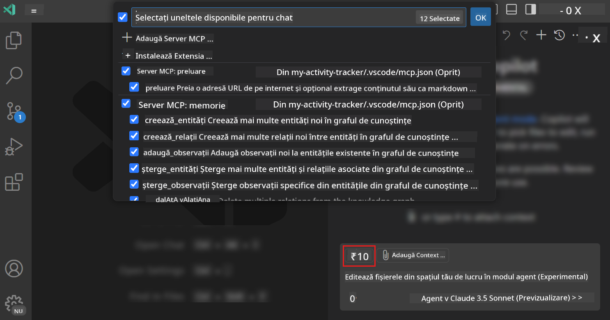
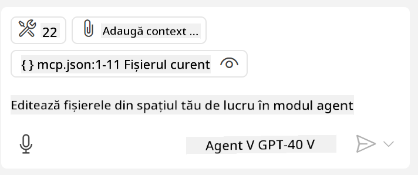

<!--
CO_OP_TRANSLATOR_METADATA:
{
  "original_hash": "8ea28e5e566edd5969337fd0b191ba3f",
  "translation_date": "2025-07-17T11:19:28+00:00",
  "source_file": "03-GettingStarted/04-vscode/README.md",
  "language_code": "ro"
}
-->
# Consumarea unui server din modul Agent GitHub Copilot

Visual Studio Code și GitHub Copilot pot funcționa ca un client și pot consuma un MCP Server. Te întrebi de ce am vrea să facem asta? Ei bine, asta înseamnă că orice funcționalitate are MCP Server poate fi folosită acum direct din IDE-ul tău. Imaginează-ți că adaugi, de exemplu, serverul MCP de la GitHub, ceea ce ar permite controlul GitHub prin comenzi naturale, în loc să tastezi comenzi specifice în terminal. Sau imaginează-ți orice altceva care ar putea îmbunătăți experiența ta de dezvoltator, toate controlate prin limbaj natural. Acum începi să vezi avantajul, nu?

## Prezentare generală

Această lecție explică cum să folosești Visual Studio Code și modul Agent al GitHub Copilot ca un client pentru MCP Server-ul tău.

## Obiective de învățare

La finalul acestei lecții, vei putea:

- Să consumi un MCP Server prin Visual Studio Code.
- Să rulezi capabilități precum unelte prin GitHub Copilot.
- Să configurezi Visual Studio Code pentru a găsi și gestiona MCP Server-ul tău.

## Utilizare

Poți controla serverul MCP în două moduri diferite:

- Interfață grafică, vei vedea cum se face acest lucru mai târziu în acest capitol.
- Terminal, este posibil să controlezi lucrurile din terminal folosind executabilul `code`:

  Pentru a adăuga un MCP server în profilul tău de utilizator, folosește opțiunea de linie de comandă --add-mcp și oferă configurația serverului în format JSON de forma {\"name\":\"server-name\",\"command\":...}.

  ```
  code --add-mcp "{\"name\":\"my-server\",\"command\": \"uvx\",\"args\": [\"mcp-server-fetch\"]}"
  ```

### Capturi de ecran





Să discutăm mai mult despre cum folosim interfața vizuală în secțiunile următoare.

## Abordare

Iată cum trebuie să abordăm acest proces la nivel înalt:

- Configurează un fișier pentru a găsi MCP Server-ul.
- Pornește/Conectează-te la serverul respectiv pentru a-i lista capabilitățile.
- Folosește aceste capabilități prin interfața GitHub Copilot Chat.

Perfect, acum că înțelegem fluxul, să încercăm să folosim un MCP Server prin Visual Studio Code într-un exercițiu.

## Exercițiu: Consumarea unui server

În acest exercițiu, vom configura Visual Studio Code să găsească MCP server-ul tău astfel încât să poată fi folosit din interfața GitHub Copilot Chat.

### -0- Pas preliminar, activează descoperirea MCP Server-elor

Este posibil să fie nevoie să activezi descoperirea MCP Server-elor.

1. Mergi la `File -> Preferences -> Settings` în Visual Studio Code.

1. Caută "MCP" și activează `chat.mcp.discovery.enabled` în fișierul settings.json.

### -1- Creează fișierul de configurare

Începe prin a crea un fișier de configurare în rădăcina proiectului tău, vei avea nevoie de un fișier numit MCP.json pe care să-l plasezi într-un folder numit .vscode. Ar trebui să arate astfel:

```text
.vscode
|-- mcp.json
```

Următorul pas este să vedem cum putem adăuga o intrare pentru server.

### -2- Configurează un server

Adaugă următorul conținut în *mcp.json*:

```json
{
    "inputs": [],
    "servers": {
       "hello-mcp": {
           "command": "node",
           "args": [
               "build/index.js"
           ]
       }
    }
}
```

Mai sus este un exemplu simplu despre cum să pornești un server scris în Node.js, pentru alte runtime-uri indică comanda corectă pentru pornirea serverului folosind `command` și `args`.

### -3- Pornește serverul

Acum că ai adăugat o intrare, să pornim serverul:

1. Găsește intrarea ta în *mcp.json* și asigură-te că vezi pictograma "play":

    

1. Apasă pe pictograma "play", ar trebui să vezi că pictograma uneltelor din GitHub Copilot Chat crește numărul de unelte disponibile. Dacă apeși pe această pictogramă, vei vedea o listă cu uneltele înregistrate. Poți bifa/debifa fiecare unealtă în funcție de dacă vrei ca GitHub Copilot să le folosească ca context:

  

1. Pentru a rula o unealtă, tastează un prompt despre care știi că se potrivește cu descrierea uneia dintre uneltele tale, de exemplu un prompt de genul "add 22 to 1":

  

  Ar trebui să vezi un răspuns care spune 23.

## Tema

Încearcă să adaugi o intrare pentru server în fișierul tău *mcp.json* și asigură-te că poți porni/opri serverul. Asigură-te că poți comunica și cu uneltele de pe server prin interfața GitHub Copilot Chat.

## Soluție

[Soluție](./solution/README.md)

## Concluzii cheie

Concluziile din acest capitol sunt următoarele:

- Visual Studio Code este un client excelent care îți permite să consumi mai multe MCP Servere și uneltele lor.
- Interfața GitHub Copilot Chat este modul în care interacționezi cu serverele.
- Poți solicita utilizatorului să introducă date precum chei API care pot fi transmise MCP Server-ului atunci când configurezi intrarea serverului în fișierul *mcp.json*.

## Exemple

- [Calculator Java](../samples/java/calculator/README.md)
- [Calculator .Net](../../../../03-GettingStarted/samples/csharp)
- [Calculator JavaScript](../samples/javascript/README.md)
- [Calculator TypeScript](../samples/typescript/README.md)
- [Calculator Python](../../../../03-GettingStarted/samples/python)

## Resurse suplimentare

- [Documentație Visual Studio](https://code.visualstudio.com/docs/copilot/chat/mcp-servers)

## Ce urmează

- Următorul: [Crearea unui server SSE](../05-sse-server/README.md)

**Declinare de responsabilitate**:  
Acest document a fost tradus folosind serviciul de traducere AI [Co-op Translator](https://github.com/Azure/co-op-translator). Deși ne străduim pentru acuratețe, vă rugăm să rețineți că traducerile automate pot conține erori sau inexactități. Documentul original în limba sa nativă trebuie considerat sursa autorizată. Pentru informații critice, se recomandă traducerea profesională realizată de un specialist uman. Nu ne asumăm răspunderea pentru eventualele neînțelegeri sau interpretări greșite rezultate din utilizarea acestei traduceri.