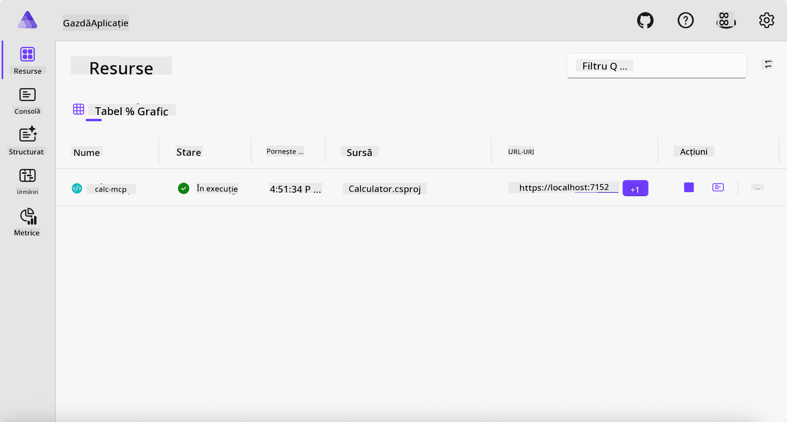
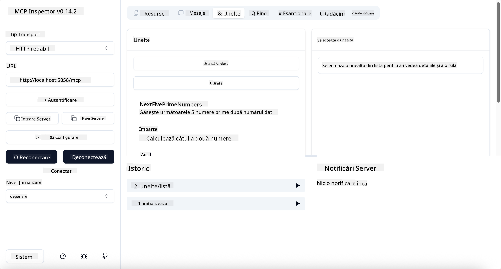

<!--
CO_OP_TRANSLATOR_METADATA:
{
  "original_hash": "0bc7bd48f55f1565f1d95ccb2c16f728",
  "translation_date": "2025-06-18T07:53:23+00:00",
  "source_file": "04-PracticalImplementation/samples/csharp/README.md",
  "language_code": "ro"
}
-->
# Exemplu

Exemplul anterior arată cum să folosești un proiect local .NET cu tipul `stdio`. Și cum să rulezi serverul local într-un container. Aceasta este o soluție bună în multe situații. Totuși, poate fi util să ai serverul rulând de la distanță, de exemplu într-un mediu cloud. Aici intervine tipul `http`.

Privind soluția din folderul `04-PracticalImplementation`, poate părea mult mai complexă decât cea anterioară. Dar în realitate, nu este așa. Dacă te uiți cu atenție la proiectul `src/Calculator`, vei vedea că este în mare parte același cod ca în exemplul anterior. Singura diferență este că folosim o bibliotecă diferită, `ModelContextProtocol.AspNetCore`, pentru a gestiona cererile HTTP. Și schimbăm metoda `IsPrime` pentru a o face privată, doar pentru a arăta că poți avea metode private în codul tău. Restul codului este la fel ca înainte.

Celelalte proiecte provin din [.NET Aspire](https://learn.microsoft.com/dotnet/aspire/get-started/aspire-overview). Având .NET Aspire în soluție va îmbunătăți experiența dezvoltatorului în timpul dezvoltării și testării și va ajuta la observabilitate. Nu este obligatoriu pentru a rula serverul, dar este o bună practică să îl ai în soluția ta.

## Pornește serverul local

1. Din VS Code (cu extensia C# DevKit), navighează în directorul `04-PracticalImplementation/samples/csharp`.
1. Execută următoarea comandă pentru a porni serverul:

   ```bash
    dotnet watch run --project ./src/AppHost
   ```

1. Când un browser web deschide panoul de control .NET Aspire, notează URL-ul `http`. Ar trebui să fie ceva de genul `http://localhost:5058/`.

   

## Testează Streamable HTTP cu MCP Inspector

Dacă ai Node.js 22.7.5 sau o versiune mai nouă, poți folosi MCP Inspector pentru a testa serverul tău.

Pornește serverul și rulează următoarea comandă într-un terminal:

```bash
npx @modelcontextprotocol/inspector http://localhost:5058
```



- Selectează `Streamable HTTP` as the Transport type.
- In the Url field, enter the URL of the server noted earlier, and append `/mcp`. Ar trebui să fie `http` (nu `https`) something like `http://localhost:5058/mcp`.
- select the Connect button.

A nice thing about the Inspector is that it provide a nice visibility on what is happening.

- Try listing the available tools
- Try some of them, it should works just like before.

## Test MCP Server with GitHub Copilot Chat in VS Code

To use the Streamable HTTP transport with GitHub Copilot Chat, change the configuration of the `calc-mcp` server creat anterior să arate astfel:

```jsonc
// .vscode/mcp.json
{
  "servers": {
    "calc-mcp": {
      "type": "http",
      "url": "http://localhost:5058/mcp"
    }
  }
}
```

Fă câteva teste:

- Cere "3 numere prime după 6780". Observă cum Copilot va folosi noile unelte `NextFivePrimeNumbers` și va returna doar primele 3 numere prime.
- Cere "7 numere prime după 111", pentru a vedea ce se întâmplă.
- Cere "John are 24 de acadele și vrea să le împartă egal la cei 3 copii ai săi. Câte acadele primește fiecare copil?", pentru a vedea ce se întâmplă.

## Publică serverul pe Azure

Să publicăm serverul pe Azure astfel încât mai mulți oameni să îl poată folosi.

Dintr-un terminal, navighează în folderul `04-PracticalImplementation/samples/csharp` și rulează următoarea comandă:

```bash
azd up
```

După ce publicarea s-a încheiat, ar trebui să vezi un mesaj de genul acesta:


Ia URL-ul și folosește-l în MCP Inspector și în GitHub Copilot Chat.

```jsonc
// .vscode/mcp.json
{
  "servers": {
    "calc-mcp": {
      "type": "http",
      "url": "https://calc-mcp.gentleriver-3977fbcf.australiaeast.azurecontainerapps.io/mcp"
    }
  }
}
```

## Ce urmează?

Vom încerca diferite tipuri de transport și unelte de testare. De asemenea, vom publica serverul MCP pe Azure. Dar ce se întâmplă dacă serverul nostru trebuie să acceseze resurse private? De exemplu, o bază de date sau un API privat? În capitolul următor, vom vedea cum putem îmbunătăți securitatea serverului nostru.

**Declinare de responsabilitate**:  
Acest document a fost tradus folosind serviciul de traducere AI [Co-op Translator](https://github.com/Azure/co-op-translator). Deși ne străduim pentru acuratețe, vă rugăm să rețineți că traducerile automate pot conține erori sau inexactități. Documentul original în limba sa nativă trebuie considerat sursa autorizată. Pentru informații critice, se recomandă traducerea profesională realizată de un traducător uman. Nu ne asumăm răspunderea pentru eventualele neînțelegeri sau interpretări greșite care pot apărea în urma utilizării acestei traduceri.