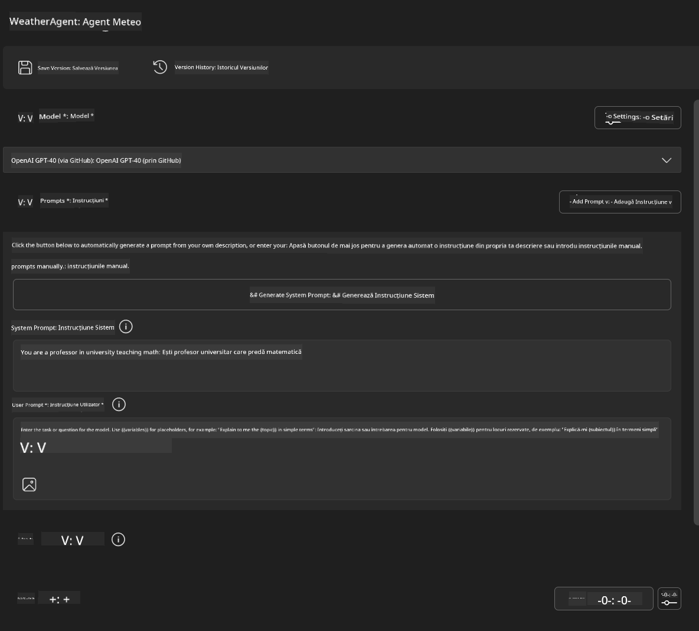
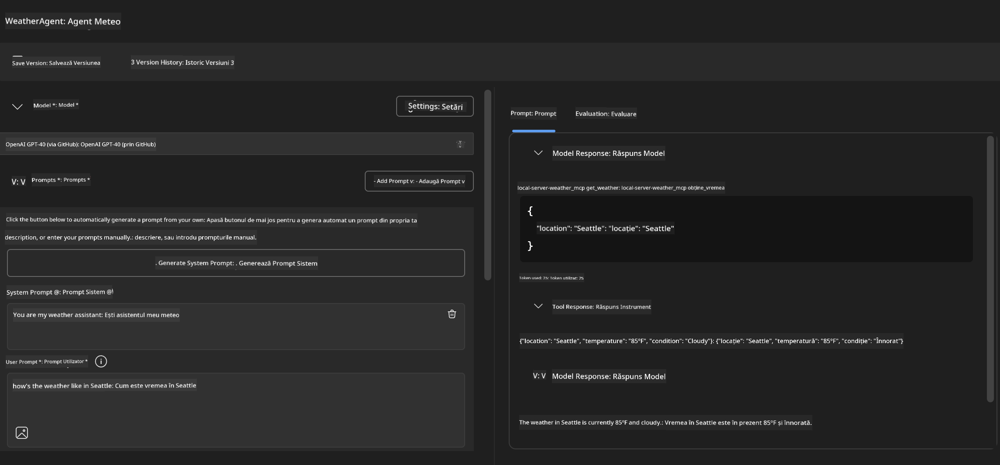

<!--
CO_OP_TRANSLATOR_METADATA:
{
  "original_hash": "dd8da3f75addcef453fe11f02a270217",
  "translation_date": "2025-06-10T06:18:58+00:00",
  "source_file": "10-StreamliningAIWorkflowsBuildingAnMCPServerWithAIToolkit/lab3/README.md",
  "language_code": "ro"
}
-->
# 🔧 Modulul 3: Dezvoltare Avansată MCP cu AI Toolkit


## 🎯 Obiective de Învățare

La finalul acestui laborator vei putea:

- ✅ Crea servere MCP personalizate folosind AI Toolkit
- ✅ Configura și utiliza cea mai recentă versiune a MCP Python SDK (v1.9.3)
- ✅ Configura și folosi MCP Inspector pentru depanare
- ✅ Depana servere MCP atât în Agent Builder cât și în Inspector
- ✅ Înțelege fluxurile de lucru avansate pentru dezvoltarea serverelor MCP

## 📋 Cerințe Prealabile

- Finalizarea Laboratorului 2 (Fundamente MCP)
- VS Code cu extensia AI Toolkit instalată
- Mediu Python 3.10+
- Node.js și npm pentru configurarea Inspectorului

## 🏗️ Ce Vei Construi

În acest laborator vei crea un **Weather MCP Server** care demonstrează:
- Implementarea unui server MCP personalizat
- Integrarea cu AI Toolkit Agent Builder
- Fluxuri de lucru profesionale pentru depanare
- Modele moderne de utilizare a MCP SDK

---

## 🔧 Prezentare Generală a Componentelor Principale

### 🐍 MCP Python SDK  
Model Context Protocol Python SDK oferă baza pentru construirea serverelor MCP personalizate. Vei folosi versiunea 1.9.3 cu capabilități avansate de depanare.

### 🔍 MCP Inspector  
Un instrument puternic pentru depanare care oferă:  
- Monitorizare în timp real a serverului  
- Vizualizarea execuției uneltelor  
- Inspectarea cererilor și răspunsurilor de rețea  
- Mediu interactiv de testare

---

## 📖 Implementare Pas cu Pas

### Pasul 1: Creează un WeatherAgent în Agent Builder

1. **Deschide Agent Builder** în VS Code prin extensia AI Toolkit  
2. **Creează un agent nou** cu următoarea configurație:  
   - Nume Agent: `WeatherAgent`



### Pasul 2: Inițializează Proiectul MCP Server

1. **Mergi la Tools** → **Add Tool** în Agent Builder  
2. **Selectează "MCP Server"** din opțiunile disponibile  
3. **Alege "Create A new MCP Server"**  
4. **Selectează șablonul `python-weather`**  
5. **Dă un nume serverului:** `weather_mcp`


### Pasul 3: Deschide și Examinează Proiectul

1. **Deschide proiectul generat** în VS Code  
2. **Revizuiește structura proiectului:**  
   ```
   weather_mcp/
   ├── src/
   │   ├── __init__.py
   │   └── server.py
   ├── inspector/
   │   ├── package.json
   │   └── package-lock.json
   ├── .vscode/
   │   ├── launch.json
   │   └── tasks.json
   ├── pyproject.toml
   └── README.md
   ```

### Pasul 4: Actualizează la Ultima Versiune MCP SDK

> **🔍 De ce să actualizăm?** Dorim să folosim cea mai recentă versiune MCP SDK (v1.9.3) și serviciul Inspector (0.14.0) pentru funcționalități extinse și capacități mai bune de depanare.

#### 4a. Actualizează Dependențele Python

**Editează `pyproject.toml`:** update [./code/weather_mcp/pyproject.toml](../../../../10-StreamliningAIWorkflowsBuildingAnMCPServerWithAIToolkit/lab3/code/weather_mcp/pyproject.toml)


#### 4b. Update Inspector Configuration

**Edit `inspector/package.json`:** update [./code/weather_mcp/inspector/package.json](../../../../10-StreamliningAIWorkflowsBuildingAnMCPServerWithAIToolkit/lab3/code/weather_mcp/inspector/package.json)

#### 4c. Update Inspector Dependencies

**Edit `inspector/package-lock.json`:** update [./code/weather_mcp/inspector/package-lock.json](../../../../10-StreamliningAIWorkflowsBuildingAnMCPServerWithAIToolkit/lab3/code/weather_mcp/inspector/package-lock.json)

> **📝 Note:** This file contains extensive dependency definitions. Below is the essential structure - the full content ensures proper dependency resolution.


> **⚡ Full Package Lock:** The complete package-lock.json contains ~3000 lines of dependency definitions. The above shows the key structure - use the provided file for complete dependency resolution.

### Step 5: Configure VS Code Debugging

*Note: Please copy the file in the specified path to replace the corresponding local file*

#### 5a. Update Launch Configuration

**Edit `.vscode/launch.json`:**

```json
{
  "version": "0.2.0",
  "configurations": [
    {
      "name": "Attach to Local MCP",
      "type": "debugpy",
      "request": "attach",
      "connect": {
        "host": "localhost",
        "port": 5678
      },
      "presentation": {
        "hidden": true
      },
      "internalConsoleOptions": "neverOpen",
      "postDebugTask": "Terminate All Tasks"
    },
    {
      "name": "Launch Inspector (Edge)",
      "type": "msedge",
      "request": "launch",
      "url": "http://localhost:6274?timeout=60000&serverUrl=http://localhost:3001/sse#tools",
      "cascadeTerminateToConfigurations": [
        "Attach to Local MCP"
      ],
      "presentation": {
        "hidden": true
      },
      "internalConsoleOptions": "neverOpen"
    },
    {
      "name": "Launch Inspector (Chrome)",
      "type": "chrome",
      "request": "launch",
      "url": "http://localhost:6274?timeout=60000&serverUrl=http://localhost:3001/sse#tools",
      "cascadeTerminateToConfigurations": [
        "Attach to Local MCP"
      ],
      "presentation": {
        "hidden": true
      },
      "internalConsoleOptions": "neverOpen"
    }
  ],
  "compounds": [
    {
      "name": "Debug in Agent Builder",
      "configurations": [
        "Attach to Local MCP"
      ],
      "preLaunchTask": "Open Agent Builder",
    },
    {
      "name": "Debug in Inspector (Edge)",
      "configurations": [
        "Launch Inspector (Edge)",
        "Attach to Local MCP"
      ],
      "preLaunchTask": "Start MCP Inspector",
      "stopAll": true
    },
    {
      "name": "Debug in Inspector (Chrome)",
      "configurations": [
        "Launch Inspector (Chrome)",
        "Attach to Local MCP"
      ],
      "preLaunchTask": "Start MCP Inspector",
      "stopAll": true
    }
  ]
}
```

**Editează `.vscode/tasks.json`:**

```
{
  "version": "2.0.0",
  "tasks": [
    {
      "label": "Start MCP Server",
      "type": "shell",
      "command": "python -m debugpy --listen 127.0.0.1:5678 src/__init__.py sse",
      "isBackground": true,
      "options": {
        "cwd": "${workspaceFolder}",
        "env": {
          "PORT": "3001"
        }
      },
      "problemMatcher": {
        "pattern": [
          {
            "regexp": "^.*$",
            "file": 0,
            "location": 1,
            "message": 2
          }
        ],
        "background": {
          "activeOnStart": true,
          "beginsPattern": ".*",
          "endsPattern": "Application startup complete|running"
        }
      }
    },
    {
      "label": "Start MCP Inspector",
      "type": "shell",
      "command": "npm run dev:inspector",
      "isBackground": true,
      "options": {
        "cwd": "${workspaceFolder}/inspector",
        "env": {
          "CLIENT_PORT": "6274",
          "SERVER_PORT": "6277",
        }
      },
      "problemMatcher": {
        "pattern": [
          {
            "regexp": "^.*$",
            "file": 0,
            "location": 1,
            "message": 2
          }
        ],
        "background": {
          "activeOnStart": true,
          "beginsPattern": "Starting MCP inspector",
          "endsPattern": "Proxy server listening on port"
        }
      },
      "dependsOn": [
        "Start MCP Server"
      ]
    },
    {
      "label": "Open Agent Builder",
      "type": "shell",
      "command": "echo ${input:openAgentBuilder}",
      "presentation": {
        "reveal": "never"
      },
      "dependsOn": [
        "Start MCP Server"
      ],
    },
    {
      "label": "Terminate All Tasks",
      "command": "echo ${input:terminate}",
      "type": "shell",
      "problemMatcher": []
    }
  ],
  "inputs": [
    {
      "id": "openAgentBuilder",
      "type": "command",
      "command": "ai-mlstudio.agentBuilder",
      "args": {
        "initialMCPs": [ "local-server-weather_mcp" ],
        "triggeredFrom": "vsc-tasks"
      }
    },
    {
      "id": "terminate",
      "type": "command",
      "command": "workbench.action.tasks.terminate",
      "args": "terminateAll"
    }
  ]
}
```

---

## 🚀 Pornirea și Testarea Serverului MCP

### Pasul 6: Instalează Dependențele

După ce ai făcut modificările de configurare, execută următoarele comenzi:

**Instalează dependențele Python:**  
```bash
uv sync
```

**Instalează dependențele Inspector:**  
```bash
cd inspector
npm install
```

### Pasul 7: Depanare cu Agent Builder

1. **Apasă F5** sau folosește configurația **"Debug in Agent Builder"**  
2. **Selectează configurația compusă** din panoul de depanare  
3. **Așteaptă să pornească serverul** și să se deschidă Agent Builder  
4. **Testează serverul tău weather MCP** cu întrebări în limbaj natural

Introdu un prompt de genul acesta

SYSTEM_PROMPT

```
You are my weather assistant
```

USER_PROMPT

```
How's the weather like in Seattle
```



### Pasul 8: Depanare cu MCP Inspector

1. **Folosește configurația "Debug in Inspector"** (Edge sau Chrome)  
2. **Deschide interfața Inspector la `http://localhost:6274`**  
3. **Explorează mediul interactiv de testare:**  
   - Vizualizează uneltele disponibile  
   - Testează execuția uneltelor  
   - Monitorizează cererile de rețea  
   - Depanează răspunsurile serverului


---

## 🎯 Rezultate Cheie ale Învățării

Finalizând acest laborator, ai:

- [x] **Creat un server MCP personalizat** folosind șabloanele AI Toolkit  
- [x] **Actualizat la cea mai recentă versiune MCP SDK** (v1.9.3) pentru funcționalități extinse  
- [x] **Configurat fluxuri profesionale de depanare** pentru Agent Builder și Inspector  
- [x] **Setat MCP Inspector** pentru testarea interactivă a serverului  
- [x] **Stăpânit configurările de depanare VS Code** pentru dezvoltarea MCP

## 🔧 Funcționalități Avansate Exploatate

| Funcționalitate | Descriere | Caz de Utilizare |
|-----------------|-----------|------------------|
| **MCP Python SDK v1.9.3** | Implementarea protocolului cea mai nouă | Dezvoltare modernă de servere |
| **MCP Inspector 0.14.0** | Instrument interactiv de depanare | Testare server în timp real |
| **Depanare VS Code** | Mediu integrat de dezvoltare | Flux profesional de depanare |
| **Integrare Agent Builder** | Conexiune directă cu AI Toolkit | Testare completă a agenților |

## 📚 Resurse Suplimentare

- [Documentația MCP Python SDK](https://modelcontextprotocol.io/docs/sdk/python)  
- [Ghidul extensiei AI Toolkit](https://code.visualstudio.com/docs/ai/ai-toolkit)  
- [Documentația depanării VS Code](https://code.visualstudio.com/docs/editor/debugging)  
- [Specificația Model Context Protocol](https://modelcontextprotocol.io/docs/concepts/architecture)

---

**🎉 Felicitări!** Ai finalizat cu succes Laboratorul 3 și acum poți crea, depana și implementa servere MCP personalizate folosind fluxuri profesionale de dezvoltare.

### 🔜 Continuă cu Modulul Următor

Ești gata să aplici abilitățile MCP într-un flux real de dezvoltare? Continuă cu **[Modulul 4: Dezvoltare Practică MCP - Server Custom GitHub Clone](../lab4/README.md)** unde vei:  
- Construi un server MCP pregătit pentru producție care automatizează operațiuni pe repo-uri GitHub  
- Implementa funcționalitatea de clonare a repo-urilor GitHub prin MCP  
- Integra servere MCP personalizate cu VS Code și GitHub Copilot Agent Mode  
- Testa și implementa servere MCP personalizate în medii de producție  
- Învața automatizarea practică a fluxurilor de lucru pentru dezvoltatori

**Declinare a responsabilității**:  
Acest document a fost tradus folosind serviciul de traducere automată AI [Co-op Translator](https://github.com/Azure/co-op-translator). Deși ne străduim pentru acuratețe, vă rugăm să rețineți că traducerile automate pot conține erori sau inexactități. Documentul original, în limba sa nativă, trebuie considerat sursa autorizată. Pentru informații critice, se recomandă traducerea profesională realizată de un specialist uman. Nu ne asumăm răspunderea pentru eventualele neînțelegeri sau interpretări greșite care pot apărea ca urmare a utilizării acestei traduceri.