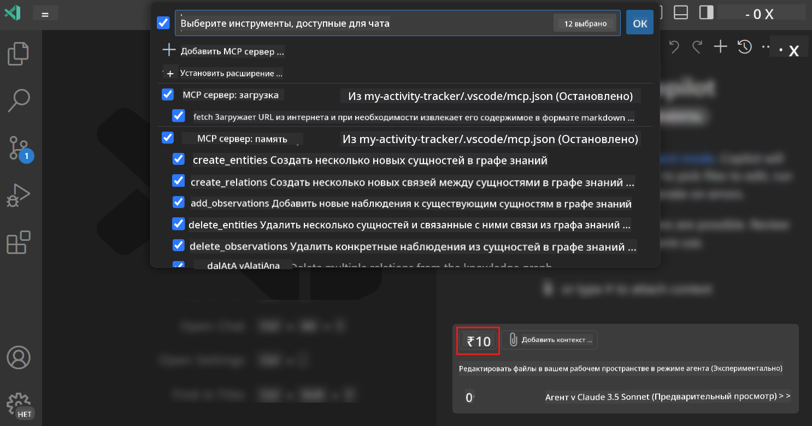
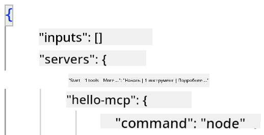

<!--
CO_OP_TRANSLATOR_METADATA:
{
  "original_hash": "8ea28e5e566edd5969337fd0b191ba3f",
  "translation_date": "2025-07-16T23:29:04+00:00",
  "source_file": "03-GettingStarted/04-vscode/README.md",
  "language_code": "ru"
}
-->
# Использование сервера в режиме GitHub Copilot Agent

Visual Studio Code и GitHub Copilot могут выступать в роли клиента и использовать MCP Server. Зачем это нужно, спросите вы? Это значит, что все функции MCP Server теперь доступны прямо в вашей IDE. Представьте, что вы добавляете, например, MCP сервер GitHub — это позволит управлять GitHub через подсказки, вместо того чтобы вводить конкретные команды в терминале. Или представьте любую другую возможность, которая улучшит ваш опыт разработки, управляемую с помощью естественного языка. Уже видите преимущество, правда?

## Обзор

В этом уроке мы рассмотрим, как использовать Visual Studio Code и режим GitHub Copilot Agent в качестве клиента для вашего MCP Server.

## Цели обучения

К концу урока вы сможете:

- Использовать MCP Server через Visual Studio Code.
- Запускать возможности, такие как инструменты, через GitHub Copilot.
- Настраивать Visual Studio Code для поиска и управления вашим MCP Server.

## Использование

Вы можете управлять вашим MCP сервером двумя способами:

- Через пользовательский интерфейс — как это делается, вы увидите позже в этой главе.
- Через терминал — можно управлять сервером из терминала с помощью исполняемого файла `code`:

  Чтобы добавить MCP сервер в ваш профиль пользователя, используйте опцию командной строки --add-mcp и передайте конфигурацию сервера в формате JSON {\"name\":\"server-name\",\"command\":...}.

  ```
  code --add-mcp "{\"name\":\"my-server\",\"command\": \"uvx\",\"args\": [\"mcp-server-fetch\"]}"
  ```

### Скриншоты

  
  


Далее подробнее расскажем, как использовать визуальный интерфейс.

## Подход

Вот общий план действий:

- Настроить файл для поиска MCP Server.
- Запустить/подключиться к серверу, чтобы получить список его возможностей.
- Использовать эти возможности через интерфейс GitHub Copilot Chat.

Отлично, теперь, когда мы понимаем общий процесс, давайте попробуем использовать MCP Server в Visual Studio Code на практике.

## Упражнение: Использование сервера

В этом упражнении мы настроим Visual Studio Code для поиска вашего MCP сервера, чтобы использовать его через интерфейс GitHub Copilot Chat.

### -0- Предварительный шаг: включение обнаружения MCP Server

Возможно, потребуется включить обнаружение MCP Server.

1. Перейдите в `File -> Preferences -> Settings` в Visual Studio Code.

1. Найдите "MCP" и включите `chat.mcp.discovery.enabled` в файле settings.json.

### -1- Создание файла конфигурации

Начните с создания файла конфигурации в корне проекта. Вам нужен файл MCP.json, который нужно поместить в папку .vscode. Он должен выглядеть примерно так:

```text
.vscode
|-- mcp.json
```

Далее посмотрим, как добавить запись о сервере.

### -2- Настройка сервера

Добавьте следующий контент в *mcp.json*:

```json
{
    "inputs": [],
    "servers": {
       "hello-mcp": {
           "command": "node",
           "args": [
               "build/index.js"
           ]
       }
    }
}
```

Приведён простой пример запуска сервера на Node.js, для других сред укажите правильную команду запуска сервера через `command` и `args`.

### -3- Запуск сервера

Теперь, когда запись добавлена, запустим сервер:

1. Найдите вашу запись в *mcp.json* и убедитесь, что видите иконку "play":

    

1. Нажмите на иконку "play", вы увидите, что иконка инструментов в GitHub Copilot Chat увеличит количество доступных инструментов. Если нажать на эту иконку, откроется список зарегистрированных инструментов. Вы можете включать или отключать каждый инструмент, в зависимости от того, хотите ли, чтобы GitHub Copilot использовал их в качестве контекста:

  

1. Чтобы запустить инструмент, введите запрос, который соответствует описанию одного из ваших инструментов, например: "add 22 to 1":

  

  Вы должны увидеть ответ с числом 23.

## Задание

Попробуйте добавить запись о сервере в ваш *mcp.json* и убедитесь, что вы можете запускать и останавливать сервер. Также проверьте, что можете взаимодействовать с инструментами сервера через интерфейс GitHub Copilot Chat.

## Решение

[Решение](./solution/README.md)

## Основные выводы

Главные выводы из этой главы:

- Visual Studio Code — отличный клиент, позволяющий использовать несколько MCP Server и их инструменты.
- Интерфейс GitHub Copilot Chat — это способ взаимодействия с серверами.
- Вы можете запрашивать у пользователя ввод, например, API ключи, которые передаются MCP Server при настройке записи сервера в *mcp.json*.

## Примеры

- [Java Calculator](../samples/java/calculator/README.md)
- [.Net Calculator](../../../../03-GettingStarted/samples/csharp)
- [JavaScript Calculator](../samples/javascript/README.md)
- [TypeScript Calculator](../samples/typescript/README.md)
- [Python Calculator](../../../../03-GettingStarted/samples/python)

## Дополнительные ресурсы

- [Документация Visual Studio](https://code.visualstudio.com/docs/copilot/chat/mcp-servers)

## Что дальше

- Далее: [Создание SSE сервера](../05-sse-server/README.md)

**Отказ от ответственности**:  
Этот документ был переведен с помощью сервиса автоматического перевода [Co-op Translator](https://github.com/Azure/co-op-translator). Несмотря на наши усилия по обеспечению точности, просим учитывать, что автоматический перевод может содержать ошибки или неточности. Оригинальный документ на его исходном языке следует считать авторитетным источником. Для получения критически важной информации рекомендуется обращаться к профессиональному переводу, выполненному человеком. Мы не несем ответственности за любые недоразумения или неправильные толкования, возникшие в результате использования данного перевода.