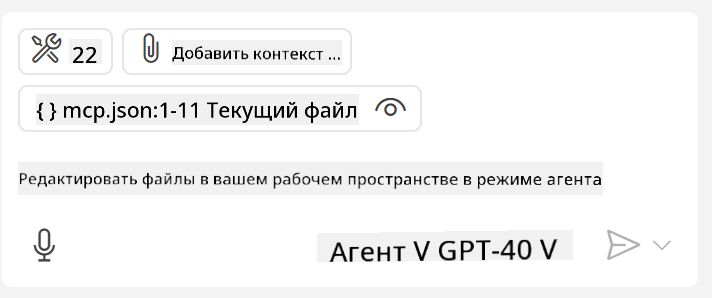

<!--
CO_OP_TRANSLATOR_METADATA:
{
  "original_hash": "0eb9557780cd0a2551cdb8a16c886b51",
  "translation_date": "2025-06-17T15:12:42+00:00",
  "source_file": "03-GettingStarted/04-vscode/README.md",
  "language_code": "ru"
}
-->
Давайте подробнее обсудим, как использовать визуальный интерфейс в следующих разделах.

## Подход

Вот как мы будем действовать на высоком уровне:

- Настроить файл для поиска нашего MCP сервера.
- Запустить/подключиться к серверу, чтобы получить список его возможностей.
- Использовать эти возможности через интерфейс GitHub Copilot Chat.

Отлично, теперь, когда мы понимаем общий процесс, давайте попробуем использовать MCP сервер через Visual Studio Code на практике.

## Упражнение: Использование сервера

В этом упражнении мы настроим Visual Studio Code так, чтобы он находил ваш MCP сервер и мог использовать его через интерфейс GitHub Copilot Chat.

### -0- Подготовительный шаг, включение обнаружения MCP серверов

Возможно, потребуется включить обнаружение MCP серверов.

1. Перейдите в `File -> Preferences -> Settings` и найдите параметр ` in Visual Studio Code.

1. Search for "MCP" and enable `chat.mcp.discovery.enabled` в файле settings.json.

### -1- Создание конфигурационного файла

Начните с создания конфигурационного файла в корне вашего проекта. Вам понадобится файл MCP.json, который нужно поместить в папку .vscode. Он должен выглядеть примерно так:

```text
.vscode
|-- mcp.json
```

Далее посмотрим, как добавить запись сервера.

### -2- Настройка сервера

Добавьте следующий контент в *mcp.json*:

```json
{
    "inputs": [],
    "servers": {
       "hello-mcp": {
           "command": "node",
           "args": [
               "build/index.js"
           ]
       }
    }
}
```

Выше приведён простой пример запуска сервера, написанного на Node.js. Для других сред укажите правильную команду запуска сервера с помощью `command` and `args`.

### -3- Запуск сервера

Теперь, когда вы добавили запись, давайте запустим сервер:

1. Найдите вашу запись в *mcp.json* и убедитесь, что видите иконку "play":

    

1. Нажмите на иконку "play", вы увидите, что иконка инструментов в GitHub Copilot Chat увеличит количество доступных инструментов. Если нажать на эту иконку, откроется список зарегистрированных инструментов. Вы можете отмечать/снимать отметки с каждого инструмента, чтобы разрешить или запретить GitHub Copilot использовать их в качестве контекста:

  

1. Чтобы запустить инструмент, введите запрос, который соответствует описанию одного из ваших инструментов, например, запрос "add 22 to 1":

  

  Вы должны увидеть ответ с числом 23.

## Задание

Попробуйте добавить запись сервера в ваш файл *mcp.json* и убедитесь, что вы можете запускать и останавливать сервер. Также убедитесь, что вы можете взаимодействовать с инструментами сервера через интерфейс GitHub Copilot Chat.

## Решение

[Решение](./solution/README.md)

## Основные выводы

Основные моменты из этой главы:

- Visual Studio Code — отличный клиент, который позволяет использовать несколько MCP серверов и их инструменты.
- Интерфейс GitHub Copilot Chat — это способ взаимодействия с серверами.
- Вы можете запрашивать у пользователя ввод, например API ключи, которые передаются MCP серверу при настройке записи сервера в файле *mcp.json*.

## Примеры

- [Калькулятор на Java](../samples/java/calculator/README.md)
- [Калькулятор на .Net](../../../../03-GettingStarted/samples/csharp)
- [Калькулятор на JavaScript](../samples/javascript/README.md)
- [Калькулятор на TypeScript](../samples/typescript/README.md)
- [Калькулятор на Python](../../../../03-GettingStarted/samples/python)

## Дополнительные ресурсы

- [Документация Visual Studio](https://code.visualstudio.com/docs/copilot/chat/mcp-servers)

## Что дальше

- Далее: [Создание SSE сервера](/03-GettingStarted/05-sse-server/README.md)

**Отказ от ответственности**:  
Этот документ был переведен с помощью сервиса автоматического перевода [Co-op Translator](https://github.com/Azure/co-op-translator). Несмотря на наши усилия по обеспечению точности, имейте в виду, что автоматический перевод может содержать ошибки или неточности. Оригинальный документ на его родном языке следует считать авторитетным источником. Для получения критически важной информации рекомендуется обратиться к профессиональному переводу, выполненному человеком. Мы не несем ответственности за любые недоразумения или неправильные толкования, возникшие в результате использования данного перевода.