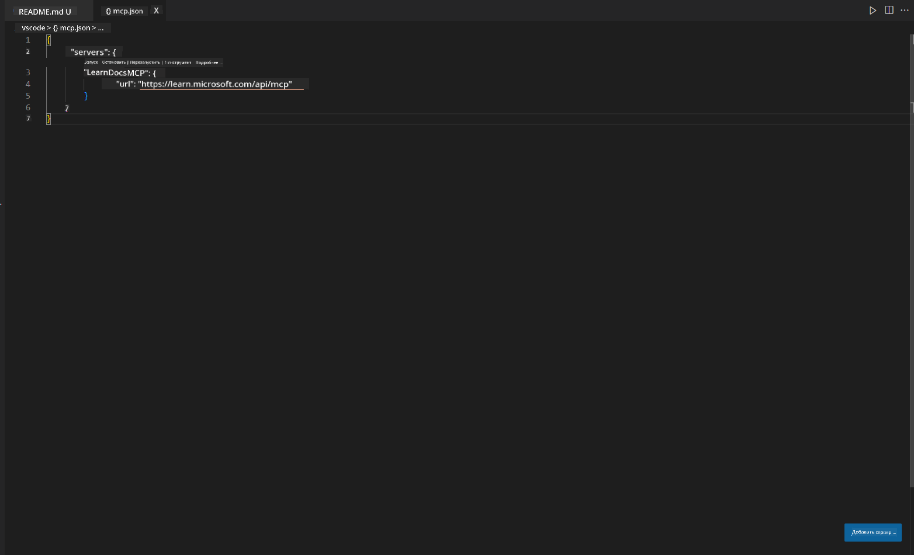
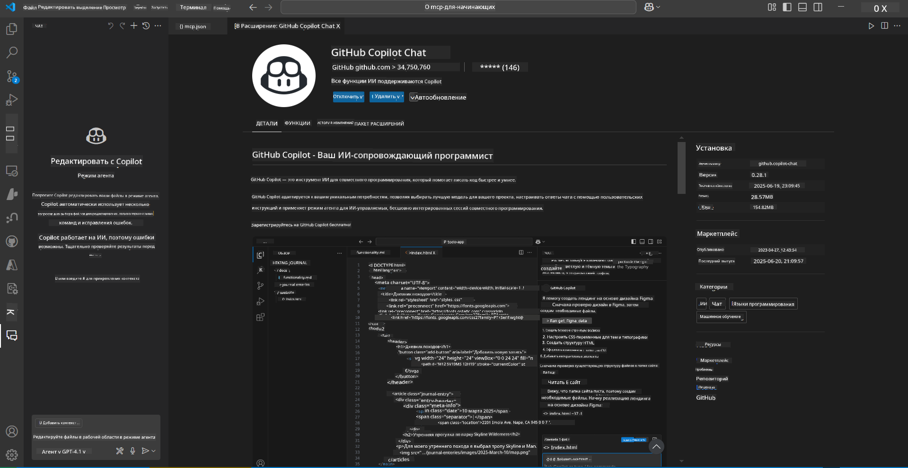
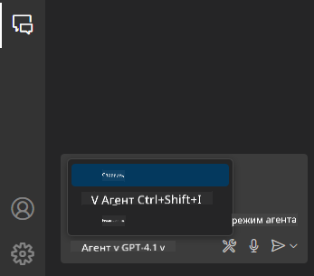
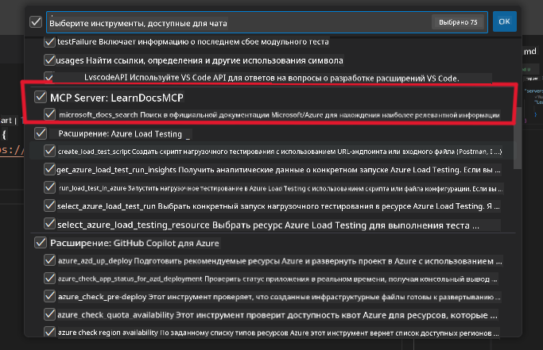
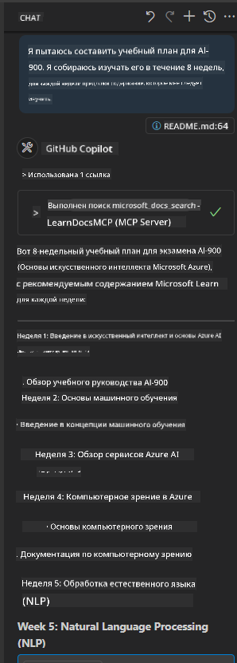
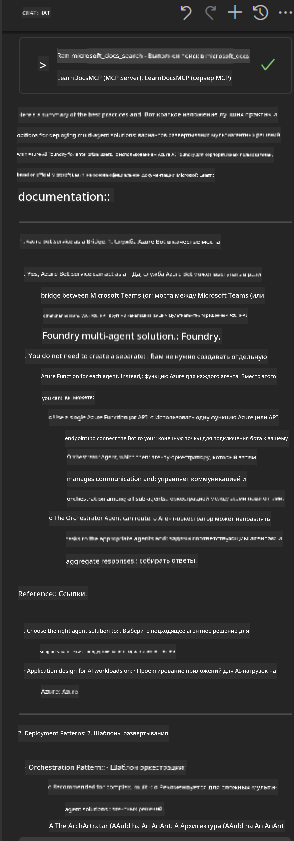

<!--
CO_OP_TRANSLATOR_METADATA:
{
  "original_hash": "db532b1ec386c9ce38c791653dc3c881",
  "translation_date": "2025-06-21T14:34:45+00:00",
  "source_file": "09-CaseStudy/docs-mcp/solution/scenario3/README.md",
  "language_code": "ru"
}
-->
# Сценарий 3: Документация внутри редактора с MCP сервером в VS Code

## Обзор

В этом сценарии вы узнаете, как интегрировать Microsoft Learn Docs прямо в вашу среду Visual Studio Code с помощью MCP сервера. Вместо постоянного переключения между вкладками браузера для поиска документации, вы сможете получать доступ, искать и ссылаться на официальные документы прямо в редакторе. Такой подход упрощает рабочий процесс, помогает оставаться сосредоточенным и обеспечивает бесшовную интеграцию с такими инструментами, как GitHub Copilot.

- Ищите и читайте документацию внутри VS Code, не покидая среды разработки.
- Ссылайтесь на документацию и вставляйте ссылки прямо в README или учебные материалы.
- Используйте GitHub Copilot и MCP вместе для удобного и интеллектуального рабочего процесса с документацией.

## Цели обучения

К концу этой главы вы научитесь настраивать и использовать MCP сервер в VS Code для улучшения работы с документацией и разработки. Вы сможете:

- Настроить рабочее пространство для использования MCP сервера при поиске документации.
- Искать и вставлять документацию непосредственно из VS Code.
- Совмещать возможности GitHub Copilot и MCP для более продуктивной работы с поддержкой ИИ.

Эти навыки помогут вам оставаться сосредоточенным, повысить качество документации и увеличить производительность как разработчика или технического писателя.

## Решение

Для доступа к документации внутри редактора вы выполните ряд шагов по интеграции MCP сервера с VS Code и GitHub Copilot. Это решение идеально подходит для авторов курсов, технических писателей и разработчиков, которые хотят работать с документацией и Copilot, не покидая редактор.

- Быстро добавляйте ссылки на источники в README во время написания курсов или документации к проекту.
- Используйте Copilot для генерации кода и MCP для мгновенного поиска и цитирования релевантной документации.
- Оставайтесь сосредоточенными в редакторе и повышайте продуктивность.

### Пошаговое руководство

Чтобы начать, выполните следующие шаги. Для каждого шага вы можете добавить скриншот из папки assets, чтобы наглядно показать процесс.

1. **Добавьте конфигурацию MCP:**
   В корне вашего проекта создайте файл `.vscode/mcp.json` и добавьте в него следующую конфигурацию:
   ```json
   {
     "servers": {
       "LearnDocsMCP": {
         "url": "https://learn.microsoft.com/api/mcp"
       }
     }
   }
   ```
   Эта конфигурация указывает VS Code, как подключаться к [`Microsoft Learn Docs MCP server`](https://github.com/MicrosoftDocs/mcp).
   
   
    
2. **Откройте панель GitHub Copilot Chat:**
   Если у вас ещё не установлен расширение GitHub Copilot, перейдите в раздел Extensions в VS Code и установите его. Вы можете скачать его напрямую с [Visual Studio Code Marketplace](https://marketplace.visualstudio.com/items?itemName=GitHub.copilot-chat). Затем откройте панель Copilot Chat в боковой панели.

   

3. **Включите режим агента и проверьте инструменты:**
   В панели Copilot Chat активируйте режим агента.

   

   После включения режима агента убедитесь, что MCP сервер указан среди доступных инструментов. Это гарантирует, что агент Copilot сможет обращаться к серверу документации для получения релевантной информации.
   
   
4. **Начните новый чат и задайте запрос агенту:**
   Откройте новый чат в панели Copilot Chat. Теперь вы можете задавать агенту вопросы по документации. Агент будет использовать MCP сервер для поиска и отображения соответствующей документации Microsoft Learn прямо в вашем редакторе.

   - *«Я пытаюсь составить учебный план по теме X. Планирую изучать её 8 недель, предложи, какой материал стоит изучать каждую неделю.»*

   

5. **Живой запрос:**

   > Рассмотрим живой запрос из раздела [#get-help](https://discord.gg/D6cRhjHWSC) в Discord Azure AI Foundry ([смотреть оригинальное сообщение](https://discord.com/channels/1113626258182504448/1385498306720829572)):
   
   *«Я ищу ответы по развертыванию мультиагентного решения с AI агентами, разработанными на Azure AI Foundry. Похоже, нет прямого способа развертывания, как в каналах Copilot Studio. Какие существуют варианты для корпоративных пользователей, чтобы взаимодействовать и выполнять задачи?
Существует много статей и блогов, где говорится, что можно использовать Azure Bot Service как мост между MS Teams и агентами Azure AI Foundry. Сработает ли это, если я настрою Azure Bot, который подключается к Orchestrator Agent на Azure AI Foundry через Azure Function для оркестрации, или мне нужно создавать Azure Function для каждого AI агента в мультиагентном решении для оркестрации через Bot Framework? Буду благодарен за любые другие предложения.»*

   

   Агент ответит с релевантными ссылками на документацию и краткими обзорами, которые вы сможете вставлять прямо в свои markdown-файлы или использовать как ссылки в коде.
   
### Примеры запросов

Вот несколько примеров запросов, которые вы можете попробовать. Они покажут, как MCP сервер и Copilot вместе обеспечивают мгновенный доступ к контекстной документации и ссылкам, не покидая VS Code:

- «Покажи, как использовать триггеры Azure Functions.»
- «Вставь ссылку на официальную документацию по Azure Key Vault.»
- «Какие лучшие практики по обеспечению безопасности ресурсов Azure?»
- «Найди quickstart по сервисам Azure AI.»

Эти запросы продемонстрируют, как MCP сервер и Copilot работают вместе, чтобы предоставить моментальный, контекстно-зависимый доступ к документации и ссылкам, не выходя из VS Code.

---

**Отказ от ответственности**:  
Этот документ был переведен с помощью сервиса автоматического перевода [Co-op Translator](https://github.com/Azure/co-op-translator). Несмотря на наши усилия по обеспечению точности, имейте в виду, что автоматический перевод может содержать ошибки или неточности. Оригинальный документ на исходном языке следует считать авторитетным источником. Для получения критически важной информации рекомендуется использовать профессиональный перевод, выполненный человеком. Мы не несем ответственности за любые недоразумения или неправильные толкования, возникшие в результате использования данного перевода.