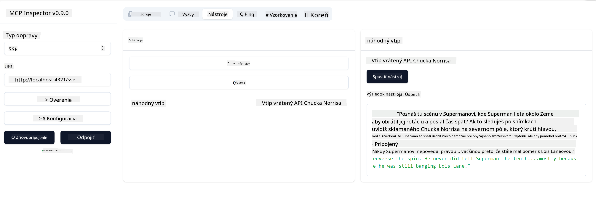

<!--
CO_OP_TRANSLATOR_METADATA:
{
  "original_hash": "1681ca3633aeb49ee03766abdbb94a93",
  "translation_date": "2025-06-17T22:27:44+00:00",
  "source_file": "03-GettingStarted/05-sse-server/README.md",
  "language_code": "sk"
}
-->
Teraz, keď už vieme trochu viac o SSE, poďme si vytvoriť SSE server.

## Cvičenie: Vytvorenie SSE servera

Pri vytváraní nášho servera musíme mať na pamäti dve veci:

- Potrebujeme použiť webový server na sprístupnenie endpointov pre pripojenie a správy.
- Server postavíme tak, ako sme zvyknutí s nástrojmi, zdrojmi a promptami, keď sme používali stdio.

### -1- Vytvorenie inštancie servera

Na vytvorenie servera použijeme rovnaké typy ako pri stdio. Avšak pre transport musíme zvoliť SSE.

Poďme teraz pridať potrebné routy.

### -2- Pridanie rout

Pridajme routy, ktoré budú spracovávať pripojenie a prichádzajúce správy:

Teraz pridáme schopnosti servera.

### -3- Pridanie schopností servera

Keď máme definované všetko špecifické pre SSE, pridajme schopnosti servera ako nástroje, prompty a zdroje.

Tvoj kompletný kód by mal vyzerať takto:

Skvelé, máme server používajúci SSE, poďme ho teraz vyskúšať.

## Cvičenie: Ladenie SSE servera pomocou Inspector

Inspector je skvelý nástroj, ktorý sme videli v predchádzajúcej lekcii [Creating your first server](/03-GettingStarted/01-first-server/README.md). Pozrime sa, či ho môžeme použiť aj tu:

### -1- Spustenie inspectora

Na spustenie inspectora musíš mať najskôr bežiaci SSE server, tak ho spustime:

1. Spusti server

1. Spusti inspector

    > ![NOTE]
    > Spusti tento príkaz v inom terminálovom okne, než kde beží server. Tiež si všimni, že príkaz nižšie musíš upraviť podľa URL, kde tvoj server beží.

    ```sh
    npx @modelcontextprotocol/inspector --cli http://localhost:8000/sse --method tools/list
    ```

Spustenie inspectora vyzerá rovnako vo všetkých runtime. Všimni si, že namiesto odovzdania cesty k serveru a príkazu na jeho spustenie odovzdávame URL, kde server beží, a tiež špecifikujeme routu `/sse`.

### -2- Vyskúšanie nástroja

Pripoj sa k serveru výberom SSE z rozbaľovacieho zoznamu a vyplň pole URL, kde tvoj server beží, napríklad http://localhost:4321/sse. Potom klikni na tlačidlo "Connect". Ako predtým, vyber nástroje, zadaj vstupné hodnoty a mal by si vidieť výsledok ako nižšie:



Skvelé, dokážeš pracovať s inspectorom, poďme sa pozrieť, ako pracovať s Visual Studio Code.

## Zadanie

Skús rozšíriť svoj server o ďalšie schopnosti. Pozri si [túto stránku](https://api.chucknorris.io/) a napríklad pridaj nástroj, ktorý volá API. Ty rozhodni, ako má server vyzerať. Prajem veľa zábavy :)

## Riešenie

[Riešenie](./solution/README.md) Tu je možné riešenie s funkčným kódom.

## Kľúčové poznatky

Kľúčové poznatky z tejto kapitoly sú:

- SSE je druhý podporovaný transport vedľa stdio.
- Na podporu SSE je potrebné spravovať prichádzajúce pripojenia a správy pomocou webového frameworku.
- Na konzumáciu SSE servera môžeš použiť Inspector aj Visual Studio Code, rovnako ako pri stdio serveroch. Všimni si, že medzi stdio a SSE sú malé rozdiely. Pri SSE musíš server spustiť samostatne a potom spustiť inspector nástroj. Pri inspectore je tiež potrebné zadať URL.

## Ukážky

- [Java Calculator](../samples/java/calculator/README.md)
- [.Net Calculator](../../../../03-GettingStarted/samples/csharp)
- [JavaScript Calculator](../samples/javascript/README.md)
- [TypeScript Calculator](../samples/typescript/README.md)
- [Python Calculator](../../../../03-GettingStarted/samples/python)

## Dodatočné zdroje

- [SSE](https://developer.mozilla.org/en-US/docs/Web/API/Server-sent_events)

## Čo nasleduje

- Ďalej: [HTTP Streaming with MCP (Streamable HTTP)](/03-GettingStarted/06-http-streaming/README.md)

**Vyhlásenie o zodpovednosti**:  
Tento dokument bol preložený pomocou AI prekladateľskej služby [Co-op Translator](https://github.com/Azure/co-op-translator). Aj keď sa snažíme o presnosť, prosím, majte na pamäti, že automatické preklady môžu obsahovať chyby alebo nepresnosti. Pôvodný dokument v jeho rodnom jazyku by mal byť považovaný za autoritatívny zdroj. Pre kritické informácie sa odporúča profesionálny ľudský preklad. Nie sme zodpovední za žiadne nedorozumenia alebo nesprávne výklady vyplývajúce z použitia tohto prekladu.