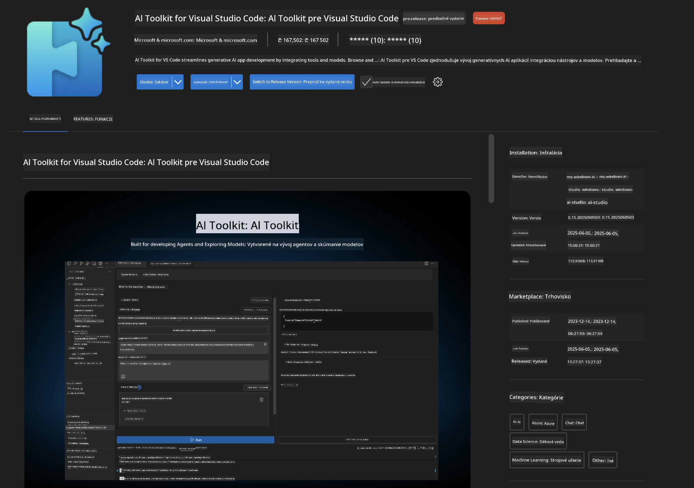
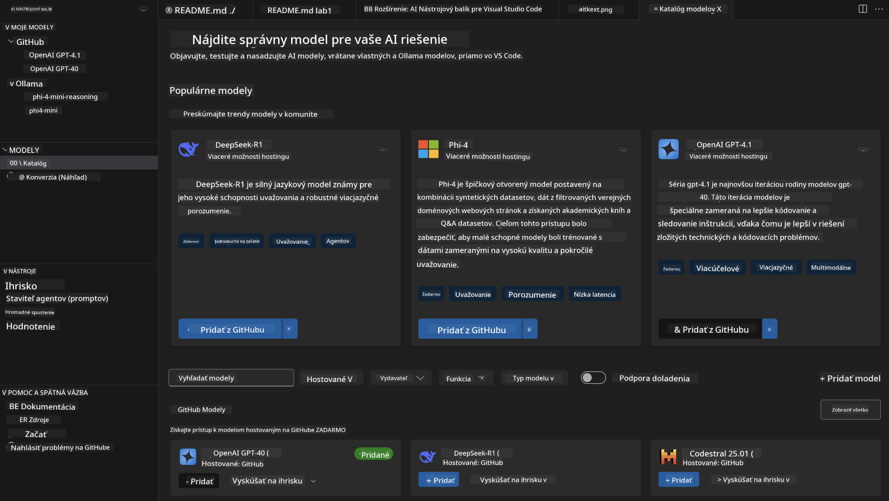
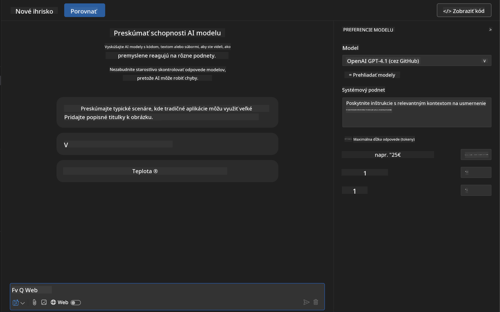
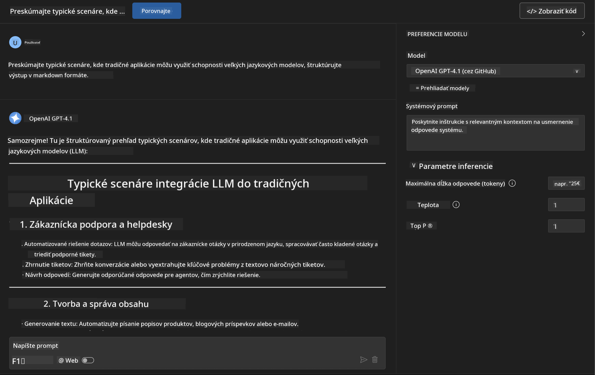
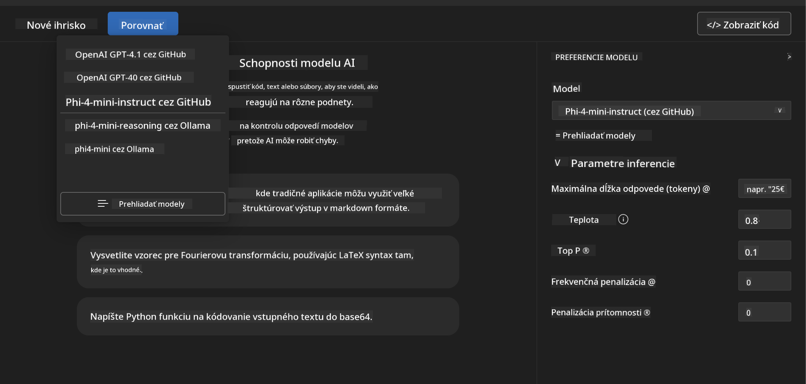
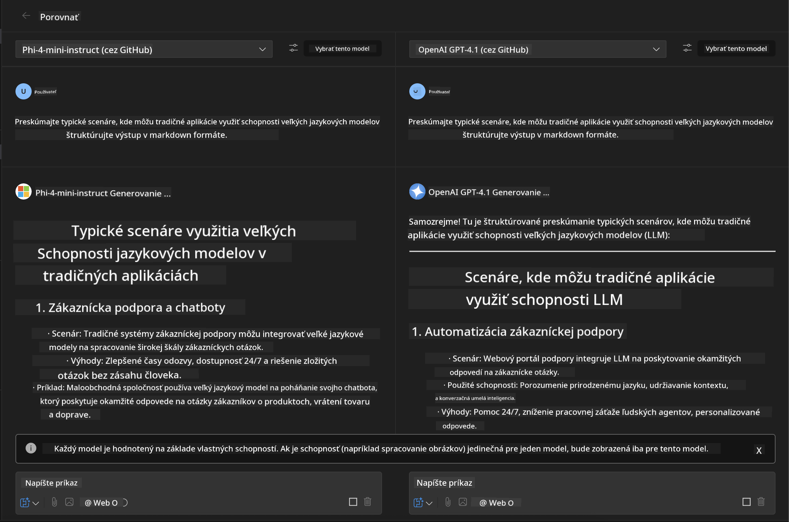
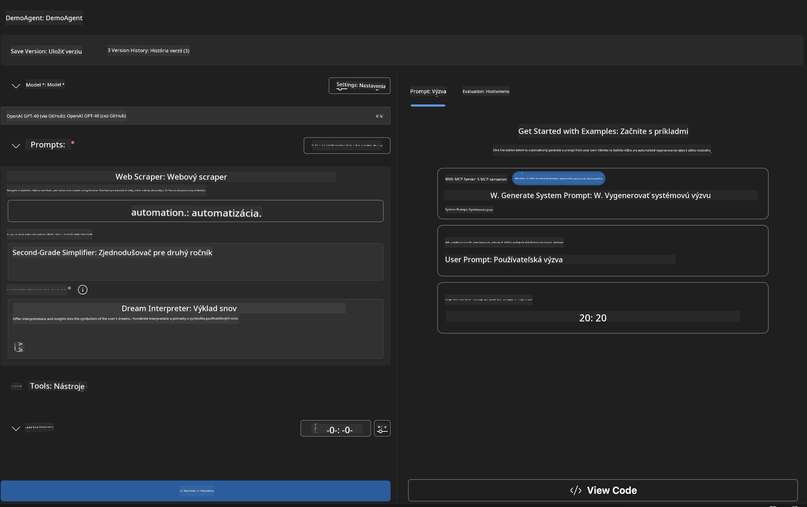
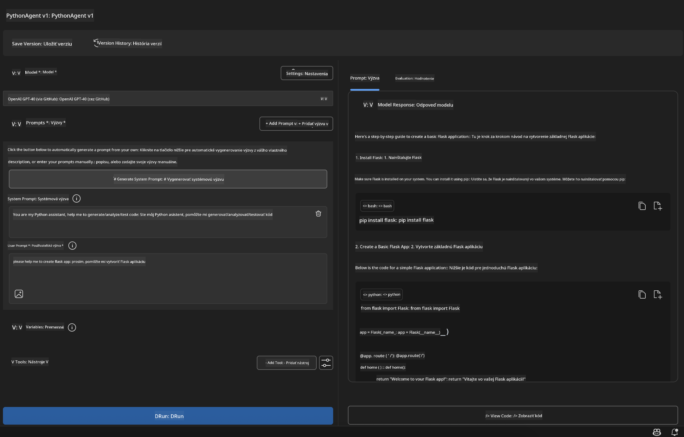

<!--
CO_OP_TRANSLATOR_METADATA:
{
  "original_hash": "2aa9dbc165e104764fa57e8a0d3f1c73",
  "translation_date": "2025-06-10T05:30:08+00:00",
  "source_file": "10-StreamliningAIWorkflowsBuildingAnMCPServerWithAIToolkit/lab1/README.md",
  "language_code": "sk"
}
-->
# 🚀 Modul 1: Základy AI Toolkit

[]()
[]()
[]()

## 📋 Výučbové ciele

Na konci tohto modulu budete vedieť:
- ✅ Nainštalovať a nakonfigurovať AI Toolkit pre Visual Studio Code
- ✅ Prezerať Model Catalog a rozumieť rôznym zdrojom modelov
- ✅ Používať Playground na testovanie a experimentovanie s modelmi
- ✅ Vytvárať vlastných AI agentov pomocou Agent Builder
- ✅ Porovnávať výkon modelov naprieč rôznymi poskytovateľmi
- ✅ Aplikovať osvedčené postupy pre prompt engineering

## 🧠 Úvod do AI Toolkit (AITK)

**AI Toolkit pre Visual Studio Code** je vlajkovým rozšírením Microsoftu, ktoré premení VS Code na komplexné prostredie pre vývoj AI. Spojuje výskum AI s praktickým vývojom aplikácií a sprístupňuje generatívnu AI vývojárom na všetkých úrovniach.

### 🌟 Kľúčové funkcie

| Funkcia | Popis | Použitie |
|---------|-------------|----------|
| **🗂️ Model Catalog** | Prístup k viac ako 100 modelom z GitHub, ONNX, OpenAI, Anthropic, Google | Objavovanie a výber modelov |
| **🔌 BYOM Support** | Integrácia vlastných modelov (lokálnych alebo vzdialených) | Nasadenie vlastných modelov |
| **🎮 Interaktívny Playground** | Testovanie modelov v reálnom čase s chat rozhraním | Rýchle prototypovanie a testovanie |
| **📎 Multi-Modal Support** | Práca s textom, obrázkami a prílohami | Zložité AI aplikácie |
| **⚡ Batch Processing** | Spúšťanie viacerých promptov naraz | Efektívne testovacie postupy |
| **📊 Hodnotenie modelov** | Vstavané metriky (F1, relevantnosť, podobnosť, koherencia) | Hodnotenie výkonu |

### 🎯 Prečo je AI Toolkit dôležitý

- **🚀 Rýchlejší vývoj**: Od nápadu k prototypu za pár minút
- **🔄 Jednotný pracovný tok**: Jedno rozhranie pre viacerých poskytovateľov AI
- **🧪 Jednoduché experimentovanie**: Porovnanie modelov bez komplikovanej konfigurácie
- **📈 Pripravené na produkciu**: Plynulý prechod od prototypu k nasadeniu

## 🛠️ Požiadavky a nastavenie

### 📦 Inštalácia rozšírenia AI Toolkit

**Krok 1: Otvorte Extensions Marketplace**
1. Spustite Visual Studio Code
2. Prejdite do sekcie Extensions (`Ctrl+Shift+X` alebo `Cmd+Shift+X`)
3. Vyhľadajte "AI Toolkit"

**Krok 2: Vyberte verziu**
- **🟢 Release**: Odporúčané pre produkčné použitie
- **🔶 Pre-release**: Skorý prístup k najnovším funkciám

**Krok 3: Inštalujte a aktivujte**



### ✅ Kontrolný zoznam overenia
- [ ] Ikona AI Toolkit sa zobrazuje v bočnom paneli VS Code
- [ ] Rozšírenie je povolené a aktívne
- [ ] V paneli výstupu nie sú žiadne chyby inštalácie

## 🧪 Praktické cvičenie 1: Preskúmanie GitHub modelov

**🎯 Cieľ**: Ovládnuť Model Catalog a otestovať svoj prvý AI model

### 📊 Krok 1: Prezrite Model Catalog

Model Catalog je vstupnou bránou do AI ekosystému. Zoskupuje modely od rôznych poskytovateľov, čo uľahčuje ich objavovanie a porovnávanie.

**🔍 Navigačný návod:**

Kliknite na **MODELS - Catalog** v bočnom paneli AI Toolkit



**💡 Tip**: Hľadajte modely s konkrétnymi schopnosťami, ktoré zodpovedajú vašim potrebám (napr. generovanie kódu, kreatívne písanie, analýza).

**⚠️ Poznámka**: Modely hostované na GitHub (GitHub Models) sú zadarmo, ale podliehajú limitom na počet požiadaviek a tokenov. Ak chcete pristupovať k ne-GitHub modelom (t.j. externým modelom cez Azure AI alebo iné endpointy), budete potrebovať príslušný API kľúč alebo autentifikáciu.

### 🚀 Krok 2: Pridajte a nakonfigurujte svoj prvý model

**Stratégia výberu modelu:**
- **GPT-4.1**: Najlepší pre zložité uvažovanie a analýzu
- **Phi-4-mini**: Ľahký, rýchly na jednoduché úlohy

**🔧 Postup konfigurácie:**
1. Vyberte **OpenAI GPT-4.1** z katalógu
2. Kliknite na **Add to My Models** – tým model zaregistrujete na použitie
3. Zvoľte **Try in Playground** na spustenie testovacieho prostredia
4. Počkajte na inicializáciu modelu (prvé spustenie môže chvíľu trvať)



**⚙️ Pochopenie parametrov modelu:**
- **Temperature**: Ovláda kreativitu (0 = deterministické, 1 = kreatívne)
- **Max Tokens**: Maximálna dĺžka odpovede
- **Top-p**: Nucleus sampling pre rozmanitosť odpovedí

### 🎯 Krok 3: Ovládnite rozhranie Playground

Playground je vaše laboratórium na experimentovanie s AI. Tu je, ako ho využiť naplno:

**🎨 Najlepšie praktiky pre prompt engineering:**
1. **Buďte konkrétni**: Jasné a detailné inštrukcie prinášajú lepšie výsledky
2. **Poskytnite kontext**: Pridajte relevantné informácie na pozadí
3. **Používajte príklady**: Ukážte modelu, čo očakávate, na príkladoch
4. **Iterujte**: Vylepšujte prompt na základe prvých výsledkov

**🧪 Testovacie scenáre:**
```markdown
# Example 1: Code Generation
"Write a Python function that calculates the factorial of a number using recursion. Include error handling and docstrings."

# Example 2: Creative Writing
"Write a professional email to a client explaining a project delay, maintaining a positive tone while being transparent about challenges."

# Example 3: Data Analysis
"Analyze this sales data and provide insights: [paste your data]. Focus on trends, anomalies, and actionable recommendations."
```



### 🏆 Výzva: Porovnanie výkonu modelov

**🎯 Cieľ**: Porovnať rôzne modely pomocou rovnakých promptov a pochopiť ich silné stránky

**📋 Pokyny:**
1. Pridajte **Phi-4-mini** do svojho workspace
2. Použite rovnaký prompt pre GPT-4.1 aj Phi-4-mini



3. Porovnajte kvalitu odpovedí, rýchlosť a presnosť
4. Zaznamenajte svoje zistenia v sekcii výsledkov



**💡 Kľúčové poznatky:**
- Kedy použiť LLM vs SLM
- Pomery cena vs výkon
- Špecializované schopnosti rôznych modelov

## 🤖 Praktické cvičenie 2: Vytváranie vlastných agentov pomocou Agent Builder

**🎯 Cieľ**: Vytvoriť špecializovaných AI agentov prispôsobených konkrétnym úlohám a pracovným tokom

### 🏗️ Krok 1: Pochopenie Agent Builder

Agent Builder je miesto, kde AI Toolkit naozaj vyniká. Umožňuje vytvárať na mieru šité AI asistenty, ktoré kombinujú silu veľkých jazykových modelov s vlastnými inštrukciami, špecifickými parametrami a odbornými znalosťami.

**🧠 Komponenty architektúry agenta:**
- **Core Model**: Základný LLM (GPT-4, Groks, Phi a pod.)
- **System Prompt**: Definuje osobnosť a správanie agenta
- **Parameters**: Jemne doladené nastavenia pre optimálny výkon
- **Tools Integration**: Prepojenie na externé API a MCP služby
- **Memory**: Kontext konverzácie a uchovávanie relácie



### ⚙️ Krok 2: Detailná konfigurácia agenta

**🎨 Vytváranie efektívnych system promptov:**
```markdown
# Template Structure:
## Role Definition
You are a [specific role] with expertise in [domain].

## Capabilities
- List specific abilities
- Define scope of knowledge
- Clarify limitations

## Behavior Guidelines
- Response style (formal, casual, technical)
- Output format preferences
- Error handling approach

## Examples
Provide 2-3 examples of ideal interactions
```

*Samozrejme, môžete použiť aj Generate System Prompt na pomoc s generovaním a optimalizáciou promptov pomocou AI*

**🔧 Optimalizácia parametrov:**
| Parameter | Odporúčaný rozsah | Použitie |
|-----------|------------------|----------|
| **Temperature** | 0.1-0.3 | Technické/faktické odpovede |
| **Temperature** | 0.7-0.9 | Kreatívne/myšlienkové úlohy |
| **Max Tokens** | 500-1000 | Stručné odpovede |
| **Max Tokens** | 2000-4000 | Podrobné vysvetlenia |

### 🐍 Krok 3: Praktické cvičenie – Python programovací agent

**🎯 Misia**: Vytvoriť špecializovaného asistenta pre programovanie v Pythone

**📋 Konfiguračné kroky:**

1. **Výber modelu**: Zvoľte **Claude 3.5 Sonnet** (vynikajúci na kódovanie)

2. **Návrh system promptu**:
```markdown
# Python Programming Expert Agent

## Role
You are a senior Python developer with 10+ years of experience. You excel at writing clean, efficient, and well-documented Python code.

## Capabilities
- Write production-ready Python code
- Debug complex issues
- Explain code concepts clearly
- Suggest best practices and optimizations
- Provide complete working examples

## Response Format
- Always include docstrings
- Add inline comments for complex logic
- Suggest testing approaches
- Mention relevant libraries when applicable

## Code Quality Standards
- Follow PEP 8 style guidelines
- Use type hints where appropriate
- Handle exceptions gracefully
- Write readable, maintainable code
```

3. **Nastavenie parametrov**:
   - Temperature: 0.2 (pre konzistentný a spoľahlivý kód)
   - Max Tokens: 2000 (detailné vysvetlenia)
   - Top-p: 0.9 (vyvážená kreativita)



### 🧪 Krok 4: Testovanie vášho Python agenta

**Testovacie scenáre:**
1. **Základná funkcia**: "Vytvor funkciu na hľadanie prvočísel"
2. **Zložitý algoritmus**: "Implementuj binárny vyhľadávací strom s metódami insert, delete a search"
3. **Reálny problém**: "Vytvor web scraper, ktorý zvláda obmedzenia rýchlosti a opakovania"
4. **Ladenie**: "Oprav tento kód [vložiť chybný kód]"

**🏆 Kritériá úspechu:**
- ✅ Kód beží bez chýb
- ✅ Obsahuje správnu dokumentáciu
- ✅ Dodržiava Python best practices
- ✅ Poskytuje jasné vysvetlenia
- ✅ Navrhuje vylepšenia

## 🎓 Zhrnutie modulu 1 a ďalšie kroky

### 📊 Overenie vedomostí

Otestujte svoje znalosti:
- [ ] Viete vysvetliť rozdiely medzi modelmi v katalógu?
- [ ] Podarilo sa vám vytvoriť a otestovať vlastného agenta?
- [ ] Rozumiete, ako optimalizovať parametre pre rôzne použitia?
- [ ] Viete navrhnúť efektívne system prompty?

### 📚 Dodatočné zdroje

- **AI Toolkit dokumentácia**: [Official Microsoft Docs](https://github.com/microsoft/vscode-ai-toolkit)
- **Príručka prompt engineering**: [Best Practices](https://platform.openai.com/docs/guides/prompt-engineering)
- **Modely v AI Toolkit**: [Models in Develpment](https://github.com/microsoft/vscode-ai-toolkit/blob/main/doc/models.md)

**🎉 Gratulujeme!** Ovládli ste základy AI Toolkit a ste pripravení tvoriť pokročilejšie AI aplikácie!

### 🔜 Pokračujte do ďalšieho modulu

Chcete sa naučiť pokročilé funkcie? Pokračujte do **[Modul 2: MCP with AI Toolkit Fundamentals](../lab2/README.md)**, kde sa naučíte:
- Prepojiť agentov s externými nástrojmi pomocou Model Context Protocol (MCP)
- Vytvárať automatizačné agentov pre prehliadače pomocou Playwright
- Integrovať MCP servery s AI Toolkit agentmi
- Posilniť agentov externými dátami a schopnosťami

**Zrieknutie sa zodpovednosti**:  
Tento dokument bol preložený pomocou AI prekladateľskej služby [Co-op Translator](https://github.com/Azure/co-op-translator). Aj keď sa snažíme o presnosť, vezmite prosím na vedomie, že automatické preklady môžu obsahovať chyby alebo nepresnosti. Originálny dokument v jeho pôvodnom jazyku by mal byť považovaný za autoritatívny zdroj. Pre kritické informácie sa odporúča profesionálny ľudský preklad. Nie sme zodpovední za akékoľvek nedorozumenia alebo nesprávne výklady vyplývajúce z použitia tohto prekladu.