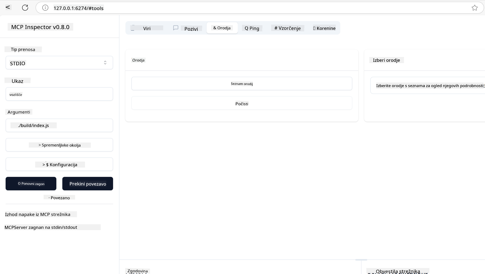
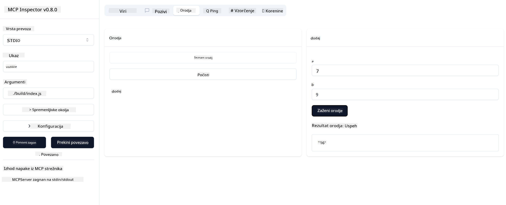

<!--
CO_OP_TRANSLATOR_METADATA:
{
  "original_hash": "d730cbe43a8efc148677fdbc849a7d5e",
  "translation_date": "2025-06-02T17:10:14+00:00",
  "source_file": "03-GettingStarted/01-first-server/README.md",
  "language_code": "sl"
}
-->
### -2- Ustvari projekt

Zdaj, ko imate nameščen SDK, ustvarimo naslednji projekt:

### -3- Ustvari projektne datoteke

### -4- Ustvari kodo strežnika

### -5- Dodajanje orodja in vira

Dodajte orodje in vir z naslednjo kodo:

### -6 Končna koda

Dodajmo še zadnjo kodo, ki jo potrebujemo, da se strežnik lahko zažene:

### -7- Testiraj strežnik

Zaženi strežnik z naslednjim ukazom:

### -8- Zaženi z uporabo inspectorja

Inspector je odlično orodje, ki lahko zažene vaš strežnik in vam omogoči interakcijo z njim, da lahko preizkusite, ali deluje. Zaženimo ga:

> [!NOTE]
> lahko izgleda drugače v polju "command", saj vsebuje ukaz za zagon strežnika z vašim specifičnim runtime-om

Videli boste naslednji uporabniški vmesnik:

1. Povežite se s strežnikom tako, da izberete gumb Connect  
   Ko se povežete s strežnikom, bi morali videti naslednje:

   

2. Izberite "Tools" in "listTools", prikazati bi se moral gumb "Add", izberite "Add" in vnesite vrednosti parametrov.

   Videli boste naslednji odgovor, torej rezultat orodja "add":

   

Čestitke, uspelo vam je ustvariti in zagnati vaš prvi strežnik!

### Uradni SDK-ji

MCP ponuja uradne SDK-je za več jezikov:
- [C# SDK](https://github.com/modelcontextprotocol/csharp-sdk) - vzdrževan v sodelovanju z Microsoftom
- [Java SDK](https://github.com/modelcontextprotocol/java-sdk) - vzdrževan v sodelovanju s Spring AI
- [TypeScript SDK](https://github.com/modelcontextprotocol/typescript-sdk) - uradna implementacija za TypeScript
- [Python SDK](https://github.com/modelcontextprotocol/python-sdk) - uradna implementacija za Python
- [Kotlin SDK](https://github.com/modelcontextprotocol/kotlin-sdk) - uradna implementacija za Kotlin
- [Swift SDK](https://github.com/modelcontextprotocol/swift-sdk) - vzdrževan v sodelovanju z Loopwork AI
- [Rust SDK](https://github.com/modelcontextprotocol/rust-sdk) - uradna implementacija za Rust

## Ključne ugotovitve

- Nastavitev MCP razvojnega okolja je preprosta z jezikovno specifičnimi SDK-ji
- Izgradnja MCP strežnikov vključuje ustvarjanje in registracijo orodij z jasnimi shemami
- Testiranje in odpravljanje napak sta ključna za zanesljive MCP implementacije

## Vzorci

- [Java kalkulator](../samples/java/calculator/README.md)
- [.Net kalkulator](../../../../03-GettingStarted/samples/csharp)
- [JavaScript kalkulator](../samples/javascript/README.md)
- [TypeScript kalkulator](../samples/typescript/README.md)
- [Python kalkulator](../../../../03-GettingStarted/samples/python)

## Naloga

Ustvarite preprost MCP strežnik z orodjem po vaši izbiri:
1. Implementirajte orodje v vašem priljubljenem jeziku (.NET, Java, Python ali JavaScript).
2. Določite vhodne parametre in povratne vrednosti.
3. Zaženite inspector orodje, da zagotovite, da strežnik deluje kot je predvideno.
4. Testirajte implementacijo z različnimi vnosi.

## Rešitev

[Rešitev](./solution/README.md)

## Dodatni viri

- [MCP GitHub repozitorij](https://github.com/microsoft/mcp-for-beginners)

## Kaj sledi

Naslednje: [Začetek z MCP klienti](/03-GettingStarted/02-client/README.md)

**Opozorilo**:  
Ta dokument je bil preveden z uporabo AI prevajalske storitve [Co-op Translator](https://github.com/Azure/co-op-translator). Čeprav si prizadevamo za natančnost, vas prosimo, da upoštevate, da avtomatizirani prevodi lahko vsebujejo napake ali netočnosti. Izvirni dokument v njegovem izvirnem jeziku velja za avtoritativni vir. Za kritične informacije priporočamo strokovni človeški prevod. Ne odgovarjamo za morebitna nesporazume ali napačne interpretacije, ki izhajajo iz uporabe tega prevoda.