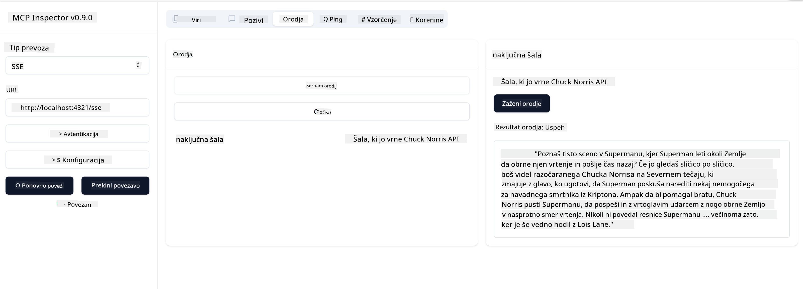

<!--
CO_OP_TRANSLATOR_METADATA:
{
  "original_hash": "d90ca3d326c48fab2ac0ebd3a9876f59",
  "translation_date": "2025-07-04T19:14:57+00:00",
  "source_file": "03-GettingStarted/05-sse-server/README.md",
  "language_code": "sl"
}
-->
Zdaj, ko vemo nekaj več o SSE, pa zgradimo še SSE strežnik.

## Vaja: Ustvarjanje SSE strežnika

Za ustvarjanje našega strežnika moramo upoštevati dve stvari:

- Potrebujemo spletni strežnik, ki bo izpostavil končne točke za povezavo in sporočila.
- Strežnik zgradimo kot običajno, z orodji, viri in pozivi, kot smo to počeli pri stdio.

### -1- Ustvarjanje instance strežnika

Za ustvarjanje strežnika uporabimo iste tipe kot pri stdio. Vendar pa moramo za transport izbrati SSE.

Dodajmo naslednje poti.

### -2- Dodajanje poti

Dodajmo poti, ki upravljajo povezavo in dohodna sporočila:

Dodajmo strežniku še funkcionalnosti.

### -3- Dodajanje zmogljivosti strežnika

Zdaj, ko imamo vse, kar je specifično za SSE, definirano, dodajmo strežniku zmogljivosti, kot so orodja, pozivi in viri.

Vaša celotna koda bi morala izgledati tako:

Odlično, imamo strežnik, ki uporablja SSE, preizkusimo ga.

## Vaja: Odpravljanje napak SSE strežnika z Inspectorjem

Inspector je odlično orodje, ki smo ga videli v prejšnji lekciji [Ustvarjanje vašega prvega strežnika](/03-GettingStarted/01-first-server/README.md). Preverimo, ali ga lahko uporabimo tudi tukaj:

### -1- Zagon Inspectorja

Za zagon Inspectorja morate najprej imeti zagnan SSE strežnik, zato ga najprej zaženimo:

1. Zaženite strežnik

1. Zaženite Inspector

    > ![NOTE]
    > To zaženite v ločenem terminalskem oknu, kot je tisto, kjer teče strežnik. Prav tako prilagodite spodnji ukaz URL-ju, kjer vaš strežnik teče.

    ```sh
    npx @modelcontextprotocol/inspector --cli http://localhost:8000/sse --method tools/list
    ```

Zagon Inspectorja je enak v vseh runtime okoljih. Opazite, da namesto da bi podali pot do strežnika in ukaz za zagon strežnika, podamo URL, kjer strežnik teče, in določimo pot `/sse`.

### -2- Preizkus orodja

Povežite strežnik tako, da v spustnem seznamu izberete SSE in v polje za URL vpišete naslov, kjer vaš strežnik teče, na primer http:localhost:4321/sse. Nato kliknite gumb "Connect". Kot prej izberite seznam orodij, izberite orodje in vnesite vhodne vrednosti. Rezultat bi moral biti podoben spodnjemu:



Odlično, lahko delate z Inspectorjem, poglejmo zdaj, kako delati z Visual Studio Code.

## Naloga

Poskusite razširiti svoj strežnik z več zmogljivostmi. Oglejte si [to stran](https://api.chucknorris.io/), da na primer dodate orodje, ki kliče API. Vi odločite, kako naj strežnik izgleda. Zabavajte se :)

## Rešitev

[Rešitev](./solution/README.md) Tukaj je možna rešitev z delujočo kodo.

## Ključne ugotovitve

Ključne ugotovitve iz tega poglavja so naslednje:

- SSE je drugi podprti transport poleg stdio.
- Za podporo SSE morate upravljati dohodne povezave in sporočila z uporabo spletnega ogrodja.
- Za uporabo SSE strežnika lahko uporabite tako Inspector kot Visual Studio Code, podobno kot pri stdio strežnikih. Opazite, da se nekoliko razlikuje med stdio in SSE. Pri SSE morate strežnik zagnati ločeno in nato zagnati orodje Inspector. Pri Inspectorju je tudi razlika, da morate določiti URL.

## Primeri

- [Java Calculator](../samples/java/calculator/README.md)
- [.Net Calculator](../../../../03-GettingStarted/samples/csharp)
- [JavaScript Calculator](../samples/javascript/README.md)
- [TypeScript Calculator](../samples/typescript/README.md)
- [Python Calculator](../../../../03-GettingStarted/samples/python)

## Dodatni viri

- [SSE](https://developer.mozilla.org/en-US/docs/Web/API/Server-sent_events)

## Kaj sledi

- Naslednje: [HTTP Streaming z MCP (Streamable HTTP)](../06-http-streaming/README.md)

**Omejitev odgovornosti**:  
Ta dokument je bil preveden z uporabo AI prevajalske storitve [Co-op Translator](https://github.com/Azure/co-op-translator). Čeprav si prizadevamo za natančnost, vas opozarjamo, da avtomatizirani prevodi lahko vsebujejo napake ali netočnosti. Izvirni dokument v njegovem izvirnem jeziku velja za avtoritativni vir. Za ključne informacije priporočamo strokovni človeški prevod. Za morebitna nesporazume ali napačne interpretacije, ki izhajajo iz uporabe tega prevoda, ne odgovarjamo.