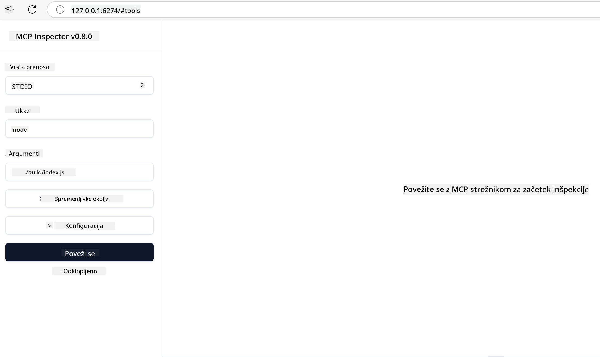

<!--
CO_OP_TRANSLATOR_METADATA:
{
  "original_hash": "4e34e34e84f013e73c7eaa6d09884756",
  "translation_date": "2025-07-04T19:15:07+00:00",
  "source_file": "03-GettingStarted/08-testing/README.md",
  "language_code": "sl"
}
-->
## Testiranje in odpravljanje napak

Preden začnete s testiranjem vašega MCP strežnika, je pomembno razumeti razpoložljiva orodja in najboljše prakse za odpravljanje napak. Učinkovito testiranje zagotavlja, da vaš strežnik deluje tako, kot je pričakovano, in vam pomaga hitro odkriti ter odpraviti težave. Naslednji razdelek opisuje priporočene pristope za preverjanje vaše MCP implementacije.

## Pregled

Ta lekcija zajema, kako izbrati pravi pristop k testiranju in najučinkovitejše orodje za testiranje.

## Cilji učenja

Do konca te lekcije boste znali:

- Opisati različne pristope k testiranju.
- Uporabiti različna orodja za učinkovito testiranje vaše kode.

## Testiranje MCP strežnikov

MCP ponuja orodja, ki vam pomagajo testirati in odpravljati napake na vaših strežnikih:

- **MCP Inspector**: Orodje ukazne vrstice, ki ga lahko uporabljate tako kot CLI orodje ali kot vizualno orodje.
- **Ročno testiranje**: Uporabite lahko orodje, kot je curl, za izvajanje spletnih zahtevkov, vendar bo katerokoli orodje, ki podpira HTTP, prav tako ustrezno.
- **Enotno testiranje**: Možno je uporabiti vaš najljubši testni okvir za testiranje funkcionalnosti tako strežnika kot odjemalca.

### Uporaba MCP Inspectorja

Uporabo tega orodja smo opisali v prejšnjih lekcijah, a poglejmo ga na splošno. Gre za orodje, napisano v Node.js, ki ga lahko uporabite z zagonom izvršljive datoteke `npx`, ki bo začasno prenesla in namestila orodje ter ga po končanem izvajanju samodejno odstranila.

[MCP Inspector](https://github.com/modelcontextprotocol/inspector) vam pomaga:

- **Odkriti zmogljivosti strežnika**: Samodejno zazna razpoložljive vire, orodja in pozive
- **Testirati izvajanje orodij**: Preizkusite različne parametre in si oglejte odzive v realnem času
- **Pregledati metapodatke strežnika**: Preučite informacije o strežniku, sheme in nastavitve

Tipičen zagon orodja izgleda takole:

```bash
npx @modelcontextprotocol/inspector node build/index.js
```

Zgornji ukaz zažene MCP in njegovo vizualno vmesnik ter odpre lokalni spletni vmesnik v vašem brskalniku. Pričakujete lahko nadzorno ploščo, ki prikazuje vaše registrirane MCP strežnike, njihova razpoložljiva orodja, vire in pozive. Vmesnik omogoča interaktivno testiranje izvajanja orodij, pregled metapodatkov strežnika in ogled odzivov v realnem času, kar olajša preverjanje in odpravljanje napak v implementacijah MCP strežnikov.

Tako lahko izgleda: 

Orodje lahko zaženete tudi v CLI načinu, pri čemer dodate atribut `--cli`. Tukaj je primer zagona orodja v "CLI" načinu, ki izpiše vsa orodja na strežniku:

```sh
npx @modelcontextprotocol/inspector --cli node build/index.js --method tools/list
```

### Ročno testiranje

Poleg zagona orodja inspector za testiranje zmogljivosti strežnika, je podoben pristop zagon odjemalca, ki podpira HTTP, na primer curl.

S curl lahko neposredno testirate MCP strežnike z uporabo HTTP zahtevkov:

```bash
# Example: Test server metadata
curl http://localhost:3000/v1/metadata

# Example: Execute a tool
curl -X POST http://localhost:3000/v1/tools/execute \
  -H "Content-Type: application/json" \
  -d '{"name": "calculator", "parameters": {"expression": "2+2"}}'
```

Kot vidite iz zgornje uporabe curl, uporabite POST zahtevek za klic orodja z uporabo podatkov, ki vsebujejo ime orodja in njegove parametre. Uporabite pristop, ki vam najbolj ustreza. CLI orodja so na splošno hitrejša za uporabo in jih je mogoče avtomatizirati, kar je lahko koristno v CI/CD okolju.

### Enotno testiranje

Ustvarite enotne teste za vaša orodja in vire, da zagotovite, da delujejo kot pričakovano. Tukaj je primer testne kode.

```python
import pytest

from mcp.server.fastmcp import FastMCP
from mcp.shared.memory import (
    create_connected_server_and_client_session as create_session,
)

# Mark the whole module for async tests
pytestmark = pytest.mark.anyio


async def test_list_tools_cursor_parameter():
    """Test that the cursor parameter is accepted for list_tools.

    Note: FastMCP doesn't currently implement pagination, so this test
    only verifies that the cursor parameter is accepted by the client.
    """

 server = FastMCP("test")

    # Create a couple of test tools
    @server.tool(name="test_tool_1")
    async def test_tool_1() -> str:
        """First test tool"""
        return "Result 1"

    @server.tool(name="test_tool_2")
    async def test_tool_2() -> str:
        """Second test tool"""
        return "Result 2"

    async with create_session(server._mcp_server) as client_session:
        # Test without cursor parameter (omitted)
        result1 = await client_session.list_tools()
        assert len(result1.tools) == 2

        # Test with cursor=None
        result2 = await client_session.list_tools(cursor=None)
        assert len(result2.tools) == 2

        # Test with cursor as string
        result3 = await client_session.list_tools(cursor="some_cursor_value")
        assert len(result3.tools) == 2

        # Test with empty string cursor
        result4 = await client_session.list_tools(cursor="")
        assert len(result4.tools) == 2
    
```

Zgornja koda naredi naslednje:

- Uporablja pytest okvir, ki omogoča ustvarjanje testov kot funkcij in uporabo assert stavkov.
- Ustvari MCP strežnik z dvema različnima orodjema.
- Uporabi `assert` stavek za preverjanje, da so določeni pogoji izpolnjeni.

Oglejte si [celotno datoteko tukaj](https://github.com/modelcontextprotocol/python-sdk/blob/main/tests/client/test_list_methods_cursor.py)

Na podlagi zgornje datoteke lahko testirate svoj strežnik, da zagotovite, da so zmogljivosti ustvarjene tako, kot je treba.

Vsi glavni SDK-ji imajo podobne teste, zato jih lahko prilagodite svojemu izbranemu runtime okolju.

## Primeri

- [Java Calculator](../samples/java/calculator/README.md)
- [.Net Calculator](../../../../03-GettingStarted/samples/csharp)
- [JavaScript Calculator](../samples/javascript/README.md)
- [TypeScript Calculator](../samples/typescript/README.md)
- [Python Calculator](../../../../03-GettingStarted/samples/python)

## Dodatni viri

- [Python SDK](https://github.com/modelcontextprotocol/python-sdk)

## Kaj sledi

- Naslednje: [Deployment](../09-deployment/README.md)

**Omejitev odgovornosti**:  
Ta dokument je bil preveden z uporabo AI prevajalske storitve [Co-op Translator](https://github.com/Azure/co-op-translator). Čeprav si prizadevamo za natančnost, vas opozarjamo, da avtomatizirani prevodi lahko vsebujejo napake ali netočnosti. Izvirni dokument v njegovem izvirnem jeziku velja za avtoritativni vir. Za ključne informacije priporočamo strokovni človeški prevod. Za morebitna nesporazume ali napačne interpretacije, ki izhajajo iz uporabe tega prevoda, ne odgovarjamo.