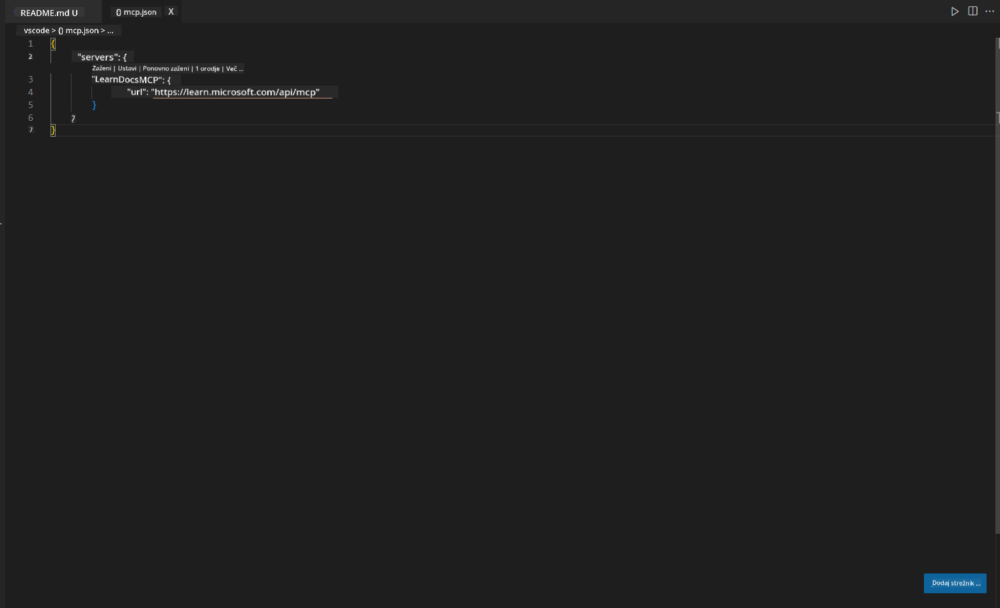
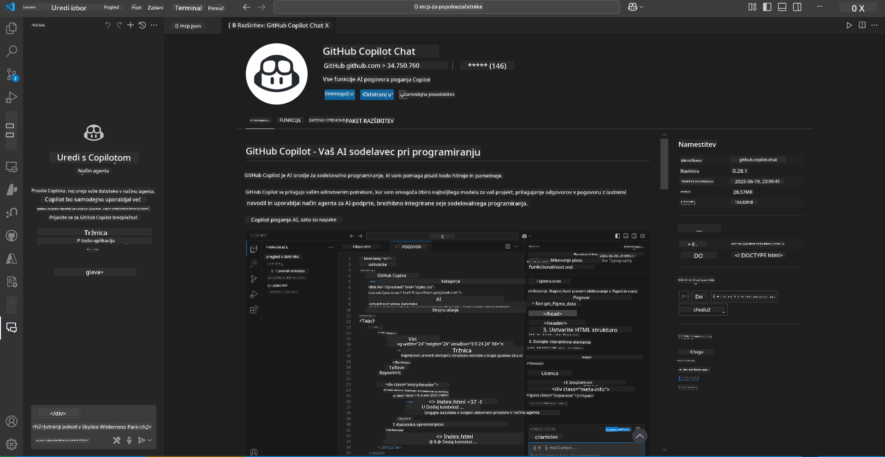
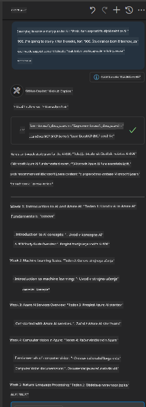
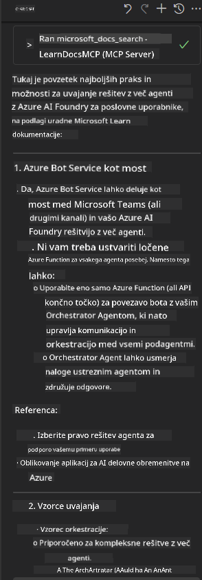

<!--
CO_OP_TRANSLATOR_METADATA:
{
  "original_hash": "db532b1ec386c9ce38c791653dc3c881",
  "translation_date": "2025-06-21T14:44:50+00:00",
  "source_file": "09-CaseStudy/docs-mcp/solution/scenario3/README.md",
  "language_code": "sl"
}
-->
# Scenarij 3: Dokumentacija v urejevalniku z MCP strežnikom v VS Code

## Pregled

V tem scenariju se boste naučili, kako Microsoft Learn Docs neposredno pripeljati v vaše okolje Visual Studio Code z uporabo MCP strežnika. Namesto da bi nenehno preklapljali med zavihki brskalnika za iskanje dokumentacije, lahko uradne dokumente dostopate, iščete in sklicujete kar znotraj urejevalnika. Ta pristop poenostavi vaš delovni proces, ohranja vašo osredotočenost in omogoča nemoteno integracijo z orodji, kot je GitHub Copilot.

- Iskanje in branje dokumentacije znotraj VS Code, brez odhoda iz razvojnega okolja.
- Sklicevanje na dokumentacijo in vstavljanje povezav neposredno v vaše README ali datoteke tečajev.
- Uporaba GitHub Copilota in MCP skupaj za tekoč delovni proces, podprt z umetno inteligenco.

## Cilji učenja

Na koncu tega poglavja boste razumeli, kako nastaviti in uporabljati MCP strežnik znotraj VS Code za izboljšanje dokumentacije in razvojnega procesa. Naučili se boste:

- Konfigurirati delovno okolje za uporabo MCP strežnika pri iskanju dokumentacije.
- Iskati in vstavljati dokumentacijo neposredno iz VS Code.
- Združiti moč GitHub Copilota in MCP za bolj produktiven, z umetno inteligenco podprt delovni proces.

Te veščine vam bodo pomagale ohranjati osredotočenost, izboljšati kakovost dokumentacije in povečati vašo produktivnost kot razvijalec ali tehnični pisec.

## Rešitev

Za dostop do dokumentacije neposredno v urejevalniku boste sledili seriji korakov, ki integrirajo MCP strežnik z VS Code in GitHub Copilotom. Ta rešitev je idealna za avtorje tečajev, pisce dokumentacije in razvijalce, ki želijo ohraniti osredotočenost v urejevalniku med delom z dokumenti in Copilotom.

- Hitro dodajte referenčne povezave v README med pisanjem tečaja ali projektne dokumentacije.
- Uporabite Copilota za generiranje kode in MCP za takojšnje iskanje ter navajanje ustrezne dokumentacije.
- Ostanite osredotočeni v urejevalniku in povečajte produktivnost.

### Korak za korakom

Za začetek sledite tem korakom. Za vsak korak lahko dodate posnetek zaslona iz mape z viri, da vizualno ponazorite postopek.

1. **Dodajte MCP konfiguracijo:**  
   V korenski mapi vašega projekta ustvarite datoteko `.vscode/mcp.json` in vanjo dodajte naslednjo konfiguracijo:  
   ```json
   {
     "servers": {
       "LearnDocsMCP": {
         "url": "https://learn.microsoft.com/api/mcp"
       }
     }
   }
   ```  
   Ta konfiguracija pove VS Code, kako se povezati z [`Microsoft Learn Docs MCP strežnikom`](https://github.com/MicrosoftDocs/mcp).  
   
   
    
2. **Odprite ploščo GitHub Copilot Chat:**  
   Če še nimate nameščene razširitve GitHub Copilot, pojdite v pogled Extensions v VS Code in jo namestite. Lahko jo prenesete neposredno iz [Visual Studio Code Marketplace](https://marketplace.visualstudio.com/items?itemName=GitHub.copilot-chat). Nato odprite ploščo Copilot Chat na stranski vrstici.

   

3. **Omogočite agent mode in preverite orodja:**  
   V plošči Copilot Chat omogočite agent mode.

   

   Po vklopu agent mode preverite, da je MCP strežnik na seznamu razpoložljivih orodij. To zagotavlja, da lahko Copilot agent dostopa do strežnika dokumentacije in pridobi ustrezne informacije.  
   
   

4. **Začnite nov pogovor in zastavite vprašanje agentu:**  
   Odprite nov pogovor v plošči Copilot Chat. Zdaj lahko agentu zastavite vprašanja glede dokumentacije. Agent bo uporabil MCP strežnik, da pridobi in prikaže ustrezno Microsoft Learn dokumentacijo neposredno v vašem urejevalniku.

   - *"Poskušam napisati študijski načrt za temo X. Študiral jo bom 8 tednov, za vsak teden predlagaj vsebino, ki naj jo pokrijem."*

   

5. **Živo poizvedovanje:**

   > Vzemimo primer iz [#get-help](https://discord.gg/D6cRhjHWSC) kanala na Azure AI Foundry Discordu ([prikaži izvirno sporočilo](https://discord.com/channels/1113626258182504448/1385498306720829572)):
   
   *"Iščem odgovore, kako namestiti rešitev z več agenti, ki temeljijo na AI agentih, razvitih na Azure AI Foundry. Vidim, da ni neposrednega načina namestitve, kot so kanali Copilot Studia. Kakšni so različni načini za to namestitev, da lahko podjetniški uporabniki sodelujejo in opravijo delo?  
Obstaja veliko člankov in blogov, ki pravijo, da lahko uporabimo Azure Bot storitev kot most med MS Teams in Azure AI Foundry agenti. Ali bo to delovalo, če nastavim Azure bota, ki se poveže z Orchestrator agentom na Azure AI Foundry preko Azure funkcije za orkestracijo, ali pa moram ustvariti Azure funkcijo za vsakega AI agenta v rešitvi z več agenti, da opravim orkestracijo v Bot frameworku? Vsak drug predlog je zelo dobrodošel."*

   

   Agent bo odgovoril z ustreznimi povezavami do dokumentacije in povzetki, ki jih lahko nato neposredno vstavite v svoje markdown datoteke ali uporabite kot reference v kodi.

### Primeri poizvedb

Tukaj je nekaj primerov vprašanj, ki jih lahko preizkusite. Ta vprašanja prikazujejo, kako MCP strežnik in Copilot lahko skupaj zagotovita takojšnjo, kontekstualno dokumentacijo in reference, brez zapuščanja VS Code:

- "Pokaži mi, kako uporabljati sprožilce Azure Functions."
- "Vstavi povezavo do uradne dokumentacije za Azure Key Vault."
- "Kakšne so najboljše prakse za varovanje Azure virov?"
- "Najdi hitri začetek za Azure AI storitve."

Ti primeri bodo prikazali, kako MCP strežnik in Copilot skupaj omogočata takojšen dostop do dokumentacije in referenc znotraj VS Code.

**Omejitev odgovornosti**:  
Ta dokument je bil preveden z uporabo AI prevajalske storitve [Co-op Translator](https://github.com/Azure/co-op-translator). Čeprav si prizadevamo za natančnost, vas opozarjamo, da avtomatizirani prevodi lahko vsebujejo napake ali netočnosti. Izvirni dokument v njegovem izvirnem jeziku velja za avtoritativni vir. Za ključne informacije priporočamo strokovni človeški prevod. Za morebitna nesporazume ali napačne interpretacije, ki izhajajo iz uporabe tega prevoda, ne prevzemamo odgovornosti.