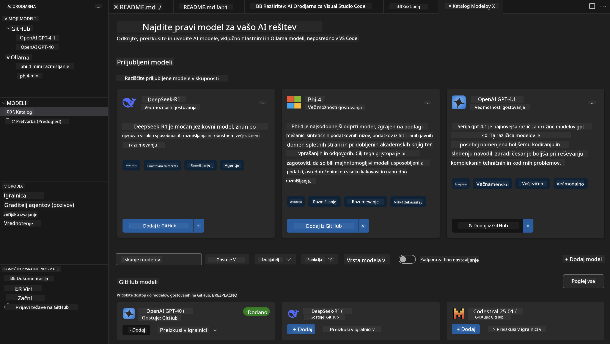
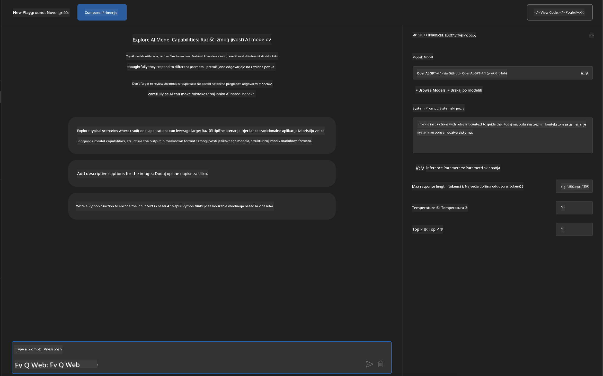
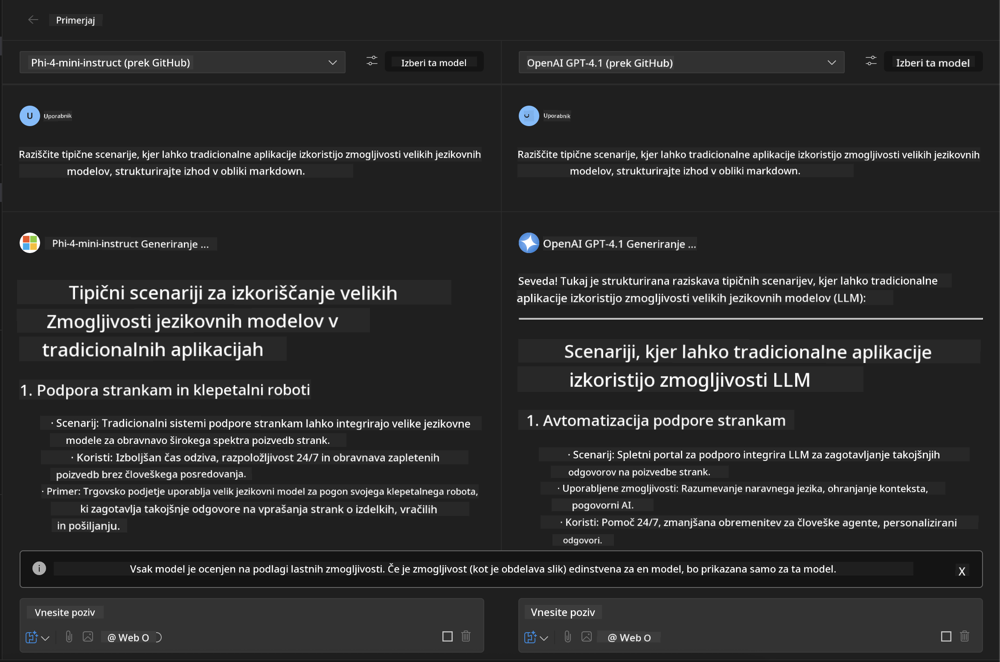

<!--
CO_OP_TRANSLATOR_METADATA:
{
  "original_hash": "2aa9dbc165e104764fa57e8a0d3f1c73",
  "translation_date": "2025-06-10T05:33:10+00:00",
  "source_file": "10-StreamliningAIWorkflowsBuildingAnMCPServerWithAIToolkit/lab1/README.md",
  "language_code": "sl"
}
-->
# 🚀 Module 1: AI Toolkit Fundamentals

[]()
[]()
[]()

## 📋 Learning Objectives

By the end of this module, you will be able to:
- ✅ Install and set up AI Toolkit for Visual Studio Code
- ✅ Explore the Model Catalog and learn about different model sources
- ✅ Use the Playground for testing and experimenting with models
- ✅ Build custom AI agents using Agent Builder
- ✅ Compare model performance across various providers
- ✅ Apply best practices for prompt engineering

## 🧠 Introduction to AI Toolkit (AITK)

The **AI Toolkit for Visual Studio Code** is Microsoft’s premier extension that turns VS Code into a full AI development environment. It bridges AI research and practical app development, making generative AI accessible for developers at any skill level.

### 🌟 Key Capabilities

| Feature | Description | Use Case |
|---------|-------------|----------|
| **🗂️ Model Catalog** | Access over 100 models from GitHub, ONNX, OpenAI, Anthropic, Google | Discover and select models |
| **🔌 BYOM Support** | Integrate your own models (local or remote) | Deploy custom models |
| **🎮 Interactive Playground** | Test models live with a chat interface | Fast prototyping and experimentation |
| **📎 Multi-Modal Support** | Work with text, images, and attachments | Build complex AI apps |
| **⚡ Batch Processing** | Run multiple prompts at once | Efficient testing workflows |
| **📊 Model Evaluation** | Built-in metrics (F1, relevance, similarity, coherence) | Assess model performance |

### 🎯 Why AI Toolkit Matters

- **🚀 Faster Development**: Go from idea to prototype in minutes
- **🔄 Unified Workflow**: One interface for multiple AI providers
- **🧪 Easy Experimentation**: Compare models without complicated setup
- **📈 Production Ready**: Smooth transition from prototype to deployment

## 🛠️ Prerequisites & Setup

### 📦 Install AI Toolkit Extension

**Step 1: Open Extensions Marketplace**
1. Launch Visual Studio Code
2. Go to the Extensions view (`Ctrl+Shift+X` or `Cmd+Shift+X`)
3. Search for "AI Toolkit"

**Step 2: Pick Your Version**
- **🟢 Release**: Recommended for production
- **🔶 Pre-release**: Early access to new features

**Step 3: Install and Activate**


### ✅ Verification Checklist
- [ ] AI Toolkit icon appears in VS Code sidebar
- [ ] Extension is enabled and active
- [ ] No installation errors in output panel

## 🧪 Hands-on Exercise 1: Exploring GitHub Models

**🎯 Objective**: Get comfortable with the Model Catalog and test your first AI model

### 📊 Step 1: Navigate the Model Catalog

The Model Catalog is your entry point into the AI ecosystem. It collects models from multiple providers, making discovery and comparison simple.

**🔍 How to Navigate:**

Click **MODELS - Catalog** in the AI Toolkit sidebar



**💡 Pro Tip**: Look for models with features that fit your needs (e.g., code generation, creative writing, analysis).

**⚠️ Note**: GitHub-hosted models are free but have rate limits on requests and tokens. To access non-GitHub models (like those hosted via Azure AI or other endpoints), you’ll need the correct API key or authentication.

### 🚀 Step 2: Add and Configure Your First Model

**Model Selection Tips:**
- **GPT-4.1**: Best for complex reasoning and analysis
- **Phi-4-mini**: Lightweight and fast for simple tasks

**🔧 Configuration Steps:**
1. Select **OpenAI GPT-4.1** from the catalog
2. Click **Add to My Models** to register it for use
3. Choose **Try in Playground** to open the testing area
4. Wait for the model to initialize (first setup might take a moment)



**⚙️ Model Parameters Explained:**
- **Temperature**: Controls creativity (0 = predictable, 1 = creative)
- **Max Tokens**: Maximum length of the response
- **Top-p**: Controls diversity via nucleus sampling

### 🎯 Step 3: Master the Playground Interface

The Playground is your AI experimentation space. Here’s how to get the most out of it:

**🎨 Prompt Engineering Best Practices:**
1. **Be Specific**: Clear, detailed instructions get better results
2. **Provide Context**: Add relevant background info
3. **Use Examples**: Show the model what you want with examples
4. **Iterate**: Refine prompts based on initial outputs

**🧪 Testing Scenarios:**
```markdown
# Example 1: Code Generation
"Write a Python function that calculates the factorial of a number using recursion. Include error handling and docstrings."

# Example 2: Creative Writing
"Write a professional email to a client explaining a project delay, maintaining a positive tone while being transparent about challenges."

# Example 3: Data Analysis
"Analyze this sales data and provide insights: [paste your data]. Focus on trends, anomalies, and actionable recommendations."
```


### 🏆 Challenge Exercise: Model Performance Comparison

**🎯 Goal**: Compare different models using the same prompts to see their strengths

**📋 Instructions:**
1. Add **Phi-4-mini** to your workspace
2. Use the same prompt for both GPT-4.1 and Phi-4-mini


3. Compare response quality, speed, and accuracy
4. Record your observations in the results section



**💡 Key Takeaways:**
- When to use LLM vs SLM
- Balancing cost and performance
- Unique strengths of each model

## 🤖 Hands-on Exercise 2: Building Custom Agents with Agent Builder

**🎯 Objective**: Create AI agents customized for specific tasks and workflows

### 🏗️ Step 1: Understanding Agent Builder

Agent Builder is where AI Toolkit really shines. It lets you create AI assistants tailored to your needs by combining large language models with custom instructions, parameters, and expert knowledge.

**🧠 Agent Architecture Components:**
- **Core Model**: The base LLM (GPT-4, Groks, Phi, etc.)
- **System Prompt**: Defines agent personality and behavior
- **Parameters**: Fine-tuned settings for best results
- **Tools Integration**: Connect external APIs and MCP services
- **Memory**: Keeps conversation context and session history


### ⚙️ Step 2: Agent Configuration Deep Dive

**🎨 Crafting Effective System Prompts:**
```markdown
# Template Structure:
## Role Definition
You are a [specific role] with expertise in [domain].

## Capabilities
- List specific abilities
- Define scope of knowledge
- Clarify limitations

## Behavior Guidelines
- Response style (formal, casual, technical)
- Output format preferences
- Error handling approach

## Examples
Provide 2-3 examples of ideal interactions
```

*You can also use Generate System Prompt to have AI help you create and optimize prompts*

**🔧 Parameter Optimization:**
| Parameter | Recommended Range | Use Case |
|-----------|------------------|----------|
| **Temperature** | 0.1-0.3 | Technical or factual replies |
| **Temperature** | 0.7-0.9 | Creative or brainstorming tasks |
| **Max Tokens** | 500-1000 | Concise answers |
| **Max Tokens** | 2000-4000 | Detailed explanations |

### 🐍 Step 3: Practical Exercise - Python Programming Agent

**🎯 Mission**: Build a Python coding assistant

**📋 Configuration Steps:**

1. **Model Selection**: Pick **Claude 3.5 Sonnet** (great for coding)

2. **System Prompt Design**:
```markdown
# Python Programming Expert Agent

## Role
You are a senior Python developer with 10+ years of experience. You excel at writing clean, efficient, and well-documented Python code.

## Capabilities
- Write production-ready Python code
- Debug complex issues
- Explain code concepts clearly
- Suggest best practices and optimizations
- Provide complete working examples

## Response Format
- Always include docstrings
- Add inline comments for complex logic
- Suggest testing approaches
- Mention relevant libraries when applicable

## Code Quality Standards
- Follow PEP 8 style guidelines
- Use type hints where appropriate
- Handle exceptions gracefully
- Write readable, maintainable code
```

3. **Parameter Setup**:
   - Temperature: 0.2 (for consistent, reliable code)
   - Max Tokens: 2000 (for detailed responses)
   - Top-p: 0.9 (balanced creativity)


### 🧪 Step 4: Testing Your Python Agent

**Test Scenarios:**
1. **Basic Function**: "Create a function to find prime numbers"
2. **Complex Algorithm**: "Implement a binary search tree with insert, delete, and search methods"
3. **Real-world Problem**: "Build a web scraper that handles rate limiting and retries"
4. **Debugging**: "Fix this code [paste buggy code]"

**🏆 Success Criteria:**
- ✅ Code runs without errors
- ✅ Includes proper documentation
- ✅ Follows Python best practices
- ✅ Provides clear explanations
- ✅ Suggests improvements

## 🎓 Module 1 Wrap-Up & Next Steps

### 📊 Knowledge Check

Test your understanding:
- [ ] Can you explain differences between models in the catalog?
- [ ] Have you successfully created and tested a custom agent?
- [ ] Do you know how to optimize parameters for various tasks?
- [ ] Can you design effective system prompts?

### 📚 Additional Resources

- **AI Toolkit Documentation**: [Official Microsoft Docs](https://github.com/microsoft/vscode-ai-toolkit)
- **Prompt Engineering Guide**: [Best Practices](https://platform.openai.com/docs/guides/prompt-engineering)
- **Models in AI Toolkit**: [Models in Development](https://github.com/microsoft/vscode-ai-toolkit/blob/main/doc/models.md)

**🎉 Congratulations!** You’ve mastered the basics of AI Toolkit and are ready to build more advanced AI apps!

### 🔜 Continue to Next Module

Ready to dive deeper? Move on to **[Module 2: MCP with AI Toolkit Fundamentals](../lab2/README.md)** to learn how to:
- Connect your agents to external tools using Model Context Protocol (MCP)
- Build browser automation agents with Playwright
- Integrate MCP servers with your AI Toolkit agents
- Supercharge your agents with external data and capabilities

**Izjava o omejitvi odgovornosti**:  
Ta dokument je bil preveden z uporabo storitve za avtomatski prevod AI [Co-op Translator](https://github.com/Azure/co-op-translator). Čeprav si prizadevamo za natančnost, upoštevajte, da avtomatizirani prevodi lahko vsebujejo napake ali netočnosti. Izvirni dokument v njegovem izvirnem jeziku je treba upoštevati kot avtoritativni vir. Za kritične informacije priporočamo strokovni človeški prevod. Nismo odgovorni za morebitna nesporazume ali napačne interpretacije, ki izhajajo iz uporabe tega prevoda.