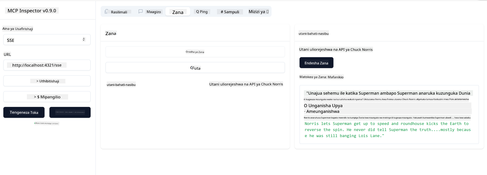

<!--
CO_OP_TRANSLATOR_METADATA:
{
  "original_hash": "64645691bf0985f1760b948123edf269",
  "translation_date": "2025-06-13T10:55:47+00:00",
  "source_file": "03-GettingStarted/05-sse-server/README.md",
  "language_code": "sw"
}
-->
Sasa tunapojua kidogo zaidi kuhusu SSE, hebu tujenge server ya SSE sasa.

## Zoefu: Kuunda Server ya SSE

Ili kuunda server yetu, tunahitaji kuzingatia mambo mawili:

- Tunahitaji kutumia web server kufungua endpoints za muunganisho na ujumbe.
- Jenga server yetu kama kawaida tunavyofanya kwa kutumia zana, rasilimali na maelekezo tulipokuwa tunatumia stdio.

### -1- Unda mfano wa server

Ili kuunda server yetu, tunatumia aina sawa na ile ya stdio. Hata hivyo, kwa usafirishaji, tunahitaji kuchagua SSE.

Hebu tuongeze njia zinazohitajika sasa.

### -2- Ongeza njia

Hebu tuongeze njia zinazoshughulikia muunganisho na ujumbe unaokuja:

Sasa tuongeze uwezo kwa server.

### -3- Kuongeza uwezo wa server

Sasa tumeeleza kila kitu maalum kwa SSE, tuongeze uwezo wa server kama zana, maelekezo na rasilimali.

Msimbo wako mzima unapaswa kuonekana kama ifuatavyo:

Nzuri, tuna server inayotumia SSE, hebu tuijaribu sasa.

## Zoefu: Kurekebisha Server ya SSE kwa kutumia Inspector

Inspector ni zana nzuri tuliyoiona katika somo la awali [Kuunda server yako ya kwanza](/03-GettingStarted/01-first-server/README.md). Hebu tazame kama tunaweza kutumia Inspector hata hapa:

### -1- Kuendesha inspector

Ili kuendesha inspector, kwanza lazima uwe na server ya SSE inayoendesha, kwa hiyo hebu tufanye hivyo sasa:

1. Endesha server

1. Endesha inspector

    > ![NOTE]
    > Endesha hii kwenye dirisha tofauti la terminal tofauti na ile server inayoendesha. Pia kumbuka, unahitaji kurekebisha amri ifuatayo ili iendane na URL ambapo server yako inaendesha.

    ```sh
    npx @modelcontextprotocol/inspector --cli http://localhost:8000/sse --method tools/list
    ```

Kuendesha inspector kunaonekana sawa katika mazingira yote ya runtime. Angalia jinsi badala ya kupitisha njia ya server yetu na amri ya kuanzisha server tunapita URL ambapo server inaendesha na pia tunabainisha njia `/sse`.

### -2- Kuijaribu zana

Unganisha server kwa kuchagua SSE kwenye droplist na jaza sehemu ya url ambapo server yako inaendesha, kwa mfano http:localhost:4321/sse. Sasa bonyeza kitufe cha "Connect". Kama awali, chagua kuorodhesha zana, chagua zana na toa maingizo. Unapaswa kuona matokeo kama ifuatavyo:



Nzuri, unaweza kutumia inspector, hebu tazame jinsi tunavyoweza kutumia Visual Studio Code sasa.

## Kazi ya Nyumbani

Jaribu kuendeleza server yako na uwezo zaidi. Tazama [ukurasa huu](https://api.chucknorris.io/) kwa mfano kuongeza zana inayopiga API, wewe uamuzi server itakuwaje. Furahia :)

## Suluhisho

[Suluhisho](./solution/README.md) Hapa kuna suluhisho linalowezekana lenye msimbo unaofanya kazi.

## Muhimu Kumbuka

Mambo muhimu kutoka sura hii ni yafuatayo:

- SSE ni usafirishaji wa pili unaoungwa mkono baada ya stdio.
- Kuunga mkono SSE, unahitaji kusimamia muunganisho unaoingia na ujumbe kwa kutumia fremu ya wavuti.
- Unaweza kutumia Inspector na Visual Studio Code kutumia server ya SSE, kama vile server za stdio. Angalia jinsi inavyotofautiana kidogo kati ya stdio na SSE. Kwa SSE, unahitaji kuanzisha server kando kisha kuendesha zana yako ya inspector. Kwa zana ya inspector, pia kuna tofauti kidogo kwa kuwa unahitaji kubainisha URL.

## Sampuli 

- [Java Calculator](../samples/java/calculator/README.md)
- [.Net Calculator](../../../../03-GettingStarted/samples/csharp)
- [JavaScript Calculator](../samples/javascript/README.md)
- [TypeScript Calculator](../samples/typescript/README.md)
- [Python Calculator](../../../../03-GettingStarted/samples/python) 

## Rasilimali Zaidi

- [SSE](https://developer.mozilla.org/en-US/docs/Web/API/Server-sent_events)

## Nini Kifuatacho

- Ifuatayo: [HTTP Streaming with MCP (Streamable HTTP)](/03-GettingStarted/06-http-streaming/README.md)

**Kasi ya kutolewa taarifa**:  
Hati hii imetafsiriwa kwa kutumia huduma ya tafsiri ya AI [Co-op Translator](https://github.com/Azure/co-op-translator). Ingawa tunajitahidi kuhakikisha usahihi, tafadhali fahamu kwamba tafsiri za kiotomatiki zinaweza kuwa na makosa au kasoro. Hati ya asili katika lugha yake ya asili inapaswa kuchukuliwa kama chanzo cha mamlaka. Kwa taarifa muhimu, tafsiri ya kitaalamu ya binadamu inapendekezwa. Hatuna dhamana kwa kutoelewana au tafsiri potofu zinazotokana na matumizi ya tafsiri hii.