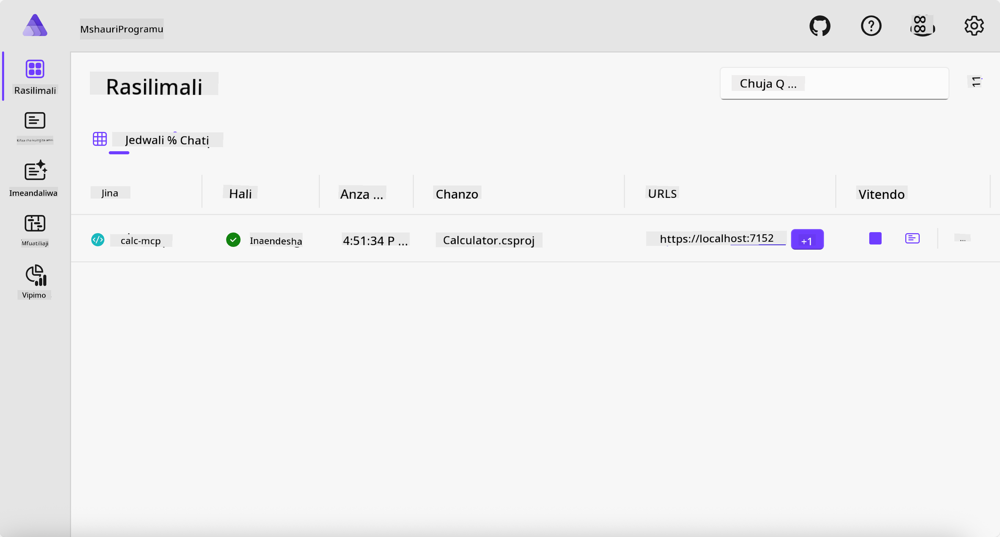
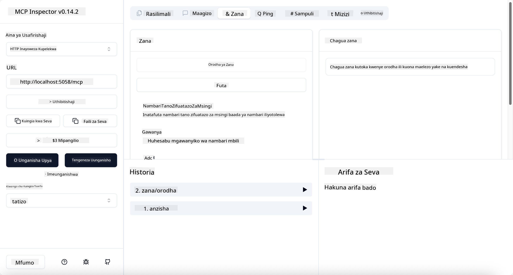

<!--
CO_OP_TRANSLATOR_METADATA:
{
  "original_hash": "0bc7bd48f55f1565f1d95ccb2c16f728",
  "translation_date": "2025-06-18T07:52:32+00:00",
  "source_file": "04-PracticalImplementation/samples/csharp/README.md",
  "language_code": "sw"
}
-->
# Mfano

Mfano uliopita unaonyesha jinsi ya kutumia mradi wa .NET wa ndani kwa aina ya `stdio`. Na jinsi ya kuendesha seva kwa ndani kwenye kontena. Hii ni suluhisho nzuri katika hali nyingi. Hata hivyo, inaweza kuwa na faida kuwa na seva inayotumia mbali, kama katika mazingira ya wingu. Hapa ndipo aina ya `http` inakuja.

Tukitazama suluhisho kwenye folda ya `04-PracticalImplementation`, linaweza kuonekana ngumu zaidi kuliko ile ya awali. Lakini kwa kweli, si hivyo. Ukitazama kwa makini mradi wa `src/Calculator`, utaona kwamba ni kanuni karibu sawa na mfano uliopita. Tofauti pekee ni kwamba tunatumia maktaba tofauti `ModelContextProtocol.AspNetCore` kushughulikia maombi ya HTTP. Na tunabadilisha njia `IsPrime` kuifanya kuwa ya faragha, tu kuonyesha kwamba unaweza kuwa na njia za faragha katika kanuni zako. Mengine yote ya kanuni ni sawa na awali.

Miradi mingine ni kutoka kwa [.NET Aspire](https://learn.microsoft.com/dotnet/aspire/get-started/aspire-overview). Kuwa na .NET Aspire katika suluhisho kutaboresha uzoefu wa mtaalamu wakati wa kuendeleza na kupima na kusaidia katika ufuatiliaji. Haohitajiki kuendesha seva, lakini ni desturi nzuri kuwa nayo katika suluhisho lako.

## Anzisha seva kwa ndani

1. Kutoka VS Code (ikiwa na ugani wa C# DevKit), elekea kwenye saraka ya `04-PracticalImplementation/samples/csharp`.
1. Endesha amri ifuatayo kuanzisha seva:

   ```bash
    dotnet watch run --project ./src/AppHost
   ```

1. Wakati kivinjari cha wavuti kinapofungua dashibodi ya .NET Aspire, kumbuka URL ya `http`. Inapaswa kuwa kama `http://localhost:5058/`.

   

## Jaribu Streamable HTTP kwa MCP Inspector

Kama una Node.js 22.7.5 au zaidi, unaweza kutumia MCP Inspector kujaribu seva yako.

Anzisha seva na endesha amri ifuatayo kwenye terminal:

```bash
npx @modelcontextprotocol/inspector http://localhost:5058
```



- Chagua `Streamable HTTP` as the Transport type.
- In the Url field, enter the URL of the server noted earlier, and append `/mcp`. Inapaswa kuwa `http` (si `https`) something like `http://localhost:5058/mcp`.
- select the Connect button.

A nice thing about the Inspector is that it provide a nice visibility on what is happening.

- Try listing the available tools
- Try some of them, it should works just like before.

## Test MCP Server with GitHub Copilot Chat in VS Code

To use the Streamable HTTP transport with GitHub Copilot Chat, change the configuration of the `calc-mcp` seva iliyoundwa awali kuonekana hivi:

```jsonc
// .vscode/mcp.json
{
  "servers": {
    "calc-mcp": {
      "type": "http",
      "url": "http://localhost:5058/mcp"
    }
  }
}
```

Fanya majaribio:

- Uliza "nambari 3 za kwanza za mfuatano wa nambari kuu baada ya 6780". Angalia jinsi Copilot atakavyotumia zana mpya `NextFivePrimeNumbers` na kurudisha nambari 3 za kwanza tu.
- Uliza "nambari 7 za kwanza za mfuatano wa nambari kuu baada ya 111", kuona kinachotokea.
- Uliza "John ana pipi 24 na anataka kuzigawa kwa watoto wake 3. Kila mtoto ana pipi ngapi?", kuona kinachotokea.

## Sambaza seva kwa Azure

Tuwasambaze seva kwa Azure ili watu wengi zaidi waiweze kutumia.

Kutoka kwenye terminal, elekea kwenye folda ya `04-PracticalImplementation/samples/csharp` na endesha amri ifuatayo:

```bash
azd up
```

Mara utekelezaji ukimalizika, unapaswa kuona ujumbe kama huu:


Chukua URL na uitumie kwenye MCP Inspector na katika GitHub Copilot Chat.

```jsonc
// .vscode/mcp.json
{
  "servers": {
    "calc-mcp": {
      "type": "http",
      "url": "https://calc-mcp.gentleriver-3977fbcf.australiaeast.azurecontainerapps.io/mcp"
    }
  }
}
```

## Nini kinachofuata?

Tujaribu aina tofauti za usafirishaji na zana za majaribio. Pia tunasambaza seva yako ya MCP kwa Azure. Lakini vipi kama seva yetu inahitaji kupata rasilimali za faragha? Kwa mfano, hifadhidata au API binafsi? Katika sura inayofuata, tutaona jinsi tunavyoweza kuboresha usalama wa seva yetu.

**Kumbusho**:  
Nyaraka hii imetafsiriwa kwa kutumia huduma ya utafsiri wa AI [Co-op Translator](https://github.com/Azure/co-op-translator). Ingawa tunajitahidi kuhakikisha usahihi, tafadhali fahamu kwamba tafsiri za kiotomatiki zinaweza kuwa na makosa au upungufu wa usahihi. Nyaraka ya asili katika lugha yake ya asili inapaswa kuzingatiwa kama chanzo cha mamlaka. Kwa taarifa muhimu, tafsiri ya kitaalamu inayofanywa na binadamu inashauriwa. Hatubeba dhima kwa kutoelewana au tafsiri potofu zitokanazo na matumizi ya tafsiri hii.