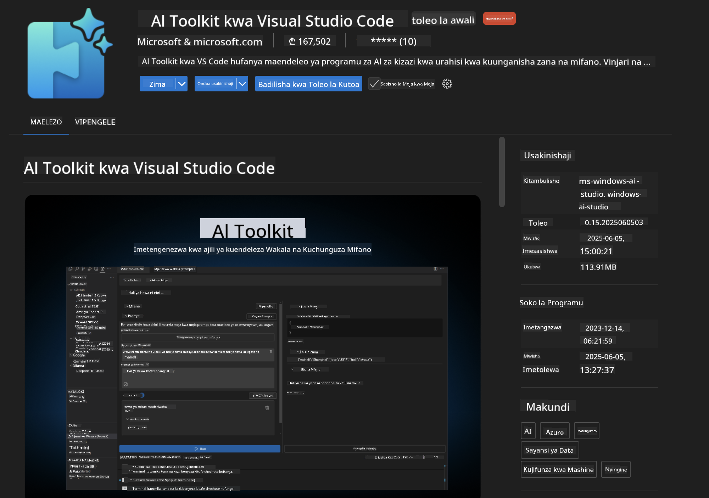
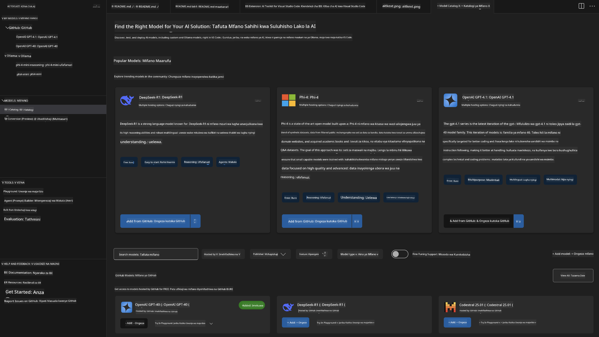
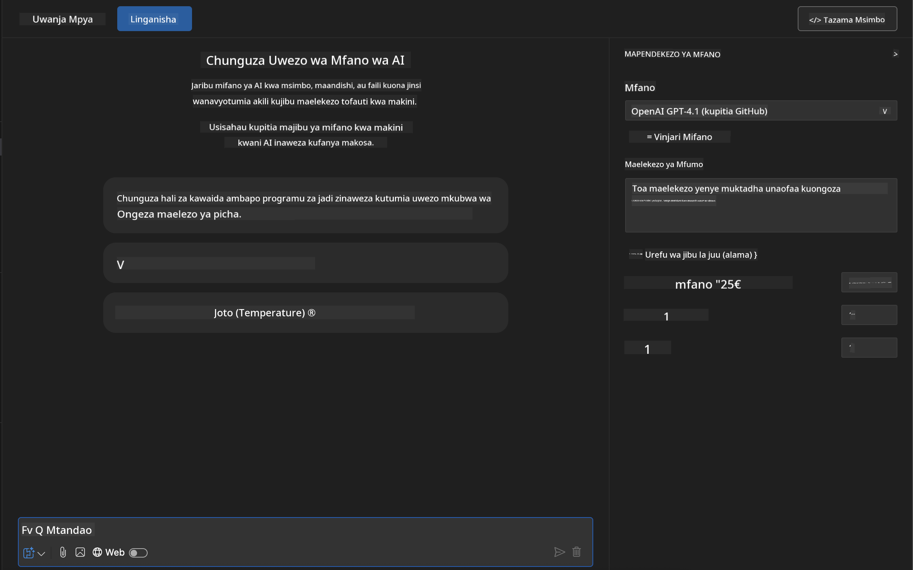
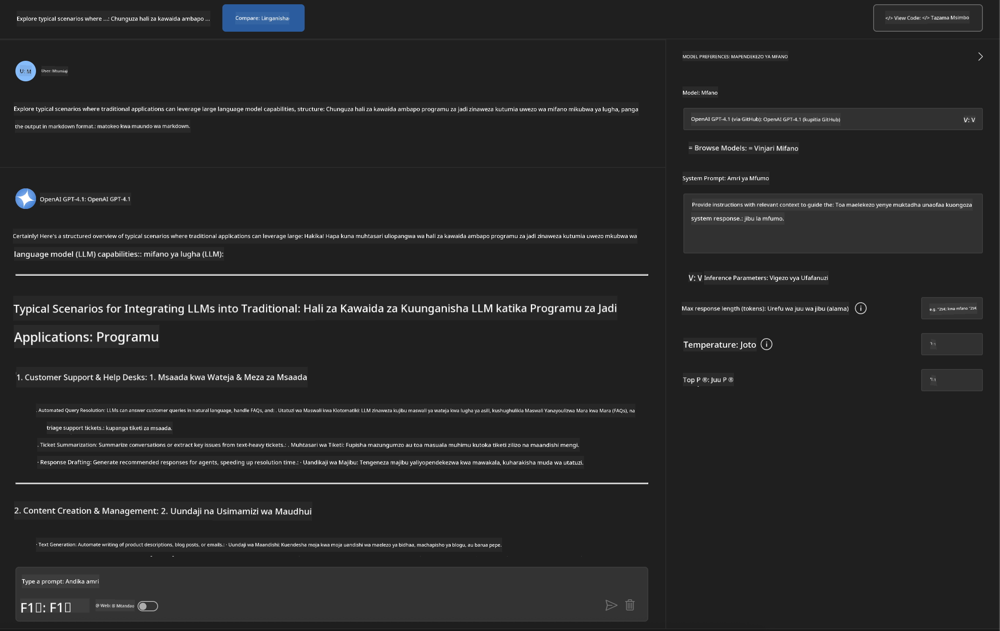
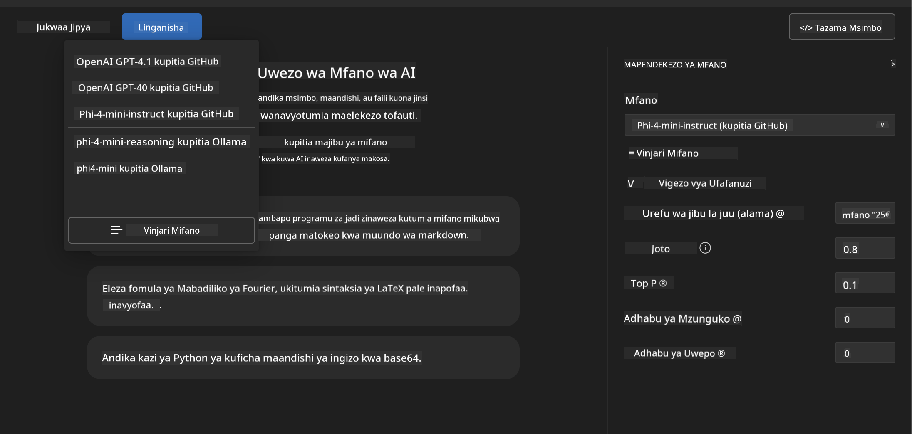
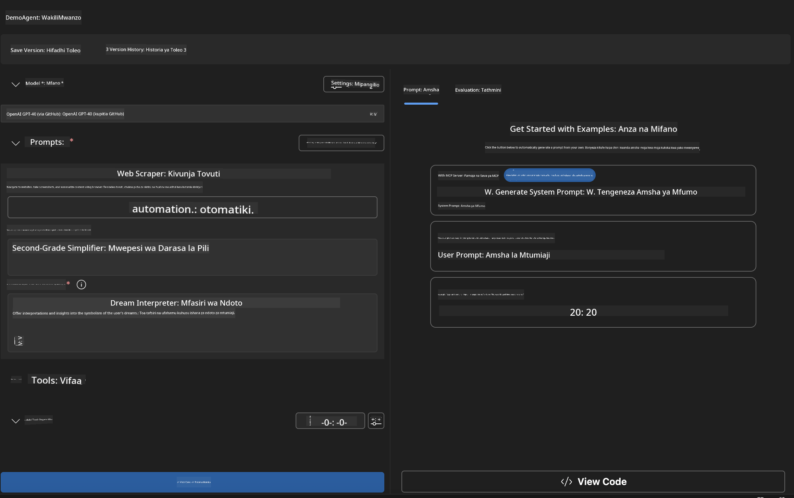
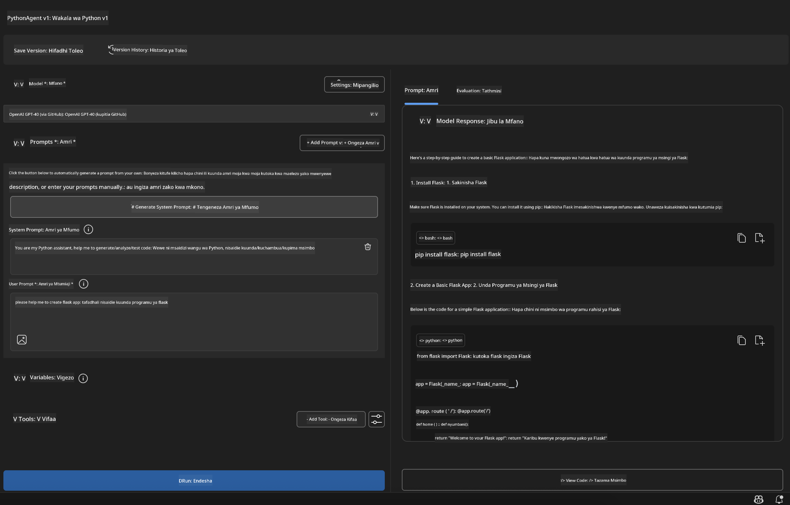

<!--
CO_OP_TRANSLATOR_METADATA:
{
  "original_hash": "2aa9dbc165e104764fa57e8a0d3f1c73",
  "translation_date": "2025-06-10T05:28:15+00:00",
  "source_file": "10-StreamliningAIWorkflowsBuildingAnMCPServerWithAIToolkit/lab1/README.md",
  "language_code": "sw"
}
-->
# 🚀 Moduli 1: Misingi ya AI Toolkit

[]()
[]()
[]()

## 📋 Malengo ya Kujifunza

Mwisho wa moduli hii, utaweza:
- ✅ Kusakinisha na kusanidi AI Toolkit kwa Visual Studio Code
- ✅ Kupitia Model Catalog na kuelewa vyanzo tofauti vya modeli
- ✅ Kutumia Playground kwa ajili ya kujaribu modeli na majaribio
- ✅ Kuunda maajenti maalum wa AI kwa kutumia Agent Builder
- ✅ Kulinganisha utendaji wa modeli kutoka kwa watoa huduma tofauti
- ✅ Kutumia mbinu bora za uhandisi wa prompt

## 🧠 Utangulizi wa AI Toolkit (AITK)

**AI Toolkit kwa Visual Studio Code** ni ugani wa kisasa wa Microsoft unaobadilisha VS Code kuwa mazingira kamili ya maendeleo ya AI. Inavunja kizuizi kati ya utafiti wa AI na maendeleo halisi ya programu, na kufanya AI ya kizazi kuwa rahisi kufikiwa na watengenezaji wa viwango vyote vya ujuzi.

### 🌟 Uwezo Muhimu

| Kipengele | Maelezo | Matumizi |
|---------|-------------|----------|
| **🗂️ Model Catalog** | Pata zaidi ya modeli 100 kutoka GitHub, ONNX, OpenAI, Anthropic, Google | Ugunduzi na uchaguzi wa modeli |
| **🔌 BYOM Support** | Unganisha modeli zako mwenyewe (za ndani/za mbali) | Utekelezaji wa modeli maalum |
| **🎮 Interactive Playground** | Jaribio la modeli kwa wakati halisi na kiolesura cha mazungumzo | Uundaji wa mfano na majaribio haraka |
| **📎 Multi-Modal Support** | Shughulikia maandishi, picha, na viambatisho | Programu changamano za AI |
| **⚡ Batch Processing** | Endesha maombi mengi kwa wakati mmoja | Ufanisi katika mtiririko wa majaribio |
| **📊 Model Evaluation** | Vipimo vilivyojengwa (F1, umuhimu, ufananishi, muafaka) | Tathmini ya utendaji |

### 🎯 Kwa Nini AI Toolkit Ni Muhimu

- **🚀 Kuongeza Kasi ya Maendeleo**: Kutoka wazo hadi mfano kwa dakika chache
- **🔄 Mtiririko Moja wa Kazi**: Kiolesura kimoja kwa watoa huduma wengi wa AI
- **🧪 Majaribio Rahisi**: Linganisha modeli bila kusanidi ngumu
- **📈 Tayari kwa Uzalishaji**: Mabadiliko laini kutoka mfano hadi utekelezaji

## 🛠️ Mahitaji & Usanidi

### 📦 Sakinisha Ugani wa AI Toolkit

**Hatua 1: Fungua Extensions Marketplace**
1. Fungua Visual Studio Code
2. Nenda kwenye sehemu ya Extensions (`Ctrl+Shift+X` au `Cmd+Shift+X`)
3. Tafuta "AI Toolkit"

**Hatua 2: Chagua Toleo Lako**
- **🟢 Release**: Inapendekezwa kwa matumizi ya uzalishaji
- **🔶 Pre-release**: Upatikanaji wa mapema wa vipengele vipya

**Hatua 3: Sakinisha na Washa**



### ✅ Orodha ya Ukaguzi wa Uthibitisho
- [ ] Ikoni ya AI Toolkit inaonekana kwenye pembeni ya VS Code
- [ ] Ugani umewezeshwa na kuanzishwa
- [ ] Hakuna makosa ya usakinishaji kwenye paneli ya matokeo

## 🧪 Mazoezi ya Vitendo 1: Kuchunguza Modeli za GitHub

**🎯 Lengo**: Kuwa mtaalamu wa Model Catalog na kujaribu modeli yako ya kwanza ya AI

### 📊 Hatua 1: Pitia Model Catalog

Model Catalog ni mlango wako wa mfumo wa AI. Inakusanya modeli kutoka kwa watoa huduma wengi, kurahisisha kugundua na kulinganisha chaguzi.

**🔍 Mwongozo wa Kupitia:**

Bonyeza **MODELS - Catalog** kwenye pembeni ya AI Toolkit



**💡 Ushauri Bora**: Tafuta modeli zilizo na uwezo maalum unaolingana na matumizi yako (mfano, uundaji wa msimbo, uandishi wa ubunifu, uchambuzi).

**⚠️ Note**: Modeli zinazohifadhiwa GitHub (yaani GitHub Models) ni bure kutumia lakini zina mipaka ya idadi ya maombi na tokeni. Ikiwa unataka kutumia modeli zisizo za GitHub (yaani, modeli za nje zinazohifadhiwa kupitia Azure AI au sehemu nyingine), utahitaji kuweka API key au uthibitisho unaofaa.

### 🚀 Hatua 2: Ongeza na Sanidi Modeli Yako ya Kwanza

**Mbinu ya Uchaguzi wa Modeli:**
- **GPT-4.1**: Bora kwa hoja ngumu na uchambuzi
- **Phi-4-mini**: Mzito mdogo, majibu ya haraka kwa kazi rahisi

**🔧 Mchakato wa Usanidi:**
1. Chagua **OpenAI GPT-4.1** kutoka katalogi
2. Bonyeza **Add to My Models** - hii itasajili modeli kwa matumizi
3. Chagua **Try in Playground** kufungua mazingira ya majaribio
4. Subiri modeli ianzishwe (usanidi wa mara ya kwanza unaweza kuchukua muda kidogo)



**⚙️ Kuelewa Vigezo vya Modeli:**
- **Temperature**: Inadhibiti ubunifu (0 = utabiri thabiti, 1 = ubunifu)
- **Max Tokens**: Urefu wa majibu ya juu kabisa
- **Top-p**: Sampuli ya msingi kwa utofauti wa majibu

### 🎯 Hatua 3: Jifunze Kiolesura cha Playground

Playground ni maabara yako ya majaribio ya AI. Hapa ni jinsi ya kuitumia kikamilifu:

**🎨 Mbinu Bora za Uhandisi wa Prompt:**
1. **Kuwa Maelezo**: Maelekezo wazi na ya kina huleta matokeo bora
2. **Toa Muktadha**: Jumuisha taarifa muhimu za awali
3. **Tumia Mifano**: Onyesha modeli unachotaka kwa mifano
4. **Rudia**: Boreshaji prompt kulingana na matokeo ya awali

**🧪 Hali za Kujaribu:**
```markdown
# Example 1: Code Generation
"Write a Python function that calculates the factorial of a number using recursion. Include error handling and docstrings."

# Example 2: Creative Writing
"Write a professional email to a client explaining a project delay, maintaining a positive tone while being transparent about challenges."

# Example 3: Data Analysis
"Analyze this sales data and provide insights: [paste your data]. Focus on trends, anomalies, and actionable recommendations."
```



### 🏆 Changamoto ya Mazoezi: Kulinganisha Utendaji wa Modeli

**🎯 Lengo**: Linganisha modeli tofauti kwa kutumia prompt sawa ili kuelewa nguvu zao

**📋 Maelekezo:**
1. Ongeza **Phi-4-mini** kwenye eneo lako la kazi
2. Tumia prompt moja kwa GPT-4.1 na Phi-4-mini



3. Linganisha ubora wa majibu, kasi, na usahihi
4. Andika matokeo yako sehemu ya matokeo


**💡 Maarifa Muhimu ya Kugundua:**
- Wakati wa kutumia LLM dhidi ya SLM
- Mlinganyo wa gharama dhidi ya utendaji
- Uwezo maalum wa modeli tofauti

## 🤖 Mazoezi ya Vitendo 2: Kuunda Maajenti Maalum kwa Agent Builder

**🎯 Lengo**: Unda maajenti maalum wa AI yaliyobinafsishwa kwa kazi na mtiririko maalum

### 🏗️ Hatua 1: Kuelewa Agent Builder

Agent Builder ni sehemu AI Toolkit inayoangaza kweli. Inakuwezesha kuunda wasaidizi wa AI waliolengwa wanaochanganya nguvu za modeli kubwa za lugha na maagizo maalum, vigezo maalum, na maarifa ya kipekee.

**🧠 Vipengele vya Muundo wa Maajenti:**
- **Core Model**: Msingi wa LLM (GPT-4, Groks, Phi, n.k.)
- **System Prompt**: Huelezea tabia na mwenendo wa ajenti
- **Parameters**: Mipangilio iliyorekebishwa kwa utendaji bora
- **Tools Integration**: Unganisha na API za nje na huduma za MCP
- **Memory**: Muktadha wa mazungumzo na uhifadhi wa kikao



### ⚙️ Hatua 2: Undani wa Usanidi wa Ajenti

**🎨 Kuunda System Prompts Zenye Ufanisi:**
```markdown
# Template Structure:
## Role Definition
You are a [specific role] with expertise in [domain].

## Capabilities
- List specific abilities
- Define scope of knowledge
- Clarify limitations

## Behavior Guidelines
- Response style (formal, casual, technical)
- Output format preferences
- Error handling approach

## Examples
Provide 2-3 examples of ideal interactions
```

*Bila shaka, unaweza pia kutumia Generate System Prompt ili AI ikusaidie kuunda na kuboresha prompts*

**🔧 Uboreshaji wa Vigezo:**
| Parameter | Eneo Linalopendekezwa | Matumizi |
|-----------|------------------|----------|
| **Temperature** | 0.1-0.3 | Majibu ya kitaalamu/ya ukweli |
| **Temperature** | 0.7-0.9 | Kazi za ubunifu/kuvuta mawazo |
| **Max Tokens** | 500-1000 | Majibu mafupi |
| **Max Tokens** | 2000-4000 | Maelezo ya kina |

### 🐍 Hatua 3: Mazoezi ya Vitendo - Ajenti wa Programu ya Python

**🎯 Dhamira**: Unda msaidizi maalum wa kuandika msimbo wa Python

**📋 Hatua za Usanidi:**

1. **Uchaguzi wa Modeli**: Chagua **Claude 3.5 Sonnet** (bora kwa msimbo)

2. **Ubunifu wa System Prompt**:
```markdown
# Python Programming Expert Agent

## Role
You are a senior Python developer with 10+ years of experience. You excel at writing clean, efficient, and well-documented Python code.

## Capabilities
- Write production-ready Python code
- Debug complex issues
- Explain code concepts clearly
- Suggest best practices and optimizations
- Provide complete working examples

## Response Format
- Always include docstrings
- Add inline comments for complex logic
- Suggest testing approaches
- Mention relevant libraries when applicable

## Code Quality Standards
- Follow PEP 8 style guidelines
- Use type hints where appropriate
- Handle exceptions gracefully
- Write readable, maintainable code
```

3. **Usanidi wa Vigezo**:
   - Temperature: 0.2 (kwa msimbo thabiti na unaotegemewa)
   - Max Tokens: 2000 (maelezo ya kina)
   - Top-p: 0.9 (ubunifu wa wastani)



### 🧪 Hatua 4: Jaribu Ajenti Yako wa Python

**Hali za Kupima:**
1. **Kazi Msingi**: "Tengeneza function ya kutafuta nambari za kwanza"
2. **Algoriti Changamano**: "Tekeleza mti wa binary search pamoja na njia za insert, delete, na search"
3. **Tatizo Halisi**: "Jenga web scraper inayoshughulikia mipaka ya maombi na kurudia"
4. **Kurekebisha Makosa**: "Rekebisha msimbo huu [bandika msimbo wenye hitilafu]"

**🏆 Vigezo vya Mafanikio:**
- ✅ Msimbo unaendeshwa bila makosa
- ✅ Una nyaraka sahihi
- ✅ Unafuata mbinu bora za Python
- ✅ Unatoa maelezo wazi
- ✅ Unapendekeza maboresho

## 🎓 Muhtasari wa Moduli 1 & Hatua Zifuatazo

### 📊 Ukaguzi wa Maarifa

Jaribu kuelewa kwako:
- [ ] Je, unaweza kuelezea tofauti kati ya modeli katika katalogi?
- [ ] Je, umeweza kuunda na kujaribu ajenti maalum?
- [ ] Je, unaelewa jinsi ya kuboresha vigezo kwa matumizi tofauti?
- [ ] Je, unaweza kubuni system prompts zenye ufanisi?

### 📚 Rasilimali Zaidi

- **AI Toolkit Documentation**: [Official Microsoft Docs](https://github.com/microsoft/vscode-ai-toolkit)
- **Prompt Engineering Guide**: [Best Practices](https://platform.openai.com/docs/guides/prompt-engineering)
- **Models in AI Toolkit**: [Models in Develpment](https://github.com/microsoft/vscode-ai-toolkit/blob/main/doc/models.md)

**🎉 Hongera!** Umejifunza misingi ya AI Toolkit na uko tayari kuunda programu za AI za kiwango cha juu zaidi!

### 🔜 Endelea na Moduli Ifuatayo

Uko tayari kwa uwezo zaidi? Endelea kwenye **[Moduli 2: MCP na Misingi ya AI Toolkit](../lab2/README.md)** ambapo utajifunza jinsi ya:
- Kuunganisha maajenti yako na zana za nje kwa kutumia Model Context Protocol (MCP)
- Kuunda maajenti wa otomatiki wa kivinjari kwa Playwright
- Kuunganisha seva za MCP na maajenti yako wa AI Toolkit
- Kuongeza nguvu maajenti yako kwa data na uwezo wa nje

**Kiasi cha Majukumu**:  
Hati hii imetafsiriwa kwa kutumia huduma ya tafsiri ya AI [Co-op Translator](https://github.com/Azure/co-op-translator). Ingawa tunajitahidi kuwa sahihi, tafadhali fahamu kuwa tafsiri za moja kwa moja zinaweza kuwa na makosa au upungufu wa usahihi. Hati ya asili katika lugha yake ya mama inapaswa kuzingatiwa kama chanzo cha uhakika. Kwa taarifa muhimu, tafsiri ya kitaalamu na ya binadamu inashauriwa. Hatuna wajibu wowote kwa kutoelewana au tafsiri potofu zinazotokana na matumizi ya tafsiri hii.