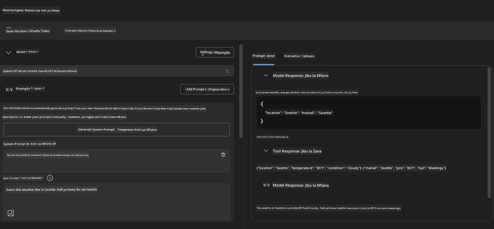
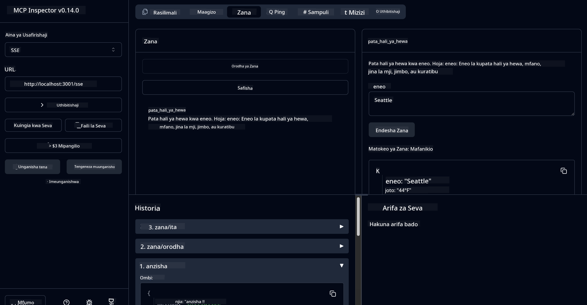

<!--
CO_OP_TRANSLATOR_METADATA:
{
  "original_hash": "dd8da3f75addcef453fe11f02a270217",
  "translation_date": "2025-06-10T06:17:00+00:00",
  "source_file": "10-StreamliningAIWorkflowsBuildingAnMCPServerWithAIToolkit/lab3/README.md",
  "language_code": "sw"
}
-->
# 🔧 Module 3: Maendeleo ya Juu ya MCP kwa AI Toolkit


## 🎯 Malengo ya Kujifunza

Mwisho wa maabara hii, utaweza:

- ✅ Kuunda seva za MCP maalum kwa kutumia AI Toolkit
- ✅ Kusanidi na kutumia toleo jipya la MCP Python SDK (v1.9.3)
- ✅ Kuweka na kutumia MCP Inspector kwa ajili ya kufuatilia makosa
- ✅ Kufuatilia makosa ya seva za MCP katika mazingira ya Agent Builder na Inspector
- ✅ Kuelewa mchakato wa maendeleo ya seva za MCP kwa kiwango cha juu

## 📋 Mahitaji ya Awali

- Kumaliza Lab 2 (Misingi ya MCP)
- VS Code yenye AI Toolkit imewekwa
- Mazingira ya Python 3.10+
- Node.js na npm kwa ajili ya usanidi wa Inspector

## 🏗️ Kile Utakachojenga

Katika maabara hii, utaunda **Seva ya Hali ya Hewa ya MCP** ambayo inaonyesha:
- Utekelezaji wa seva ya MCP maalum
- Uunganisho na AI Toolkit Agent Builder
- Mchakato wa kitaalamu wa kufuatilia makosa
- Matumizi ya mifumo ya kisasa ya MCP SDK

---

## 🔧 Muhtasari wa Vipengele Muhimu

### 🐍 MCP Python SDK
Model Context Protocol Python SDK ni msingi wa kujenga seva za MCP maalum. Utatumia toleo 1.9.3 lenye uwezo bora wa kufuatilia makosa.

### 🔍 MCP Inspector
Chombo chenye nguvu cha kufuatilia makosa kinachotoa:
- Ufuatiliaji wa seva kwa wakati halisi
- Uonyesho wa utekelezaji wa zana
- Ukaguzi wa maombi na majibu ya mtandao
- Mazingira ya majaribio ya mwingiliano

---

## 📖 Hatua kwa Hatua ya Utekelezaji

### Hatua 1: Unda WeatherAgent katika Agent Builder

1. **Fungua Agent Builder** katika VS Code kupitia AI Toolkit
2. **Unda agent mpya** kwa usanidi huu:
   - Jina la Agent: `WeatherAgent`


### Hatua 2: Anzisha Mradi wa Seva ya MCP

1. **Nenda Tools** → **Add Tool** katika Agent Builder
2. **Chagua "MCP Server"** kutoka kwa chaguzi zilizopo
3. **Chagua "Create A new MCP Server"**
4. **Chagua templeti ya `python-weather`**
5. **Weka jina la seva yako:** `weather_mcp`


### Hatua 3: Fungua na Kagua Mradi

1. **Fungua mradi uliotengenezwa** katika VS Code
2. **Pitia muundo wa mradi:**
   ```
   weather_mcp/
   ├── src/
   │   ├── __init__.py
   │   └── server.py
   ├── inspector/
   │   ├── package.json
   │   └── package-lock.json
   ├── .vscode/
   │   ├── launch.json
   │   └── tasks.json
   ├── pyproject.toml
   └── README.md
   ```

### Hatua 4: Sasisha MCP SDK hadi Toleo la Hivi Karibuni

> **🔍 Kwa Nini Kusasisha?** Tunataka kutumia toleo jipya la MCP SDK (v1.9.3) na huduma ya Inspector (0.14.0) kwa vipengele vya hali ya juu na kufuatilia makosa kwa ufanisi zaidi.

#### 4a. Sasisha Mategemeo ya Python

**Hariri `pyproject.toml`:** update [./code/weather_mcp/pyproject.toml](../../../../10-StreamliningAIWorkflowsBuildingAnMCPServerWithAIToolkit/lab3/code/weather_mcp/pyproject.toml)


#### 4b. Update Inspector Configuration

**Edit `inspector/package.json`:** update [./code/weather_mcp/inspector/package.json](../../../../10-StreamliningAIWorkflowsBuildingAnMCPServerWithAIToolkit/lab3/code/weather_mcp/inspector/package.json)

#### 4c. Update Inspector Dependencies

**Edit `inspector/package-lock.json`:** update [./code/weather_mcp/inspector/package-lock.json](../../../../10-StreamliningAIWorkflowsBuildingAnMCPServerWithAIToolkit/lab3/code/weather_mcp/inspector/package-lock.json)

> **📝 Note:** This file contains extensive dependency definitions. Below is the essential structure - the full content ensures proper dependency resolution.


> **⚡ Full Package Lock:** The complete package-lock.json contains ~3000 lines of dependency definitions. The above shows the key structure - use the provided file for complete dependency resolution.

### Step 5: Configure VS Code Debugging

*Note: Please copy the file in the specified path to replace the corresponding local file*

#### 5a. Update Launch Configuration

**Edit `.vscode/launch.json`:**

```json
{
  "version": "0.2.0",
  "configurations": [
    {
      "name": "Attach to Local MCP",
      "type": "debugpy",
      "request": "attach",
      "connect": {
        "host": "localhost",
        "port": 5678
      },
      "presentation": {
        "hidden": true
      },
      "internalConsoleOptions": "neverOpen",
      "postDebugTask": "Terminate All Tasks"
    },
    {
      "name": "Launch Inspector (Edge)",
      "type": "msedge",
      "request": "launch",
      "url": "http://localhost:6274?timeout=60000&serverUrl=http://localhost:3001/sse#tools",
      "cascadeTerminateToConfigurations": [
        "Attach to Local MCP"
      ],
      "presentation": {
        "hidden": true
      },
      "internalConsoleOptions": "neverOpen"
    },
    {
      "name": "Launch Inspector (Chrome)",
      "type": "chrome",
      "request": "launch",
      "url": "http://localhost:6274?timeout=60000&serverUrl=http://localhost:3001/sse#tools",
      "cascadeTerminateToConfigurations": [
        "Attach to Local MCP"
      ],
      "presentation": {
        "hidden": true
      },
      "internalConsoleOptions": "neverOpen"
    }
  ],
  "compounds": [
    {
      "name": "Debug in Agent Builder",
      "configurations": [
        "Attach to Local MCP"
      ],
      "preLaunchTask": "Open Agent Builder",
    },
    {
      "name": "Debug in Inspector (Edge)",
      "configurations": [
        "Launch Inspector (Edge)",
        "Attach to Local MCP"
      ],
      "preLaunchTask": "Start MCP Inspector",
      "stopAll": true
    },
    {
      "name": "Debug in Inspector (Chrome)",
      "configurations": [
        "Launch Inspector (Chrome)",
        "Attach to Local MCP"
      ],
      "preLaunchTask": "Start MCP Inspector",
      "stopAll": true
    }
  ]
}
```

**Hariri `.vscode/tasks.json`:**

```
{
  "version": "2.0.0",
  "tasks": [
    {
      "label": "Start MCP Server",
      "type": "shell",
      "command": "python -m debugpy --listen 127.0.0.1:5678 src/__init__.py sse",
      "isBackground": true,
      "options": {
        "cwd": "${workspaceFolder}",
        "env": {
          "PORT": "3001"
        }
      },
      "problemMatcher": {
        "pattern": [
          {
            "regexp": "^.*$",
            "file": 0,
            "location": 1,
            "message": 2
          }
        ],
        "background": {
          "activeOnStart": true,
          "beginsPattern": ".*",
          "endsPattern": "Application startup complete|running"
        }
      }
    },
    {
      "label": "Start MCP Inspector",
      "type": "shell",
      "command": "npm run dev:inspector",
      "isBackground": true,
      "options": {
        "cwd": "${workspaceFolder}/inspector",
        "env": {
          "CLIENT_PORT": "6274",
          "SERVER_PORT": "6277",
        }
      },
      "problemMatcher": {
        "pattern": [
          {
            "regexp": "^.*$",
            "file": 0,
            "location": 1,
            "message": 2
          }
        ],
        "background": {
          "activeOnStart": true,
          "beginsPattern": "Starting MCP inspector",
          "endsPattern": "Proxy server listening on port"
        }
      },
      "dependsOn": [
        "Start MCP Server"
      ]
    },
    {
      "label": "Open Agent Builder",
      "type": "shell",
      "command": "echo ${input:openAgentBuilder}",
      "presentation": {
        "reveal": "never"
      },
      "dependsOn": [
        "Start MCP Server"
      ],
    },
    {
      "label": "Terminate All Tasks",
      "command": "echo ${input:terminate}",
      "type": "shell",
      "problemMatcher": []
    }
  ],
  "inputs": [
    {
      "id": "openAgentBuilder",
      "type": "command",
      "command": "ai-mlstudio.agentBuilder",
      "args": {
        "initialMCPs": [ "local-server-weather_mcp" ],
        "triggeredFrom": "vsc-tasks"
      }
    },
    {
      "id": "terminate",
      "type": "command",
      "command": "workbench.action.tasks.terminate",
      "args": "terminateAll"
    }
  ]
}
```


---

## 🚀 Kuendesha na Kupima Seva Yako ya MCP

### Hatua 6: Sakinisha Mategemeo

Baada ya kufanya mabadiliko, tumia amri hizi:

**Sakinisha mategemeo ya Python:**
```bash
uv sync
```

**Sakinisha mategemeo ya Inspector:**
```bash
cd inspector
npm install
```

### Hatua 7: Fuatilia Makosa kwa Agent Builder

1. **Bonyeza F5** au tumia usanidi wa **"Debug in Agent Builder"**
2. **Chagua usanidi wa pamoja** kutoka kwenye paneli ya ufuatiliaji
3. **Subiri seva ianze** na Agent Builder ifunguke
4. **Jaribu seva yako ya weather MCP** kwa maswali ya lugha ya kawaida

Ingiza ombi kama hili

SYSTEM_PROMPT

```
You are my weather assistant
```

USER_PROMPT

```
How's the weather like in Seattle
```



### Hatua 8: Fuatilia Makosa kwa MCP Inspector

1. **Tumia usanidi wa "Debug in Inspector"** (Edge au Chrome)
2. **Fungua kiolesura cha Inspector** kwa `http://localhost:6274`
3. **Chunguza mazingira ya majaribio ya mwingiliano:**
   - Angalia zana zilizopo
   - Jaribu utekelezaji wa zana
   - Fuata maombi ya mtandao
   - Fuatilia majibu ya seva



---

## 🎯 Matokeo Muhimu ya Kujifunza

Kwa kumaliza maabara hii, ume:

- [x] **Kuunda seva ya MCP maalum** kwa kutumia templeti za AI Toolkit
- [x] **Kusasaisha hadi MCP SDK ya hivi karibuni** (v1.9.3) kwa vipengele bora
- [x] **Kusakinisha mchakato wa kitaalamu wa kufuatilia makosa** kwa Agent Builder na Inspector
- [x] **Kuweka MCP Inspector** kwa majaribio ya seva kwa mwingiliano
- [x] **Kuwa mtaalamu wa usanidi wa ufuatiliaji makosa wa VS Code** kwa maendeleo ya MCP

## 🔧 Vipengele vya Juu Vilivyogunduliwa

| Kipengele | Maelezo | Matumizi |
|---------|-------------|----------|
| **MCP Python SDK v1.9.3** | Utekelezaji wa itifaki ya hivi karibuni | Maendeleo ya seva za kisasa |
| **MCP Inspector 0.14.0** | Chombo cha kufuatilia makosa kwa mwingiliano | Majaribio ya seva kwa wakati halisi |
| **VS Code Debugging** | Mazingira ya maendeleo yaliyojumuishwa | Mchakato wa kitaalamu wa kufuatilia makosa |
| **Agent Builder Integration** | Muunganisho wa moja kwa moja wa AI Toolkit | Majaribio ya agent kutoka mwanzo hadi mwisho |

## 📚 Rasilimali Zaidi

- [MCP Python SDK Documentation](https://modelcontextprotocol.io/docs/sdk/python)
- [AI Toolkit Extension Guide](https://code.visualstudio.com/docs/ai/ai-toolkit)
- [VS Code Debugging Documentation](https://code.visualstudio.com/docs/editor/debugging)
- [Model Context Protocol Specification](https://modelcontextprotocol.io/docs/concepts/architecture)

---

**🎉 Hongera!** Umefanikiwa kumaliza Lab 3 na sasa unaweza kuunda, kufuatilia makosa, na kupeleka seva za MCP maalum kwa kutumia mchakato wa maendeleo ya kitaalamu.

### 🔜 Endelea kwenye Moduli Ifuatayo

Uko tayari kutumia ujuzi wako wa MCP katika mchakato halisi wa maendeleo? Endelea kwenye **[Module 4: Practical MCP Development - Custom GitHub Clone Server](../lab4/README.md)** ambapo utajifunza:
- Kujenga seva ya MCP inayotumika katika mazingira ya uzalishaji kwa kuendesha shughuli za GitHub
- Kutekeleza utendaji wa kunakili repositori za GitHub kupitia MCP
- Kuunganisha seva za MCP maalum na VS Code na GitHub Copilot Agent Mode
- Kupima na kupeleka seva za MCP maalum katika mazingira ya uzalishaji
- Kujifunza mchakato wa otomatiki wa kazi kwa waendelezaji

**Kiarifu**:  
Hati hii imetafsiriwa kwa kutumia huduma ya tafsiri ya AI [Co-op Translator](https://github.com/Azure/co-op-translator). Ingawa tunajitahidi kuwa sahihi, tafadhali fahamu kuwa tafsiri za kiotomatiki zinaweza kuwa na makosa au upungufu wa usahihi. Hati asilia katika lugha yake ya asili inapaswa kuchukuliwa kama chanzo cha mamlaka. Kwa taarifa muhimu, tafsiri ya mtaalamu wa binadamu inapendekezwa. Hatubebeki dhima kwa kutoelewana au tafsiri potofu zinazotokana na matumizi ya tafsiri hii.