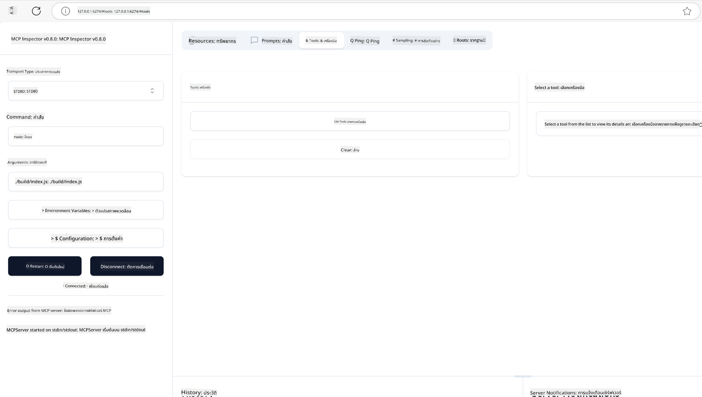
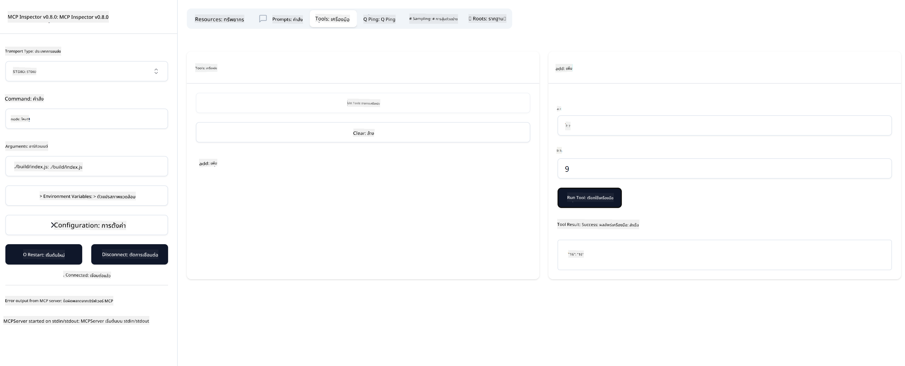

<!--
CO_OP_TRANSLATOR_METADATA:
{
  "original_hash": "d730cbe43a8efc148677fdbc849a7d5e",
  "translation_date": "2025-06-02T17:02:04+00:00",
  "source_file": "03-GettingStarted/01-first-server/README.md",
  "language_code": "th"
}
-->
### -2- สร้างโปรเจกต์

ตอนนี้ที่คุณติดตั้ง SDK เรียบร้อยแล้ว มาสร้างโปรเจกต์กันเลย:

### -3- สร้างไฟล์โปรเจกต์

### -4- เขียนโค้ดเซิร์ฟเวอร์

### -5- เพิ่มเครื่องมือและทรัพยากร

เพิ่มเครื่องมือและทรัพยากรด้วยการเพิ่มโค้ดดังนี้:

### -6- โค้ดสุดท้าย

เพิ่มโค้ดส่วนสุดท้ายที่จำเป็นเพื่อให้เซิร์ฟเวอร์เริ่มทำงานได้:

### -7- ทดสอบเซิร์ฟเวอร์

เริ่มเซิร์ฟเวอร์ด้วยคำสั่งดังนี้:

### -8- รันด้วย inspector

inspector เป็นเครื่องมือที่ยอดเยี่ยมที่ช่วยให้คุณเริ่มเซิร์ฟเวอร์และโต้ตอบกับมันเพื่อทดสอบการทำงาน มาเริ่มกันเลย:

> [!NOTE]
> อาจดูแตกต่างในช่อง "command" เพราะมีคำสั่งสำหรับรันเซิร์ฟเวอร์ด้วย runtime ที่คุณเลือก

คุณจะเห็นอินเทอร์เฟซผู้ใช้ดังนี้:

1. เชื่อมต่อกับเซิร์ฟเวอร์โดยเลือกปุ่ม Connect  
   เมื่อเชื่อมต่อกับเซิร์ฟเวอร์แล้ว คุณจะเห็นหน้าจอดังนี้:

   

2. เลือก "Tools" แล้วเลือก "listTools" คุณจะเห็น "Add" ปรากฏขึ้น เลือก "Add" และกรอกค่าพารามิเตอร์

   คุณจะเห็นผลลัพธ์ดังนี้ คือผลลัพธ์จากเครื่องมือ "add":

   

ขอแสดงความยินดี คุณสร้างและรันเซิร์ฟเวอร์แรกของคุณสำเร็จแล้ว!

### SDK อย่างเป็นทางการ

MCP มี SDK อย่างเป็นทางการสำหรับหลายภาษา:
- [C# SDK](https://github.com/modelcontextprotocol/csharp-sdk) - ดูแลร่วมกับ Microsoft
- [Java SDK](https://github.com/modelcontextprotocol/java-sdk) - ดูแลร่วมกับ Spring AI
- [TypeScript SDK](https://github.com/modelcontextprotocol/typescript-sdk) - การใช้งาน TypeScript อย่างเป็นทางการ
- [Python SDK](https://github.com/modelcontextprotocol/python-sdk) - การใช้งาน Python อย่างเป็นทางการ
- [Kotlin SDK](https://github.com/modelcontextprotocol/kotlin-sdk) - การใช้งาน Kotlin อย่างเป็นทางการ
- [Swift SDK](https://github.com/modelcontextprotocol/swift-sdk) - ดูแลร่วมกับ Loopwork AI
- [Rust SDK](https://github.com/modelcontextprotocol/rust-sdk) - การใช้งาน Rust อย่างเป็นทางการ

## สรุปใจความสำคัญ

- การตั้งค่าสภาพแวดล้อมการพัฒนา MCP ทำได้ง่ายด้วย SDK เฉพาะภาษา
- การสร้างเซิร์ฟเวอร์ MCP คือการสร้างและลงทะเบียนเครื่องมือพร้อมสคีมาที่ชัดเจน
- การทดสอบและดีบักมีความสำคัญเพื่อให้การใช้งาน MCP เชื่อถือได้

## ตัวอย่าง

- [Java Calculator](../samples/java/calculator/README.md)
- [.Net Calculator](../../../../03-GettingStarted/samples/csharp)
- [JavaScript Calculator](../samples/javascript/README.md)
- [TypeScript Calculator](../samples/typescript/README.md)
- [Python Calculator](../../../../03-GettingStarted/samples/python)

## แบบฝึกหัด

สร้างเซิร์ฟเวอร์ MCP ง่ายๆ พร้อมเครื่องมือที่คุณเลือก:
1. เขียนเครื่องมือในภาษาที่คุณถนัด (.NET, Java, Python หรือ JavaScript)
2. กำหนดพารามิเตอร์นำเข้าและค่าที่ส่งกลับ
3. รันเครื่องมือ inspector เพื่อตรวจสอบว่าเซิร์ฟเวอร์ทำงานถูกต้อง
4. ทดสอบการใช้งานด้วยค่าต่างๆ

## วิธีแก้ไข

[Solution](./solution/README.md)

## แหล่งข้อมูลเพิ่มเติม

- [MCP GitHub Repository](https://github.com/microsoft/mcp-for-beginners)

## ต่อไป

ถัดไป: [Getting Started with MCP Clients](/03-GettingStarted/02-client/README.md)

**ข้อจำกัดความรับผิดชอบ**:  
เอกสารฉบับนี้ได้รับการแปลโดยใช้บริการแปลภาษา AI [Co-op Translator](https://github.com/Azure/co-op-translator) แม้เราจะพยายามให้มีความถูกต้อง แต่โปรดทราบว่าการแปลอัตโนมัติอาจมีข้อผิดพลาดหรือความไม่ถูกต้องได้ เอกสารต้นฉบับในภาษาต้นฉบับถือเป็นแหล่งข้อมูลที่เชื่อถือได้ สำหรับข้อมูลที่สำคัญ ขอแนะนำให้ใช้การแปลโดยมืออาชีพที่เป็นมนุษย์ เราจะไม่รับผิดชอบต่อความเข้าใจผิดหรือการตีความผิดที่เกิดขึ้นจากการใช้การแปลนี้