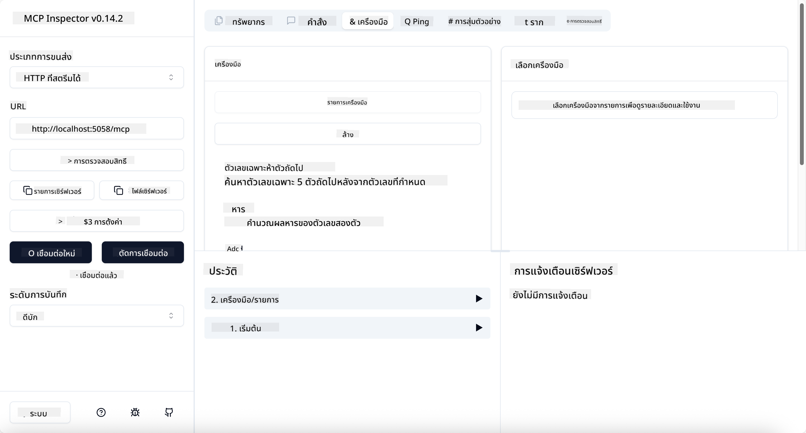

<!--
CO_OP_TRANSLATOR_METADATA:
{
  "original_hash": "0bc7bd48f55f1565f1d95ccb2c16f728",
  "translation_date": "2025-06-18T07:50:28+00:00",
  "source_file": "04-PracticalImplementation/samples/csharp/README.md",
  "language_code": "th"
}
-->
# ตัวอย่าง

ตัวอย่างก่อนหน้านี้แสดงให้เห็นวิธีการใช้โปรเจกต์ .NET แบบโลคอลที่มีประเภท `stdio` และวิธีการรันเซิร์ฟเวอร์ในเครื่องผ่านคอนเทนเนอร์ นี่เป็นวิธีแก้ปัญหาที่ดีในหลายสถานการณ์ อย่างไรก็ตาม การมีเซิร์ฟเวอร์ที่รันจากระยะไกล เช่น ในสภาพแวดล้อมคลาวด์ ก็มีประโยชน์เช่นกัน ซึ่งตรงนี้เองที่ประเภท `http` เข้ามามีบทบาท

เมื่อดูที่โซลูชันในโฟลเดอร์ `04-PracticalImplementation` อาจดูซับซ้อนกว่าตัวอย่างก่อนหน้านี้มาก แต่ในความเป็นจริงแล้วไม่ใช่เลย ถ้าคุณดูโปรเจกต์ `src/Calculator` อย่างละเอียด จะเห็นว่าโค้ดส่วนใหญ่เหมือนกับตัวอย่างก่อนหน้า ความแตกต่างเพียงอย่างเดียวคือเราใช้ไลบรารีต่างออกไปคือ `ModelContextProtocol.AspNetCore` เพื่อจัดการกับ HTTP requests และเราเปลี่ยนเมธอด `IsPrime` ให้เป็น private เพื่อแสดงให้เห็นว่าคุณสามารถมีเมธอดส่วนตัวในโค้ดของคุณได้ โค้ดส่วนที่เหลือยังเหมือนเดิม

โปรเจกต์อื่นๆ มาจาก [.NET Aspire](https://learn.microsoft.com/dotnet/aspire/get-started/aspire-overview) การมี .NET Aspire ในโซลูชันจะช่วยปรับปรุงประสบการณ์ของนักพัฒนาในระหว่างการพัฒนาและทดสอบ รวมถึงช่วยในเรื่องของการสังเกตการณ์ (observability) แม้ว่าจะไม่จำเป็นสำหรับการรันเซิร์ฟเวอร์ แต่ก็เป็นแนวทางปฏิบัติที่ดีที่จะมีไว้ในโซลูชันของคุณ

## เริ่มรันเซิร์ฟเวอร์ในเครื่อง

1. จาก VS Code (พร้อมส่วนขยาย C# DevKit) ให้ไปที่ไดเรกทอรี `04-PracticalImplementation/samples/csharp`
1. รันคำสั่งต่อไปนี้เพื่อเริ่มเซิร์ฟเวอร์:

   ```bash
    dotnet watch run --project ./src/AppHost
   ```

1. เมื่อเว็บเบราว์เซอร์เปิดหน้าแดชบอร์ด .NET Aspire ให้จดจำ URL ของ `http` ไว้ ซึ่งน่าจะเป็นประมาณ `http://localhost:5058/`

   

## ทดสอบ Streamable HTTP ด้วย MCP Inspector

ถ้าคุณมี Node.js เวอร์ชัน 22.7.5 ขึ้นไป คุณสามารถใช้ MCP Inspector ในการทดสอบเซิร์ฟเวอร์ของคุณได้

เริ่มเซิร์ฟเวอร์แล้วรันคำสั่งนี้ในเทอร์มินัล:

```bash
npx @modelcontextprotocol/inspector http://localhost:5058
```



- เลือก `Streamable HTTP` as the Transport type.
- In the Url field, enter the URL of the server noted earlier, and append `/mcp` ซึ่งควรจะเป็น `http` (ไม่ใช่ `https`) something like `http://localhost:5058/mcp`.
- select the Connect button.

A nice thing about the Inspector is that it provide a nice visibility on what is happening.

- Try listing the available tools
- Try some of them, it should works just like before.

## Test MCP Server with GitHub Copilot Chat in VS Code

To use the Streamable HTTP transport with GitHub Copilot Chat, change the configuration of the `calc-mcp` เซิร์ฟเวอร์ที่สร้างไว้ก่อนหน้านี้ควรมีลักษณะดังนี้:

```jsonc
// .vscode/mcp.json
{
  "servers": {
    "calc-mcp": {
      "type": "http",
      "url": "http://localhost:5058/mcp"
    }
  }
}
```

ลองทดสอบดังนี้:

- ขอ "จำนวนเฉพาะ 3 ตัวหลังเลข 6780" สังเกตว่า Copilot จะใช้เครื่องมือใหม่ `NextFivePrimeNumbers` และคืนค่าจำนวนเฉพาะ 3 ตัวแรกเท่านั้น
- ขอ "จำนวนเฉพาะ 7 ตัวหลังเลข 111" เพื่อดูผลลัพธ์
- ขอ "จอห์นมีลูกกวาด 24 เม็ดและต้องการแจกให้ลูกทั้ง 3 คนเท่าๆ กัน แต่ละคนจะได้ลูกกวาดกี่เม็ด?" เพื่อดูผลลัพธ์

## นำเซิร์ฟเวอร์ไปใช้งานบน Azure

มานำเซิร์ฟเวอร์ไปใช้งานบน Azure เพื่อให้คนอื่นสามารถใช้งานได้มากขึ้น

จากเทอร์มินัล ให้ไปที่โฟลเดอร์ `04-PracticalImplementation/samples/csharp` แล้วรันคำสั่งนี้:

```bash
azd up
```

เมื่อการดีพลอยเสร็จสิ้น คุณควรเห็นข้อความแบบนี้:


นำ URL นี้ไปใช้ใน MCP Inspector และใน GitHub Copilot Chat

```jsonc
// .vscode/mcp.json
{
  "servers": {
    "calc-mcp": {
      "type": "http",
      "url": "https://calc-mcp.gentleriver-3977fbcf.australiaeast.azurecontainerapps.io/mcp"
    }
  }
}
```

## ต่อไปทำอะไรดี?

เราได้ลองใช้ประเภทการขนส่งและเครื่องมือทดสอบต่างๆ และยังได้นำเซิร์ฟเวอร์ MCP ของคุณไปดีพลอยบน Azure แต่ถ้าเซิร์ฟเวอร์ของเราต้องการเข้าถึงทรัพยากรส่วนตัวล่ะ? เช่น ฐานข้อมูลหรือ API ส่วนตัว? ในบทถัดไป เราจะมาดูวิธีปรับปรุงความปลอดภัยของเซิร์ฟเวอร์ของเราให้ดีขึ้น

**ข้อจำกัดความรับผิดชอบ**:  
เอกสารนี้ได้รับการแปลโดยใช้บริการแปลภาษา AI [Co-op Translator](https://github.com/Azure/co-op-translator) แม้เราจะพยายามให้ความถูกต้องสูงสุด แต่โปรดทราบว่าการแปลโดยอัตโนมัติอาจมีข้อผิดพลาดหรือความไม่ถูกต้อง เอกสารต้นฉบับในภาษาต้นทางถือเป็นแหล่งข้อมูลที่เชื่อถือได้ สำหรับข้อมูลสำคัญแนะนำให้ใช้บริการแปลโดยมนุษย์มืออาชีพ เราไม่รับผิดชอบต่อความเข้าใจผิดหรือการตีความที่ผิดพลาดใด ๆ ที่เกิดจากการใช้การแปลนี้