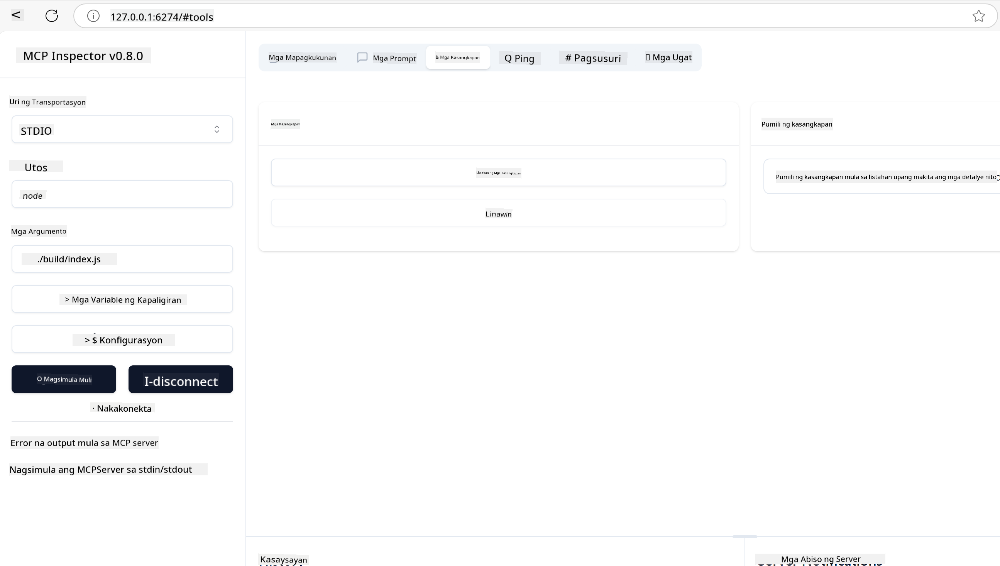

<!--
CO_OP_TRANSLATOR_METADATA:
{
  "original_hash": "262e6e510f0c3fe1e36180eadcd67c33",
  "translation_date": "2025-06-02T17:42:27+00:00",
  "source_file": "03-GettingStarted/01-first-server/README.md",
  "language_code": "tl"
}
-->
### -2- Gumawa ng proyekto

Ngayon na na-install mo na ang iyong SDK, gumawa tayo ng proyekto bilang susunod na hakbang:

### -3- Gumawa ng mga file ng proyekto

### -4- Gumawa ng code para sa server

### -5- Magdagdag ng tool at resource

Magdagdag ng isang tool at resource gamit ang sumusunod na code:

### -6 Final na code

Idagdag natin ang huling code na kailangan para makapagsimula ang server:

### -7- Subukan ang server

Simulan ang server gamit ang sumusunod na utos:

### -8- Patakbuhin gamit ang inspector

Ang inspector ay isang mahusay na tool na makakapagsimula ng iyong server at nagbibigay-daan sa iyo na makipag-ugnayan dito upang masubukan kung ito ay gumagana. Simulan natin ito:

> [!NOTE]
> maaaring mag-iba ang hitsura nito sa "command" field dahil ito ay naglalaman ng utos para patakbuhin ang server gamit ang iyong partikular na runtime/

Makikita mo ang sumusunod na user interface:

1. Kumonekta sa server sa pamamagitan ng pagpili sa Connect button  
  Kapag nakakonekta ka na sa server, makikita mo na ang sumusunod:

  

1. Piliin ang "Tools" at "listTools", makikita mo ang "Add" na lalabas, piliin ang "Add" at punan ang mga halaga ng parameter.

  Makikita mo ang sumusunod na tugon, ibig sabihin ay resulta mula sa "add" tool:

  

Congrats, nagawa mo nang lumikha at patakbuhin ang iyong unang server!

### Opisyal na SDKs

Nagbibigay ang MCP ng opisyal na SDKs para sa iba't ibang wika:
- [C# SDK](https://github.com/modelcontextprotocol/csharp-sdk) - Pinamamahalaan kasama ang Microsoft
- [Java SDK](https://github.com/modelcontextprotocol/java-sdk) - Pinamamahalaan kasama ang Spring AI
- [TypeScript SDK](https://github.com/modelcontextprotocol/typescript-sdk) - Opisyal na implementasyon para sa TypeScript
- [Python SDK](https://github.com/modelcontextprotocol/python-sdk) - Opisyal na implementasyon para sa Python
- [Kotlin SDK](https://github.com/modelcontextprotocol/kotlin-sdk) - Opisyal na implementasyon para sa Kotlin
- [Swift SDK](https://github.com/modelcontextprotocol/swift-sdk) - Pinamamahalaan kasama ang Loopwork AI
- [Rust SDK](https://github.com/modelcontextprotocol/rust-sdk) - Opisyal na implementasyon para sa Rust

## Mga Mahahalagang Punto

- Madaling mag-setup ng MCP development environment gamit ang mga language-specific SDKs
- Ang paggawa ng MCP servers ay kinabibilangan ng paglikha at pagrerehistro ng mga tool na may malinaw na mga schema
- Mahalaga ang pagsubok at pag-debug para sa maaasahang MCP implementations

## Mga Halimbawa

- [Java Calculator](../samples/java/calculator/README.md)
- [.Net Calculator](../../../../03-GettingStarted/samples/csharp)
- [JavaScript Calculator](../samples/javascript/README.md)
- [TypeScript Calculator](../samples/typescript/README.md)
- [Python Calculator](../../../../03-GettingStarted/samples/python)

## Takdang Aralin

Gumawa ng simpleng MCP server na may tool na iyong pipiliin:
1. I-implement ang tool sa iyong nais na wika (.NET, Java, Python, o JavaScript).
2. Tukuyin ang mga input parameter at mga return value.
3. Patakbuhin ang inspector tool para matiyak na gumagana ang server ayon sa inaasahan.
4. Subukan ang implementasyon gamit ang iba't ibang inputs.

## Solusyon

[Solution](./solution/README.md)

## Karagdagang Mga Mapagkukunan

- [Build Agents using Model Context Protocol on Azure](https://learn.microsoft.com/azure/developer/ai/intro-agents-mcp)
- [Remote MCP with Azure Container Apps (Node.js/TypeScript/JavaScript)](https://learn.microsoft.com/samples/azure-samples/mcp-container-ts/mcp-container-ts/)
- [.NET OpenAI MCP Agent](https://learn.microsoft.com/samples/azure-samples/openai-mcp-agent-dotnet/openai-mcp-agent-dotnet/)

## Ano ang susunod

Susunod: [Getting Started with MCP Clients](/03-GettingStarted/02-client/README.md)

**Paalala**:  
Ang dokumentong ito ay isinalin gamit ang AI translation service na [Co-op Translator](https://github.com/Azure/co-op-translator). Bagamat nagsusumikap kami na maging tumpak, pakatandaan na ang awtomatikong pagsasalin ay maaaring maglaman ng mga pagkakamali o hindi pagkakatugma. Ang orihinal na dokumento sa kanyang orihinal na wika ang dapat ituring na pinakapinagkakatiwalaang sanggunian. Para sa mahahalagang impormasyon, inirerekomenda ang propesyonal na pagsasalin ng tao. Hindi kami mananagot sa anumang hindi pagkakaunawaan o maling interpretasyon na maaaring magmula sa paggamit ng pagsasaling ito.