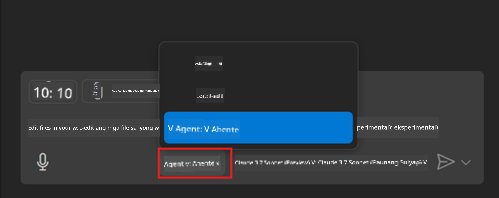
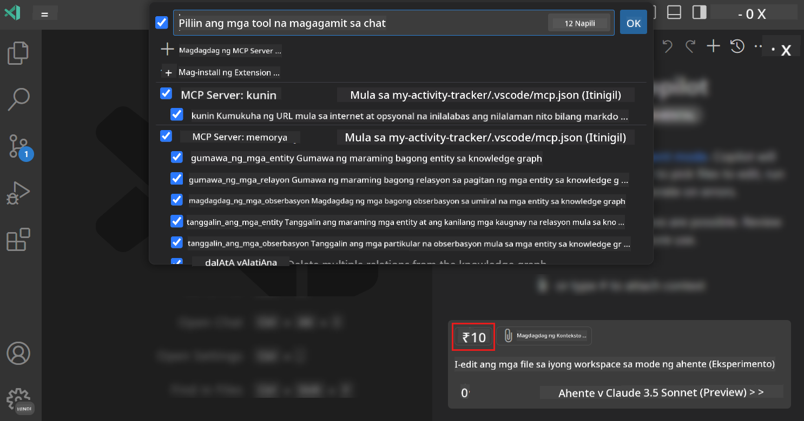

<!--
CO_OP_TRANSLATOR_METADATA:
{
  "original_hash": "8ea28e5e566edd5969337fd0b191ba3f",
  "translation_date": "2025-07-17T08:24:46+00:00",
  "source_file": "03-GettingStarted/04-vscode/README.md",
  "language_code": "tl"
}
-->
# Consuming a server mula sa GitHub Copilot Agent mode

Maaaring gumana ang Visual Studio Code at GitHub Copilot bilang client at kumonsumo ng MCP Server. Bakit natin gustong gawin ito, tanong mo? Ibig sabihin nito, anumang mga tampok na mayroon ang MCP Server ay magagamit na mula mismo sa iyong IDE. Isipin mo na lang na idagdag mo ang MCP server ng GitHub, magbibigay ito ng kakayahan na kontrolin ang GitHub gamit ang mga prompt sa halip na mag-type ng mga partikular na command sa terminal. O kaya naman, isipin ang anumang bagay na makakapagpahusay sa iyong karanasan bilang developer na kontrolado gamit ang natural na wika. Nakikita mo na ba ang benepisyo?

## Pangkalahatang-ideya

Tinuturo ng araling ito kung paano gamitin ang Visual Studio Code at ang Agent mode ng GitHub Copilot bilang client para sa iyong MCP Server.

## Mga Layunin sa Pagkatuto

Sa pagtatapos ng araling ito, magagawa mong:

- Kumonsumo ng MCP Server gamit ang Visual Studio Code.
- Patakbuhin ang mga kakayahan tulad ng mga tools gamit ang GitHub Copilot.
- I-configure ang Visual Studio Code upang mahanap at mapamahalaan ang iyong MCP Server.

## Paggamit

Maaari mong kontrolin ang iyong MCP server sa dalawang paraan:

- User interface, makikita mo kung paano ito gawin sa mga susunod na bahagi ng kabanatang ito.
- Terminal, posible ring kontrolin ang mga bagay mula sa terminal gamit ang `code` executable:

  Para idagdag ang MCP server sa iyong user profile, gamitin ang --add-mcp na command line option, at ibigay ang JSON server configuration sa anyo na {\"name\":\"server-name\",\"command\":...}.

  ```
  code --add-mcp "{\"name\":\"my-server\",\"command\": \"uvx\",\"args\": [\"mcp-server-fetch\"]}"
  ```

### Mga Screenshot

  
  


Pag-usapan natin nang mas detalyado kung paano gamitin ang visual interface sa mga susunod na bahagi.

## Paraan ng Pagsisimula

Ganito ang dapat nating gawin sa pangkalahatan:

- I-configure ang isang file para mahanap ang ating MCP Server.
- Simulan/Kumonekta sa nasabing server upang makita ang mga kakayahan nito.
- Gamitin ang mga kakayahang iyon sa pamamagitan ng GitHub Copilot Chat interface.

Maganda, ngayon na naiintindihan natin ang daloy, subukan nating gamitin ang MCP Server sa Visual Studio Code sa pamamagitan ng isang pagsasanay.

## Pagsasanay: Paggamit ng isang server

Sa pagsasanay na ito, i-configure natin ang Visual Studio Code upang mahanap ang iyong MCP server upang magamit ito mula sa GitHub Copilot Chat interface.

### -0- Paunang hakbang, paganahin ang MCP Server discovery

Maaaring kailanganin mong paganahin ang pagtuklas ng MCP Servers.

1. Pumunta sa `File -> Preferences -> Settings` sa Visual Studio Code.

1. Hanapin ang "MCP" at paganahin ang `chat.mcp.discovery.enabled` sa settings.json file.

### -1- Gumawa ng config file

Magsimula sa paggawa ng config file sa root ng iyong proyekto, kailangan mo ng file na tinatawag na MCP.json at ilagay ito sa folder na .vscode. Dapat itong ganito ang hitsura:

```text
.vscode
|-- mcp.json
```

Susunod, tingnan natin kung paano magdagdag ng entry para sa server.

### -2- I-configure ang server

Idagdag ang sumusunod na nilalaman sa *mcp.json*:

```json
{
    "inputs": [],
    "servers": {
       "hello-mcp": {
           "command": "node",
           "args": [
               "build/index.js"
           ]
       }
    }
}
```

Narito ang isang simpleng halimbawa kung paano simulan ang server na nakasulat sa Node.js, para sa ibang mga runtime, ituro ang tamang command para simulan ang server gamit ang `command` at `args`.

### -3- Simulan ang server

Ngayon na naidagdag mo na ang entry, simulan natin ang server:

1. Hanapin ang iyong entry sa *mcp.json* at siguraduhing makita mo ang "play" icon:

    

1. I-click ang "play" icon, makikita mong tataas ang bilang ng mga available na tools sa tools icon ng GitHub Copilot Chat. Kapag na-click mo ang tools icon, makikita mo ang listahan ng mga rehistradong tools. Maaari mong i-check/uncheck ang bawat tool depende kung gusto mong gamitin ito ng GitHub Copilot bilang konteksto:

  

1. Para patakbuhin ang isang tool, mag-type ng prompt na alam mong tugma sa paglalarawan ng isa sa iyong mga tool, halimbawa isang prompt na ganito "add 22 to 1":

  

  Makikita mo dapat ang sagot na 23.

## Takdang-Aralin

Subukang magdagdag ng server entry sa iyong *mcp.json* file at siguraduhing kaya mong simulan/hintuin ang server. Siguraduhin mo ring makipag-ugnayan sa mga tools sa iyong server gamit ang GitHub Copilot Chat interface.

## Solusyon

[Solution](./solution/README.md)

## Mahahalagang Punto

Ang mga mahahalagang punto mula sa kabanatang ito ay ang mga sumusunod:

- Ang Visual Studio Code ay isang mahusay na client na nagpapahintulot sa iyo na kumonsumo ng maraming MCP Servers at ang kanilang mga tools.
- Ang GitHub Copilot Chat interface ang paraan ng pakikipag-ugnayan mo sa mga server.
- Maaari kang humiling ng input mula sa user tulad ng API keys na maaaring ipasa sa MCP Server kapag kino-configure ang server entry sa *mcp.json* file.

## Mga Halimbawa

- [Java Calculator](../samples/java/calculator/README.md)
- [.Net Calculator](../../../../03-GettingStarted/samples/csharp)
- [JavaScript Calculator](../samples/javascript/README.md)
- [TypeScript Calculator](../samples/typescript/README.md)
- [Python Calculator](../../../../03-GettingStarted/samples/python)

## Karagdagang Mga Sanggunian

- [Visual Studio docs](https://code.visualstudio.com/docs/copilot/chat/mcp-servers)

## Ano ang Susunod

- Susunod: [Creating an SSE Server](../05-sse-server/README.md)

**Paalala**:  
Ang dokumentong ito ay isinalin gamit ang AI translation service na [Co-op Translator](https://github.com/Azure/co-op-translator). Bagamat nagsusumikap kami para sa katumpakan, pakatandaan na ang mga awtomatikong pagsasalin ay maaaring maglaman ng mga pagkakamali o di-tumpak na impormasyon. Ang orihinal na dokumento sa kanyang sariling wika ang dapat ituring na pangunahing sanggunian. Para sa mahahalagang impormasyon, inirerekomenda ang propesyonal na pagsasalin ng tao. Hindi kami mananagot sa anumang hindi pagkakaunawaan o maling interpretasyon na maaaring magmula sa paggamit ng pagsasaling ito.