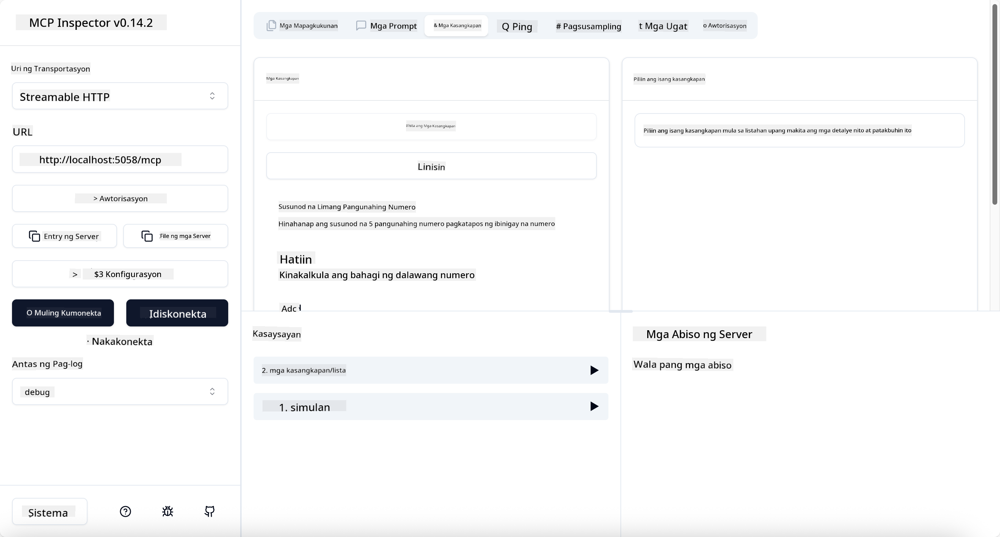

<!--
CO_OP_TRANSLATOR_METADATA:
{
  "original_hash": "0bc7bd48f55f1565f1d95ccb2c16f728",
  "translation_date": "2025-06-18T07:52:18+00:00",
  "source_file": "04-PracticalImplementation/samples/csharp/README.md",
  "language_code": "tl"
}
-->
# Sample

Ipinapakita ng naunang halimbawa kung paano gamitin ang lokal na .NET project gamit ang `stdio` na uri. At kung paano patakbuhin ang server nang lokal sa loob ng container. Magandang solusyon ito sa maraming sitwasyon. Ngunit, maaaring maging kapaki-pakinabang na patakbuhin ang server nang remote, tulad sa isang cloud na kapaligiran. Dito pumapasok ang uri ng `http`.

Tumingin sa solusyon sa `04-PracticalImplementation` na folder, maaaring mukhang mas kumplikado ito kaysa sa nauna. Pero sa totoo lang, hindi naman. Kung titingnan mo nang mabuti ang project na `src/Calculator`, makikita mo na halos pareho lang ang code nito sa naunang halimbawa. Ang tanging pinagkaiba ay gumagamit tayo ng ibang library na `ModelContextProtocol.AspNetCore` para pangasiwaan ang HTTP requests. At binago natin ang method na `IsPrime` para maging private, para ipakita na maaari kang magkaroon ng private methods sa iyong code. Ang iba pang bahagi ng code ay pareho pa rin.

Ang iba pang mga proyekto ay mula sa [.NET Aspire](https://learn.microsoft.com/dotnet/aspire/get-started/aspire-overview). Ang pagkakaroon ng .NET Aspire sa solusyon ay magpapahusay sa karanasan ng developer habang nagde-develop at nagte-test, at makakatulong sa observability. Hindi ito kinakailangan para patakbuhin ang server, pero magandang practice na mayroon nito sa iyong solusyon.

## Simulan ang server nang lokal

1. Mula sa VS Code (gamit ang C# DevKit extension), pumunta sa `04-PracticalImplementation/samples/csharp` na direktoryo.
1. Patakbuhin ang sumusunod na command para simulan ang server:

   ```bash
    dotnet watch run --project ./src/AppHost
   ```

1. Kapag nagbukas ang web browser ng .NET Aspire dashboard, tandaan ang `http` na URL. Dapat ito ay tulad ng `http://localhost:5058/`.

   

## Subukan ang Streamable HTTP gamit ang MCP Inspector

Kung mayroon kang Node.js 22.7.5 pataas, maaari mong gamitin ang MCP Inspector para subukan ang iyong server.

Simulan ang server at patakbuhin ang sumusunod na command sa terminal:

```bash
npx @modelcontextprotocol/inspector http://localhost:5058
```



- Piliin ang `Streamable HTTP` as the Transport type.
- In the Url field, enter the URL of the server noted earlier, and append `/mcp`. Dapat ito ay `http` (hindi `https`) something like `http://localhost:5058/mcp`.
- select the Connect button.

A nice thing about the Inspector is that it provide a nice visibility on what is happening.

- Try listing the available tools
- Try some of them, it should works just like before.

## Test MCP Server with GitHub Copilot Chat in VS Code

To use the Streamable HTTP transport with GitHub Copilot Chat, change the configuration of the `calc-mcp` na server na nilikha dati upang maging ganito:

```jsonc
// .vscode/mcp.json
{
  "servers": {
    "calc-mcp": {
      "type": "http",
      "url": "http://localhost:5058/mcp"
    }
  }
}
```

Gumawa ng ilang pagsubok:

- Magtanong ng "3 prime numbers after 6780". Pansinin kung paano gagamitin ng Copilot ang bagong mga tools na `NextFivePrimeNumbers` at ibabalik lamang ang unang 3 prime numbers.
- Magtanong ng "7 prime numbers after 111", para makita kung ano ang mangyayari.
- Magtanong ng "John has 24 lollies and wants to distribute them all to his 3 kids. How many lollies does each kid have?", para makita kung ano ang mangyayari.

## I-deploy ang server sa Azure

I-deploy natin ang server sa Azure para mas maraming tao ang makagamit nito.

Mula sa terminal, pumunta sa folder na `04-PracticalImplementation/samples/csharp` at patakbuhin ang sumusunod na command:

```bash
azd up
```

Kapag tapos na ang deployment, makikita mo ang mensaheng ganito:


Kunin ang URL at gamitin ito sa MCP Inspector at sa GitHub Copilot Chat.

```jsonc
// .vscode/mcp.json
{
  "servers": {
    "calc-mcp": {
      "type": "http",
      "url": "https://calc-mcp.gentleriver-3977fbcf.australiaeast.azurecontainerapps.io/mcp"
    }
  }
}
```

## Ano ang susunod?

Sinubukan natin ang iba't ibang uri ng transport at mga testing tools. Ipinadeploy din natin ang iyong MCP server sa Azure. Pero paano kung kailangan ng server natin na ma-access ang mga private resources? Halimbawa, isang database o isang private API? Sa susunod na kabanata, titingnan natin kung paano mapapabuti ang seguridad ng ating server.

**Paunawa**:  
Ang dokumentong ito ay isinalin gamit ang AI translation service na [Co-op Translator](https://github.com/Azure/co-op-translator). Bagamat nagsusumikap kami para sa katumpakan, pakatandaan na ang mga awtomatikong pagsasalin ay maaaring maglaman ng mga pagkakamali o hindi pagkakatugma. Ang orihinal na dokumento sa kanyang orihinal na wika ang dapat ituring na pangunahing sanggunian. Para sa mahahalagang impormasyon, inirerekomenda ang propesyonal na pagsasalin ng tao. Hindi kami mananagot sa anumang hindi pagkakaunawaan o maling interpretasyon na maaaring magmula sa paggamit ng pagsasaling ito.