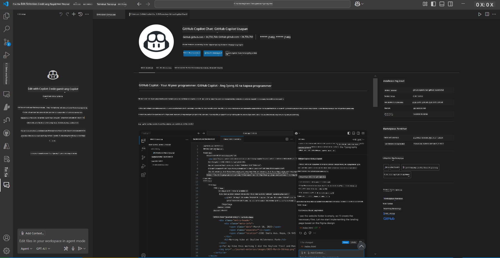
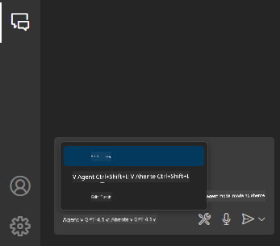

<!--
CO_OP_TRANSLATOR_METADATA:
{
  "original_hash": "db532b1ec386c9ce38c791653dc3c881",
  "translation_date": "2025-06-21T14:42:27+00:00",
  "source_file": "09-CaseStudy/docs-mcp/solution/scenario3/README.md",
  "language_code": "tl"
}
-->
# Scenario 3: Mga Dokumento sa Editor gamit ang MCP Server sa VS Code

## Pangkalahatang-ideya

Sa senaryong ito, matututuhan mo kung paano direktang dalhin ang Microsoft Learn Docs sa iyong Visual Studio Code gamit ang MCP server. Sa halip na palaging magpalipat-lipat ng browser tabs para maghanap ng dokumentasyon, maaari mong ma-access, hanapin, at i-refer ang opisyal na docs mismo sa loob ng iyong editor. Pinapadali ng paraang ito ang iyong workflow, pinananatili kang naka-focus, at nagbibigay-daan sa tuloy-tuloy na integrasyon sa mga tools tulad ng GitHub Copilot.

- Maghanap at magbasa ng docs sa loob ng VS Code nang hindi umaalis sa iyong coding environment.
- Mag-refer ng dokumentasyon at maglagay ng mga link nang direkta sa iyong README o mga file ng kurso.
- Gamitin ang GitHub Copilot at MCP nang sabay para sa tuloy-tuloy at AI-powered na workflow sa dokumentasyon.

## Mga Layunin sa Pagkatuto

Sa pagtatapos ng kabanatang ito, mauunawaan mo kung paano i-setup at gamitin ang MCP server sa loob ng VS Code para mapahusay ang iyong dokumentasyon at workflow sa pag-develop. Magagawa mong:

- I-configure ang iyong workspace para gamitin ang MCP server sa paghahanap ng dokumentasyon.
- Maghanap at mag-insert ng dokumentasyon nang direkta mula sa loob ng VS Code.
- Pagsamahin ang kapangyarihan ng GitHub Copilot at MCP para sa mas produktibong workflow na may tulong ng AI.

Makakatulong ang mga kasanayang ito para manatili kang naka-focus, mapabuti ang kalidad ng dokumentasyon, at mapataas ang iyong produktibidad bilang developer o technical writer.

## Solusyon

Para magkaroon ng access sa dokumentasyon sa loob ng editor, susundin mo ang mga hakbang na nag-iintegrate ng MCP server sa VS Code at GitHub Copilot. Ang solusyong ito ay mainam para sa mga course authors, documentation writers, at developers na nais manatiling naka-focus sa editor habang nagtatrabaho gamit ang docs at Copilot.

- Mabilis na magdagdag ng mga reference link sa README habang nagsusulat ng kurso o dokumentasyon ng proyekto.
- Gamitin ang Copilot para gumawa ng code at MCP para agad maghanap at mag-cite ng mga kaugnay na docs.
- Manatiling naka-focus sa editor at mapataas ang produktibidad.

### Gabay Hakbang-Hakbang

Para makapagsimula, sundin ang mga hakbang na ito. Sa bawat hakbang, maaari kang magdagdag ng screenshot mula sa assets folder para ipakita nang mas malinaw ang proseso.

1. **Idagdag ang MCP configuration:**
   Sa root ng iyong proyekto, gumawa ng `.vscode/mcp.json` file at ilagay ang sumusunod na configuration:
   ```json
   {
     "servers": {
       "LearnDocsMCP": {
         "url": "https://learn.microsoft.com/api/mcp"
       }
     }
   }
   ```
   Sinasabi ng configuration na ito sa VS Code kung paano kumonekta sa [`Microsoft Learn Docs MCP server`](https://github.com/MicrosoftDocs/mcp).
   
   
    
2. **Buksan ang GitHub Copilot Chat panel:**
   Kung wala ka pang GitHub Copilot extension, pumunta sa Extensions view sa VS Code at i-install ito. Maaari mo itong i-download nang direkta mula sa [Visual Studio Code Marketplace](https://marketplace.visualstudio.com/items?itemName=GitHub.copilot-chat). Pagkatapos, buksan ang Copilot Chat panel mula sa sidebar.

   

3. **I-enable ang agent mode at i-verify ang mga tools:**
   Sa Copilot Chat panel, i-enable ang agent mode.

   

   Pagkatapos i-enable ang agent mode, tiyakin na nakalista ang MCP server bilang isa sa mga available na tools. Tinitiyak nito na makaka-access ang Copilot agent sa documentation server para kunin ang mga kaugnay na impormasyon.
   
   
4. **Magsimula ng bagong chat at i-prompt ang agent:**
   Magbukas ng bagong chat sa Copilot Chat panel. Maaari mo nang i-prompt ang agent gamit ang iyong mga tanong tungkol sa dokumentasyon. Gagamitin ng agent ang MCP server para kunin at ipakita ang kaugnay na Microsoft Learn documentation nang direkta sa iyong editor.

   - *"Sinusubukan kong gumawa ng study plan para sa topic X. Balak kong pag-aralan ito ng 8 linggo, para sa bawat linggo, magmungkahi ng content na dapat kong kunin."*

   

5. **Live Query:**

   > Kunin natin ang isang live query mula sa [#get-help](https://discord.gg/D6cRhjHWSC) section sa Azure AI Foundry Discord ([tingnan ang orihinal na mensahe](https://discord.com/channels/1113626258182504448/1385498306720829572)):
   
   *"Naghahanap ako ng mga sagot kung paano mag-deploy ng multi-agent solution gamit ang AI agents na ginawa sa Azure AI Foundry. Nakikita ko na walang direktang deployment method, tulad ng Copilot Studio channels. Kaya, ano ang mga iba't ibang paraan para gawin ang deployment na ito para sa mga enterprise users na makipag-interact at matapos ang trabaho?
Maraming artikulo/blogs ang nagsasabing pwede nating gamitin ang Azure Bot service para dito na maaaring magsilbing tulay sa pagitan ng MS teams at Azure AI Foundry Agents, pero gagana ba ito kung magse-setup ako ng Azure bot na kumokonekta sa Orchestrator Agent sa Azure AI Foundry gamit ang Azure function para gawin ang orchestration o kailangan kong gumawa ng Azure function para sa bawat AI agent na bahagi ng multi-agent solution para gawin ang orchestration sa Bot framework? Bukas ako sa iba pang mga suhestiyon."*

   

   Sasagutin ng agent ang mga tanong gamit ang mga kaugnay na dokumentasyon at buod, na maaari mong direktang i-insert sa iyong markdown files o gamitin bilang mga reference sa iyong code.
   
### Mga Halimbawang Query

Narito ang ilang halimbawa ng mga query na maaari mong subukan. Ipapakita ng mga ito kung paano nagsasama ang MCP server at Copilot upang magbigay ng instant at konteksto-sensitibong dokumentasyon at mga reference nang hindi umaalis sa VS Code:

- "Ipakita kung paano gamitin ang Azure Functions triggers."
- "Maglagay ng link sa opisyal na dokumentasyon para sa Azure Key Vault."
- "Ano ang mga best practices para sa pag-secure ng Azure resources?"
- "Maghanap ng quickstart para sa Azure AI services."

Ipinapakita ng mga query na ito kung paano nagtutulungan ang MCP server at Copilot para magbigay ng instant, konteksto-sensitibong dokumentasyon at mga reference nang hindi umaalis sa VS Code.

---

**Paunawa**:  
Ang dokumentong ito ay isinalin gamit ang AI translation service na [Co-op Translator](https://github.com/Azure/co-op-translator). Bagamat aming pinagsisikapan ang katumpakan, pakatandaan na ang mga awtomatikong pagsasalin ay maaaring maglaman ng mga pagkakamali o hindi pagkakatugma. Ang orihinal na dokumento sa orihinal nitong wika ang dapat ituring na pangunahing sanggunian. Para sa mahahalagang impormasyon, inirerekomenda ang propesyonal na pagsasalin ng tao. Hindi kami mananagot sa anumang hindi pagkakaunawaan o maling interpretasyon na maaaring magmula sa paggamit ng pagsasaling ito.