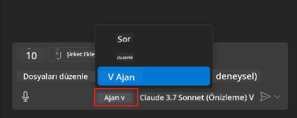

<!--
CO_OP_TRANSLATOR_METADATA:
{
  "original_hash": "8ea28e5e566edd5969337fd0b191ba3f",
  "translation_date": "2025-07-17T01:32:25+00:00",
  "source_file": "03-GettingStarted/04-vscode/README.md",
  "language_code": "tr"
}
-->
# GitHub Copilot Agent modundan bir sunucu kullanmak

Visual Studio Code ve GitHub Copilot, bir MCP Sunucusuna istemci olarak bağlanabilir ve onu kullanabilir. Neden bunu yapmak isteyelim diye sorabilirsiniz? Çünkü bu, MCP Sunucusunun sahip olduğu tüm özelliklerin artık IDE'nizden kullanılabileceği anlamına gelir. Örneğin GitHub'ın MCP sunucusunu eklediğinizi düşünün, bu sayede terminalde belirli komutları yazmak yerine doğal dil ile GitHub'ı kontrol edebilirsiniz. Ya da genel olarak geliştirici deneyiminizi iyileştirebilecek her şey doğal dil ile kontrol edilebilir. Artık avantajı görmeye başladınız değil mi?

## Genel Bakış

Bu ders, Visual Studio Code ve GitHub Copilot'un Agent modunu MCP Sunucunuz için bir istemci olarak nasıl kullanacağınızı anlatır.

## Öğrenme Hedefleri

Bu dersin sonunda şunları yapabileceksiniz:

- Visual Studio Code üzerinden bir MCP Sunucusunu kullanmak.
- GitHub Copilot aracılığıyla araçlar gibi yetenekleri çalıştırmak.
- Visual Studio Code'u MCP Sunucunuzu bulacak ve yönetecek şekilde yapılandırmak.

## Kullanım

MCP sunucunuzu iki farklı şekilde kontrol edebilirsiniz:

- Kullanıcı arayüzü, bunun nasıl yapıldığını bu bölümün ilerleyen kısımlarında göreceksiniz.
- Terminal, `code` çalıştırılabilir dosyasını kullanarak terminalden kontrol etmek mümkün:

  MCP sunucusunu kullanıcı profilinize eklemek için --add-mcp komut satırı seçeneğini kullanın ve JSON sunucu yapılandırmasını {\"name\":\"server-name\",\"command\":...} biçiminde sağlayın.

  ```
  code --add-mcp "{\"name\":\"my-server\",\"command\": \"uvx\",\"args\": [\"mcp-server-fetch\"]}"
  ```

### Ekran Görüntüleri




Görsel arayüzü nasıl kullandığımızı sonraki bölümlerde daha detaylı konuşalım.

## Yaklaşım

Yüksek seviyede nasıl yaklaşmamız gerektiği şöyle:

- MCP Sunucumuzu bulacak bir dosya yapılandırmak.
- Sunucuyu başlatmak/bağlanmak ve yeteneklerini listelemesini sağlamak.
- Bu yetenekleri GitHub Copilot Chat arayüzü üzerinden kullanmak.

Harika, akışı anladığımıza göre, şimdi bir egzersizle Visual Studio Code üzerinden bir MCP Sunucusu kullanmayı deneyelim.

## Egzersiz: Bir sunucu kullanmak

Bu egzersizde, Visual Studio Code'u MCP sunucunuzu bulacak şekilde yapılandıracağız, böylece GitHub Copilot Chat arayüzünden kullanılabilir olacak.

### -0- Ön adım, MCP Sunucu keşfini etkinleştirme

MCP Sunucularının keşfini etkinleştirmeniz gerekebilir.

1. Visual Studio Code'da `File -> Preferences -> Settings` menüsüne gidin.

1. "MCP" araması yapın ve settings.json dosyasında `chat.mcp.discovery.enabled` seçeneğini etkinleştirin.

### -1- Yapılandırma dosyası oluşturma

Proje kök dizininizde bir yapılandırma dosyası oluşturun, MCP.json adında bir dosya ve bunu .vscode adlı bir klasöre koymanız gerekiyor. Dosya şu şekilde olmalı:

```text
.vscode
|-- mcp.json
```

Şimdi bir sunucu girişi nasıl eklenir görelim.

### -2- Sunucu yapılandırma

*mcp.json* dosyasına aşağıdaki içeriği ekleyin:

```json
{
    "inputs": [],
    "servers": {
       "hello-mcp": {
           "command": "node",
           "args": [
               "build/index.js"
           ]
       }
    }
}
```

Yukarıda Node.js ile yazılmış bir sunucuyu başlatmak için basit bir örnek var, diğer çalışma zamanları için `command` ve `args` kullanarak sunucuyu başlatmak için uygun komutu belirtin.

### -3- Sunucuyu başlatma

Bir giriş eklediğinize göre, şimdi sunucuyu başlatalım:

1. *mcp.json* dosyanızdaki girişinizi bulun ve "play" simgesini gördüğünüzden emin olun:

    

1. "play" simgesine tıklayın, GitHub Copilot Chat'teki araçlar simgesinin kullanılabilir araç sayısını artırdığını görmelisiniz. Bu araçlar simgesine tıklarsanız, kayıtlı araçların bir listesini göreceksiniz. GitHub Copilot'un bunları bağlam olarak kullanmasını isteyip istemediğinize göre her aracı işaretleyip kaldırabilirsiniz:

  

1. Bir aracı çalıştırmak için, araçlarınızdan birinin açıklamasıyla eşleşeceğini bildiğiniz bir komut yazın, örneğin "add 22 to 1" gibi bir komut:

  

  23 cevabını görmelisiniz.

## Ödev

*mcp.json* dosyanıza bir sunucu girişi eklemeyi deneyin ve sunucuyu başlatıp durdurabildiğinizden emin olun. Ayrıca GitHub Copilot Chat arayüzü üzerinden sunucunuzdaki araçlarla iletişim kurabildiğinizi kontrol edin.

## Çözüm

[Solution](./solution/README.md)

## Önemli Noktalar

Bu bölümden çıkarılacak önemli noktalar şunlardır:

- Visual Studio Code, birden fazla MCP Sunucusunu ve araçlarını kullanmanızı sağlayan harika bir istemcidir.
- GitHub Copilot Chat arayüzü, sunucularla etkileşim kurduğunuz yerdir.
- Kullanıcıdan API anahtarları gibi girdiler isteyebilir ve bunları *mcp.json* dosyasındaki sunucu yapılandırmasına geçirebilirsiniz.

## Örnekler

- [Java Calculator](../samples/java/calculator/README.md)
- [.Net Calculator](../../../../03-GettingStarted/samples/csharp)
- [JavaScript Calculator](../samples/javascript/README.md)
- [TypeScript Calculator](../samples/typescript/README.md)
- [Python Calculator](../../../../03-GettingStarted/samples/python)

## Ek Kaynaklar

- [Visual Studio dokümanları](https://code.visualstudio.com/docs/copilot/chat/mcp-servers)

## Sonraki Adım

- Sonraki: [Bir SSE Sunucusu Oluşturma](../05-sse-server/README.md)

**Feragatname**:  
Bu belge, AI çeviri servisi [Co-op Translator](https://github.com/Azure/co-op-translator) kullanılarak çevrilmiştir. Doğruluk için çaba göstersek de, otomatik çevirilerin hatalar veya yanlışlıklar içerebileceğini lütfen unutmayınız. Orijinal belge, kendi dilinde yetkili kaynak olarak kabul edilmelidir. Kritik bilgiler için profesyonel insan çevirisi önerilir. Bu çevirinin kullanımı sonucu oluşabilecek yanlış anlamalar veya yorum hatalarından sorumlu değiliz.